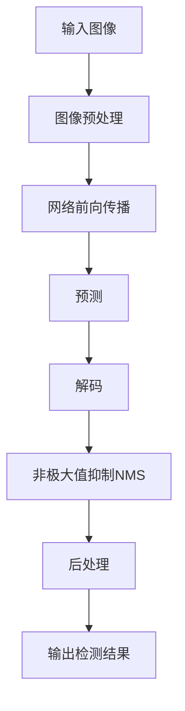

# 基于YOLOv5的戴口罩检测

## 1. 背景介绍

### 1.1 问题的由来

随着新冠肺炎疫情的爆发,戴口罩成为了日常生活中的一种重要防护措施。然而,在公共场合,仍有部分人员未能正确佩戴口罩,这不仅增加了个人感染风险,也可能危及他人的健康安全。因此,建立一种自动化的口罩检测系统,能够实时监测人员是否佩戴口罩,对于疫情防控工作至关重要。

### 1.2 研究现状

目前,已有多种基于计算机视觉和深度学习的方法被应用于口罩检测任务。其中,基于目标检测的方法因其高效且准确的特点,受到了广泛关注。常见的目标检测算法包括YOLO(You Only Look Once)、Faster R-CNN、SSD(Single Shot MultiBox Detector)等。这些算法能够在图像或视频中实时定位并识别目标对象,如人脸、口罩等。

### 1.3 研究意义

建立一个高效准确的口罩检测系统,不仅能够为疫情防控工作提供有力支持,同时也为计算机视觉和深度学习技术在实际应用场景中的落地提供了一个典型案例。此外,该系统还可以推广应用于其他领域,如安全监控、人员统计等,具有广阔的应用前景。

### 1.4 本文结构

本文将详细介绍基于YOLOv5算法的口罩检测系统的实现过程。首先阐述相关的核心概念和算法原理,然后对算法的数学模型进行推导和案例分析。接下来,通过代码实例和详细解释,展示系统的具体实现过程。最后,探讨该系统在实际场景中的应用,以及未来的发展趋势和面临的挑战。

## 2. 核心概念与联系

在介绍YOLOv5算法之前,我们需要先了解一些核心概念,包括目标检测、卷积神经网络(CNN)和锚框(Anchor Box)等。

**目标检测(Object Detection)**是计算机视觉领域的一个重要任务,旨在从图像或视频中定位并识别感兴趣的目标对象。它与图像分类和语义分割等任务密切相关,但更加复杂,需要同时完成目标的定位和识别。

**卷积神经网络(Convolutional Neural Network, CNN)**是一种常用的深度学习模型,在计算机视觉任务中表现出色。CNN由多个卷积层、池化层和全连接层组成,能够自动从图像数据中提取特征,并进行模式识别和分类。

**锚框(Anchor Box)**是目标检测算法中的一个重要概念。它是一组预定义的矩形框,用于在图像中扫描和定位可能存在的目标对象。每个锚框都有特定的形状和大小,算法会根据锚框与真实目标之间的重合程度,预测目标的位置和类别。

YOLOv5算法基于上述核心概念,将目标检测任务转化为一个端到端的回归问题,从而实现了高效且准确的目标检测。

## 3. 核心算法原理与具体操作步骤

### 3.1 算法原理概述

YOLOv5是YOLO(You Only Look Once)系列算法的最新版本,由Glenn Jocher等人在2020年提出。与传统的基于区域提议的目标检测算法(如Faster R-CNN)不同,YOLO算法将整个图像划分为多个网格,并对每个网格单元进行预测,从而实现了端到端的目标检测。

YOLOv5算法的核心思想是将目标检测任务转化为一个回归问题。具体来说,算法会预测每个网格单元中目标的边界框坐标、置信度和类别概率。通过对这些预测结果进行后处理和非极大值抑制(Non-Maximum Suppression, NMS),即可获得最终的检测结果。

算法的主要优点包括:

1. **速度快**: 由于采用了端到端的设计,避免了传统方法中的候选区域生成和特征提取步骤,因此检测速度更快。
2. **准确率高**: 通过引入新的特征提取网络和损失函数,提高了检测精度。
3. **实时性强**: 能够实时处理视频流,满足实时检测的需求。

### 3.2 算法步骤详解

YOLOv5算法的具体步骤如下:

1. **图像预处理**: 将输入图像调整到网络所需的尺寸,并进行归一化处理。

2. **网络前向传播**: 将预处理后的图像输入到YOLOv5网络中,经过一系列卷积、池化和残差连接操作,提取图像特征。

3. **预测**: 网络的输出包含三个张量,分别对应不同尺度的预测结果。每个张量的形状为(batch_size, num_boxes, 5 + num_classes),其中5表示边界框坐标(x, y, w, h)和置信度,num_classes表示类别数量。

4. **解码**: 将网络输出的张量解码为边界框坐标、置信度和类别概率。

5. **非极大值抑制(NMS)**: 对解码后的结果进行NMS操作,去除重复的边界框,获得最终的检测结果。

6. **后处理**: 根据需要,对检测结果进行进一步的处理,如绘制边界框、标注类别等。

下面是YOLOv5算法的Mermaid流程图:

### 3.3 算法优缺点

**优点**:

1. **速度快**: YOLOv5算法采用端到端的设计,避免了传统方法中的候选区域生成和特征提取步骤,因此检测速度更快。
2. **准确率高**: 通过引入新的特征提取网络和损失函数,提高了检测精度。
3. **实时性强**: 能够实时处理视频流,满足实时检测的需求。
4. **训练简单**: 只需要一个损失函数,训练过程相对简单。

**缺点**:

1. **定位精度略低**: 由于将图像划分为网格,对于较小目标的定位精度可能略低于基于区域提议的方法。
2. **对小目标敏感**: 对于较小的目标,检测效果可能不太理想。
3. **对密集目标敏感**: 当目标密集分布时,可能会出现遗漏或重叠的情况。

### 3.4 算法应用领域

YOLOv5算法的高效和实时性使其在多个领域具有广泛的应用前景,包括但不限于:

1. **安全监控**: 用于监测和识别可疑人员、车辆等目标。
2. **自动驾驶**: 实时检测道路上的行人、车辆、障碍物等,为自动驾驶系统提供关键信息。
3. **机器人视觉**: 帮助机器人识别和定位周围的物体,实现智能操作。
4. **人脸识别**: 结合人脸检测和识别技术,实现身份验证等应用。
5. **无人机监控**: 用于无人机的目标跟踪和识别任务。
6. **医疗影像分析**: 辅助医生检测和诊断医学影像中的病变等目标。

## 4. 数学模型和公式详细讲解与举例说明

### 4.1 数学模型构建

YOLOv5算法的数学模型基于卷积神经网络和回归思想。我们将目标检测任务转化为一个回归问题,即预测每个网格单元中目标的边界框坐标、置信度和类别概率。

设输入图像的尺寸为(H, W),将其划分为S x S个网格单元。对于每个网格单元(i, j),我们预测B个边界框,每个边界框包含以下信息:

- 边界框坐标: $(b_x, b_y, b_w, b_h)$
- 置信度: $c$
- 类别概率: $(p_1, p_2, ..., p_C)$

其中,$(b_x, b_y)$表示边界框中心相对于网格单元的偏移量,$(b_w, b_h)$表示边界框的宽高。$c$表示该边界框包含目标的置信度,$(p_1, p_2, ..., p_C)$表示该边界框属于每个类别的概率。

因此,对于每个网格单元(i, j),网络的输出张量的形状为$(B, 5 + C)$,其中5表示$(b_x, b_y, b_w, b_h, c)$,C表示类别数量。

### 4.2 公式推导过程

为了优化网络的训练过程,YOLOv5算法采用了一种新的损失函数,将边界框坐标、置信度和类别概率的损失合并为一个整体。

设真实标签为$(t_x, t_y, t_w, t_h)$,预测值为$(b_x, b_y, b_w, b_h)$,则边界框坐标的损失可表示为:

$$
\begin{aligned}
\lambda_{\text{coord}} \sum_{i=0}^{S^2} \sum_{j=0}^B \mathbb{1}_{\text{obj}}^{ij} \Big[ (t_x - b_x)^2 + (t_y - b_y)^2 \Big] + \\
\lambda_{\text{coord}} \sum_{i=0}^{S^2} \sum_{j=0}^B \mathbb{1}_{\text{obj}}^{ij} \Big[ (\sqrt{t_w} - \sqrt{b_w})^2 + (\sqrt{t_h} - \sqrt{b_h})^2 \Big]
\end{aligned}
$$

其中,$\mathbb{1}_{\text{obj}}^{ij}$是一个指示函数,当网格单元(i, j)包含目标时为1,否则为0。$\lambda_{\text{coord}}$是一个超参数,用于平衡不同损失项的权重。

置信度损失可表示为:

$$
\lambda_{\text{noobj}} \sum_{i=0}^{S^2} \sum_{j=0}^B \mathbb{1}_{\text{noobj}}^{ij} (c_i)^2 + \lambda_{\text{obj}} \sum_{i=0}^{S^2} \sum_{j=0}^B \mathbb{1}_{\text{obj}}^{ij} (c_i - 1)^2
$$

其中,$\mathbb{1}_{\text{noobj}}^{ij}$是一个指示函数,当网格单元(i, j)不包含目标时为1,否则为0。$\lambda_{\text{noobj}}$和$\lambda_{\text{obj}}$是超参数,用于平衡置信度损失的权重。

类别概率损失可表示为:

$$
\lambda_{\text{class}} \sum_{i=0}^{S^2} \mathbb{1}_{\text{obj}}^{i} \sum_{c \in \text{classes}} (p_c - \hat{p}_c)^2
$$

其中,$\hat{p}_c$是真实类别的one-hot编码,$\lambda_{\text{class}}$是一个超参数,用于平衡类别损失的权重。

最终,YOLOv5算法的总损失函数为:

$$
\text{Loss} = \text{Loss}_{\text{coord}} + \text{Loss}_{\text{conf}} + \text{Loss}_{\text{class}}
$$

通过最小化这个损失函数,网络可以学习到准确的边界框坐标、置信度和类别概率,从而实现高精度的目标检测。

### 4.3 案例分析与讲解

现在,让我们通过一个具体的案例来分析YOLOv5算法的工作原理。假设我们有一张包含人脸和口罩的图像,我们希望检测出图像中的人脸,并判断是否佩戴了口罩。

1. **图像预处理**: 首先,我们将输入图像调整到YOLOv5网络所需的尺寸,并进行归一化处理。

2. **网络前向传播**: 将预处理后的图像输入到YOLOv5网络中,经过一系列卷积、池化和残差连接操作,提取图像特征。

3. **预测**: 网络的输出包含三个张量,分别对应不同尺度的预测结果。每个张量的形状为(batch_size, num_boxes, 5 + num_classes),其中5表示边界框坐标(x, y, w, h)和置信度,num_classes表示类别数量(在本例中为2,分别是人脸和口罩)。

4. **解码**: 将网络输