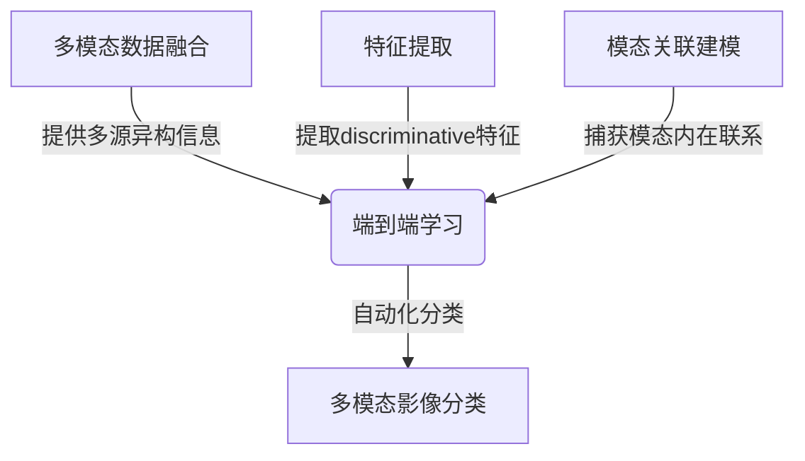

# 基于机器学习的多模态影像分类研究

## 1. 背景介绍

### 1.1 问题的由来

在当今数字时代,影像数据的采集和存储已经成为常态。无论是医疗诊断、遥感探测还是安防监控,影像数据都扮演着不可或缺的角色。然而,海量的影像数据如何高效处理和分析,成为了一个亟待解决的问题。传统的人工分类方法不仅耗时耗力,而且难以确保一致性和准确性。因此,基于机器学习的自动化影像分类技术应运而生,旨在提高影像数据处理的效率和质量。

### 1.2 研究现状

近年来,机器学习在影像分类领域取得了长足进展。深度学习模型如卷积神经网络(CNN)和递归神经网络(RNN)展现出了强大的特征提取和模式识别能力,在图像、视频和医学影像等单一模态影像分类任务中取得了令人瞩目的成绩。然而,现实世界中的影像数据往往具有多模态特征,如RGB图像、深度图像和红外图像等。单一模态的深度学习模型难以充分利用这些多源异构信息,因此多模态影像分类成为了一个新的挑战。

### 1.3 研究意义

多模态影像分类技术的发展对于多个领域具有重要意义:

1. **医疗诊断**: 通过融合CT、MRI、PET等不同模态的医学影像,可以提高疾病诊断的准确性和全面性。
2. **遥感探测**: 集成光学、雷达和红外等遥感影像,有助于更好地监测和分析地表覆盖情况。
3. **自动驾驶**: 融合视觉、激光雷达和红外等传感器数据,可以提高自动驾驶系统的环境感知能力。
4. **安防监控**: 结合可见光、热红外和深度等模态信息,能够增强目标检测和行为分析的鲁棒性。

因此,发展高效的多模态影像分类技术不仅具有重要的理论意义,也将为众多应用领域带来实际价值。

### 1.4 本文结构

本文将全面介绍基于机器学习的多模态影像分类研究。首先阐述核心概念和技术路线,然后深入探讨核心算法原理和数学模型,并通过实践案例展示具体的代码实现和应用场景。最后,我们将总结研究成果,展望未来发展趋势并分析面临的挑战。

## 2. 核心概念与联系

多模态影像分类是指利用机器学习算法,将包含多种模态(如RGB、深度、热红外等)信息的影像数据进行自动分类的过程。其核心概念包括:

1. **多模态数据融合**: 将来自不同传感器或者不同物理测量手段获取的异构数据进行有效融合,以捕获更加全面的信息。
2. **特征提取**: 从原始的多模态影像数据中提取出对分类任务更加discriminative的特征表示。
3. **模态关联建模**: 学习和建模不同模态之间的内在联系,以充分利用多模态数据之间的互补性。
4. **端到端学习**: 直接从原始多模态数据中端到端地学习特征表示和分类模型,无需人工设计特征。

这些核心概念相互关联、环环相扣。数据融合为模型输入提供多源异构信息;特征提取从原始数据中挖掘出更加discriminative的表示;模态关联建模捕获不同模态之间的内在联系;端到端学习则将上述过程无缝集成,实现自动化的多模态影像分类。

## 3. 核心算法原理 & 具体操作步骤

### 3.1 算法原理概述

基于机器学习的多模态影像分类算法通常遵循以下原理:

1. **多模态数据表示**: 首先将异构的多模态数据(如RGB图像、深度图像、红外图像等)映射到同一特征空间,形成统一的多模态特征表示。
2. **模态融合**: 对映射后的多模态特征进行融合,捕获不同模态之间的相关性和互补性信息。常用的融合策略包括向量拼接、特征级融合和决策级融合等。
3. **端到端学习**: 将融合后的多模态特征输入到端到端的深度神经网络中,同时学习特征表示和分类模型,实现自动化的影像分类。
4. **模型优化**: 通过设计合理的损失函数和优化策略,有效训练端到端的多模态分类模型,提高其泛化能力。

该算法框架能够充分利用多模态数据之间的互补信息,提高影像分类的准确性和鲁棒性。

### 3.2 算法步骤详解

1. **数据预处理**
    - 对原始的多模态影像数据进行标准化、裁剪等预处理,以消除数据偏差和噪声。
    - 将不同模态的影像数据映射到同一特征空间,获得统一的多模态特征表示。

2. **特征融合**
    - 对映射后的多模态特征进行融合,常用的融合策略包括:
        - **向量拼接融合**: 将不同模态的特征向量直接拼接成一个长向量。
        - **特征级融合**: 使用神经网络对不同模态的特征进行非线性融合,捕获更加复杂的模态间关系。
        - **决策级融合**: 为每个模态单独训练分类器,然后对多个分类器的输出结果进行融合。

3. **端到端学习**
    - 将融合后的多模态特征输入到端到端的深度神经网络中,例如多通道卷积神经网络、多模态递归神经网络等。
    - 在网络中同时学习特征表示和分类模型,实现自动化的影像分类。

4. **模型优化**
    - 设计合理的损失函数,例如交叉熵损失、三元组损失等,以指导模型的训练过程。
    - 采用优化策略如随机梯度下降、自适应优化器等,有效优化模型参数。
    - 引入正则化技术如dropout、批归一化等,提高模型的泛化能力。

5. **模型评估**
    - 在保留的测试集上评估模型的分类性能,常用的指标包括准确率、精确率、召回率、F1分数等。
    - 分析模型在不同模态下的表现,识别其优缺点,为后续改进提供依据。

### 3.3 算法优缺点

**优点**:

- 充分利用了多模态数据之间的互补性信息,提高了影像分类的准确性和鲁棒性。
- 端到端的学习框架实现了自动化的特征提取和模型训练,降低了人工参与的需求。
- 具有较强的泛化能力,可以适应不同领域的多模态影像分类任务。

**缺点**:

- 需要大量的标注数据用于模型训练,数据采集和标注过程耗时耗力。
- 模型训练过程计算量大,需要高性能的硬件资源支持。
- 不同模态数据之间存在着不同的分布和尺度,增加了融合的难度。
- 模型的可解释性较差,决策过程往往是一个黑箱操作。

### 3.4 算法应用领域

基于机器学习的多模态影像分类算法可以广泛应用于以下领域:

1. **医疗影像分析**: 融合CT、MRI、PET等不同模态的医学影像,用于疾病诊断、病理分类等任务。
2. **遥感图像解译**: 集成光学、雷达、红外等遥感影像,用于土地覆盖分类、目标检测等任务。
3. **自动驾驶感知**: 融合视觉、激光雷达、红外等传感器数据,用于道路场景分割、障碍物检测等任务。
4. **安防监控分析**: 结合可见光、热红外、深度等模态信息,用于人体检测、行为分析等任务。
5. **机器人视觉**: 融合RGB-D图像、力触觉等多模态数据,用于物体识别、抓取规划等任务。

## 4. 数学模型和公式 & 详细讲解 & 举例说明

### 4.1 数学模型构建

假设我们有$M$种模态的影像数据$\{X_1, X_2, \cdots, X_M\}$,其中$X_i$表示第$i$种模态的特征表示。我们的目标是将这些多模态特征有效融合,并学习一个分类模型$f$,将融合后的特征映射到预定义的类别空间$\mathcal{Y}$:

$$f(X_1, X_2, \cdots, X_M) \rightarrow y, y \in \mathcal{Y}$$

为了实现上述目标,我们构建了一个基于深度神经网络的端到端多模态融合分类模型。该模型主要由以下几个部分组成:

1. **模态特征提取器**: 对于每一种模态$X_i$,使用对应的特征提取网络$\phi_i$提取其特征表示$\phi_i(X_i)$。
2. **模态融合模块**: 将来自不同模态的特征表示$\{\phi_1(X_1), \phi_2(X_2), \cdots, \phi_M(X_M)\}$融合成一个统一的多模态特征表示$\Phi$。
3. **分类器**: 将融合后的多模态特征$\Phi$输入到分类器网络$f$中,得到预测的类别概率分布$\hat{y} = f(\Phi)$。

在训练阶段,我们的目标是最小化真实标签$y$和预测标签$\hat{y}$之间的损失函数$\mathcal{L}$:

$$\min_{\theta} \mathcal{L}(y, \hat{y}) = \mathcal{L}(y, f(\Phi(\phi_1(X_1), \phi_2(X_2), \cdots, \phi_M(X_M))))$$

其中$\theta$表示整个模型的所有可训练参数。通过反向传播算法和优化策略(如随机梯度下降),我们可以有效地训练该端到端的多模态融合分类模型。

在推理阶段,给定一个新的多模态影像样本$\{X_1^*, X_2^*, \cdots, X_M^*\}$,我们可以通过前向传播获得其预测类别:

$$\hat{y}^* = f(\Phi(\phi_1(X_1^*), \phi_2(X_2^*), \cdots, \phi_M(X_M^*)))$$

该模型架构能够灵活地适应不同数量和类型的模态输入,并通过端到端的训练实现自动化的多模态影像分类。

### 4.2 公式推导过程

在4.1节中,我们提出了一个基于深度神经网络的端到端多模态融合分类模型。现在,我们将详细推导该模型中的核心公式,以加深对其原理的理解。

**模态融合模块**

假设我们采用向量拼接的融合策略,将不同模态的特征表示$\{\phi_1(X_1), \phi_2(X_2), \cdots, \phi_M(X_M)\}$拼接成一个长向量$\Phi$:

$$\Phi = [\phi_1(X_1), \phi_2(X_2), \cdots, \phi_M(X_M)]$$

其中$[\cdot]$表示向量拼接操作。

如果我们采用特征级融合策略,则需要使用一个融合网络$\psi$对不同模态的特征进行非线性融合:

$$\Phi = \psi(\phi_1(X_1), \phi_2(X_2), \cdots, \phi_M(X_M))$$

其中$\psi$可以是一个多层感知机网络或其他非线性映射函数。

**分类器**

将融合后的多模态特征$\Phi$输入到分类器网络$f$中,我们可以获得预测的类别概率分布$\hat{y}$。对于一个$K$类分类问题,分类器的输出是一个$K$维向量:

$$\hat{y} = f(\Phi) = [p_1, p_2, \cdots, p_K]^T, \sum_{k=1}^K p_k = 1$$

其