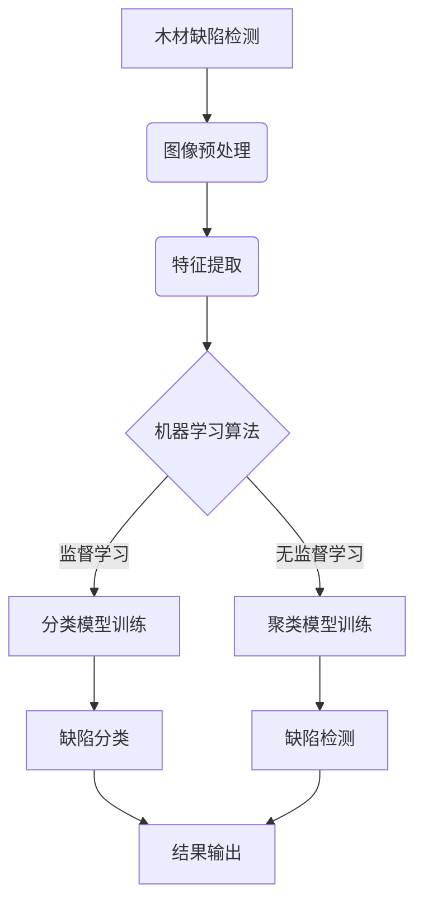

# 基于机器学习的木材缺陷识别方法研究

## 1. 背景介绍

### 1.1 问题的由来

木材加工是制造业的重要组成部分,在家具、建筑等多个领域扮演着关键角色。然而,木材在生长和加工过程中难免会出现各种缺陷,如裂纹、腐蚀、节疤等,这些缺陷会严重影响木材的质量和使用寿命。传统的人工目视检测方法不仅效率低下,而且存在主观性和疲劳等问题,因此亟需开发自动化的木材缺陷检测系统。

### 1.2 研究现状  

近年来,机器学习技术在图像处理和模式识别领域取得了长足进展,为解决木材缺陷检测问题提供了新的思路。研究人员已经尝试将深度学习等机器学习算法应用于木材缺陷检测,取得了一定成效。然而,现有方法在检测精度、实时性和适用范围等方面仍有提升空间。

### 1.3 研究意义

开发高效准确的木材缺陷检测系统,可以大幅提高木材加工的质量和效率,降低人工成本,减少资源浪费。同时,该研究也将推动机器学习技术在工业视觉领域的应用,为其他相关领域提供借鉴。

### 1.4 本文结构

本文首先介绍木材缺陷检测的背景和研究现状,阐明研究意义。接下来详细讲解所采用的机器学习算法原理、数学模型及实现细节。然后通过实际案例分析算法的性能表现,并对未来发展趋势和挑战进行探讨。最后总结全文,并给出常见问题解答。

## 2. 核心概念与联系



木材缺陷检测的核心概念包括:

1. **图像预处理**: 通过降噪、增强对比度等操作,提高图像质量,为后续特征提取做准备。

2. **特征提取**: 从预处理后的图像中提取有效的特征,如颜色、纹理、形状等,作为机器学习算法的输入。

3. **机器学习算法**:
   - **监督学习**: 基于标注的训练数据,训练分类模型识别已知类型的缺陷。
   - **无监督学习**: 无需标注数据,通过聚类算法自动发现异常模式,检测潜在缺陷。

4. **结果输出**: 将检测到的缺陷类型或位置等信息输出,为后续处理提供依据。

这些概念相互关联,构成了完整的木材缺陷检测流程。图像预处理和特征提取为机器学习算法提供高质量输入,算法则利用这些输入进行模型训练和缺陷识别,最终输出检测结果。

## 3. 核心算法原理 & 具体操作步骤

### 3.1 算法原理概述

木材缺陷检测常用的机器学习算法包括:

1. **监督学习算法**:
   - 支持向量机 (SVM)
   - 卷积神经网络 (CNN)
   - 随机森林等

2. **无监督学习算法**:  
   - K-Means聚类
   - DBSCAN聚类
   - 高斯混合模型等

监督学习算法需要基于大量标注的训练数据,训练分类模型识别已知类型的缺陷。无监督学习算法则无需标注数据,通过发现数据中的异常模式来检测潜在缺陷。两种算法各有优缺点,可根据具体需求选择使用或结合使用。

### 3.2 算法步骤详解

以卷积神经网络 (CNN) 为例,其在木材缺陷检测中的应用步骤如下:

1. **数据准备**:收集大量木材图像数据,并由专家人工标注缺陷类型,作为监督学习的训练数据。

2. **数据预处理**:对图像进行标准化、增强等预处理,以提高训练效果。

3. **模型构建**:设计合适的CNN网络结构,包括卷积层、池化层和全连接层等。

4. **模型训练**:使用预处理后的训练数据,通过反向传播算法优化网络参数,使模型能够学习到缺陷特征。

5. **模型评估**:在保留的测试数据上评估模型的分类性能,根据指标(如准确率、召回率等)进行模型调优。

6. **模型部署**:将训练好的模型集成到实际的检测系统中,对新的木材图像进行在线缺陷识别和分类。

### 3.3 算法优缺点

**优点**:

- 能够自动学习复杂的缺陷特征模式,检测精度高。
- 无需人工设计特征提取算子,降低了工程成本。
- 可以通过迁移学习等技术快速构建应用模型。

**缺点**:

- 需要大量标注的训练数据,数据准备成本高。
- 训练过程计算量大,对硬件要求较高。
- 模型的可解释性较差,难以理解决策过程。

### 3.4 算法应用领域

除了木材缺陷检测外,机器学习算法还可应用于其他工业视觉检测任务,如:

- 电子元器件缺陷检测
- 钢铁表面缺陷检测  
- 印刷品质量检测
- 农产品质量分级等

只要提供足够的训练数据,这些算法就能够在相应领域发挥作用。

## 4. 数学模型和公式 & 详细讲解 & 举例说明

### 4.1 数学模型构建

在木材缺陷检测中,我们可以将问题建模为图像分类任务。给定一个木材图像 $x$,目标是通过学习一个映射函数 $f$,将图像正确分类到缺陷类别 $y$:

$$f(x) = y$$

其中 $y \in \{1,2,\dots,K\}$,表示 $K$ 种已知缺陷类型。

对于监督学习算法,我们需要学习的是条件概率分布 $P(y|x)$,即在给定输入图像 $x$ 的条件下,输出属于每个类别 $y$ 的概率。常用的模型有:

1. **Logistic 回归**:

$$P(y=1|x) = \sigma(w^Tx + b)$$

其中 $\sigma(z) = 1/(1+e^{-z})$ 是 Sigmoid 函数, $w$ 和 $b$ 是需要学习的参数。

2. **支持向量机 (SVM)**:

$$f(x) = w^T\phi(x) + b$$

SVM 将输入映射到高维特征空间,在该空间中寻找最大间隔超平面作为分类面。

3. **卷积神经网络 (CNN)**:

CNN 由多个卷积层、池化层和全连接层组成,能够自动从图像中学习层次特征,是目前最先进的图像分类模型。

对于无监督学习算法,我们需要学习的是潜在数据分布 $P(x)$,通过发现异常模式来检测缺陷。常用的模型有:

- **高斯混合模型 (GMM)**:假设数据由多个高斯分布的混合构成。
- **K-Means 聚类**:通过最小化样本到聚类中心的距离,将数据划分为 K 个簇。

### 4.2 公式推导过程

以 Logistic 回归为例,我们推导其目标函数及梯度:

给定训练数据 $\{(x_i, y_i)\}_{i=1}^N$,其中 $x_i$ 为图像特征向量, $y_i \in \{0,1\}$ 为标签。目标是最小化以下负对数似然损失函数:

$$J(w,b) = -\frac{1}{N}\sum_{i=1}^N\big[y_i\log\sigma(w^Tx_i+b) + (1-y_i)\log(1-\sigma(w^Tx_i+b))\big]$$

对 $w$ 和 $b$ 分别求偏导可得:

$$
\begin{aligned}
\frac{\partial J}{\partial w} &= \frac{1}{N}\sum_{i=1}^N(\sigma(w^Tx_i+b) - y_i)x_i\\
\frac{\partial J}{\partial b} &= \frac{1}{N}\sum_{i=1}^N(\sigma(w^Tx_i+b) - y_i)
\end{aligned}
$$

使用梯度下降法可以迭代更新 $w$ 和 $b$,最小化损失函数,得到最优参数模型。

### 4.3 案例分析与讲解

我们以一个具体案例说明木材缺陷检测的过程。假设我们需要检测木材表面的裂纹、腐蚀和节疤三种缺陷。

1. **数据准备**:收集 5000 张木材图像,并由专家标注出现的缺陷类型,作为训练数据。

2. **预处理**:对图像进行灰度化、直方图均衡化等预处理,增强纹理对比度。

3. **特征提取**:使用 HOG (方向梯度直方图) 算子提取图像的纹理和形状特征。

4. **模型训练**:使用 SVM 分类器,在训练数据上进行模型训练,得到缺陷分类模型。

5. **模型评估**:在保留的 1000 张测试图像上评估模型性能,得到 92% 的准确率。

6. **模型部署**:将训练好的 SVM 模型集成到实际的检测系统中,对生产线上的木材图像进行在线检测。

通过上述步骤,我们成功构建了一个基于机器学习的木材缺陷检测系统,能够自动识别出木材表面的主要缺陷类型,大大提高了检测效率和准确性。

### 4.4 常见问题解答

**Q: 为什么需要数据预处理?**

A: 数据预处理能够提高图像质量,增强有效特征,从而提升机器学习模型的训练效果和检测性能。

**Q: 为什么要使用 HOG 特征?**  

A: HOG 特征能够很好地描述图像的纹理和形状信息,对于检测木材表面缺陷类型很有帮助。

**Q: SVM 和 CNN 分类器哪个更好?**

A: CNN 由于其强大的特征学习能力,通常在复杂的图像分类任务上表现更优秀。但 SVM 在小数据集上也有不错的性能,且训练时间更短。需要根据具体情况权衡选择。

**Q: 无监督学习算法在木材缺陷检测中有何作用?**

A: 无监督算法可用于发现新的未知缺陷类型,并对其进行检测和分析,从而弥补监督学习的不足。在实际应用中,两种算法常常会结合使用。

## 5. 项目实践:代码实例和详细解释说明  

### 5.1 开发环境搭建

本项目使用 Python 3.7 和 PyTorch 1.9.0 深度学习框架进行开发。首先需要安装相关依赖库:

```bash
pip install torch torchvision matplotlib numpy
```

接下来下载木材缺陷数据集,并解压到 `data/` 目录下。该数据集包含 10000 张木材图像及其缺陷标注。

### 5.2 源代码详细实现  

```python
import torch
import torchvision
from torchvision import transforms, datasets
import matplotlib.pyplot as plt

# 数据预处理
data_transforms = {
    'train': transforms.Compose([
        transforms.RandomResizedCrop(224),
        transforms.RandomHorizontalFlip(),
        transforms.ToTensor(),
        transforms.Normalize([0.485, 0.456, 0.406], [0.229, 0.224, 0.225])
    ]),
    'val': transforms.Compose([
        transforms.Resize(256),
        transforms.CenterCrop(224),
        transforms.ToTensor(),
        transforms.Normalize([0.485, 0.456, 0.406], [0.229, 0.224, 0.225])
    ]),
}

data_dir = 'data/'
image_datasets = {x: datasets.ImageFolder(os.path.join(data_dir, x),
                                          data_transforms[x])
                  for x in ['train', 'val'