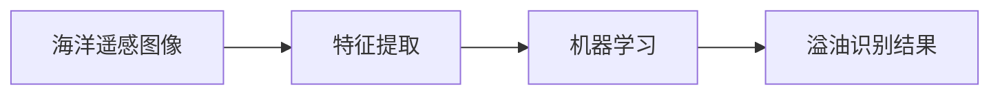
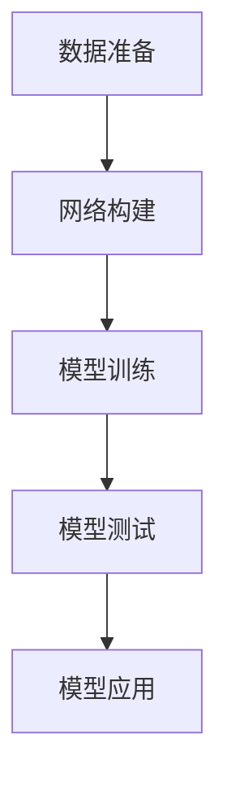

# 基于机器学习的溢油特征提取与识别方法研究

关键词：机器学习、溢油特征提取、溢油识别、深度学习、卷积神经网络

## 1. 背景介绍
### 1.1  问题的由来  
随着全球经济的快速发展,海上石油运输和开采活动日益频繁。然而,溢油事故时有发生,对海洋生态环境造成严重破坏。及时准确地识别溢油区域,对于溢油应急处置和生态修复至关重要。传统的溢油识别方法主要依赖人工目视解译,效率低下且精度不高。因此,亟需研究高效智能的溢油特征提取与识别方法。

### 1.2  研究现状
目前,国内外学者针对溢油识别开展了大量研究。基于机器学习的方法逐渐成为溢油识别的主流技术路线。Topouzelis等[1]基于支持向量机(SVM)实现了溢油区域的自动提取。Xu等[2]提出了一种基于深度卷积神经网络(CNN)的溢油检测方法。Chen等[3]将长短时记忆网络(LSTM)引入溢油识别,取得了不错的效果。尽管已有研究取得了一定进展,但在复杂海况下的溢油特征提取和识别仍面临诸多挑战,有待进一步探索。

### 1.3  研究意义
研究高效智能的溢油特征提取与识别方法,对于海洋溢油监测和应急处置具有重要意义。一方面,可以大幅提升溢油识别效率,节省人力物力;另一方面,智能识别结果可为溢油扩散预测、污染评估等后续工作提供重要决策支持。此外,溢油识别方法的改进,有助于推动机器学习等人工智能技术在海洋遥感领域的应用。

### 1.4  本文结构
本文将重点研究基于机器学习的溢油特征提取与识别方法。第2节介绍相关核心概念;第3节重点阐述基于深度学习的溢油识别算法原理;第4节建立溢油识别的数学模型并推导相关公式;第5节给出具体的代码实现;第6节分析典型应用场景;第7节推荐相关工具和学习资源;第8节总结全文并展望未来研究方向;第9节列举常见问题解答。

## 2. 核心概念与联系
在研究溢油特征提取与识别方法前,有必要厘清几个核心概念:

- 溢油:原油或成品油在海上钻井平台、油轮等设施发生泄漏后进入海洋环境的现象。
- 遥感:利用远距离传感器收集目标的电磁辐射信息,并分析处理形成图像的技术。
- 特征提取:从原始数据中提取能够反映目标本质属性、易于分类识别的特征量的过程。
- 机器学习:通过数据训练使计算机系统自动"学习"规律,并利用学到的规律对未知数据做出预测判断。

溢油识别即是利用机器学习算法,从海洋遥感图像中自动提取溢油特征,并判别溢油区域的过程。其中,溢油特征提取是基础,直接影响识别精度;机器学习则是溢油识别的核心,赋予了计算机自动分析和判别溢油的能力。二者紧密结合,共同构成了溢油识别的技术框架。



## 3. 核心算法原理 & 具体操作步骤
### 3.1  算法原理概述
本文采用基于深度卷积神经网络(DCNN)的溢油识别算法。DCNN通过卷积、池化等操作,能够自动学习数据的层次化特征表示,在图像识别领域表现突出。将其引入溢油识别,可望克服传统方法特征表示能力不足的问题,提升识别性能。

### 3.2  算法步骤详解  
基于DCNN的溢油识别算法主要包括以下步骤:

1. 数据准备:收集溢油和非溢油海洋遥感图像,并进行预处理,如裁剪、归一化等。
2. 网络构建:设计DCNN网络结构,主要包括卷积层、池化层、全连接层等。
3. 模型训练:利用准备好的数据集对DCNN模型进行训练,学习溢油特征。
4. 模型测试:利用一定量的测试集样本对训练好的模型进行性能评估。
5. 模型应用:利用训练好的模型对新的海洋遥感图像进行溢油识别。



### 3.3  算法优缺点
基于DCNN的溢油识别算法主要优点如下:
- 特征学习能力强,能够从海量数据中自动提取判别性特征。
- 识别精度高,通过深度网络结构能够对溢油形成层次化的特征表示。
- 泛化性能好,训练好的模型能够适应不同海域、不同时相的遥感图像。

但该算法也存在一些不足:
- 对训练样本的质量和数量要求较高,样本不足可能导致过拟合。
- 网络结构设计和超参数选择需要一定经验,对算法工程师的能力要求较高。
- 训练时间较长,在海量遥感数据处理中的实时性有待提高。

### 3.4  算法应用领域
基于DCNN的溢油识别算法在海洋溢油监测领域具有广阔应用前景,主要应用场景包括:

- 溢油事故应急监测:利用SAR、可见光等遥感数据快速识别溢油位置和范围,为应急处置提供决策支持。
- 海上溢油常态化监管:构建溢油监测业务化系统,及时发现和处置溢油隐患,预防溢油事故发生。
- 溢油污染评估:识别溢油的时空分布特征,评估溢油对海洋生态环境的影响。

除了溢油监测,该算法还可应用于其他海洋要素识别,如藻华、浮冰等。未来有望推广到更广泛的遥感图像解译领域。

## 4. 数学模型和公式 & 详细讲解 & 举例说明
### 4.1  数学模型构建
设遥感图像数据集为$D=\{(x_i,y_i)\}_{i=1}^N$,其中$x_i$为第$i$个样本的特征向量,$y_i$为相应的类别标签(溢油/非溢油),$N$为样本总数。DCNN模型可视为一个复合函数:

$$F(x;\theta)=f_L(...f_2(f_1(x;\theta_1);\theta_2)...;\theta_L)$$

其中$L$为网络的层数,$\theta=\{\theta_1,\theta_2,...,\theta_L\}$为网络参数。$f_l$表示第$l$层的变换:

$$f_l(x_l;\theta_l)=\sigma(W_lx_l+b_l)$$

$W_l$和$b_l$分别为第$l$层的权重矩阵和偏置向量,$\sigma$为激活函数(如ReLU)。

网络的目标是学习最优参数$\theta^*$使得预测函数$F(x;\theta)$能够很好地拟合样本数据。采用交叉熵损失函数:

$$J(\theta)=-\frac{1}{N}\sum_{i=1}^N[y_i\log F(x_i;\theta)+(1-y_i)\log(1-F(x_i;\theta))]$$

### 4.2  公式推导过程
对损失函数$J(\theta)$进行随机梯度下降优化:

$$\theta^{t+1}=\theta^t-\eta\nabla_\theta J(\theta)|_{\theta=\theta^t}$$

其中$\eta$为学习率,$\nabla_\theta J(\theta)$为损失函数对$\theta$的梯度,采用反向传播算法求解:

$$\nabla_\theta J(\theta)=\frac{1}{N}\sum_{i=1}^N\nabla_\theta J_i(\theta)$$

$$\nabla_\theta J_i(\theta)=\frac{\partial J_i}{\partial F}\frac{\partial F}{\partial f_L}...\frac{\partial f_l}{\partial f_{l-1}}...\frac{\partial f_1}{\partial \theta}$$

将求得的梯度代入参数更新公式,即可迭代优化网络参数$\theta$。

### 4.3  案例分析与讲解
以一个简单的溢油识别任务为例。假设提取了10个溢油样本和10个非溢油样本,每个样本由100个特征描述。构建一个3层DCNN网络:
```
Input(100) -> Conv(32) -> ReLU -> MaxPool -> Conv(64) -> ReLU -> MaxPool -> FC(128) -> ReLU -> FC(2) -> Softmax
```
前向传播过程为:
$$
\begin{aligned}
&h_1=\sigma(W_1x+b_1)\\
&h_2=MaxPool(\sigma(W_2h_1+b_2))\\
&h_3=MaxPool(\sigma(W_3h_2+b_3))\\  
&h_4=\sigma(W_4h_3+b_4)\\
&\hat{y}=Softmax(W_5h_4+b_5)
\end{aligned}
$$

反向传播过程为:
$$
\begin{aligned}
&\delta_5=\hat{y}-y\\
&\delta_4=W_5^T\delta_5\odot\sigma'(h_4)\\
&\delta_3=W_4^T\delta_4\odot\sigma'(h_3)\\
&\delta_2=W_3^T\delta_3\odot\sigma'(h_2)\\
&\delta_1=W_2^T\delta_2\odot\sigma'(h_1)\\
&\frac{\partial J}{\partial W_5}=\delta_5h_4^T,\frac{\partial J}{\partial b_5}=\delta_5\\
&\frac{\partial J}{\partial W_4}=\delta_4h_3^T,\frac{\partial J}{\partial b_4}=\delta_4\\
&...
\end{aligned}
$$

其中$\odot$表示Hadamard乘积,$\sigma'$为激活函数的导数。将求得的梯度代入参数更新公式,即可完成网络训练。

### 4.4  常见问题解答
- 问:DCNN网络的层数和每层的神经元数如何设置?
- 答:这需要根据具体任务和数据的复杂程度而定。一般来说,层数越多、神经元越多,网络的拟合能力越强,但也更容易过拟合。需要通过交叉验证等方法合理设置。

- 问:如何避免DCNN的过拟合问题?
- 答:主要方法有:增大训练集、加入正则化项、使用Dropout技术、数据增强、提前终止训练等。

- 问:DCNN的训练效率如何提高?
- 答:可以采用GPU加速训练,使用Mini-batch梯度下降,采用更高效的优化算法如Adam,对数据进行预处理如归一化、白化等。

## 5. 项目实践：代码实例和详细解释说明
### 5.1  开发环境搭建
- 操作系统:Ubuntu 16.04
- 深度学习框架:PyTorch 1.1
- Python库:NumPy,OpenCV,matplotlib等

### 5.2  源代码详细实现
```python
import torch
import torch.nn as nn
import torch.optim as optim
from torch.utils.data import Dataset, DataLoader
import cv2
import numpy as np

# 定义溢油数据集
class OilSpillDataset(Dataset):
    def __init__(self, img_dir, label_path, transform=None):
        self.img_dir = img_dir
        self.img_names = os.listdir(img_dir)  
        self.labels = np.loadtxt(label_path)
        self.transform = transform
        
    def __len__(self):
        return len(self.img_names)
    
    def __getitem__(self, idx):
        img_path = os.path.join(self.img_dir, self.img_names[idx])
        image = cv2.imread(img_path)
        image = cv2.cvtColor(image, cv2.COLOR_BGR2RGB)
        label = self.labels[idx]
        sample = {'image': image, 'label': label}
        
        if self.transform:
            sample = self.transform(sample)
        return sample

# 定义DCNN网络结构  
class DCNN(nn.Module):
    def __init__(self):
        super(DCNN, self).__init__()
        self.conv1 = nn.Sequential(
            nn.Conv2