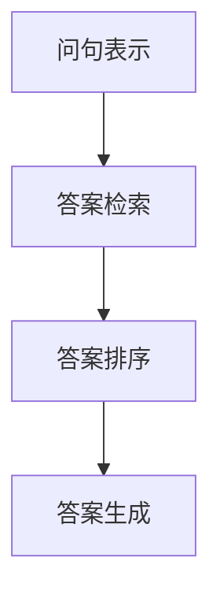

# 基于机器学习的问答推荐算法设计

## 1. 背景介绍

### 1.1 问题的由来

在当今信息时代,互联网上蕴藏着海量的数据和知识。然而,如何高效地从这些海量数据中获取有价值的信息并满足用户的需求,一直是一个巨大的挑战。传统的搜索引擎虽然可以返回相关的网页链接,但往往需要用户进一步浏览和筛选才能找到所需的答案。这种低效的信息获取方式已经无法满足现代用户对即时性和准确性的需求。

### 1.2 研究现状  

为了解决这一问题,问答推荐系统(Question Answering Recommendation System)应运而生。问答推荐系统旨在直接从大规模语料库中检索出高质量的答案,从而为用户提供更加准确和高效的信息服务。近年来,随着机器学习和自然语言处理技术的不断发展,基于机器学习的问答推荐算法也取得了长足的进步。

目前,基于机器学习的问答推荐算法主要分为两大类:

1. **生成式模型**:这类模型通过学习大量的问答对,生成新的答案来回答用户的问题。代表性算法包括Seq2Seq、Transformer等。
2. **检索式模型**:这类模型则是从预先构建的语料库中检索最相关的答案片段。代表性算法有BM25、DocRank等。

### 1.3 研究意义

基于机器学习的问答推荐算法具有重要的理论意义和应用价值:

- **理论意义**:问答推荐算法的研究推动了自然语言处理、信息检索、机器学习等多个领域的发展,促进了人工智能技术的进步。
- **应用价值**:高效准确的问答推荐系统可以广泛应用于智能助手、客服系统、在线教育等多个领域,为用户提供优质的信息服务。

### 1.4 本文结构

本文将全面介绍基于机器学习的问答推荐算法设计。首先阐述问答推荐的核心概念和算法之间的联系,然后深入探讨核心算法的原理和具体实现步骤。接下来,我们将构建数学模型并推导公式,并通过案例分析加深理解。此外,本文还将提供项目实践的代码示例和详细解释。最后,我们将探讨算法的实际应用场景、发展趋势和面临的挑战。

## 2. 核心概念与联系

问答推荐算法设计涉及多个核心概念,包括:

1. **问句表示(Question Representation)**:将自然语言问句转换为机器可以理解的数值向量表示。
2. **答案检索(Answer Retrieval)**:从语料库中快速检索出与问句相关的答案候选。
3. **答案排序(Answer Ranking)**:根据问句和答案之间的相关性,对候选答案进行排序。
4. **答案生成(Answer Generation)**:基于问句和上下文,生成新的自然语言答案。

这些核心概念相互关联,构成了完整的问答推荐算法流程,如下面的Mermaid流程图所示:

其中,问句表示是算法的输入,将自然语言问句转换为算法可以处理的数值表示。答案检索则是从海量语料库中快速检索出相关的答案候选。接下来,答案排序模块会根据问句和答案之间的相关性对候选答案进行排序。最后,对于生成式模型,还需要一个答案生成模块生成新的自然语言答案。

不同的算法在具体实现上会有所侧重,有的算法专注于高效的答案检索,有的则侧重答案排序或生成的质量。但是,无论采用何种算法,上述核心概念都是问答推荐系统不可或缺的组成部分。

## 3. 核心算法原理与具体操作步骤

在这一部分,我们将重点介绍两种核心算法:BM25检索式算法和Transformer生成式算法,并详细阐述它们的原理和实现步骤。

### 3.1 算法原理概述

#### 3.1.1 BM25检索式算法

BM25是一种著名的基于TF-IDF的检索式算法,它根据词频(Term Frequency)和逆文档频率(Inverse Document Frequency)计算问句和答案之间的相关性分数,从而实现高效的答案检索。

BM25算法的核心思想是:

1. 词频(TF)反映了词对文档的重要性,词频越高,越重要。
2. 逆文档频率(IDF)反映了词的区分能力,在少量文档中出现的词更有区分能力。
3. 通过将TF和IDF相结合,可以平衡词的重要性和区分能力,从而计算出更加准确的相关性分数。

BM25算法的具体计算公式如下:

$$
\mathrm{Score(D,Q)} = \sum_{q \in Q} \mathrm{IDF(q)} \cdot \frac{f(q,D) \cdot (k_1 + 1)}{f(q,D) + k_1 \cdot (1 - b + b \cdot \frac{|D|}{avgdl})}
$$

其中,$f(q,D)$表示词$q$在文档$D$中出现的次数,$|D|$表示文档$D$的长度,avgdl表示语料库中所有文档的平均长度,$k_1$和$b$是两个可调节的超参数。

通过BM25算法,我们可以高效地从语料库中检索出与问句最相关的答案候选,为后续的答案排序和生成奠定基础。

#### 3.1.2 Transformer生成式算法

Transformer是一种革命性的基于注意力机制(Attention Mechanism)的序列到序列(Seq2Seq)模型,它可以直接生成自然语言答案,而不需要依赖语料库。

Transformer模型的核心思想是:

1. 完全放弃了循环神经网络(RNN)和卷积神经网络(CNN),而是使用了自注意力(Self-Attention)机制来捕获输入序列中任意两个位置之间的依赖关系。
2. 引入了多头注意力(Multi-Head Attention)机制,允许模型同时关注输入序列的不同位置。
3. 使用了位置编码(Positional Encoding)来注入序列的位置信息。
4. 采用了编码器-解码器(Encoder-Decoder)架构,编码器捕获输入序列的上下文信息,解码器则根据上下文生成输出序列。

Transformer模型的自注意力机制可以被形式化为:

$$
\mathrm{Attention(Q,K,V)} = \mathrm{softmax}(\frac{QK^T}{\sqrt{d_k}})V
$$

其中,$Q$、$K$和$V$分别表示查询(Query)、键(Key)和值(Value)向量。通过计算查询向量与所有键向量的点积,并对结果进行软最大值归一化,我们可以获得一个注意力分数向量。将注意力分数与值向量相乘,即可得到注意力加权的输出向量。

基于自注意力机制,Transformer模型可以直接生成高质量的自然语言答案,而无需依赖预先构建的语料库。

### 3.2 算法步骤详解

#### 3.2.1 BM25检索式算法步骤

1. **问句预处理**:对输入的自然语言问句进行分词、去停用词、词形还原等预处理,将问句转换为词袋(Bag of Words)表示。

2. **构建倒排索引**:遍历语料库中的所有文档,统计每个词在每个文档中出现的次数,构建倒排索引(Inverted Index)。倒排索引是一种高效的数据结构,可以快速找到包含特定词的所有文档。

3. **计算TF-IDF**:对于每个词,计算其在每个文档中的词频(TF),以及在整个语料库中的逆文档频率(IDF)。

4. **计算BM25分数**:使用BM25公式,根据问句的词袋表示和每个文档的TF-IDF值,计算问句与每个文档之间的相关性分数。

5. **答案检索**:根据BM25分数对文档进行排序,从中选取得分最高的Top-K个文档作为答案候选。

6. **答案提取**:从Top-K个候选文档中提取最相关的答案片段,可以使用简单的关键词匹配或更高级的答案提取技术。

通过上述步骤,BM25算法可以高效地从海量语料库中检索出与问句最相关的答案候选,为后续的答案排序和生成提供基础。

#### 3.2.2 Transformer生成式算法步骤

1. **数据预处理**:从问答对语料库中收集大量的问答数据,并进行分词、词形还原等预处理,将问答对转换为词序列的形式。

2. **词嵌入**:使用预训练的词嵌入模型(如Word2Vec、GloVe等)将词序列转换为dense向量表示。

3. **位置编码**:为每个词添加位置编码,使模型能够捕获序列的位置信息。

4. **编码器**:将问句输入到Transformer的编码器中,编码器通过多层自注意力机制捕获问句中词与词之间的依赖关系,生成问句的上下文表示。

5. **解码器**:将编码器生成的上下文表示输入到解码器中,解码器通过多头注意力机制关注问句的不同部分,并逐步生成答案序列。在生成每个词时,解码器会综合考虑问句上下文、已生成的答案部分,以及编码器-解码器注意力机制。

6. **答案生成**:当解码器生成了特殊的结束符号(End of Sequence)时,输出当前生成的答案序列作为最终答案。

7. **模型训练**:使用最大似然估计(Maximum Likelihood Estimation)或其他优化目标,在问答对语料库上训练Transformer模型的参数。

8. **模型评估**:在held-out测试集上评估模型的生成质量,可以使用BLEU、ROUGE等自动评估指标,或者人工评估。

通过上述步骤,Transformer生成式算法可以直接生成高质量的自然语言答案,而无需依赖预先构建的语料库。该算法利用了自注意力机制来捕获问句和答案之间的长距离依赖关系,从而提高了答案的相关性和流畅性。

### 3.3 算法优缺点

#### 3.3.1 BM25检索式算法

**优点**:

- 计算高效,可以快速从海量语料库中检索出相关答案候选。
- 算法简单,易于实现和部署。
- 对问句和答案的长度没有限制。

**缺点**:

- 无法生成新的答案,只能从现有语料库中检索。
- 基于词袋模型,无法捕获词与词之间的语序和语义信息。
- 对同义词、近义词等语义相似性的处理能力有限。

#### 3.3.2 Transformer生成式算法

**优点**:

- 可以直接生成新的自然语言答案,不受语料库的限制。
- 利用自注意力机制,能够捕获问句和答案之间的长距离依赖关系。
- 生成的答案通常更加流畅、相关和连贯。

**缺点**:

- 训练数据要求较高,需要大量的高质量问答对数据。
- 模型结构复杂,训练和inference过程计算量大。
- 生成的答案可能存在事实错误或矛盾的情况。

### 3.4 算法应用领域

基于机器学习的问答推荐算法可以广泛应用于以下领域:

1. **智能助手**:如Siri、Alexa、小米助手等,可以为用户提供自然语言问答服务。
2. **客服系统**:通过问答推荐算法,可以自动解答用户的常见问题,提高客服效率。
3. **在线教育**:学生可以通过问答系统获取所需的知识和解答。
4. **医疗健康**:患者可以通过问答系统咨询常见病症的诊断和治疗方案。
5. **法律咨询**:为普通用户提供法律问题的解答和建议。
6. **知识问答**:构建大规模的开放域知识问答系统,为用户提供全方位的知识服务。

总的来说,无论是检索式算法还是生成式算法,都有着广阔的应