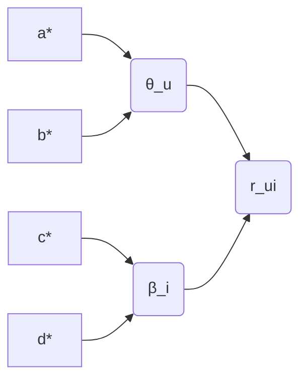

# 基于泊松分解的推荐算法研究与应用

关键词：泊松分解、推荐算法、协同过滤、矩阵分解、个性化推荐

## 1. 背景介绍
### 1.1 问题的由来
随着互联网技术的飞速发展,信息过载问题日益严重。面对海量的信息,用户往往难以快速找到自己感兴趣的内容。个性化推荐系统应运而生,通过分析用户的历史行为数据,自动为用户推荐可能感兴趣的内容,成为解决信息过载问题的有效途径。

### 1.2 研究现状
目前,推荐算法主要分为三大类:基于内容的推荐、协同过滤推荐和混合推荐。其中,协同过滤是应用最广泛、最成熟的一类推荐算法。协同过滤又可分为基于用户的协同过滤和基于物品的协同过滤两种。近年来,基于矩阵分解的推荐算法受到广泛关注,如PMF、SVD++等。但现有的推荐算法仍存在数据稀疏、冷启动等问题有待解决。

### 1.3 研究意义
基于泊松分解的推荐算法是近年来提出的一种新型推荐算法,通过引入泊松分布对用户行为数据进行建模,能够更好地刻画用户偏好,提高推荐精度。研究泊松分解推荐算法,对于改进现有推荐系统,提升用户体验具有重要意义。

### 1.4 本文结构
本文将首先介绍推荐系统的基本概念和经典算法,然后重点阐述泊松分解推荐算法的原理、推导过程和实现细节。接着通过实验对比分析泊松分解推荐算法的有效性。最后总结全文,并对推荐系统的未来发展趋势进行展望。

## 2. 核心概念与联系
推荐系统的核心是利用算法从大量历史数据中学习用户的兴趣偏好,进而给用户推荐感兴趣的内容。其中涉及的核心概念包括:

- 用户(User):使用推荐系统的主体,系统根据用户的兴趣爱好为其推荐内容。
- 物品(Item):推荐系统向用户推荐的对象,可以是商品、新闻、电影等。
- 用户-物品评分矩阵:用户对物品的偏好程度,通常由用户的历史交互行为(如评分、点击、购买等)构成。
- 用户画像:对用户兴趣爱好的全面刻画,通常由用户属性、用户行为等信息组成。
- 物品画像:对物品特征的全面刻画,通常由物品属性、内容信息等组成。
- 评分预测:推荐系统的核心任务,即预测用户对未评分物品的喜好程度。
- 物品推荐:根据预测评分给用户推荐排名靠前的物品。

推荐系统的目标是最大化用户的满意度,因此用户兴趣建模是推荐算法的关键。通过挖掘用户行为数据,构建用户画像和物品画像,从而预测用户的潜在兴趣,是各类推荐算法的基本思路。

## 3. 核心算法原理 & 具体操作步骤
### 3.1 算法原理概述
泊松分解推荐算法(Poisson Factorization for Recommendation)是一种基于概率图模型的推荐算法。它假设用户对物品的评分服从泊松分布,通过隐变量刻画用户兴趣和物品特征,并利用变分推断算法学习模型参数。与经典的推荐算法相比,泊松分解模型能够显式地对用户评分行为进行建模,具有更好的可解释性和灵活性。

### 3.2 算法步骤详解
泊松分解推荐算法的主要步骤如下:

**Step 1: 定义概率图模型**
假设有$M$个用户和$N$个物品,评分矩阵为$R=(r_{ui}) \in \mathbb{N}^{M \times N}$。定义用户隐向量$\theta_u \in \mathbb{R}^K$和物品隐向量$\beta_i \in \mathbb{R}^K$,其中$K$为隐空间维度。$\theta_u$和$\beta_i$分别服从Gamma先验分布:

$$
\theta_{uk} \sim \text{Gamma}(a^*, b^*), \forall u,k \\
\beta_{ik} \sim \text{Gamma}(c^*, d^*), \forall i,k
$$

其中$a^*,b^*,c^*,d^*$为先验参数。假设评分$r_{ui}$服从参数为$\theta_u^T\beta_i$的泊松分布:

$$
r_{ui} \sim \text{Poisson}(\theta_u^T\beta_i), \forall u,i
$$

**Step 2: 变分推断**
由于后验分布难以直接求解,因此采用变分推断近似后验。引入变分分布$q(\theta,\beta)$逼近真实后验$p(\theta,\beta|R)$:

$$
q(\theta,\beta) = \prod_{u=1}^M q(\theta_u) \prod_{i=1}^N q(\beta_i)
$$

其中$q(\theta_u)$和$q(\beta_i)$分别服从Gamma分布:

$$
q(\theta_{uk}) = \text{Gamma}(\theta_{uk}|a_{uk}, b_{uk}), \forall u,k \\
q(\beta_{ik}) = \text{Gamma}(\beta_{ik}|c_{ik}, d_{ik}), \forall i,k
$$

通过最小化变分分布$q$与真实后验$p$的KL散度,得到变分参数$a,b,c,d$的更新规则。

**Step 3: 参数估计**
通过迭代优化变分参数直至收敛,得到隐变量$\theta,\beta$的变分后验分布。利用变分后验的期望值$\mathbb{E}[\theta],\mathbb{E}[\beta]$作为用户和物品的低维隐向量表示。

**Step 4: 评分预测与物品推荐**
对于用户$u$和物品$i$,预测评分为隐向量的内积:

$$
\hat{r}_{ui} = \mathbb{E}[\theta_u]^T \mathbb{E}[\beta_i]
$$

根据预测评分的大小,选取Top-N物品推荐给用户。

### 3.3 算法优缺点
泊松分解推荐算法的优点包括:
- 可以显式地对用户评分行为进行建模,具有概率解释。
- 通过引入gamma先验,可以灵活地引入用户和物品的额外信息。 
- 采用变分推断进行近似求解,计算效率较高。

但是,泊松分解推荐算法也存在一些局限性:
- 假设评分服从泊松分布,可能无法很好地拟合实际数据分布。
- 变分推断得到的是后验分布的近似,存在一定的近似误差。
- 没有考虑时间动态性,难以刻画用户兴趣的动态变化。

### 3.4 算法应用领域
泊松分解推荐算法可以应用于各类推荐场景,如电商推荐、新闻推荐、社交推荐等。通过学习用户的历史行为,发现用户的隐含兴趣,从而给用户推荐感兴趣的内容,提升用户的满意度和engagement。

## 4. 数学模型和公式 & 详细讲解 & 举例说明
### 4.1 数学模型构建
泊松分解推荐算法的数学模型可以表示为如下的概率图模型:

其中$\theta_u$和$\beta_i$是服从Gamma分布的隐变量,分别表示用户兴趣和物品特征。$r_{ui}$为观测变量,服从均值为$\theta_u^T\beta_i$的泊松分布。$a^*,b^*,c^*,d^*$为先验参数。

### 4.2 公式推导过程
利用变分推断可以近似求解后验分布。假设变分后验$q(\theta,\beta)$的分解形式为:

$$
q(\theta,\beta) = \prod_{u=1}^M \prod_{k=1}^K \text{Gamma}(\theta_{uk}|a_{uk}, b_{uk}) \prod_{i=1}^N \prod_{k=1}^K \text{Gamma}(\beta_{ik}|c_{ik}, d_{ik})
$$

其中$a_{uk},b_{uk},c_{ik},d_{ik}$为变分参数。变分推断的目标是最小化变分分布$q$与真实后验$p$的KL散度:

$$
\min_{q} \text{KL}(q(\theta,\beta)||p(\theta,\beta|R))
$$

根据平均场理论,可以推导出变分参数的更新规则为:

$$
\begin{aligned}
a_{uk} &= a^* + \sum_{i=1}^N r_{ui} \\
b_{uk} &= b^* + \sum_{i=1}^N \mathbb{E}_q[\beta_{ik}] \\
c_{ik} &= c^* + \sum_{u=1}^M r_{ui} \\
d_{ik} &= d^* + \sum_{u=1}^M \mathbb{E}_q[\theta_{uk}]
\end{aligned}
$$

其中$\mathbb{E}_q[\cdot]$表示基于变分分布$q$的期望。通过迭代更新变分参数直至收敛,即可得到隐变量的变分后验分布。

### 4.3 案例分析与讲解
下面以电影推荐为例,说明泊松分解推荐算法的应用。假设有$M=1000$个用户和$N=2000$部电影,评分矩阵$R \in \mathbb{N}^{1000 \times 2000}$。$R_{ui}$表示用户$u$对电影$i$的评分,取值范围为$\{0,1,2,3,4,5\}$。

首先,假设隐空间维度$K=50$,先验参数$a^*=b^*=c^*=d^*=0.1$。随机初始化变分参数$a,b,c,d$,然后迭代更新直至收敛。在每次迭代中,根据上述更新规则更新变分参数。迭代结束后,得到隐变量$\theta,\beta$的变分后验分布。

接着,对于每个用户$u$,计算其对每部未评分电影$i$的预测评分:

$$
\hat{r}_{ui} = \mathbb{E}_q[\theta_u]^T \mathbb{E}_q[\beta_i]
$$

根据预测评分的高低,选取Top-N的电影推荐给用户$u$。

例如,假设用户$u=1$对电影$i=100$的真实评分为$r_{1,100}=4$,而预测评分为$\hat{r}_{1,100}=4.2$。这说明泊松分解模型较好地预测了用户的偏好,可以将电影$i=100$推荐给用户$u=1$。

### 4.4 常见问题解答
**Q: 泊松分解推荐算法与其他推荐算法相比有何优势?**

A: 与传统的协同过滤算法相比,泊松分解模型能够显式地对用户评分行为进行建模,具有更好的可解释性。通过引入先验分布,可以灵活地纳入用户和物品的side information,提高建模的灵活性。采用变分推断进行近似求解,计算效率较高。

**Q: 泊松分解推荐算法是否适用于隐式反馈数据?**

A: 泊松分解本质上是对计数数据进行建模,因此也适用于隐式反馈数据,如点击、购买等。将隐式反馈转化为计数数据,即可直接应用泊松分解模型。对于缺失数据,可以引入曝光机制进行建模,如考虑用户对物品的感兴趣程度和物品本身的流行度。

**Q: 如何处理泊松分解推荐算法中的冷启动问题?**

A: 对于新用户和新物品,由于缺乏足够的交互数据,直接应用泊松分解模型效果可能较差。一种常用的策略是引入用户和物品的属性特征,通过学习属性的隐向量来缓解冷启动问题。也可以考虑将泊松分解与其他算法(如基