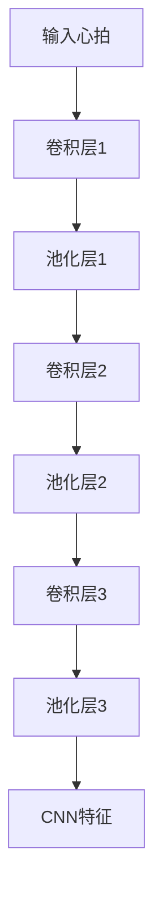
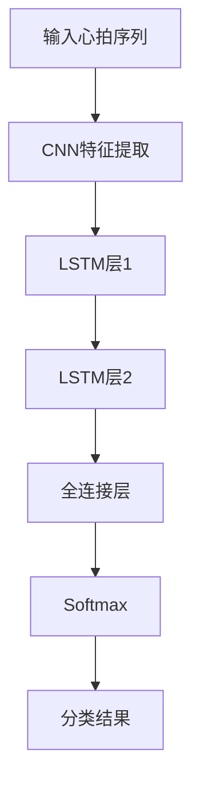

# 基于深度学习的心律失常的自动分类

关键词：心律失常、深度学习、自动分类、卷积神经网络、长短期记忆网络

## 1. 背景介绍
### 1.1  问题的由来
心律失常是一种常见的心血管疾病,严重威胁人们的健康和生命。传统的心律失常诊断主要依赖医生对心电图的人工判读,费时费力且容易出错。因此,利用人工智能技术实现心律失常的自动分类具有重要意义。
### 1.2  研究现状  
近年来,深度学习在医学图像分析领域取得了巨大成功。一些研究者尝试将卷积神经网络(CNN)应用于心电图分类,取得了良好效果。但CNN模型难以捕捉心电图的长程依赖关系。长短期记忆网络(LSTM)能够有效建模时序数据,在心律失常分类任务中表现出色。
### 1.3  研究意义
基于深度学习的心律失常自动分类可以辅助医生快速、准确地诊断心律失常,减轻医生工作负担,提高诊断效率。同时,该技术有望应用于可穿戴设备,实现心律失常的实时监测和预警,具有广阔的应用前景。
### 1.4  本文结构
本文首先介绍心律失常分类和深度学习的相关背景知识,然后重点阐述将CNN和LSTM结合用于心律失常分类的核心算法原理。接着通过数学推导和代码实例详细说明算法实现过程。最后总结全文,展望该领域的未来发展趋势和挑战。

## 2. 核心概念与联系
- 心律失常:是指心脏节律和/或传导异常引起的心律紊乱,常见类型包括室性早搏、房性早搏、室上性心动过速、心房颤动、心室颤动等。
- 心电图:是记录心脏电活动的曲线,是诊断心律失常的重要依据。
- 深度学习:是一种多层神经网络模型,能够从大量数据中自动学习特征表示,在图像分类、语音识别等任务上取得了突破性进展。
- 卷积神经网络:是一种特殊的深度学习模型,通过局部连接和权值共享,能够有效提取图像的空间特征。
- 长短期记忆网络:是一种循环神经网络,通过引入门控机制,能够学习序列数据的长程依赖关系。

CNN能够自动提取心电图的形态学特征,LSTM能够建模心电图的时序关系,两者结合可以更好地对心律失常进行分类。

## 3. 核心算法原理 & 具体操作步骤
### 3.1  算法原理概述
本文采用的心律失常分类算法主要包括以下几个步骤:
1. 心电图预处理:对原始心电图进行滤波、分割等预处理,提取单个心拍。 
2. CNN特征提取:将单个心拍输入到CNN中,提取局部形态学特征。
3. LSTM序列学习:将CNN提取的特征序列输入到LSTM中,学习心拍之间的时序关系。  
4. 分类输出:将LSTM的输出通过全连接层映射到不同心律失常类别的概率。

算法流程如下图所示:

### 3.2  算法步骤详解
1. 心电图预处理
- 使用带通滤波器去除工频干扰和基线漂移
- 利用差分算法检测R波位置,对心电图进行心拍分割  
- 对单个心拍进行归一化处理

2. CNN特征提取
- 使用3层卷积层提取心拍的局部特征
- 每层卷积后接最大池化层进行下采样
- 卷积核大小为3x3,池化核大小为2x2
- 激活函数采用ReLU

CNN结构如下:

3. LSTM序列学习
- 将CNN提取的特征序列输入到2层LSTM中
- LSTM的隐藏单元数为128
- LSTM的输出经过全连接层映射到心律失常类别的概率

4. 分类输出
- 全连接层的输出维度等于心律失常类别数
- 使用Softmax激活函数获得各类别的概率
- 取概率最大的类别作为最终分类结果

完整的CNN-LSTM模型结构如下图:

### 3.3  算法优缺点
优点:
- 能够同时利用心电图的局部形态特征和全局时序特征进行分类,分类性能好
- 端到端的分类方式,不需要手工提取特征,使用方便

缺点: 
- 模型参数较多,训练时间长,对计算资源要求高
- 模型的可解释性不强,分类决策过程不透明

### 3.4 算法应用领域
- 医院心电图自动分析系统
- 可穿戴心电监测设备
- 远程心电诊断平台

## 4. 数学模型和公式 & 详细讲解 & 举例说明
### 4.1  数学模型构建
1. 心电信号建模
设心电信号为时间序列$\boldsymbol{x}=\{x_1,\cdots,x_T\}$,其中$x_t$表示第$t$个采样点的电位值。

2. CNN特征提取
设第$l$层卷积层的输入为$\boldsymbol{H}^{l-1}$,卷积核为$\boldsymbol{W}^l$,偏置为$\boldsymbol{b}^l$,则卷积输出为:
$$\boldsymbol{H}^l=f(\boldsymbol{W}^l*\boldsymbol{H}^{l-1}+\boldsymbol{b}^l)$$
其中$*$表示卷积操作,$f$为激活函数,这里取ReLU函数:
$$f(x)=max(0,x)$$

经过多层卷积和池化后,CNN的输出为特征图$\boldsymbol{F}=\{\boldsymbol{f}_1,\cdots,\boldsymbol{f}_N\}$,其中$\boldsymbol{f}_i$为第$i$个心拍对应的特征向量。

3. LSTM序列学习
设LSTM各门的权重矩阵为$\boldsymbol{W}_f,\boldsymbol{W}_i,\boldsymbol{W}_o,\boldsymbol{W}_c$,偏置向量为$\boldsymbol{b}_f,\boldsymbol{b}_i,\boldsymbol{b}_o,\boldsymbol{b}_c$,则LSTM的前向传播公式为:
遗忘门:
$$\boldsymbol{f}_t=\sigma(\boldsymbol{W}_f\cdot[\boldsymbol{h}_{t-1},\boldsymbol{x}_t]+\boldsymbol{b}_f)$$
输入门:
$$\boldsymbol{i}_t=\sigma(\boldsymbol{W}_i\cdot[\boldsymbol{h}_{t-1},\boldsymbol{x}_t]+\boldsymbol{b}_i)$$
输出门:
$$\boldsymbol{o}_t=\sigma(\boldsymbol{W}_o\cdot[\boldsymbol{h}_{t-1},\boldsymbol{x}_t]+\boldsymbol{b}_o)$$  
候选记忆元:
$$\tilde{\boldsymbol{C}}_t=tanh(\boldsymbol{W}_c\cdot[\boldsymbol{h}_{t-1},\boldsymbol{x}_t]+\boldsymbol{b}_c)$$
记忆元更新:
$$\boldsymbol{C}_t=\boldsymbol{f}_t\odot \boldsymbol{C}_{t-1}+\boldsymbol{i}_t\odot\tilde{\boldsymbol{C}}_t$$
隐藏状态更新:
$$\boldsymbol{h}_t=\boldsymbol{o}_t\odot tanh(\boldsymbol{C}_t)$$

其中$\sigma$为Sigmoid函数,$tanh$为双曲正切函数,$\odot$表示按元素相乘。LSTM的输出为最后一个隐藏状态$\boldsymbol{h}_N$。

4. 分类器设计
设全连接层的权重矩阵为$\boldsymbol{W}$,偏置向量为$\boldsymbol{b}$,则分类器输出为:
$$\boldsymbol{y}=softmax(\boldsymbol{W}\cdot\boldsymbol{h}_N+\boldsymbol{b})$$

其中$softmax$函数将输出归一化为概率分布:
$$softmax(\boldsymbol{z})_i=\frac{exp(z_i)}{\sum_jexp(z_j)}$$

最终分类结果为概率最大的类别:
$$c^*=argmax_c\boldsymbol{y}_c$$

### 4.2  公式推导过程
1. 交叉熵损失函数
设训练集为$\{(\boldsymbol{x}_i,y_i)\}_{i=1}^M$,其中$\boldsymbol{x}_i$为第$i$个样本,$y_i$为其真实类别,模型在$\boldsymbol{x}_i$上的输出为$\boldsymbol{\hat{y}}_i$。定义交叉熵损失函数:
$$\mathcal{L}=-\sum_{i=1}^M\sum_{c=1}^C\boldsymbol{1}(y_i=c)log\boldsymbol{\hat{y}}_{ic}$$

其中$\boldsymbol{1}(y_i=c)$为示性函数,当$y_i=c$时取1,否则取0。$C$为类别总数。

2. 反向传播算法
根据链式法则,可以递归地计算损失函数对各层参数的梯度。以LSTM层的权重$\boldsymbol{W}_f$为例,其梯度为:
$$\frac{\partial\mathcal{L}}{\partial \boldsymbol{W}_f}=\sum_{t=1}^N\frac{\partial\mathcal{L}}{\partial \boldsymbol{h}_t}\frac{\partial \boldsymbol{h}_t}{\partial \boldsymbol{f}_t}\frac{\partial \boldsymbol{f}_t}{\partial \boldsymbol{W}_f}$$

其中
$$\frac{\partial \boldsymbol{h}_t}{\partial \boldsymbol{f}_t}=\boldsymbol{o}_t\odot(1-tanh^2(\boldsymbol{C}_t))\odot\boldsymbol{C}_{t-1}$$
$$\frac{\partial \boldsymbol{f}_t}{\partial \boldsymbol{W}_f}=\boldsymbol{f}_t\odot(1-\boldsymbol{f}_t)\odot[\boldsymbol{h}_{t-1},\boldsymbol{x}_t]^T$$

$\frac{\partial\mathcal{L}}{\partial \boldsymbol{h}_t}$可以通过时间反向传播算法计算:
$$\frac{\partial\mathcal{L}}{\partial \boldsymbol{h}_t}=\frac{\partial\mathcal{L}}{\partial \boldsymbol{h}_{t+1}}\frac{\partial \boldsymbol{h}_{t+1}}{\partial \boldsymbol{h}_t}+\frac{\partial\mathcal{L}}{\partial \boldsymbol{h}_t}\frac{\partial \boldsymbol{y}}{\partial \boldsymbol{h}_t}$$

其中$\frac{\partial\mathcal{L}}{\partial \boldsymbol{h}_N}=\frac{\partial\mathcal{L}}{\partial \boldsymbol{y}}\frac{\partial \boldsymbol{y}}{\partial \boldsymbol{h}_N}$。

CNN层和全连接层的梯度计算与标准BP算法类似,这里不再赘述。

3. 参数更新
利用随机梯度下降法对模型参数进行更新,以$\boldsymbol{W}_f$为例:
$$\boldsymbol{W}_f:=\boldsymbol{W}_f-\eta\frac{\partial\mathcal{L}}{\partial \boldsymbol{W}_f}$$

其中$\eta$为学习率。

### 4.3  案例分析与讲解
下面以一个简单的二分类问题为例,说明模型的训练和测试过程。

假设训练集包含两类心律失常:室性早搏(PVC)和室上性心动过速(SVT),每类各100个样本。每个样本由10个连续心拍组成,每个心拍包含300个采样点