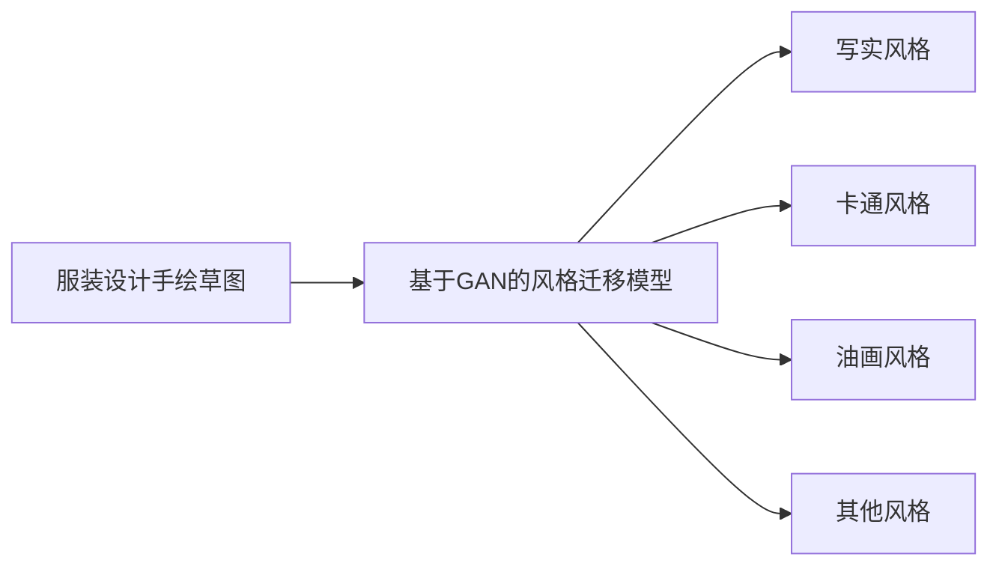

# 基于生成对抗网络的服装设计草图风格自动迁移

关键词：生成对抗网络、服装设计、草图风格迁移、深度学习、计算机视觉

## 1. 背景介绍
### 1.1 问题的由来
随着人工智能技术的飞速发展,将AI应用于时尚服装设计领域已成为一个热门的研究方向。传统的服装设计流程需要设计师投入大量的时间和精力来手绘设计草图,然后再将草图转化为成品。这个过程不仅耗时耗力,而且对设计师的创造力和想象力要求很高。如何利用人工智能技术,特别是深度学习算法,来自动化服装草图设计并实现风格迁移,是一个亟待解决的问题。

### 1.2 研究现状
近年来,随着生成对抗网络(Generative Adversarial Networks, GANs)的兴起,利用GAN进行图像风格迁移已取得了显著的研究进展。GAN由生成器和判别器两部分组成,生成器负责生成假样本以尽可能欺骗判别器,判别器则负责区分真假样本。通过生成器和判别器的对抗学习,GAN能够生成高质量的图像。

在服装设计领域,已有一些研究尝试利用GAN进行服装图像生成和风格迁移。比如,日本Preferred Networks公司开发了一个名为FashionGAN的模型,可以根据用户输入的服装类别、颜色等属性自动生成时尚服装图像。美国Adobe公司的研究人员提出了一个基于CycleGAN的服装图像风格迁移模型Fashion Style Generator,可以将日常服装图像转换为具有特定风格(如复古、潮流等)的服装图像。

### 1.3 研究意义
利用GAN实现服装设计草图的风格自动迁移,具有重要的理论和实践意义:

1. 提高服装设计效率:通过自动化服装草图绘制和风格迁移,可以大幅减少设计师的工作量,加快服装设计速度。

2. 激发设计灵感:呈现多种风格迁移后的服装草图,有助于设计师获得新的创意,拓宽设计思路。

3. 个性化定制:根据顾客偏好自动生成满足需求的服装设计图,实现服装的个性化定制。

4. 探索AI设计的可能性:研究GAN在服装设计中的应用,探索人工智能在设计领域的潜力,推动设计行业的智能化发展。

### 1.4 本文结构
本文将详细介绍如何利用生成对抗网络实现服装设计草图的风格自动迁移。第2部分介绍服装设计、GAN等相关概念;第3部分重点阐述基于GAN的服装草图风格迁移算法原理和步骤;第4部分建立算法的数学模型并给出公式推导;第5部分通过代码实例演示算法的实现;第6部分讨论该方法在实际服装设计中的应用场景;第7部分推荐相关学习资源和工具;第8部分总结全文,展望服装设计自动化的发展趋势和挑战;第9部分为文章的常见问题解答。

## 2. 核心概念与联系
在利用GAN实现服装设计草图风格自动迁移之前,首先需要了解以下几个核心概念:

1. 服装设计草图:服装设计师为设计一款新服装而绘制的手稿,一般用铅笔勾勒轮廓,并用水彩或马克笔上色,以展示服装的款式、色彩、面料等细节。

2. 风格迁移:一种图像处理技术,即将一张图像的风格特征迁移到另一张图像上,使处理后的图像同时拥有两张图像的内容和风格特点。常见的风格如写实风、卡通风、油画风等。

3. 生成对抗网络(GAN):一种深度学习模型,由生成器和判别器组成。生成器负责生成假样本,判别器负责判断输入样本是真是假。通过两者的对抗学习,生成器可生成以假乱真的样本。

4. 深度卷积神经网络(DCNN):一种常用于图像处理的神经网络,通过卷积、池化等操作提取图像特征。GAN的生成器和判别器都基于DCNN构建。

5. CycleGAN:一种用于无配对图像风格迁移的GAN变体,可以学习两个图像域之间的映射,从而将一个域的图像转换为另一个域的风格。

下图展示了服装设计草图风格迁移的整体流程:

## 3. 核心算法原理 & 具体操作步骤
### 3.1 算法原理概述
基于GAN的服装设计草图风格迁移算法,本质上是利用生成对抗网络学习服装草图和目标风格图像之间的映射关系,从而将草图转换为具有目标风格的图像。该算法主要分为以下几个步骤:

1. 数据准备:收集大量服装设计手绘草图和具有不同风格的图像,作为训练数据集。

2. 模型构建:搭建生成器和判别器网络。生成器负责将输入的草图转换为目标风格,判别器负责判断生成图像是否具有目标风格特征。

3. 模型训练:通过生成器和判别器的对抗学习,优化两个网络的参数。生成器尽可能生成接近目标风格的图像,判别器尽可能准确区分真假图像。

4. 风格迁移:用训练好的生成器网络,将新的服装草图转换为具有目标风格的图像。

### 3.2 算法步骤详解
下面详细介绍基于CycleGAN的服装草图风格迁移算法的具体步骤。

输入:服装设计手绘草图集合X,风格图像集合Y。

输出:具有目标风格Y的服装设计图像集合。

(1) 定义两个生成器网络G和F,分别负责将X域图像转换为Y域风格,和将Y域图像转换为X域风格。定义两个判别器网络DX和DY,分别负责判断X域和Y域中的图像是真是假。

(2) 初始化G、F、DX和DY的参数。

(3) 重复以下步骤,直到模型收敛:

a. 从X和Y中分别采样一批图像x和y。

b. 将x输入G,生成假的Y域图像G(x);将y输入F,生成假的X域图像F(y)。

c. 将G(x)输入DY,计算DY(G(x))的损失,即G生成的假Y域图像被判别为假图像的概率。将F(y)输入DX,计算DX(F(y))的损失。

d. 将y输入DY,计算DY(y)的损失,即真实Y域图像被判别为真图像的概率。将x输入DX,计算DX(x)的损失。 

e. 计算循环一致性损失:将G(x)输入F,得到F(G(x)),计算其与x的差异;将F(y)输入G,得到G(F(y)),计算其与y的差异。该损失促使G和F互为逆映射。

f. 综合以上损失,更新G、F、DX和DY的参数,优化目标为:
$$
\min_{G,F} \max_{DX,DY} L(G,F,DX,DY) = L_{GAN}(G,DY) + L_{GAN}(F,DX) + \lambda L_{cyc}(G,F)
$$

其中$L_{GAN}$为生成器和判别器的对抗损失,$L_{cyc}$为循环一致性损失,$\lambda$为平衡两种损失的权重系数。

(4) 用训练好的生成器G,将服装草图集合X中的图像转换为具有风格Y的图像。

### 3.3 算法优缺点
优点:
- 端到端的训练方式,不需要成对的训练数据
- 生成效果自然,保留了原始图像的语义内容
- 可以同时实现双向的风格迁移

缺点:  
- 训练过程不够稳定,容易出现模式崩溃现象
- 生成图像质量和分辨率有待提高
- 迁移效果依赖于训练数据的质量和风格多样性

### 3.4 算法应用领域
- 服装设计自动化
- 游戏场景设计
- 电影特效制作
- 虚拟试衣
- 时尚趋势预测

## 4. 数学模型和公式 & 详细讲解 & 举例说明
### 4.1 数学模型构建
设服装草图图像域为X,风格图像域为Y。定义两个生成器映射函数:
$$G: X \rightarrow Y, F: Y \rightarrow X$$
和两个判别器函数:  
$$D_X: X \rightarrow [0,1], D_Y: Y \rightarrow [0,1]$$

目标是求解生成器G和F,使得G将X域图像转换为Y域风格,F将Y域图像转换为X域风格,且转换后的图像能骗过相应的判别器。同时要求G和F互为逆映射,即:
$$F(G(x)) \approx x, G(F(y)) \approx y$$

因此,算法的数学模型可表示为以下最小最大化问题:
$$\min_{G,F} \max_{D_X,D_Y} L(G,F,D_X,D_Y) = L_{GAN}(G,D_Y,X,Y) + L_{GAN}(F,D_X,Y,X) + \lambda L_{cyc}(G,F)$$

其中对抗损失$L_{GAN}$为:

$$L_{GAN}(G,D_Y,X,Y) = \mathbb{E}_{y \sim p_{data}(y)} [\log D_Y(y)] + \mathbb{E}_{x \sim p_{data}(x)} [\log (1-D_Y(G(x)))]$$

$$L_{GAN}(F,D_X,Y,X) = \mathbb{E}_{x \sim p_{data}(x)} [\log D_X(x)] + \mathbb{E}_{y \sim p_{data}(y)} [\log (1-D_X(F(y)))]$$

循环一致性损失$L_{cyc}$为:

$$L_{cyc}(G,F) = \mathbb{E}_{x \sim p_{data}(x)} [\| F(G(x))-x \|_1] + \mathbb{E}_{y \sim p_{data}(y)} [\| G(F(y))-y \|_1]$$

其中$\| \cdot \|_1$表示L1范数,用于衡量两张图像的像素差异。

### 4.2 公式推导过程
(1) 首先考虑单向的风格迁移过程,以G: X→Y为例。判别器DY的目标是最大化以下损失函数:

$$\max_{D_Y} \mathbb{E}_{y \sim p_{data}(y)} [\log D_Y(y)] + \mathbb{E}_{x \sim p_{data}(x)} [\log (1-D_Y(G(x)))]$$

即判别器要尽可能将真实的Y域图像判别为真(概率接近1),将生成器G生成的假Y域图像判别为假(概率接近0)。

(2) 生成器G的目标是最小化以下损失函数:

$$\min_G \mathbb{E}_{x \sim p_{data}(x)} [\log (1-D_Y(G(x)))]$$

即生成器要尽可能生成接近真实Y域图像的假图像,使判别器无法分辨。

(3) 将两个方向的生成器G: X→Y和F: Y→X结合,并引入循环一致性损失,得到完整的目标函数:

$$\min_{G,F} \max_{D_X,D_Y} L(G,F,D_X,D_Y) = L_{GAN}(G,D_Y,X,Y) + L_{GAN}(F,D_X,Y,X) + \lambda L_{cyc}(G,F)$$

其中$L_{GAN}$如前所述,循环一致性损失$L_{cyc}$为:

$$L_{cyc}(G,F) = \mathbb{E}_{x \sim p_{data}(x)} [\| F(G(x))-x \|_1] + \mathbb{E}_{y \sim p_{data}(y)} [\| G(F(y))-y \|_1]$$

直观地说,循环一致性损失要求G和F互为逆映射,即将一张图像从X域转到Y域再转回X域,应该与原图接近,反之亦然。

(4) 采用梯度下降法交替优化上述