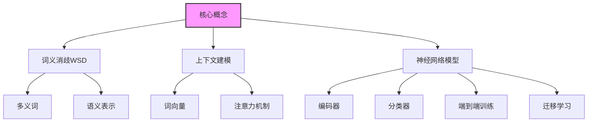

# 基于端到端神经网络模型的词义消歧算法研究

## 1. 背景介绍

### 1.1 问题的由来

在自然语言处理领域中,词义消歧(Word Sense Disambiguation, WSD)是一个长期存在的挑战性问题。由于许多单词在不同上下文中具有多种含义,因此正确理解单词意义对于实现人机交互、信息检索、机器翻译等任务至关重要。传统的基于规则或统计模型的方法存在一些局限性,难以充分利用上下文信息并适应不同领域。

### 1.2 研究现状

近年来,随着深度学习技术的不断发展,基于神经网络的端到端(End-to-End)模型在词义消歧任务中展现出了优异的性能。这些模型能够自动从大量语料中学习语义表示,并直接对目标词义进行预测,避免了传统方法中复杂的特征工程和知识库构建过程。

目前,主流的基于神经网络的词义消歧模型可分为以下几类:

1. **基于词向量的模型**: 利用Word2Vec、GloVe等工具预训练的词向量作为输入特征,通过神经网络模型进行词义预测。这类模型简单高效,但难以充分捕捉上下文信息。

2. **基于序列标注的模型**: 将词义消歧任务视为序列标注问题,利用循环神经网络(RNN)或者transformer等模型对上下文进行建模,并预测目标词的词义标签。这类模型能够有效利用上下文信息,但需要大量标注数据进行训练。

3. **基于语言模型的模型**: 利用预训练的大型语言模型(如BERT、GPT等)作为编码器,对上下文进行表示,再通过分类器预测目标词义。这类模型具有强大的语义表示能力,但计算复杂度较高。

4. **基于知识增强的模型**: 在神经网络模型中融入外部知识库信息,如词义定义、语义关系等,以提高模型的理解能力。这类模型需要额外的知识库构建工作。

### 1.3 研究意义

词义消歧是自然语言处理中的一个基础性问题,对于提高语义理解能力、实现人机交互等具有重要意义。研究基于端到端神经网络模型的词义消歧算法,可以探索如何充分利用上下文信息、避免复杂的特征工程,并在不同领域数据上实现良好的泛化能力。此外,相关研究成果也可以推动神经网络模型在其他自然语言处理任务中的应用。

### 1.4 本文结构

本文将重点介绍一种基于端到端神经网络的词义消歧算法。首先阐述核心概念及其联系,然后详细讲解算法原理和数学模型,并通过案例分析给出具体实现步骤。接下来介绍算法的实际应用场景、开发工具和学习资源,最后总结算法的发展趋势和面临的挑战。

## 2. 核心概念与联系

上图展示了本文涉及的核心概念及其相互联系:

- **词义消歧(Word Sense Disambiguation, WSD)**: 指在给定上下文中正确识别一个多义词的词义。是自然语言处理中的一个基础性问题。
- **上下文建模**: 指如何有效地对目标词的上下文进行编码和表示,以捕捉语义信息。常用的方法包括词向量表示、注意力机制等。
- **神经网络模型**: 指基于深度学习的端到端神经网络架构,通常包括编码器对上下文进行表示,以及分类器对目标词义进行预测。模型可以通过大量数据进行端到端训练,也可以基于预训练模型进行迁移学习。

上述三个核心概念相互关联、环环相扣。有效的上下文建模是实现词义消歧的关键,而端到端的神经网络模型则提供了一种自动化、数据驱动的建模和预测方式。

## 3. 核心算法原理与具体操作步骤

### 3.1 算法原理概述

本文介绍的基于端到端神经网络的词义消歧算法,主要分为以下三个模块:

1. **上下文编码器**: 对目标词的上下文进行编码,获取其语义表示。常用的编码器包括基于词向量的编码器、基于RNN/LSTM的序列编码器、基于Transformer的自注意力编码器等。

2. **词义表示**: 为每个可能的词义构建一个语义表示向量,可以基于词义定义、语义关系等知识进行表示。

3. **分类器**: 将上下文表示和词义表示进行匹配,通过神经网络分类器预测目标词的正确词义。

算法的核心思想是:利用神经网络自动从大量语料中学习上下文和词义的语义表示,并直接对目标词义进行分类预测,避免了传统方法中复杂的特征工程和知识库构建过程。

### 3.2 算法步骤详解

1. **数据预处理**:
   - 构建训练数据集,包括带标注词义的句子样本。
   - 对句子进行分词、词性标注等基本预处理。
   - 将词义标注转换为one-hot编码形式,作为监督信号。

2. **上下文编码**:
   - 将句子中的单词转换为预训练的词向量表示。
   - 利用RNN/LSTM或Transformer等神经网络对上下文进行编码,获取目标词的上下文语义表示 $c$。

3. **词义表示**:
   - 对每个可能的词义 $s_i$ 构建一个语义向量表示 $v_i$。
   - 向量表示可以基于词义定义、语义关系等知识进行初始化,也可以作为参数进行训练。

4. **匹配与分类**:
   - 将上下文表示 $c$ 和每个词义表示 $v_i$ 进行匹配,计算相似度分数 $y_i$:
     $$y_i = \text{score}(c, v_i)$$
   - 常用的匹配函数包括向量点乘、双线性匹配等。
   - 通过softmax将相似度分数归一化为概率分布 $\hat{y}$:
     $$\hat{y} = \text{softmax}(y)$$

5. **模型训练**:
   - 将预测的词义概率分布 $\hat{y}$ 与标注的one-hot编码 $y$ 计算交叉熵损失:
     $$\mathcal{L} = \text{CrossEntropy}(y, \hat{y})$$
   - 使用随机梯度下降等优化算法,对神经网络的参数进行端到端训练,最小化损失函数。

6. **预测与评估**:
   - 在测试集上运行训练好的模型,获取每个句子的词义预测结果。
   - 将预测结果与人工标注的正确词义进行对比,计算准确率等评估指标。

上述算法可以根据具体的模型架构和任务需求进行调整和优化,例如引入注意力机制、知识增强、数据增强等策略。

### 3.3 算法优缺点

**优点**:

1. **端到端训练**:算法能够自动从大量语料中学习上下文和词义的语义表示,避免了传统方法中复杂的特征工程和知识库构建过程。

2. **利用上下文信息**:通过神经网络对上下文进行编码,可以有效捕捉目标词前后的语义信息,提高词义消歧的准确性。

3. **可扩展性强**:算法框架通用,可以方便地集成不同的编码器(如RNN、Transformer等)和匹配函数,并在不同领域数据上进行迁移学习和微调。

4. **联合训练**:算法中的上下文编码器、词义表示和分类器可以进行联合端到端训练,各个模块能够相互促进,提高整体性能。

**缺点**:

1. **需要大量标注数据**:由于算法基于监督学习,需要大量带有词义标注的语料作为训练数据,数据标注工作耗时耗力。

2. **解释性较差**:神经网络模型通常被视为"黑箱",内部参数的语义解释性较差,难以提供可解释的决策过程。

3. **资源消耗较大**:训练大型神经网络模型需要消耗大量的计算资源,对硬件要求较高。

4. **领域迁移能力有限**:虽然算法具有一定的泛化能力,但在全新领域的数据上,性能可能会下降,需要进行持续的微调和迁移学习。

### 3.4 算法应用领域

基于端到端神经网络的词义消歧算法可以广泛应用于以下领域:

1. **自然语言理解**:作为语义理解的基础,词义消歧技术可以应用于问答系统、对话系统等,提高人机交互的准确性。

2. **信息检索**:在文本检索中,准确理解查询词义有助于提高检索的相关性和质量。

3. **机器翻译**:词义消歧有助于消除源语言中的歧义,提高机器翻译的准确性。

4. **知识图谱构建**:从大规模文本语料中自动构建知识图谱时,需要对文本中的实体和关系进行准确的语义理解。

5. **文本挖掘与分析**:在文本分类、情感分析、主题模型等任务中,词义消歧可以提高对文本语义的理解。

6. **其他NLP任务**:词义消歧作为基础技术,也可以促进命名实体识别、关系抽取等其他自然语言处理任务的发展。

## 4. 数学模型和公式详细讲解与举例说明

### 4.1 数学模型构建

在基于端到端神经网络的词义消歧算法中,我们需要构建数学模型来表示上下文编码、词义表示和匹配分类等过程。下面将详细介绍模型的数学形式化表示。

假设输入句子为 $X = (x_1, x_2, \ldots, x_n)$,其中 $x_i$ 表示第 $i$ 个单词,目标词为 $x_t$,共有 $K$ 个可能的词义 $\{s_1, s_2, \ldots, s_K\}$。我们的目标是预测目标词 $x_t$ 在给定上下文 $X$ 中的正确词义。

### 4.2 公式推导过程

1. **上下文编码**:

我们首先将句子 $X$ 中的每个单词 $x_i$ 映射为一个词向量表示 $\boldsymbol{x}_i \in \mathbb{R}^{d}$,其中 $d$ 为词向量的维度。然后利用编码器神经网络(如RNN、LSTM或Transformer)对上下文进行编码,获得目标词 $x_t$ 的上下文语义表示 $\boldsymbol{c}_t \in \mathbb{R}^{h}$,其中 $h$ 为编码器的隐层维度。编码器的具体计算过程可以表示为:

$$\boldsymbol{c}_t = \text{Encoder}(X, t)$$

2. **词义表示**:

对于每个可能的词义 $s_i$,我们构建一个语义向量表示 $\boldsymbol{v}_i \in \mathbb{R}^{m}$,其中 $m$ 为词义向量的维度。这些向量可以基于词义定义、语义关系等知识进行初始化,也可以作为模型参数进行训练和更新。

3. **匹配与分类**:

我们将上下文表示 $\boldsymbol{c}_t$ 与每个词义表示 $\boldsymbol{v}_i$ 进行匹配,计算相似度分数 $y_i$:

$$y_i = \text{score}(\boldsymbol{c}_t, \boldsymbol{v}_i)$$

其中 $\text{score}(\cdot, \cdot)$ 为匹配函数,可以采用多种形式,例如:

- **向量点乘**:
  $$y_i = \bolds