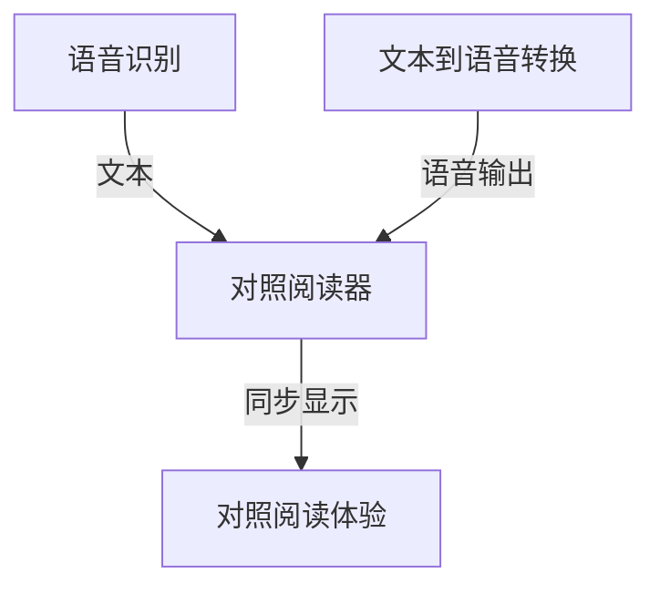

以下是关于《基于语音识别的对照阅读器》的技术博客文章正文内容：

# 基于语音识别的对照阅读器

## 1. 背景介绍

### 1.1 问题的由来

在当今快节奏的生活中，人们越来越依赖移动设备和应用程序来完成日常任务。然而,阅读材料通常需要将注意力集中在屏幕上,这可能会分散注意力并影响效率。此外,对于视力障碍人士或需要在做其他事情时阅读的人来说,传统的阅读方式也存在一定挑战。

### 1.2 研究现状  

为了解决这些问题,研究人员一直在探索利用语音识别技术来提高阅读体验的方法。目前,已经有一些应用程序可以将文本转换为语音输出,但大多数应用程序仅提供基本的朗读功能,缺乏对照阅读和个性化设置的支持。

### 1.3 研究意义

基于语音识别的对照阅读器旨在提供一种全新的阅读体验。通过将文本转换为自然语音输出,用户可以在移动设备上同步跟踪文本内容,从而实现无缝的对照阅读。此外,该系统还支持个性化设置,如语速、音调和语音模式,以满足不同用户的需求。

### 1.4 本文结构

本文将首先介绍对照阅读器的核心概念和算法原理,包括语音识别、文本到语音转换(TTS)和同步对照阅读等关键技术。接下来,将详细讲解数学模型和公式,并通过案例分析进行说明。然后,我们将探讨项目实践,包括开发环境搭建、源代码实现、代码解读和运行结果展示。最后,本文将讨论实际应用场景、未来发展趋势、挑战以及相关资源推荐。

## 2. 核心概念与联系

对照阅读器的核心概念包括:

1. **语音识别(Automatic Speech Recognition, ASR)**: 将人类语音转换为文本的过程。ASR系统通过捕获语音信号,提取特征,并将其与预先训练的语音模型进行匹配,从而识别出相应的文本。

2. **文本到语音转换(Text-to-Speech, TTS)**: 将文本转换为自然语音输出的过程。TTS系统通过分析文本,确定发音、节奏和语调,并将其合成为自然语音。

3. **同步对照阅读**: 将文本内容与语音输出同步显示,使用户可以在阅读时同步跟踪文本内容。这需要精确地将文本与语音输出对齐,并实时高亮显示当前正在播放的文本部分。

这三个核心概念紧密相关,共同构成了对照阅读器的基础。语音识别技术用于将用户的语音指令转换为文本,以控制阅读器的操作。文本到语音转换技术则负责将文本内容转换为自然语音输出。同步对照阅读技术将这两者结合,实现了无缝的对照阅读体验。

## 3. 核心算法原理 & 具体操作步骤

### 3.1 算法原理概述

对照阅读器的核心算法原理可以概括为以下三个主要步骤:

1. **语音识别**: 使用深度学习模型(如卷积神经网络和循环神经网络)从语音信号中提取特征,并将其与预先训练的语音模型进行匹配,以识别出相应的文本。

2. **文本到语音转换**: 首先对输入文本进行预处理,包括标点符号规范化、文本规范化和语音标记。然后,使用统计参数化语音合成技术(如隐马尔可夫模型或深度神经网络)生成自然语音波形。

3. **同步对照阅读**: 通过对齐文本和语音输出,实时高亮显示当前正在播放的文本部分。这可以通过计算每个单词的时间戳,并将其与语音输出进行匹配来实现。

### 3.2 算法步骤详解

1. **语音识别算法步骤**:
   - 步骤1: 语音预处理,包括降噪、端点检测和语音分段。
   - 步骤2: 特征提取,通常使用梅尔频率倒谱系数(MFCC)或其他特征提取技术。
   - 步骤3: 声学模型,使用深度神经网络(如卷积神经网络和长短期记忆网络)从语音特征中建模。
   - 步骤4: 语言模型,使用N-gram或神经网络语言模型捕获语言的统计规律。
   - 步骤5: 解码器,将声学模型和语言模型的输出结合,使用算法(如维特比算法)搜索最可能的文本序列。

2. **文本到语音转换算法步骤**:
   - 步骤1: 文本分析,包括标点符号规范化、文本规范化和语音标记。
   - 步骤2: 语音合成前端,确定每个音素的持续时间、pitch和能量。
   - 步骤3: 声学模型,使用统计参数化技术(如隐马尔可夫模型)或深度神经网络生成语音特征序列。
   - 步骤4: 波形合成,将语音特征序列转换为时域波形信号,通常使用滤波器银行或神经网络波形合成。

3. **同步对照阅读算法步骤**:
   - 步骤1: 文本到语音对齐,使用动态时间规整(DTW)算法或注意力机制将文本与语音输出对齐。
   - 步骤2: 时间戳计算,为每个单词计算开始和结束时间戳。
   - 步骤3: 实时高亮,根据当前播放位置,实时高亮显示相应的文本部分。
   - 步骤4: 用户交互,支持用户控制播放、暂停、调节语速等操作。

### 3.3 算法优缺点

**优点**:

- 提高了阅读效率和可访问性,特别是对于视力障碍人士或需要在做其他事情时阅读的人群。
- 支持个性化设置,如语速、音调和语音模式,以满足不同用户的需求。
- 通过同步对照阅读,增强了用户的注意力集中度和理解能力。
- 利用了先进的深度学习技术,提供了高质量的语音识别和语音合成。

**缺点**:

- 对于复杂的语言结构和口语表达,语音识别和语音合成的准确性可能会受到影响。
- 需要大量的计算资源和训练数据,以获得高质量的语音模型和语言模型。
- 同步对照阅读算法的准确性取决于文本到语音对齐的质量,对齐错误可能会导致不同步的问题。
- 对于某些语言和领域,可能缺乏足够的语音和文本数据用于训练模型。

### 3.4 算法应用领域

基于语音识别的对照阅读器可以应用于以下领域:

- **无障碍阅读**: 为视力障碍人士或需要在做其他事情时阅读的人群提供无障碍的阅读体验。
- **语言学习**: 通过同步显示文本和语音输出,有助于语言学习者提高听力和阅读能力。
- **有声书和播客**: 为有声书和播客提供增强的阅读体验,用户可以同步跟踪文本内容。
- **会议记录**: 通过语音识别技术,自动转录会议记录,并与幻灯片或其他材料同步显示。
- **车载系统**: 在驾驶时,可以通过语音控制和语音输出来安全地阅读文本信息。

## 4. 数学模型和公式 & 详细讲解 & 举例说明

### 4.1 数学模型构建

在对照阅读器中,语音识别和文本到语音转换都涉及到了数学模型的构建。

1. **语音识别数学模型**:

语音识别的目标是找到最可能的文本序列 $W^*$,给定观测到的语音特征序列 $O$,可以表示为:

$$W^* = \arg\max_W P(W|O)$$

根据贝叶斯定理,我们可以将其分解为:

$$W^* = \arg\max_W \frac{P(O|W)P(W)}{P(O)}$$

其中,$ P(O|W) $是声学模型,描述了给定文本序列 $W$ 产生观测语音特征序列 $O$ 的概率;$ P(W) $是语言模型,描述了文本序列 $W$ 的先验概率;$ P(O) $是观测概率,在优化过程中可以忽略。

声学模型和语言模型通常使用深度神经网络进行建模,如卷积神经网络、循环神经网络和转former等。

2. **文本到语音转换数学模型**:

文本到语音转换的目标是生成自然的语音波形序列 $Y$,给定输入文本序列 $X$,可以表示为:

$$Y^* = \arg\max_Y P(Y|X)$$

这个过程通常分为两个阶段:

- 语音合成前端: 确定每个音素的持续时间、pitch和能量等参数,可以表示为:

$$\pi^* = \arg\max_\pi P(\pi|X)$$

其中 $\pi$ 是一组声学特征参数。

- 声学模型: 根据声学特征参数生成语音特征序列,可以表示为:

$$O^* = \arg\max_O P(O|\pi)$$

最后,通过波形合成模块将语音特征序列 $O$ 转换为时域波形信号 $Y$。

声学模型通常使用隐马尔可夫模型(HMM)或深度神经网络(如WaveNet和Tacotron)进行建模。

### 4.2 公式推导过程

1. **语音识别公式推导**:

我们的目标是找到最可能的文本序列 $W^*$,给定观测到的语音特征序列 $O$,即:

$$W^* = \arg\max_W P(W|O)$$

根据贝叶斯定理,我们可以将其分解为:

$$\begin{aligned}
W^* &= \arg\max_W P(W|O) \\
    &= \arg\max_W \frac{P(O|W)P(W)}{P(O)} \\
    &= \arg\max_W P(O|W)P(W)
\end{aligned}$$

其中,$ P(O) $是观测概率,在优化过程中可以忽略。

$ P(O|W) $是声学模型,描述了给定文本序列 $W$ 产生观测语音特征序列 $O$ 的概率;$ P(W) $是语言模型,描述了文本序列 $W$ 的先验概率。

通过最大化声学模型和语言模型的联合概率,我们可以找到最可能的文本序列 $W^*$。

2. **文本到语音转换公式推导**:

文本到语音转换的目标是生成自然的语音波形序列 $Y$,给定输入文本序列 $X$,可以表示为:

$$Y^* = \arg\max_Y P(Y|X)$$

这个过程通常分为两个阶段:

- 语音合成前端: 确定每个音素的持续时间、pitch和能量等参数 $\pi$,可以表示为:

$$\pi^* = \arg\max_\pi P(\pi|X)$$

- 声学模型: 根据声学特征参数 $\pi$ 生成语音特征序列 $O$,可以表示为:

$$O^* = \arg\max_O P(O|\pi)$$

最后,通过波形合成模块将语音特征序列 $O$ 转换为时域波形信号 $Y$。

在实际应用中,语音合成前端和声学模型通常使用深度神经网络或隐马尔可夫模型等统计模型进行建模和优化。

### 4.3 案例分析与讲解

让我们通过一个具体的案例来说明语音识别和文本到语音转换的过程。

假设我们要识别以下语音输入:"Hello, how are you doing today?"

1. **语音识别过程**:

- 步骤1: 语音预处理,包括降噪、端点检测和语音分段。
- 步骤2: 特征提取,使用MFCC技术从语音信号中提取特征序列 $O$。
- 步骤3: 