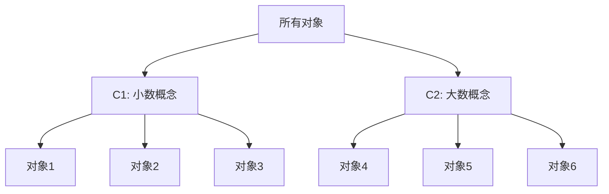

# 复杂思想的形成：概念的基础

关键词：概念形成、思维复杂性、认知发展、神经网络、计算模型

## 1. 背景介绍 
### 1.1 问题的由来
人类思维的复杂性一直是认知科学和人工智能领域研究的核心问题之一。理解复杂思想是如何形成的,对于揭示人类智能的奥秘,以及构建真正智能的人工系统都具有重要意义。概念作为人类思维活动的基本单元,在复杂思想形成过程中扮演着关键角色。

### 1.2 研究现状
目前对于概念形成与复杂思想的关系,学术界已有一定研究。认知心理学领域的研究表明,概念的获得是一个渐进的过程,通过不断抽象、归纳和整合,低级概念逐步发展为高级概念。神经科学的研究发现,概念在大脑中以分布式的神经元集群形式表征,不同概念之间通过神经连接建立联系。人工智能领域的相关工作,尝试利用符号逻辑、本体、语义网等技术对概念进行形式化表示和推理。

### 1.3 研究意义
深入研究概念形成与复杂思想的关系,对于从根本上理解人类的思维机制具有重要价值。一方面,它有助于揭示人类如何利用有限的认知资源,去应对复杂多变的现实世界,是对人类智能本质的探索。另一方面,这些研究能为人工智能系统的设计和构建提供重要启示,帮助我们开发出具备概念抽象和创新思维能力的智能系统,推动人工智能迈向更高层次。

### 1.4 本文结构
本文将从以下几个方面来探讨概念形成与复杂思想之间的关系：首先介绍概念形成的核心理论和机制；然后分析概念形成的计算模型及算法实现；接着讨论概念形成在人工智能系统中的应用；最后总结全文,并对未来研究方向进行展望。

## 2. 核心概念与联系
要理解复杂思想的形成,首先需要明确以下几个核心概念：

- 概念(Concept):对客观事物的本质属性的抽象反映,是人们对事物的一般认识,是思维的基本单位。
- 概念形成(Concept Formation):从感性认识上升到理性认识,获得概念的心理过程。通过归纳出事物的共同本质特征,并用语言符号加以概括和固定。  
- 知识表征(Knowledge Representation):以一定的符号、规则等形式,对客观世界的认识结果在智能系统中的表示。
- 思维(Thinking):人脑对客观事物间接的、概括的反映过程。包括概念、判断、推理等基本形式。
- 复杂思想(Complex Thought):涉及多个领域知识、多层次概念的交互与综合,具有emergent特性的高级思维活动。

这些概念之间存在着紧密的内在联系。概念是构成人类思维的基石,概念形成过程是思维发展的重要体现。概念在人脑或智能系统中,以知识表征的方式存储。概念之间不断发生联系,经过判断、推理等思维操作,形成新的概念或更高层次的抽象认识,思维也随之变得更加复杂。复杂思想正是建立在丰富的概念基础之上,通过概念间的灵活组合与综合而产生。

## 3. 核心算法原理 & 具体操作步骤
### 3.1 算法原理概述
概念形成可以看作一个聚类问题,即将相似的个体归为同一个概念。主要有两类算法:一是自下而上的归纳法,通过比较个体间的相似性,逐步形成越来越抽象的概念;二是自顶向下的分解法,从最一般的概念出发,通过添加限定条件细化出更具体的子概念。两种方法常结合使用。

### 3.2 算法步骤详解
以层次聚类算法为例,其基本步骤如下:
1. 相似性计算:定义个体间两两比较的相似性度量,常用欧氏距离、jaccard系数等。
2. 聚类准则:根据相似性将最相似的个体或簇合并,常用方法有单链、全链、类平均等。
3. 概念形成:将每个簇视为一个概念,用簇内所有个体的共同特征来描述该概念。 
4. 迭代:重复2-3,直到满足一定停止条件(如达到事先指定的概念数)。
5. 概念命名:对形成的概念人工赋予一个语言标签,完成从簇到概念的映射。

### 3.3 算法优缺点
优点:
- 过程直观,符合人们归纳概括的思维习惯。
- 通过调节相似性阈值,可控制概念的抽象层次。
- 算法复杂度较低,有多种快速实现。

缺点:
- 概念形成质量很大程度依赖相似性的定义。对复杂对象,难以刻画全面的相似性。
- 缺乏对概念语义的深入理解,形成的概念可解释性不强。
- 忽略了概念之间的逻辑关系,难以形成系统的知识体系。

### 3.4 算法应用领域
概念形成算法在以下领域得到广泛应用:
- 数据挖掘:对大规模数据进行概念归纳,发现新知识。
- 模式识别:形成对样本数据的概念表示,用于分类、检索等任务。
- 本体学习:从数据中自动构建领域本体,形成概念的层次结构。
- 认知建模:模拟人的概念学习过程,构建认知系统。

## 4. 数学模型和公式 & 详细讲解 & 举例说明
### 4.1 数学模型构建
设有 $n$ 个待聚类的对象 $x_1,\cdots,x_n$,每个对象由 $m$ 个属性 $\{a_1,\cdots,a_m\}$ 刻画。相似度量 $d(x_i,x_j)$ 满足:

(1) 非负性: $d(x_i,x_j) \geq 0$
(2) 同一性: $d(x_i,x_j)=0$ 当且仅当 $x_i=x_j$ 
(3) 对称性: $d(x_i,x_j)=d(x_j,x_i)$

常见的相似度量包括:

- 欧氏距离: $d(x_i,x_j)=\sqrt{\sum_{k=1}^m (x_{ik}-x_{jk})^2}$
- 曼哈顿距离: $d(x_i,x_j)=\sum_{k=1}^m |x_{ik}-x_{jk}|$
- 余弦相似度: $d(x_i,x_j)=\frac{\sum_{k=1}^m x_{ik}x_{jk}}{\sqrt{\sum_{k=1}^m x_{ik}^2} \sqrt{\sum_{k=1}^m x_{jk}^2}}$

聚类准则函数 $L$ 定义为被合并的两个簇 $C_i,C_j$ 的相似度:

$$
L(C_i,C_j)=\underset{x\in C_i, y\in C_j}{link}\, d(x,y)
$$

其中 $link$ 可取 $\min$(单链)、$\max$(全链)、$avg$(类平均)等。

### 4.2 公式推导过程
单链(single-linkage)准则的聚类过程可表示为动态规划:

设 $D(k,i,j)$ 表示对前 $k$ 个样本,将 $x_i,x_j$ 分在同一簇的最小距离和。则有递推公式:

$$
D(k,i,j)=\begin{cases}
d(x_i,x_j) & k=1 \\
\min\{D(k-1,i,j), d(x_k,x_i)+d(x_k,x_j)\} & k>1
\end{cases}
$$

最优聚类可通过反向追踪得到。时间复杂度 $O(n^3)$,空间复杂度 $O(n^2)$。

### 4.3 案例分析与讲解
考虑对以下6个对象进行聚类:

| 编号 | 属性1 | 属性2 |
|-----|-------|-------|
| 1   | 1.0   | 1.0   |
| 2   | 1.2   | 1.3   |
| 3   | 1.1   | 1.2   |
| 4   | 4.0   | 4.2   |
| 5   | 4.2   | 4.1   |
| 6   | 4.1   | 4.0   |

使用欧氏距离和类平均准则,过程如下:

1. 计算任意两个对象间的欧氏距离,得到距离矩阵(对角线上为0,省略):
$$
\begin{bmatrix}
- & 0.32 & 0.22 & 4.24 & 4.32 & 4.31\\
0.32 & - & 0.14 & 3.96 & 4.03 & 4.03\\
0.22 & 0.14 & - & 4.12 & 4.20 & 4.19\\
4.24 & 3.96 & 4.12 & - & 0.22 & 0.14\\
4.32 & 4.03 & 4.20 & 0.22 & - & 0.14\\
4.31 & 4.03 & 4.19 & 0.14 & 0.14 & -
\end{bmatrix}
$$

2. 找出最小距离 $d_{23}=0.14$,合并对象2和3,得到簇 $C_1=\{2,3\}$。
3. 计算 $C_1$ 与其他对象的距离,更新距离矩阵:
$$
\begin{bmatrix}
- & 0.27 & 4.18 & 4.26 & 4.25\\
0.27 & - & 4.04 & 4.12 & 4.11\\
4.18 & 4.04 & - & 0.18 & 0.14\\
4.26 & 4.12 & 0.18 & - & 0.14\\
4.25 & 4.11 & 0.14 & 0.14 & -
\end{bmatrix}
$$

4. 找出最小距离 $d_{56}=0.14$,合并对象5和6,得到簇 $C_2=\{5,6\}$。
5. 重复上述过程直到达到预设的簇数或最小距离阈值。

最终可得到层次化的概念结构:



### 4.4 常见问题解答
Q: 聚类结果对初始值敏感吗?
A: 像K-means这样的原型聚类算法对初始值敏感,层次聚类算法一般不敏感,结果具有唯一性。

Q: 聚类算法的性能瓶颈在哪? 
A: 主要在相似度矩阵的计算和存储。对于大数据,可采用近似算法,牺牲些许精度换取速度。

Q: 概念的最佳数量如何确定?
A: 可通过手肘法、Gap统计量等方法,权衡聚类的误差平方和与模型复杂度,选择合适的概念数。

Q: 能否发现非球形的概念?
A: 基于原型的聚类往往假设概念呈超球体分布。若概念分布不规则,可采用密度聚类、谱聚类等算法。

## 5. 项目实践：代码实例和详细解释说明
### 5.1 开发环境搭建
本实例使用Python语言,需安装以下库:
- numpy: 数值计算
- matplotlib: 数据可视化
- scikit-learn: 机器学习算法库

使用pip安装:
```bash
pip install numpy matplotlib scikit-learn
```

### 5.2 源代码详细实现
下面给出层次聚类的简要实现:

```python
import numpy as np
from sklearn.cluster import AgglomerativeClustering
import matplotlib.pyplot as plt

# 随机生成样本数据
X = np.random.rand(50, 2)

# 层次聚类,设定概念数为3
clustering = AgglomerativeClustering(n_clusters=3).fit(X)

# 聚类结果可视化
plt.scatter(X[:, 0], X[:, 1], c=clustering.labels_)
plt.xlabel('Attribute 1')
plt.ylabel('Attribute 2')