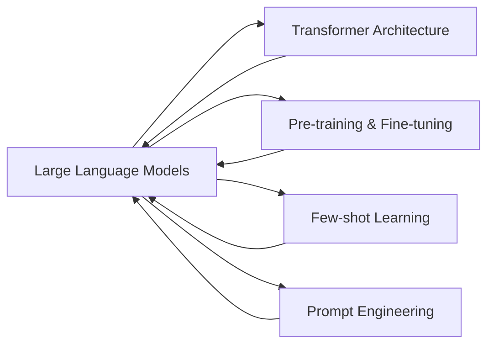

# 多模态大模型：技术原理与实战 LLM在软件研发过程中的单点提效

## 1. 背景介绍

### 1.1 问题的由来

随着人工智能技术的快速发展，大语言模型(Large Language Models, LLMs)在自然语言处理领域取得了突破性进展。LLMs通过在海量文本数据上进行无监督预训练，能够学习到丰富的语言知识和常识，具备强大的语言理解和生成能力。近年来，LLMs的应用范围不断扩大，从对话系统、文本摘要到代码生成等，都展现出了巨大的潜力。特别是在软件研发领域，LLMs正在悄然改变着传统的开发模式，为提升研发效率带来新的可能。

### 1.2 研究现状

目前，业界已经涌现出一批优秀的LLM模型，如OpenAI的GPT系列、Google的BERT和T5、Meta的OPT等。这些模型在标准的自然语言处理任务上取得了State-of-the-art的表现，甚至在某些任务上超越了人类的水平。同时，研究者们也在不断探索LLMs在垂直领域的应用，如代码生成、软件工程等。微软的CodeBERT、OpenAI的Codex等专门针对编程语言的预训练模型相继问世，展现出了LLMs在软件研发中的巨大潜力。

### 1.3 研究意义

将LLMs应用于软件研发过程，有望显著提升开发效率，改善代码质量。传统的软件开发流程中，开发人员需要花费大量时间进行需求分析、系统设计、代码编写、测试和调试等工作。而LLMs可以通过自动化的方式，根据自然语言描述直接生成代码，减少了手动编码的工作量。同时，基于LLMs的智能编程助手可以为开发者提供实时的代码补全、错误检查、性能优化等建议，提升开发体验。此外，LLMs还可以应用于软件文档生成、代码注释等方面，进一步提高软件的可维护性。

### 1.4 本文结构

本文将围绕多模态大模型在软件研发中的应用展开探讨。首先，介绍LLMs的核心概念和工作原理。然后，重点阐述LLMs在代码生成任务中的技术细节，包括数学模型、算法流程和实践案例。接着，分析LLMs在软件研发各个环节中的应用场景和效果。最后，总结LLMs在软件工程领域的发展趋势和面临的挑战，并对未来的研究方向进行展望。

## 2. 核心概念与联系

在探讨LLMs在软件研发中的应用之前，有必要先了解几个核心概念：

- 大语言模型(Large Language Models, LLMs)：是一类基于深度学习的自然语言处理模型，通过在大规模文本语料上进行无监督预训练，学习语言的统计规律和语义表示，具备强大的语言理解和生成能力。
- Transformer架构：LLMs的核心架构，采用自注意力机制来建模文本序列中的长距离依赖关系，相比传统的RNN/LSTM等模型，能够更好地并行化训练和推理。
- 预训练和微调(Pre-training & Fine-tuning)：LLMs通常采用两阶段学习范式，先在大规模通用语料上进行无监督预训练，学习通用的语言知识；然后在下游任务的标注数据上进行监督微调，适应特定的应用场景。
- 少样本学习(Few-shot Learning)：LLMs拥有强大的语言泛化能力，在只给出少量示例的情况下，即可对新任务进行快速学习和适配，无需大量标注数据。
- 提示工程(Prompt Engineering)：通过设计合适的输入提示模板，引导LLMs生成所需的输出结果，是应用LLMs解决实际问题的关键技术。

LLMs、Transformer、预训练微调、少样本学习和提示工程之间紧密相关。Transformer作为LLMs的核心架构，奠定了其并行计算和长距离建模的基础。预训练使LLMs学习到通用的语言知识，而微调使其适应特定任务。少样本学习能力源自LLMs强大的语言泛化能力。提示工程则是应用LLMs的关键，通过精心设计输入提示来引导模型生成期望的输出。

下面是LLMs核心概念之间的关系示意图：

## 3. 核心算法原理 & 具体操作步骤

### 3.1 算法原理概述

LLMs的核心算法是基于Transformer架构的自注意力机制。与传统的RNN/LSTM等顺序模型不同，Transformer采用全局的注意力计算，允许任意两个位置之间的信息交互，从而更好地捕捉长距离依赖关系。Transformer的编码器由多层自注意力和前馈网络组成，用于将输入文本映射为高维语义表示；解码器同样由多层自注意力和前馈网络组成，并额外引入编码-解码注意力机制，用于根据编码器的输出生成目标文本。

### 3.2 算法步骤详解

以Transformer的编码器为例，其处理步骤如下：

1. 输入表示：将输入文本转换为词嵌入向量，并加上位置编码以引入顺序信息。

2. 自注意力计算：对于每个位置，通过查询(Query)、键(Key)、值(Value)的计算，得到该位置与其他所有位置的注意力权重，并根据权重对值进行加权求和，得到该位置的新表示。

$$
\text{Attention}(Q,K,V) = \text{softmax}(\frac{QK^T}{\sqrt{d_k}})V
$$

3. 多头注意力：将步骤2中的自注意力计算过程独立重复多次，得到多个注意力头，然后将它们拼接起来并经过线性变换，得到多头注意力的输出表示。

$$
\text{MultiHead}(Q,K,V) = \text{Concat}(\text{head}_1, ..., \text{head}_h)W^O
$$

4. 前馈网络：对每个位置的多头注意力输出，经过两层全连接前馈网络，引入非线性变换和特征交互。

$$
\text{FFN}(x) = \max(0, xW_1 + b_1)W_2 + b_2
$$

5. 残差连接和层归一化：在每个子层(自注意力和前馈网络)之后，加入残差连接和层归一化操作，有助于梯度传播和模型收敛。

$$
\text{LayerNorm}(x + \text{Sublayer}(x))
$$

编码器的多层堆叠，最终得到输入文本的高层语义表示。解码器的处理步骤与编码器类似，额外加入了编码-解码注意力机制，用于关联编码器的输出与解码器的状态。

### 3.3 算法优缺点

Transformer相比传统的RNN/LSTM等模型，具有以下优点：
- 并行计算：自注意力计算可以充分利用GPU等硬件进行并行加速，显著提升训练和推理速度。
- 长距离依赖建模：通过全局的注意力机制，Transformer能够直接捕捉任意两个位置之间的依赖关系，更好地处理长文本。
- 丰富的语义表示：多头注意力机制允许模型从不同的子空间学习多样化的语义特征，增强了表示能力。

但Transformer也存在一些局限性：
- 计算复杂度：自注意力计算的时间和空间复杂度随着序列长度呈平方级增长，在处理超长文本时面临挑战。
- 位置编码：Transformer依赖于固定的位置编码来引入顺序信息，在某些任务中可能不够灵活。
- 过拟合风险：Transformer的参数量较大，在数据量有限的情况下容易过拟合，需要采取一些正则化手段。

### 3.4 算法应用领域

Transformer已成为NLP领域的主流架构，广泛应用于各类任务：
- 机器翻译：Transformer是当前机器翻译系统的核心组件，显著提升了翻译质量。
- 文本分类：基于Transformer的预训练模型如BERT、RoBERTa等，在文本分类任务上取得了SOTA表现。
- 问答系统：Transformer用于构建端到端的问答系统，根据问题从大规模文档中抽取答案。
- 文本生成：GPT等基于Transformer的语言模型，能够生成连贯流畅的长文本。
- 信息抽取：Transformer用于从非结构化文本中抽取结构化知识，如实体、关系、事件等。

除了NLP领域，Transformer还被引入到计算机视觉、语音识别、图神经网络等其他领域，展现出广泛的适用性。

## 4. 数学模型和公式 & 详细讲解 & 举例说明

### 4.1 数学模型构建

Transformer的核心是自注意力机制，可以用数学公式来刻画其计算过程。对于一个长度为$n$的输入序列$X=(x_1,\ldots,x_n)$，自注意力的计算可以分为以下几个步骤：

1. 计算查询矩阵$Q$、键矩阵$K$和值矩阵$V$：

$$
Q = XW^Q, K = XW^K, V = XW^V
$$

其中，$W^Q, W^K, W^V$是可学习的参数矩阵，将输入映射到查询、键、值空间。

2. 计算注意力权重矩阵$A$：

$$
A = \text{softmax}(\frac{QK^T}{\sqrt{d_k}})
$$

其中，$d_k$是查询/键向量的维度，用于缩放点积结果，避免softmax函数的梯度消失。$A$的每一行表示对应位置与其他所有位置的注意力权重分布。

3. 计算注意力输出矩阵$Z$：

$$
Z = AV
$$

将注意力权重矩阵$A$与值矩阵$V$相乘，得到加权求和后的输出表示$Z$。

4. 计算多头注意力输出矩阵$H$：

$$
H = \text{Concat}(Z_1, \ldots, Z_h)W^O
$$

独立重复步骤1-3得到多个注意力头$Z_1, \ldots, Z_h$，然后拼接起来并经过线性变换，得到多头注意力的输出$H$。

5. 前馈网络变换：

$$
F = \text{ReLU}(HW_1 + b_1)W_2 + b_2
$$

对多头注意力的输出$H$经过两层全连接前馈网络，引入非线性变换和特征交互，得到最终的输出表示$F$。

### 4.2 公式推导过程

以下是Transformer中自注意力机制的详细公式推导过程：

给定输入序列$X=(x_1,\ldots,x_n)$，其中$x_i \in \mathbb{R}^{d_{\text{model}}}$是第$i$个位置的词嵌入向量，$d_{\text{model}}$是词嵌入维度。

1. 计算查询矩阵$Q$、键矩阵$K$和值矩阵$V$：

$$
\begin{aligned}
Q &= XW^Q, \quad W^Q \in \mathbb{R}^{d_{\text{model}} \times d_k} \\
K &= XW^K, \quad W^K \in \mathbb{R}^{d_{\text{model}} \times d_k} \\
V &= XW^V, \quad W^V \in \mathbb{R}^{d_{\text{model}} \times d_v}
\end{aligned}
$$

其中，$W^Q, W^K, W^V$是可学习的参数矩阵，将输入映射到查询、键、值空间，$d_k, d_v$分别是查询/键向量和值向量的维度。

2. 计算注意力权重矩阵$A$：

$$
A = \text{softmax}(\frac{QK^T}{\sqrt{d_k}}) \in \mathbb{R}^{n \times n}
$$

其中，$QK^T$计算查询矩阵$Q$与键矩阵$K$的转置之间的点积，得到$n \times n$的注意力分数矩阵。除以$\sqrt{d_k}$是为了缩放点积结果，避免softmax函数的梯度消失。softmax函数对每一