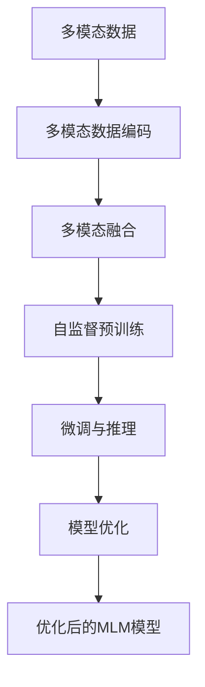

# 多模态大模型：技术原理与实战 在LLM时代，对软件研发的更多思考

## 1. 背景介绍

### 1.1 问题的由来

在过去的几年中，自然语言处理(NLP)领域取得了长足的进步,尤其是大型语言模型(LLM)的出现,极大地推动了人工智能技术的发展。传统的NLP系统通常专注于单一模态(如文本)的处理,但现实世界中的数据往往是多模态的,包括文本、图像、视频、音频等多种形式。为了更好地理解和处理这些多模态数据,研究人员提出了多模态大模型(Multimodal Large Model,MLM)的概念。

MLM旨在通过统一的架构同时处理多种模态数据,实现跨模态的理解和生成能力。这种新型模型不仅可以提高人工智能系统的性能,还能为人机交互带来全新的体验。然而,MLM的研究和应用仍处于初级阶段,存在诸多挑战亟待解决。

### 1.2 研究现状

目前,MLM的研究主要集中在以下几个方面:

1. **模型架构设计**:如何设计统一的架构来有效融合多种模态的信息,是MLM研究的核心问题之一。常见的方法包括早期融合、晚期融合和混合融合等。

2. **预训练策略**:MLM通常采用自监督学习的方式进行大规模预训练,以捕获多模态数据中的丰富知识。设计高效的预训练任务和优化策略是提高模型性能的关键。

3. **多模态表示学习**:MLM需要学习模态间的相关性,并构建统一的多模态表示空间。这对于实现跨模态的理解和生成至关重要。

4. **多任务学习**:MLM通常需要在多个下游任务上进行微调,因此如何设计有效的多任务学习策略也是一个重要的研究方向。

5. **效率和可解释性**:MLM通常具有庞大的模型规模,因此提高计算效率和模型可解释性也是亟待解决的问题。

尽管取得了一些进展,但MLM的研究仍面临诸多挑战,如数据质量、模态不平衡、知识迁移等,需要持续的努力和创新。

### 1.3 研究意义

MLM的研究对于推动人工智能技术的发展具有重要意义:

1. **提升人机交互体验**:MLM能够同时处理多种模态数据,为人机交互带来更自然、更智能的体验。

2. **促进多学科融合**:MLM需要融合计算机视觉、自然语言处理、语音识别等多个领域的知识,有助于推动不同领域的交叉融合。

3. **拓展AI应用场景**:MLM的出现为人工智能技术在多模态数据密集型场景(如医疗影像诊断、智能驾驶等)的应用铺平了道路。

4. **推动基础研究进展**:MLM的研究涉及多模态表示学习、多任务学习、高效计算等多个前沿领域,必将推动相关基础理论的发展。

综上所述,MLM的研究不仅具有重要的理论意义,也将为人工智能技术的实际应用带来深远影响。

### 1.4 本文结构

本文将全面介绍MLM的技术原理与实战应用,内容安排如下:

1. 首先阐述MLM的核心概念,包括模型架构、预训练策略、多模态表示学习等关键技术。

2. 接着详细解析MLM的核心算法原理,包括数学模型推导、具体操作步骤等。

3. 通过实际项目实践,展示MLM在代码层面的实现细节,并对关键模块进行解读和分析。

4. 探讨MLM在多个领域的应用场景,并对未来的发展趋势和挑战进行展望。

5. 最后,总结全文要点,并就常见问题给出解答。

在阅读本文后,读者将对MLM的技术原理和实战应用有全面的了解,为相关研究和开发工作奠定坚实基础。

## 2. 核心概念与联系

MLM是一种统一的架构,旨在同时处理多种模态数据,实现跨模态的理解和生成能力。它融合了多个领域的核心概念,包括:

1. **自然语言处理(NLP)**: MLM需要处理文本数据,因此需要借鉴NLP领域的技术,如Transformer模型、注意力机制、语义表示等。

2. **计算机视觉(CV)**: MLM需要处理图像和视频数据,因此需要借鉴CV领域的技术,如卷积神经网络(CNN)、目标检测、图像分割等。

3. **多模态表示学习**: MLM需要学习不同模态之间的相关性,并构建统一的多模态表示空间。这是MLM的核心技术之一。

4. **多任务学习**: MLM通常需要在多个下游任务上进行微调,因此需要采用多任务学习的策略,实现有效的知识迁移。

5. **自监督学习**: MLM通常采用自监督学习的方式进行大规模预训练,以捕获多模态数据中的丰富知识。设计高效的预训练任务是提高模型性能的关键。

6. **高效计算**: MLM通常具有庞大的模型规模,因此需要采用高效的计算策略,如模型压缩、分布式训练等。

7. **可解释性**: MLM作为一种"黑盒"模型,提高其可解释性是确保其可靠性和可信度的关键。

这些核心概念相互关联、相互影响,共同构建了MLM的理论基础和技术体系。只有全面掌握这些概念,才能真正理解MLM的工作原理,并将其应用于实际场景。

## 3. 核心算法原理 & 具体操作步骤

### 3.1 算法原理概述

MLM的核心算法原理可以概括为以下几个关键步骤:

1. **多模态数据编码**: 将不同模态的数据(如文本、图像、视频等)转换为统一的向量表示形式,以便后续的处理。常见的编码方式包括文本编码(如Word2Vec、BERT等)、图像编码(如CNN、ViT等)。

2. **多模态融合**: 将不同模态的编码向量进行融合,构建统一的多模态表示空间。常见的融合方式包括早期融合、晚期融合和混合融合等。

3. **自监督预训练**: 在大规模多模态数据集上进行自监督预训练,以捕获多模态数据中的丰富知识。常见的预训练任务包括掩码语言模型(Masked Language Modeling)、图像文本对比(Image-Text Contrastive)等。

4. **微调与推理**: 在特定的下游任务上对预训练模型进行微调,并进行推理预测。根据任务的不同,可采用单模态推理或多模态推理。

5. **模型优化**: 通过各种优化策略(如模型压缩、知识蒸馏等)来提高模型的效率和性能。

这些步骤构成了MLM的核心算法流程,下面将对其中的关键步骤进行详细阐述。

### 3.2 算法步骤详解

#### 3.2.1 多模态数据编码

多模态数据编码是MLM算法的第一步,旨在将不同模态的数据转换为统一的向量表示形式。常见的编码方式包括:

1. **文本编码**:
   - Word2Vec: 基于神经网络的词嵌入模型,将单词映射到固定长度的向量空间。
   - BERT: 基于Transformer的预训练语言模型,能够捕获上下文信息,生成更富表现力的文本表示。

2. **图像编码**:
   - CNN: 卷积神经网络,通过卷积和池化操作提取图像的局部特征。
   - ViT: 基于Transformer的视觉编码器,将图像分割为多个patch,并通过自注意力机制捕获全局信息。

3. **视频编码**:
   - 3D CNN: 在时间维度上扩展的三维卷积神经网络,用于捕获视频的时空特征。
   - ViViT: 基于Transformer的视频编码器,将视频分割为多个clip,并通过自注意力机制捕获长期依赖关系。

4. **音频编码**:
   - CNN: 类似于图像编码,通过一维卷积神经网络提取音频的局部特征。
   - Transformer: 基于自注意力机制的音频编码器,能够捕获长期依赖关系。

不同模态的数据编码方式各有优缺点,需要根据具体任务和数据特征进行选择和调整。编码后的向量表示将作为后续多模态融合的输入。

#### 3.2.2 多模态融合

多模态融合是MLM算法的核心步骤,旨在将不同模态的编码向量融合到统一的多模态表示空间中。常见的融合方式包括:

1. **早期融合**:
   - 将不同模态的编码向量在特征级别进行拼接或加和,构建统一的多模态表示。
   - 优点是简单高效,但缺点是无法捕获模态间的交互关系。

2. **晚期融合**:
   - 对每个模态单独建模,得到单模态表示,然后在决策级别进行融合。
   - 优点是可以充分利用每个模态的特征,但缺点是难以捕获模态间的内在关联。

3. **混合融合**:
   - 在不同层次(特征级、决策级等)进行多次融合,充分捕获模态间的交互关系。
   - 优点是融合效果好,但缺点是计算复杂度较高。

4. **自注意力融合**:
   - 基于Transformer的自注意力机制,直接对不同模态的编码向量进行交互和融合。
   - 优点是能够自适应地捕获模态间的关系,但需要大量数据进行预训练。

5. **交叉注意力融合**:
   - 通过交叉注意力机制,让不同模态的表示相互引导和增强。
   - 优点是能够充分利用模态间的互补信息,提高表示能力。

不同的融合方式各有优缺点,需要根据具体任务和数据特征进行选择和调整。融合后的多模态表示将作为后续自监督预训练和微调的输入。

#### 3.2.3 自监督预训练

自监督预训练是MLM算法的关键步骤,旨在在大规模多模态数据集上捕获丰富的知识和模式。常见的预训练任务包括:

1. **掩码语言模型(Masked Language Modeling, MLM)**:
   - 在文本序列中随机掩码部分单词,模型需要根据上下文预测被掩码的单词。
   - 这有助于模型捕获文本的语义和上下文信息。

2. **图像文本对比(Image-Text Contrastive, ITC)**:
   - 给定一个图像-文本对,模型需要判断它们是否匹配。
   - 这有助于模型学习图像和文本之间的语义对应关系。

3. **视频文本对比(Video-Text Contrastive, VTC)**:
   - 类似于ITC,但是将图像替换为视频,模型需要捕获视频和文本之间的关联。

4. **音频文本对比(Audio-Text Contrastive, ATC)**:
   - 类似于ITC,但是将图像替换为音频,模型需要捕获音频和文本之间的关联。

5. **多模态对比(Multimodal Contrastive, MMC)**:
   - 给定多个模态的输入,模型需要判断它们是否来自同一个样本。
   - 这有助于模型学习不同模态之间的内在联系。

6. **多模态生成(Multimodal Generation, MMG)**:
   - 给定一个或多个模态的输入,模型需要生成另一种模态的数据。
   - 这有助于模型学习跨模态的生成能力。

这些预训练任务可以单独使用,也可以组合使用,以充分利用多模态数据中的信息。预训练后的MLM模型将具备丰富的多模态知识,为后续的微调和推理奠定基础。

#### 3.2.4 微调与推