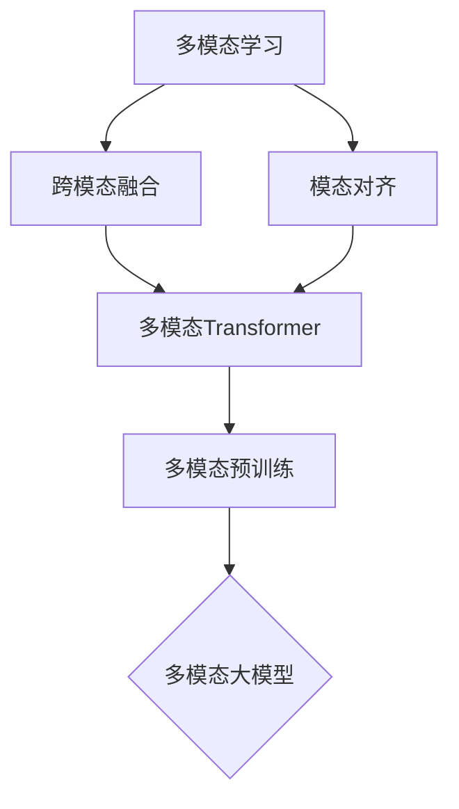

# 多模态大模型：技术原理与实战 多模态大模型在情绪识别领域的应用

关键词：多模态大模型、情绪识别、深度学习、Transformer、跨模态融合、注意力机制、预训练

## 1. 背景介绍

### 1.1 问题的由来

随着人工智能技术的飞速发展，情绪识别已成为自然语言处理和计算机视觉领域的热门研究方向之一。准确识别人类情绪对于构建智能化的人机交互系统、提升用户体验至关重要。传统的单模态情绪识别方法存在一定局限性，难以充分利用多模态信息。因此，如何有效融合文本、语音、图像等多模态数据，实现更加精准、鲁棒的情绪识别，成为亟待解决的问题。

### 1.2 研究现状

近年来，深度学习技术的兴起为情绪识别带来了新的突破。特别是Transformer[1]等注意力机制模型在自然语言处理任务上取得了显著成果，为构建强大的情绪识别模型奠定了基础。同时，跨模态学习[2]的研究也取得长足进展，通过学习不同模态数据之间的联系，实现了多模态信息的有效融合。一些研究者开始尝试将Transformer等模型应用于多模态情绪识别[3][4]，并取得了良好效果。

### 1.3 研究意义

多模态大模型在情绪识别领域的研究具有重要意义：

1. 提高情绪识别的准确性和鲁棒性，更好地理解人类情感。
2. 推动人机交互技术的发展，构建更加智能、自然的交互系统。
3. 为心理健康、社交媒体分析等领域提供有力的技术支持。
4. 探索多模态大模型的潜力，为其他多模态任务提供借鉴。

### 1.4 本文结构

本文将围绕多模态大模型在情绪识别领域的应用展开论述，内容组织如下：

第2部分介绍多模态大模型的核心概念及其内在联系；第3部分详细阐述多模态大模型的核心算法原理与具体操作步骤；第4部分给出数学模型和公式推导过程，并结合案例进行讲解；第5部分展示项目实践，包括代码实现和结果分析；第6部分讨论多模态大模型在情绪识别中的实际应用场景；第7部分推荐相关学习资源和开发工具；第8部分总结全文，展望未来发展趋势与挑战；第9部分列举常见问题与解答。

## 2. 核心概念与联系

在探讨多模态大模型之前，我们首先需要了解以下几个核心概念：

- **多模态学习**：旨在处理和融合来自多个模态（如文本、语音、视觉等）的信息，挖掘不同模态数据之间的联系，从而获得更全面、准确的理解和预测[2]。
- **Transformer**：一种基于自注意力机制的神经网络模型，最初应用于机器翻译任务[1]。Transformer 通过 self-attention 机制捕捉序列内部的长距离依赖关系，在并行计算、记忆力等方面表现出色。
- **预训练**：在大规模无标注数据上进行自监督学习，学习通用的特征表示，再针对下游任务进行微调。预训练有助于提高模型的泛化能力和训练效率[5]。

这些概念之间存在紧密联系。**多模态学习**为融合不同模态信息提供了理论基础，**Transformer**及其变体则是实现多模态融合的有效模型架构。通过在海量多模态数据上进行**预训练**，可以学习到更加通用、鲁棒的跨模态表示。多模态大模型正是在这些概念的基础上发展而来，力图构建一个统一的框架来处理文本、语音、图像等多模态数据，实现情绪识别等复杂任务。

下图展示了多模态大模型的核心概念及其内在联系：

## 3. 核心算法原理 & 具体操作步骤

### 3.1 算法原理概述

多模态大模型的核心在于如何有效地融合不同模态的信息，并在此基础上进行情绪识别。本文采用的多模态融合框架主要包括以下几个关键组件：

1. **模态特征提取**：针对文本、语音、图像等不同模态数据，使用相应的深度神经网络（如BERT[6]、VGGish[7]、ResNet[8]等）提取高层特征表示。
2. **跨模态注意力机制**：通过注意力机制建模不同模态之间的交互，学习模态间的对齐和融合策略。常见的方法有多模态Transformer[9]、跨模态注意力[10]等。
3. **模态融合**：将不同模态的特征表示进行融合，得到一个统一的多模态表示。常用的融合方式有拼接、求和、注意力加权等。
4. **情绪分类**：在融合后的多模态表示上添加分类器（如全连接层+Softmax），对不同情绪类别进行预测。

### 3.2 算法步骤详解

下面以文本-语音-视觉三模态为例，详细介绍多模态大模型的实现步骤。

**输入**：文本序列 $\mathbf{w}=(w_1,\dots,w_n)$，语音特征 $\mathbf{a} \in \mathbb{R}^{d_a}$，图像特征 $\mathbf{v} \in \mathbb{R}^{d_v}$。

**Step 1**：模态特征提取
- 文本模态：使用预训练的BERT对文本序列进行编码，得到文本特征表示 $\mathbf{H}_w \in \mathbb{R}^{n \times d_w}$。
- 语音模态：使用预训练的VGGish提取语音特征，得到语音特征表示 $\mathbf{h}_a \in \mathbb{R}^{d_a}$。
- 视觉模态：使用预训练的ResNet提取图像特征，得到视觉特征表示 $\mathbf{h}_v \in \mathbb{R}^{d_v}$。

**Step 2**：跨模态注意力交互
- 将语音、视觉特征通过线性变换映射到与文本特征相同的维度：
$$\mathbf{H}_a = \mathbf{W}_a\mathbf{h}_a + \mathbf{b}_a, \quad \mathbf{H}_a \in \mathbb{R}^{n \times d_w}$$
$$\mathbf{H}_v = \mathbf{W}_v\mathbf{h}_v + \mathbf{b}_v, \quad \mathbf{H}_v \in \mathbb{R}^{n \times d_w}$$
- 计算文本-语音、文本-视觉注意力权重：
$$\alpha_{ij}^{(wa)} = \frac{\exp(\mathbf{h}_{wi}^\top \mathbf{h}_{aj})}{\sum_{k=1}^n \exp(\mathbf{h}_{wi}^\top \mathbf{h}_{ak})}, \quad \alpha_{ij}^{(wv)} = \frac{\exp(\mathbf{h}_{wi}^\top \mathbf{h}_{vj})}{\sum_{k=1}^n \exp(\mathbf{h}_{wi}^\top \mathbf{h}_{vk})}$$
- 计算跨模态上下文表示：
$$\tilde{\mathbf{h}}_{wi} = \sum_{j=1}^n \alpha_{ij}^{(wa)} \mathbf{h}_{aj} + \sum_{j=1}^n \alpha_{ij}^{(wv)} \mathbf{h}_{vj}$$

**Step 3**：模态融合
- 将原始文本特征与跨模态上下文特征拼接，得到融合特征：
$$\mathbf{H}_f = [\mathbf{H}_w; \tilde{\mathbf{H}}_w], \quad \mathbf{H}_f \in \mathbb{R}^{n \times 2d_w}$$

**Step 4**：情绪分类
- 在融合特征 $\mathbf{H}_f$ 上应用注意力汇聚，得到句子级别表示：
$$\alpha_i = \frac{\exp(\mathbf{w}_s^\top \mathbf{h}_{fi})}{\sum_{j=1}^n \exp(\mathbf{w}_s^\top \mathbf{h}_{fj})}, \quad \mathbf{h}_s = \sum_{i=1}^n \alpha_i \mathbf{h}_{fi}$$
- 将句子表示 $\mathbf{h}_s$ 输入全连接层和Softmax函数，得到情绪类别概率分布：
$$\mathbf{p} = \mathrm{Softmax}(\mathbf{W}_c\mathbf{h}_s + \mathbf{b}_c)$$

**输出**：情绪类别概率分布 $\mathbf{p}$。

### 3.3 算法优缺点

**优点**：
1. 通过跨模态注意力机制，有效建模不同模态之间的交互和对齐关系。
2. 利用预训练模型提取模态特征，充分利用大规模无标注数据，提高模型泛化能力。
3. 融合多模态信息，较单模态方法准确性和鲁棒性更强。

**缺点**：
1. 模型复杂度较高，训练和推理成本大。
2. 对模态缺失问题的处理有待进一步研究。
3. 可解释性有待提高，模态交互和融合过程有一定的黑盒性。

### 3.4 算法应用领域

多模态大模型除了在情绪识别任务上有广泛应用，还可以拓展到以下领域：

1. 多模态情感分析：识别文本、语音、表情等多模态数据中蕴含的情感倾向。
2. 多模态事件检测：从文本、图像、视频等多源数据中检测和识别重要事件。
3. 多模态问答：根据文本问题和图像线索生成答案。
4. 多模态机器翻译：利用文本、图像等多模态信息提高机器翻译质量。

## 4. 数学模型和公式 & 详细讲解 & 举例说明

### 4.1 数学模型构建

我们以文本-语音-视觉三模态为例，给出多模态情绪识别的数学模型。

**模态特征提取**：
- 文本模态：$\mathbf{H}_w = \mathrm{BERT}(\mathbf{w})$
- 语音模态：$\mathbf{h}_a = \mathrm{VGGish}(\mathbf{a})$
- 视觉模态：$\mathbf{h}_v = \mathrm{ResNet}(\mathbf{v})$

**跨模态注意力交互**：
- 语音、视觉特征映射：
$$\mathbf{H}_a = \mathbf{W}_a\mathbf{h}_a + \mathbf{b}_a, \quad \mathbf{H}_v = \mathbf{W}_v\mathbf{h}_v + \mathbf{b}_v$$
- 文本-语音、文本-视觉注意力权重：
$$\alpha_{ij}^{(wa)} = \frac{\exp(\mathbf{h}_{wi}^\top \mathbf{h}_{aj})}{\sum_{k=1}^n \exp(\mathbf{h}_{wi}^\top \mathbf{h}_{ak})}, \quad \alpha_{ij}^{(wv)} = \frac{\exp(\mathbf{h}_{wi}^\top \mathbf{h}_{vj})}{\sum_{k=1}^n \exp(\mathbf{h}_{wi}^\top \mathbf{h}_{vk})}$$
- 跨模态上下文表示：
$$\tilde{\mathbf{h}}_{wi} = \sum_{j=1}^n \alpha_{ij}^{(wa)} \mathbf{h}_{aj} + \sum_{j=1}^n \alpha_{ij}^{(wv)} \mathbf{h}_{vj}$$

**模态融合**：
$$\mathbf{H}_f = [\mathbf{H}_w; \tilde{\mathbf{H}}_w]$$

**情绪分类**：
- 注意力汇聚：
$$\alpha_i = \frac{\exp(\mathbf{w}_s^\top \mathbf{h}_{fi})}{\sum_{j=1}^n \exp(\mathbf{w}_s^\top \mathbf{h}_{fj})}, \quad \mathbf{h}_s = \sum_{i=1}^n \alpha_i \mathbf{h}_{fi}$$
- 全连接+Softmax：
$$\mathbf{p} = \mathrm{