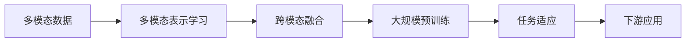

# 多模态大模型：技术原理与实战 多模态大模型的性能评估

关键词：多模态大模型、技术原理、实战应用、性能评估

## 1. 背景介绍
### 1.1 问题的由来
随着人工智能技术的快速发展,特别是深度学习的突破性进展,多模态大模型逐渐成为学术界和工业界关注的热点。多模态大模型能够同时处理文本、图像、音频等不同模态的数据,在许多任务上取得了显著的性能提升。然而,多模态大模型的训练和应用仍然面临诸多挑战,如何评估其性能也是一个亟待解决的问题。

### 1.2 研究现状
目前,国内外已有不少研究者开展了多模态大模型的研究工作。微软、谷歌、OpenAI等科技巨头纷纷推出自己的多模态大模型,如Turing-NLG、DALL-E、GPT-3等。学术界也提出了一系列多模态预训练模型,如ViLBERT、VisualBERT、UNITER等。这些模型在图文匹配、视觉问答、图像描述生成等任务上取得了优异的表现。但对于多模态大模型的性能评估,目前还缺乏统一的标准和系统的研究。

### 1.3 研究意义
深入研究多模态大模型的技术原理,总结其在实战中的应用经验,对于推动多模态人工智能的发展具有重要意义。同时,探索多模态大模型的性能评估方法,有助于客观衡量不同模型的优劣,为后续的模型优化和应用部署提供参考依据。本文将从技术和应用两个角度切入,系统阐述多模态大模型的原理、实践和评估,力求为相关研究提供新的思路和见解。

### 1.4 本文结构
本文共分为9个章节。第1节介绍研究背景；第2节阐述多模态大模型的核心概念；第3节详细讲解多模态大模型的算法原理和操作步骤；第4节介绍相关的数学模型和公式推导；第5节给出多模态大模型的代码实例和详细解释；第6节分析多模态大模型的实际应用场景；第7节推荐相关的工具和学习资源；第8节总结全文,并展望多模态大模型的未来发展趋势和面临的挑战；第9节列举常见问题与解答。

## 2. 核心概念与联系

多模态大模型是指能够同时处理多种不同模态数据(如文本、图像、音频、视频等)的大规模预训练模型。与单模态模型相比,多模态大模型能够学习不同模态之间的内在联系和互补信息,从而获得更全面、更准确的语义理解能力。

多模态大模型的核心概念包括:

- 多模态表示学习:通过将不同模态的数据映射到一个共同的语义空间,学习统一的多模态表示。常见的方法有对齐映射、交叉注意力机制等。

- 跨模态融合:在获得统一的多模态表示后,需要进一步融合不同模态的信息,挖掘它们之间的互补性和关联性。常见的融合方式有简单拼接、门控融合、层次融合等。

- 大规模预训练:利用海量的多模态数据对模型进行预训练,使其掌握通用的多模态理解能力。预训练任务包括掩码语言建模、图文匹配、对比学习等。

- 任务适应:在下游任务中,通过微调或提示学习等方式,将预训练好的多模态大模型应用到特定场景,实现快速适应。

多模态大模型的关键在于实现不同模态信息的有效融合,充分利用它们的互补性,从而获得更好的表示和泛化能力。同时,大规模预训练也是提升多模态大模型性能的重要手段。

## 3. 核心算法原理 & 具体操作步骤
### 3.1 算法原理概述
多模态大模型的核心算法主要包括多模态表示学习和跨模态融合两大部分。其中,多模态表示学习旨在将不同模态的数据映射到一个共同的语义空间,常用的方法有对齐映射和交叉注意力机制。跨模态融合则在统一表示的基础上,进一步融合不同模态的信息,挖掘它们的互补性和关联性。

### 3.2 算法步骤详解
1. 多模态表示学习
- 对齐映射:将不同模态的特征通过线性变换或非线性变换映射到同一维度的空间,使它们在语义上对齐。例如,可以使用全连接层将图像特征和文本特征映射到相同维度。
- 交叉注意力:通过注意力机制,让不同模态的特征相互关注,捕捉它们之间的对应关系。常见的做法是使用多头自注意力或协同注意力。

2. 跨模态融合 
- 简单拼接:直接将不同模态的特征在某一维度上拼接起来,得到多模态联合表示。这种方法简单但有时效果欠佳。
- 门控融合:引入门控机制,自适应地控制不同模态信息的重要性,选择性地融合多模态特征。门控可以是sigmoid函数或GELU等。
- 层次融合:在模型的不同层次分别进行多模态融合,逐步提炼高层语义。可以设计层次化的融合模块,如级联融合、树状融合等。

3. 大规模预训练
- 掩码语言建模:随机掩盖输入文本的部分token,让模型根据上下文和图像线索预测被掩盖的内容,学习文本-图像对齐。
- 图文匹配:给定图文对,判断它们是否匹配。通过这种方式,模型可以学习跨模态的语义一致性。
- 对比学习:将不同模态的数据视为不同的视角,通过最大化相似视角的一致性来学习多模态表示。

4. 任务适应
- 微调:在下游任务的数据集上,通过梯度下降等方法微调预训练模型的参数,使其适应特定任务。
- 提示学习:设计适当的输入提示,引导预训练模型生成所需的输出,而无需修改模型参数。

### 3.3 算法优缺点
- 优点:
  - 多模态大模型能够有效融合不同模态的信息,获得更全面、更准确的语义理解能力。
  - 大规模预训练可以让模型学习到通用的多模态表示,具备较好的迁移能力和泛化能力。
  - 多模态大模型在许多任务上取得了显著的性能提升,展现出广阔的应用前景。

- 缺点:
  - 训练多模态大模型需要海量的数据和计算资源,对算力和存储提出了很高的要求。  
  - 不同模态数据的特征分布差异较大,如何设计有效的表示学习和融合方法仍具有挑战性。
  - 多模态大模型的解释性和可控性有待进一步提高,存在一定的安全隐患。

### 3.4 算法应用领域
多模态大模型可以应用于多个领域,包括但不限于:

- 跨模态检索:根据一种模态的查询(如文本),检索另一种模态的相关内容(如图像)。
- 视觉问答:根据图像和文本问题,生成自然语言答案。
- 图像描述生成:根据输入的图像,自动生成对应的文本描述。
- 多模态对话:融合文本、图像、语音等多模态信息,实现更自然、更智能的对话交互。
- 多模态推理:利用多模态线索进行复杂的推理和决策,如多模态阅读理解、多模态事件抽取等。

## 4. 数学模型和公式 & 详细讲解 & 举例说明
### 4.1 数学模型构建
多模态大模型的数学模型可以用统一的公式来表示:

$$\mathbf{y} = f(\mathbf{x}_1, \mathbf{x}_2, ..., \mathbf{x}_n; \theta)$$

其中,$\mathbf{x}_1, \mathbf{x}_2, ..., \mathbf{x}_n$表示不同模态的输入数据,$\mathbf{y}$表示模型的输出,$f$表示多模态大模型的映射函数,$\theta$表示模型的参数。

模型的目标是学习一个最优的参数$\theta^*$,使得在给定输入$\mathbf{x}_1, \mathbf{x}_2, ..., \mathbf{x}_n$的情况下,模型的输出$\mathbf{y}$与真实标签$\mathbf{y}^*$尽可能接近:

$$\theta^* = \arg\min_\theta \mathcal{L}(f(\mathbf{x}_1, \mathbf{x}_2, ..., \mathbf{x}_n; \theta), \mathbf{y}^*)$$

其中,$\mathcal{L}$表示损失函数,用于衡量模型输出与真实标签之间的差异。常见的损失函数包括交叉熵损失、均方误差损失等。

### 4.2 公式推导过程
以交叉注意力机制为例,我们详细推导其数学公式。

假设有两个模态的输入特征$\mathbf{X}_1 \in \mathbb{R}^{n_1 \times d}, \mathbf{X}_2 \in \mathbb{R}^{n_2 \times d}$,其中$n_1,n_2$分别表示两个模态的特征长度,$d$表示特征维度。

首先,通过线性变换得到查询矩阵$\mathbf{Q}$、键矩阵$\mathbf{K}$和值矩阵$\mathbf{V}$:

$$\mathbf{Q}_1 = \mathbf{X}_1 \mathbf{W}_1^Q, \quad \mathbf{K}_2 = \mathbf{X}_2 \mathbf{W}_2^K, \quad \mathbf{V}_2 = \mathbf{X}_2 \mathbf{W}_2^V$$

其中,$\mathbf{W}_1^Q \in \mathbb{R}^{d \times d_k}, \mathbf{W}_2^K \in \mathbb{R}^{d \times d_k}, \mathbf{W}_2^V \in \mathbb{R}^{d \times d_v}$为可学习的参数矩阵。

然后,计算模态1对模态2的注意力分数:

$$\mathbf{A}_{1\rightarrow2} = \text{softmax}(\frac{\mathbf{Q}_1 \mathbf{K}_2^T}{\sqrt{d_k}})$$

接着,根据注意力分数对值矩阵进行加权求和,得到模态1对模态2的注意力输出:

$$\mathbf{O}_{1\rightarrow2} = \mathbf{A}_{1\rightarrow2} \mathbf{V}_2$$

最后,将注意力输出与原始特征相加,并通过前馈网络(FFN)得到最终的输出表示:

$$\mathbf{H}_1 = \text{FFN}(\mathbf{X}_1 + \mathbf{O}_{1\rightarrow2})$$

同理,可以计算模态2对模态1的注意力输出$\mathbf{O}_{2\rightarrow1}$和最终表示$\mathbf{H}_2$。

通过交叉注意力机制,两个模态的特征相互关注,捕捉它们之间的对应关系,得到更好的多模态表示。

### 4.3 案例分析与讲解
我们以图文匹配任务为例,说明如何应用交叉注意力机制进行多模态融合。

给定一张图像和一段文本,模型需要判断它们是否匹配。首先,使用卷积神经网络(CNN)提取图像特征,使用预训练的词嵌入和循环神经网络(RNN)提取文本特征。然后,将图像特征和文本特征输入到交叉注意力模块中,计算它们之间的注意力分数和注意力输出。接着,将注意力输出与原始特征相加,并通过前馈网络得到融合后的多模态表示。最后,将图像和文本的多模态表示拼接起来,输入到分类器中进行匹配预测。

设图像特征为$\mathbf{X}_I \in \mathbb{R}^{n_I \times 