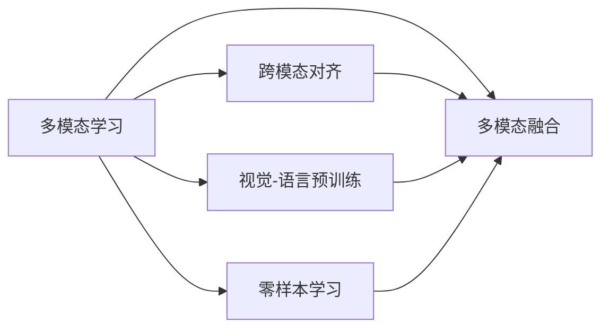
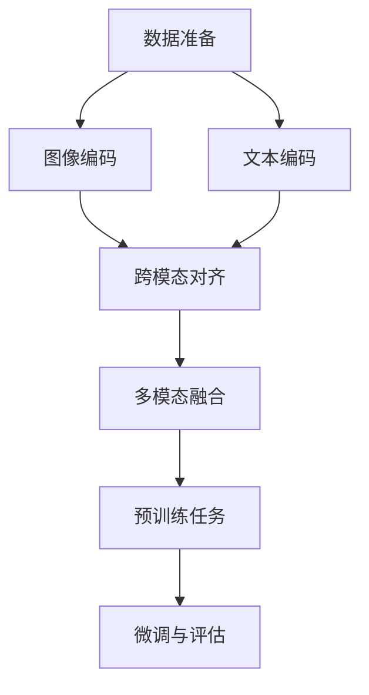

# 多模态大模型：技术原理与实战 多模态大模型的效果评估

关键词：多模态大模型、跨模态对齐、视觉-语言预训练、零样本学习、多模态融合

## 1. 背景介绍
### 1.1  问题的由来
随着人工智能技术的飞速发展,单模态的大模型如GPT-3、PaLM等在自然语言处理领域取得了令人瞩目的成就。然而,现实世界中的信息往往以多种模态形式存在,如文本、图像、音频、视频等。因此,如何构建能够理解和生成多模态信息的大模型,成为了当前人工智能领域的一个重要研究方向。
### 1.2  研究现状
目前,多模态大模型的研究主要集中在以下几个方面:

1. 跨模态对齐:通过对不同模态数据进行对齐,实现模态间的信息交互和融合。常见的方法有对抗学习、注意力机制等。

2. 视觉-语言预训练:利用大规模的图文对数据,对模型进行预训练,使其能够同时理解图像和文本信息。代表性工作有CLIP、ALIGN等。

3. 零样本学习:通过对预训练模型进行微调,使其能够在没有见过目标任务数据的情况下,快速适应新的任务。这大大提高了模型的泛化能力。

4. 多模态融合:探索不同模态信息的融合方式,如早期融合、晚期融合、中间融合等,以提升模型的性能。

### 1.3  研究意义
多模态大模型的研究具有重要的理论和实践意义:

1. 推动人工智能向通用人工智能(AGI)的方向发展,使机器能够像人一样理解和交互多模态信息。

2. 拓展人工智能的应用场景,如多模态对话、视觉问答、图像生成等,为智能化生活提供更多可能。

3. 促进不同学科领域的交叉融合,如计算机视觉、自然语言处理、语音识别等,催生更多创新性研究成果。

### 1.4  本文结构
本文将围绕多模态大模型的技术原理与实战展开,主要内容包括:

1. 多模态大模型的核心概念与关键技术
2. 主流多模态大模型的架构原理与算法步骤
3. 多模态大模型中的数学模型与公式推导
4. 多模态大模型的代码实现与效果评估
5. 多模态大模型的实际应用场景与案例分析
6. 多模态大模型的开发工具与学习资源推荐
7. 多模态大模型的未来发展趋势与挑战展望

## 2. 核心概念与联系
要理解多模态大模型,首先需要了解其中的一些核心概念:

- 模态(Modality):指信息的不同表现形式,如文本、图像、音频、视频等。
- 多模态学习(Multimodal Learning):旨在让机器同时处理和理解多种模态的信息,实现模态间的信息交互和融合。
- 跨模态对齐(Cross-modal Alignment):通过将不同模态数据映射到一个共同的语义空间,实现模态间的信息对齐。
- 视觉-语言预训练(Vision-Language Pre-training):利用大规模的图文对数据对模型进行预训练,使其能够同时理解图像和文本信息。
- 零样本学习(Zero-shot Learning):模型在没有见过目标任务数据的情况下,利用预训练的知识快速适应新任务。
- 多模态融合(Multimodal Fusion):将不同模态的信息进行融合,以提升模型的性能。常见的融合方式有早期融合、晚期融合、中间融合等。

这些概念之间存在着紧密的联系:

多模态学习是一个总领概念,其中跨模态对齐、视觉-语言预训练、零样本学习都是实现多模态学习的关键技术,而多模态融合则是将不同模态信息进行整合的重要手段。只有协调运用这些技术,才能构建出高效、鲁棒的多模态大模型。

## 3. 核心算法原理 & 具体操作步骤
### 3.1  算法原理概述
多模态大模型的核心算法主要包括两大类:跨模态对齐和多模态融合。

跨模态对齐旨在学习不同模态数据之间的语义对应关系,常用的方法有:

- 对抗学习:通过引入对抗损失,让不同模态的特征在公共语义空间中尽可能接近。
- 注意力机制:通过注意力机制动态地对齐不同模态的特征。
- 对比学习:通过最大化正样本对的相似度,最小化负样本对的相似度,实现跨模态对齐。

多模态融合则探索不同模态信息的融合方式,主要有:

- 早期融合:直接将不同模态的原始特征拼接起来。
- 晚期融合:将不同模态的特征先分别提取,再进行融合。
- 中间融合:在网络的中间层对不同模态的特征进行交互融合。

### 3.2  算法步骤详解
以视觉-语言预训练为例,详细介绍多模态大模型的训练步骤:

1. 数据准备:收集大规模的图文对数据,如Image-Text Pair。

2. 图像编码:使用预训练的CNN网络(如ResNet)提取图像特征。

3. 文本编码:使用预训练的Transformer网络(如BERT)提取文本特征。

4. 跨模态对齐:通过对抗学习、注意力机制等方法,将图像特征和文本特征对齐到一个公共语义空间。

5. 多模态融合:使用中间融合的方式,在Transformer的每一层加入图像特征,实现多模态特征的交互融合。

6. 预训练任务:设计预训练任务,如图文匹配、图文检索等,让模型学习到跨模态的语义对应关系。

7. 微调与评估:在下游任务数据上微调模型,并进行评估,不断优化模型性能。

### 3.3  算法优缺点
多模态大模型算法的优点包括:

- 能够有效捕捉不同模态数据之间的语义对应关系。
- 通过预训练学习到的跨模态知识,可以显著提升下游任务的性能。
- 具有较强的泛化能力,可以适应各种不同的场景和任务。

但同时也存在一些局限性:

- 对大规模高质量的多模态数据有较大需求,数据的获取和标注成本较高。
- 模型参数量大,训练和推理的计算开销大。
- 对于一些细粒度的理解任务,如视觉问答中的推理能力,还有待进一步提升。

### 3.4  算法应用领域
多模态大模型可以应用于各种需要处理多模态信息的任务,如:

- 多模态对话:如视觉对话、音频对话等,让机器能够理解图像、语音等多模态信息,并进行自然流畅的对话交互。
- 视觉问答:根据图像信息回答用户提出的问题,需要对图像和文本进行理解和推理。
- 图像描述生成:根据输入的图像,自动生成对应的文本描述。
- 文本-图像检索:根据文本描述从图像库中检索出相关的图像,或根据图像从文本库中检索出相关的文本。
- 多模态内容创作:如根据文本描述自动生成对应的图像,或根据图像自动生成对应的音乐等。

随着多模态大模型的不断发展,其应用场景也将越来越广泛,为人们的生活和工作带来更多便利。

## 4. 数学模型和公式 & 详细讲解 & 举例说明
### 4.1  数学模型构建
多模态大模型的数学模型通常由三部分组成:图像编码器、文本编码器和跨模态交互模块。

设输入的图像为$I$,文本为$T$,图像编码器为$f_v$,文本编码器为$f_t$,跨模态交互模块为$f_m$,则多模态大模型可以表示为:

$$z=f_m(f_v(I),f_t(T))$$

其中,$z$表示最终的多模态融合表示。

图像编码器$f_v$通常使用CNN网络,如ResNet。设图像$I$经过$L$层CNN得到的特征为$v_L$,则$f_v$可以表示为:

$$v_L=f_v(I)=CNN_L(\cdots CNN_2(CNN_1(I))\cdots)$$

文本编码器$f_t$通常使用Transformer网络,如BERT。设文本$T$经过$N$层Transformer得到的特征为$t_N$,则$f_t$可以表示为:

$$t_N=f_t(T)=Transformer_N(\cdots Transformer_2(Transformer_1(T))\cdots)$$

跨模态交互模块$f_m$可以采用多种方式,如拼接、注意力机制等。以拼接方式为例,设拼接后的特征为$h$,则$f_m$可以表示为:

$$h=f_m(v_L,t_N)=Concat(v_L,t_N)$$

### 4.2  公式推导过程
以视觉-语言预训练中的对比学习为例,详细推导多模态大模型的损失函数。

设图像特征为$v$,文本特征为$t$,二者经过映射函数$g_v$和$g_t$映射到同一语义空间,得到$z_v$和$z_t$:

$$z_v=g_v(v)$$
$$z_t=g_t(t)$$

对于一个图文对$(v_i,t_i)$,其余的图像特征为$v_{i,1},\cdots,v_{i,k}$,其余的文本特征为$t_{i,1},\cdots,t_{i,k}$,则对比学习的损失函数可以定义为:

$$\mathcal{L}=-\log\frac{\exp(sim(z_{v_i},z_{t_i})/\tau)}{\exp(sim(z_{v_i},z_{t_i})/\tau)+\sum_{j=1}^k\exp(sim(z_{v_i},z_{t_{i,j}})/\tau)+\sum_{j=1}^k\exp(sim(z_{v_{i,j}},z_{t_i})/\tau)}$$

其中,$sim(\cdot,\cdot)$表示相似度函数,通常使用内积或余弦相似度:

$$sim(z_v,z_t)=z_v^Tz_t$$

或

$$sim(z_v,z_t)=\frac{z_v^Tz_t}{||z_v||_2||z_t||_2}$$

$\tau$是一个温度超参数,用于控制softmax分布的平滑程度。

最小化上述损失函数,可以让正样本对$(v_i,t_i)$的相似度尽可能大,负样本对$(v_i,t_{i,j})$和$(v_{i,j},t_i)$的相似度尽可能小,从而实现图像特征和文本特征在公共语义空间中的对齐。

### 4.3  案例分析与讲解
以图文匹配任务为例,说明多模态大模型的应用。

图文匹配任务旨在判断给定的图像和文本是否匹配。设图像特征为$v$,文本特征为$t$,匹配得分为$s$,则可以使用多模态大模型计算匹配得分:

$$s=f_m(f_v(v),f_t(t))$$

其中,$f_v$、$f_t$、$f_m$分别表示图像编码器、文本编码器和跨模态交互模块。

假设有一张图像描述了"一只猫坐在沙发上",那么与之匹配的文本可能是"A cat is sitting on the sofa",而不匹配的文本可能是"A dog is playing in the garden"。

通过多模态大模型,可以学习到图像和文本之间的语义对应关系,从而准确地判断出图文是否匹配。具体来说:

1. 图像编码器$f_v$提取图像