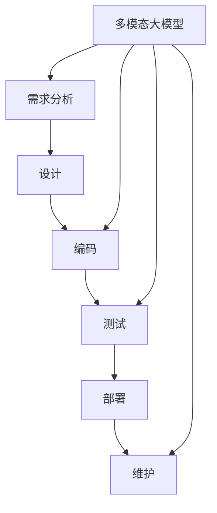

# 多模态大模型：技术原理与实战 大模型在软件研发领域的实战案例与前沿探索

关键词：多模态大模型、软件研发、深度学习、自然语言处理、计算机视觉、语音识别、知识图谱

## 1. 背景介绍
### 1.1  问题的由来
随着人工智能技术的飞速发展,尤其是深度学习的崛起,大模型已经成为了当前人工智能领域的研究热点。多模态大模型通过融合文本、图像、语音等多种模态的信息,能够更全面地理解和表达复杂的语义,在软件研发、智能问答、智能助手等领域展现出了广阔的应用前景。然而,多模态大模型的训练和应用仍面临诸多挑战,亟需从技术原理和实践案例两个角度进行深入探索。

### 1.2  研究现状 
目前,国内外已有不少团队开展了多模态大模型的研究。谷歌提出的 BERT 和 T5 等预训练语言模型在 NLP 领域取得了突破性进展。OpenAI 的 CLIP 和 DALL-E 实现了图文对齐和文本生成图像。微软的 Florence 将视觉、语言和语音进行了更紧密的融合。国内的 ERNIE-ViLG 和 M6 等模型也展现出了强大的多模态理解和生成能力。这些研究成果为多模态大模型在软件研发中的应用奠定了基础。

### 1.3  研究意义
探索多模态大模型在软件研发领域的应用,具有重要的理论意义和实践价值:

1. 有助于推动人工智能技术与软件工程的深度融合,为软件研发注入新的活力。多模态大模型可用于需求分析、代码生成、软件测试等环节,提高开发效率和质量。

2. 丰富多模态人工智能的应用场景,推动相关技术的进一步发展。软件研发涉及复杂的信息处理和知识应用,是验证多模态大模型能力的理想场景。

3. 为传统软件行业的数字化转型提供新的思路和方法。利用多模态大模型构建智能化的软件开发平台和工具,有望从根本上改变软件的开发模式。

### 1.4  本文结构
本文将围绕多模态大模型在软件研发领域的技术原理和实战案例展开论述,主要内容包括:

1. 多模态大模型的核心概念与内在联系
2. 多模态大模型的核心算法原理和关键技术
3. 多模态大模型中的数学模型与公式推导
4. 多模态大模型在软件研发中的代码实例详解
5. 多模态大模型的实际应用场景及案例分析
6. 多模态大模型的开发工具与学习资源推荐
7. 多模态大模型的未来发展趋势与面临的挑战
8. 常见问题解答与补充说明

## 2. 核心概念与联系
要理解多模态大模型在软件研发中的应用,首先需要厘清其核心概念及内在联系。

多模态(Multimodal):指融合了文本、图像、语音、视频等多种不同形式的信息,以更全面地理解和表达语义。人类感知世界也是多模态的,因此多模态AI更接近人类智能。

大模型(Large Model):是指参数量极大(数亿到数千亿)的深度学习模型。大模型一般采用预训练(pre-train)和微调(fine-tune)的范式,在海量数据上进行自监督学习,再针对下游任务进行调优,可以实现更强的理解和生成能力。

软件研发(Software Development):指软件生命周期中的各项活动,包括需求分析、设计、编码、测试、部署、维护等。传统软件研发主要依赖人力,而引入多模态大模型则可实现智能化、自动化,大幅提升研发效率。

多模态大模型与软件研发的结合点主要体现在:

1. 需求分析:通过分析用户提供的文档、原型图、语音说明等多模态需求信息,自动生成结构化的需求规格说明。

2. 代码生成:根据需求描述、流程图、伪代码等信息,自动生成符合要求的源代码,支持多种编程语言。

3. 软件测试:通过分析需求文档、用户界面图、操作视频等,自动生成测试用例,进行功能测试和UI测试。

4. 代码注释:对源代码进行分析理解,自动生成符合规范的注释,提高代码可读性和可维护性。

5. 文档生成:根据软件需求、设计、代码注释等信息,自动生成用户手册、API文档等。

6. 智能问答:针对开发者的问题,通过语义理解和知识推理给出精准的答案和建议。

下图展示了多模态大模型在软件研发各环节的应用:



## 3. 核心算法原理 & 具体操作步骤
### 3.1  算法原理概述
多模态大模型的核心是利用深度神经网络,通过自监督学习从海量多模态数据中习得通用的语义表示,再针对具体任务进行微调。其主要涉及以下关键技术:

1. Transformer 架构:摒弃了传统的 RNN/CNN,通过 self-attention 机制建模任意长度的序列依赖,并实现并行计算,是大模型的核心骨架。

2. 预训练模型:如 BERT、GPT、T5、ViT、MAE 等,在大规模语料上进行自监督预训练,习得了丰富的语言知识和视觉特征,是后续任务的基础。

3. 对比学习:通过最大化正样本的相似度,最小化负样本的相似度,实现对多模态数据的对齐,如 CLIP 利用图文对比学习实现了跨模态检索。

4. 知识蒸馏:通过teacher model指导student model学习,实现模型压缩,在保持性能的同时降低资源占用,如 DistilBERT。

5. 提示学习(Prompt Learning):通过设计恰当的提示模板,引导预训练模型执行特定任务,无需或少量微调,如 GPT-3。

6. 多任务学习:通过共享网络层和联合训练,实现不同任务间的知识迁移和泛化,避免训练独立模型,如 T5 支持文本生成、分类、问答等任务。

### 3.2  算法步骤详解
以代码生成任务为例,详细说明多模态大模型的应用步骤:

1. 收集高质量的(需求文档,源代码)数据对,涵盖主流的编程语言和应用场景,进行必要的清洗和预处理。

2. 选择合适的多模态预训练模型,如 CodeBERT、CodeT5、CodeGen 等,根据任务特点和资源限制进行必要的修改,如调整词表、网络结构等。

3. 在收集的数据集上进行预训练,采用掩码语言建模(MLM)、 next sentence prediction (NSP)等预训练任务,习得编程语言的语法和语义知识。

4. 根据代码生成任务的输入输出格式,设计合适的微调样本,如:

   输入:
   """
   请编写一个 Python 函数计算两个数的最大公约数
   """
   
   输出:
   ```python
   def gcd(a, b):
       while b != 0:
           a, b = b, a % b
       return a
   ```

5. 在预训练模型的基础上,使用微调样本进行训练,采用 teacher forcing 或 scheduled sampling 等方法避免曝光偏差。通过设置适当的学习率、batch size、epoch 等超参数优化模型性能。

6. 在验证集上评估模型的性能,如 BLEU、CodeBLEU、pass@k 等指标。根据实际需求平衡模型的性能和效率,如采用模型蒸馏、量化、剪枝等优化方法。

7. 将训练好的代码生成模型集成到 IDE 插件或在线编程助手中,接收用户的自然语言需求,输出对应的代码片段,并根据反馈持续优化。

### 3.3  算法优缺点
多模态大模型用于软件研发的优点包括:

1. 显著提高开发效率,减少重复劳动。通过自动生成代码、测试用例、文档等,让开发者聚焦更高层次的设计。

2. 降低开发门槛,赋能低代码/零代码开发。即使是非专业开发者也能根据需求快速生成可用的程序。

3. 保证软件质量,减少缺陷引入。基于大规模高质量数据训练的模型能生成安全、健壮、高性能的代码。

4. 促进知识积累和复用。通过预训练,模型习得了大量通用的编程知识,可以在不同项目间迁移和复用。

但也存在一些局限和挑战:

1. 生成代码的可解释性和可控性有待提高,对于复杂系统难以完全信赖。需要人工审查和修正。

2. 对于特定领域的需求,如操作系统、数据库、安全等,需要进一步的领域适配和优化。

3. 训练大模型需要大量计算资源和高质量数据,对中小团队而言成本较高。

4. 生成的代码可能存在版权、许可证等知识产权风险,需要谨慎处理。

### 3.4  算法应用领域
除了前面提到的代码生成,多模态大模型在软件研发的其他环节也有广泛应用,如:

1. 代码补全:根据上下文自动补全后续代码,提示可能的 API 用法。如 GitHub Copilot。

2. 代码搜索:通过自然语言查询匹配相关代码片段,支持跨库、跨语言的语义搜索。如 Sourcegraph。

3. 代码审查:自动检查代码规范、安全漏洞、性能瓶颈等,给出优化建议。如 SonarQube。

4. 代码翻译:将一种语言的代码转换为另一种语言,保留原有逻辑和注释。如 Facebook TransCoder。

5. 程序修复:根据错误信息和测试用例,自动定位和修复 bug。如 Getafix。

未来,多模态大模型有望进一步融合需求、设计、开发、测试、部署、维护等环节,实现端到端的智能化软件研发。

## 4. 数学模型和公式 & 详细讲解 & 举例说明
### 4.1  数学模型构建
多模态大模型的数学基础是深度神经网络和概率图模型。以 Transformer 为例,其核心是 self-attention 机制,通过计算 query、key、value 三个矩阵的相似度,得到输入序列中每个位置与其他位置的依赖关系。

给定输入序列 $\mathbf{X} \in \mathbb{R}^{n \times d}$,其中 $n$ 为序列长度,$d$ 为特征维度。self-attention 的计算过程为:

$$
\begin{aligned}
\mathbf{Q} &= \mathbf{X} \mathbf{W}^Q \\
\mathbf{K} &= \mathbf{X} \mathbf{W}^K \\
\mathbf{V} &= \mathbf{X} \mathbf{W}^V \\
\mathbf{A} &= \text{softmax}(\frac{\mathbf{Q}\mathbf{K}^T}{\sqrt{d_k}}) \\
\text{Attention}(\mathbf{Q}, \mathbf{K}, \mathbf{V}) &= \mathbf{A} \mathbf{V}
\end{aligned}
$$

其中 $\mathbf{W}^Q, \mathbf{W}^K, \mathbf{W}^V \in \mathbb{R}^{d \times d_k}$ 为可学习的权重矩阵,$\mathbf{A} \in \mathbb{R}^{n \times n}$ 为注意力分布,softmax 保证了每一行和为1。除以 $\sqrt{d_k}$ 是为了缓解点积结果过大的问题。

多头注意力(multi-head attention)通过并行计算多个 self-attention,然后拼接结果,增强了模型的表达能力:

$$
\begin{aligned}
\text{MultiHead}(\mathbf{Q}, \mathbf{K}, \mathbf{V