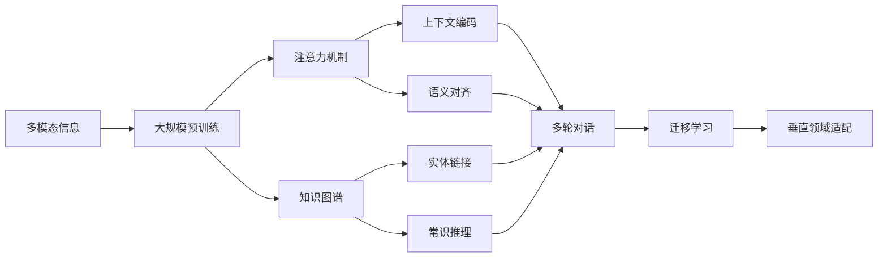

# 多模态大模型：技术原理与实战 如何提高多轮对话能力

关键词：多模态大模型, 多轮对话, 自然语言处理, 深度学习, 知识图谱, 预训练模型, 迁移学习

## 1. 背景介绍
### 1.1  问题的由来
随着人工智能技术的飞速发展,多模态大模型在自然语言处理领域取得了突破性进展。多模态大模型能够同时处理文本、图像、语音等多种模态的信息,实现了前所未有的性能提升。然而,如何进一步提高多模态大模型在多轮对话场景中的表现,仍然是一个亟待解决的难题。
### 1.2  研究现状
目前,业界主流的多模态大模型包括OpenAI的GPT系列、Google的BERT系列、微软的Turing-NLG等。这些模型在多种NLP任务上取得了state-of-the-art的结果。但在多轮对话场景中,现有模型仍然存在信息遗忘、逻辑混乱、缺乏常识等问题,难以支撑真正智能化的人机交互。
### 1.3  研究意义 
深入研究多模态大模型在多轮对话中的技术原理和实践方法,对于提升人机交互体验、拓展人工智能应用场景具有重要意义。一方面,高质量的多轮对话能力是智能客服、虚拟助手等应用的核心诉求;另一方面,多轮对话蕴含着丰富的语义理解和逻辑推理技术,是通用人工智能的重要探索方向。
### 1.4  本文结构
本文将从以下几个方面展开论述:
- 第2部分介绍多模态大模型涉及的核心概念及其内在联系 
- 第3部分重点阐述多模态大模型的核心算法原理和关键实现步骤
- 第4部分建立多轮对话场景下的数学模型,并给出详细的公式推导和案例分析
- 第5部分提供项目实践的代码实例和解释说明
- 第6部分讨论多模态大模型在实际应用场景中的案例和未来展望
- 第7部分推荐相关的学习资源、开发工具和文献资料
- 第8部分总结全文,并对未来发展趋势和挑战进行展望

## 2. 核心概念与联系
要理解多模态大模型在多轮对话中的原理和应用,需要先明确以下几个核心概念:

- **多模态(Multi-modal)**: 指同时处理文本、语音、图像、视频等多种不同形式的信息。相比单一模态,多模态融合能更全面地理解语义,但也带来了异构信息的表征和对齐挑战。

- **大模型(Large Model)**: 指参数量极大(数亿到数千亿)的深度神经网络模型。大模型一般采用Transformer等注意力机制结构,并在大规模语料上进行预训练,具备强大的语言理解和生成能力。

- **多轮对话(Multi-turn Dialogue)**: 指多个交互回合构成的完整对话。多轮对话需要理解上下文信息,记忆历史语义,推理话题走向,生成连贯回复,是一项综合性很强的任务。

- **知识图谱(Knowledge Graph)**: 指用图结构表示实体、属性、关系的大规模知识库。将外部知识图谱与语言模型相结合,能够赋予模型更强的常识推理和问答能力。

- **预训练(Pre-training)**: 指在大规模通用语料上进行自监督学习,习得语言的基本表征和规律。预训练是大模型的核心范式,为下游任务提供了性能强劲的初始化参数。

- **迁移学习(Transfer Learning)**: 指将预训练模型应用到具体任务的微调过程。通过迁移学习,大模型可以快速适应垂直领域数据,实现少样本学习。

下图展示了多模态大模型的关键技术要素及其内在联系:



## 3. 核心算法原理 & 具体操作步骤
### 3.1 算法原理概述
多模态大模型在多轮对话中的核心算法可以概括为:基于注意力机制的上下文语义编码、多模态信息的表征学习与对齐、结合外部知识的常识推理、端到端的生成式回复预测。其中Transformer结构及其变体是最主流的建模范式。
### 3.2 算法步骤详解
1. **预训练阶段**:在大规模多模态语料上进行自监督学习,通过掩码语言建模(MLM)、对比学习等任务习得通用语义表征。将文本、图像等不同模态数据映射到同一语义空间进行对齐。 

2. **上下文编码**:采用Transformer结构的自注意力机制,建模多轮对话中的上下文信息。将每轮对话的utterance通过位置编码、段落编码进行区分,学习到全局的会话状态表示。

3. **知识注入**:将外部知识图谱通过实体链接、图神经网络等技术映射到语义空间,与对话语义表示进行融合。知识增强的语义表示能够引入背景信息,加强常识推理能力。

4. **回复生成**:采用自回归的Transformer Decoder结构,以知识增强的上下文语义表示为输入,自左向右地预测生成回复文本。生成过程通过beam search、nucleus sampling等策略引入随机性和多样性。 

5. **迁移学习**:在特定领域的对话数据上对预训练模型进行微调,使其适应垂直场景的口语表达和话题转换。设计针对性的损失函数,如回复相关性、信息性等,优化对话质量。

### 3.3 算法优缺点
- 优点:通过预训练和注意力机制,多模态大模型能够建模长距离依赖,挖掘深层语义,实现更加连贯、丰富的对话生成。引入外部知识增强了模型的背景理解和逻辑推理能力。
- 缺点:模型参数量巨大,训练和推理成本高昂。知识的选择和融合方式有待进一步优化。多模态信息的语义对齐仍然面临挑战。模型泛化能力有限,在开放域对话中的安全性和可控性有待加强。

### 3.4 算法应用领域
多模态大模型在以下应用领域有广阔的前景:
- 智能客服:通过多轮对话理解用户意图,提供个性化问答和服务支持。
- 虚拟助手:扮演生活中的贴身助手角色,执行信息查询、任务规划、社交陪伴等功能。
- 医疗健康:基于医学知识图谱,为患者提供智能问诊、健康咨询等服务。
- 教育培训:构建知识引导型的教学助手,针对学生的提问给出有启发性的回复。
- 金融投资:挖掘金融资讯、研报等多源信息,形成市场洞见,提供投资决策支持。

## 4. 数学模型和公式 & 详细讲解 & 举例说明
### 4.1 数学模型构建
我们以Transformer结构为例,给出多轮对话建模的数学形式。设第$i$轮对话的utterance embedding为$u_i$,上下文embedding为$c_i$,外部知识embedding为$k_i$,则第$i$轮的隐层状态$h_i$可表示为:

$$
\begin{aligned}
q_i,k_i,v_i &= W_q u_i, W_k u_i, W_v u_i \\
\alpha_{ij} &= \text{softmax}(\frac{q_i k_j^T}{\sqrt{d}}) \\  
h'_i &= \sum_{j=1}^{i-1} \alpha_{ij} v_j \\
h_i &= \text{FFN}([h'_i;c_i;k_i])
\end{aligned}
$$

其中$q,k,v$分别表示查询、键、值向量,$\alpha$为注意力权重,$d$为隐层维度,FFN为前馈神经网络。

### 4.2 公式推导过程
Transformer的自注意力计算过程可细分为以下步骤:

1. 将输入embedding $u_i$通过三个不同的线性变换得到查询向量$q_i$,键向量$k_i$和值向量$v_i$。

2. 计算查询$q_i$与各个键$k_j$的注意力权重$\alpha_{ij}$,通过点积相似度和softmax归一化得到。

3. 将值向量$v_j$与注意力权重$\alpha_{ij}$加权求和,得到上下文信息聚合的隐层表示$h'_i$。

4. 将$h'_i$与外部知识$k_i$、段落编码$c_i$拼接,经过FFN得到最终的第$i$轮隐层状态$h_i$。

通过这种注意力机制,模型能够在多轮对话中捕捉到长距离的相关信息,并引入外部知识进行增强。

### 4.3 案例分析与讲解
我们以一个简单的三轮对话为例,展示Transformer的注意力计算过程:

```
用户: 明天杭州的天气怎么样?
助手: 根据天气预报,明天杭州多云转阴,最高温度25℃,最低温度20℃,东南风3-4级。
用户: 需要带伞吗?
助手: 从天气预报来看,明天白天多云,傍晚转阴,并没有提示有降雨。不过阴天气温较低,建议您出门时还是带上伞,以备不时之需。同时也要注意添加衣物,预防感冒。
```

对于第三轮助手的回复,Transformer的注意力权重分布可能如下:

```
需要带伞吗?
  |  |  |
  |  |  └--- 0.1 --- 根据天气预报  
  |  └------ 0.3 --- 明天杭州多云转阴
  └--------- 0.6 --- 并没有提示有降雨
```

可以看出,模型主要关注了第二轮中的天气状况(多云转阴,无降雨提示),并结合常识推理给出了是否需要带伞的回复。同时也捕捉到了温度较低的信息,补充了添加衣物的建议。

### 4.4 常见问题解答
- Q: Transformer能处理多长的上下文?
- A: 理论上Transformer对序列长度没有限制,但实际应用中受显存限制,一般最大支持1024或2048个token的输入。可以采用滑动窗口、层次分段等方式扩大感受野。

- Q: 如何加速Transformer的训练和推理?
- A: 可以采用以下优化手段:
  - 采用混合精度(FP16)训练,减少显存占用
  - 使用稀疏注意力机制,降低计算复杂度
  - 通过知识蒸馏压缩模型,减小参数规模
  - 利用模型并行、流水线并行等策略加速训练过程

- Q: 如何评估多轮对话模型的性能?
- A: 常用的评估指标有:
  - 困惑度(Perplexity):衡量模型对测试集的预测概率,值越低越好
  - BLEU:基于n-gram匹配度的生成质量指标,值越高越好
  - Distinct:基于生成回复的词表丰富度,反映了回复的多样性 
  - 人工评分:从连贯性、相关性、丰富性等维度对回复质量进行主观评判

## 5. 项目实践：代码实例和详细解释说明
### 5.1 开发环境搭建
首先需要搭建PyTorch深度学习环境,并安装transformers、datasets等常用NLP库。推荐的环境配置:
- Python 3.8
- PyTorch 1.11
- CUDA 11.3
- transformers 4.20
- datasets 2.3

可以使用以下命令安装依赖:
```bash
pip install torch transformers datasets
```

### 5.2 源代码详细实现
以下代码展示了如何使用Hugging Face的transformers库实现一个基于GPT-2的多轮对话模型:

```python