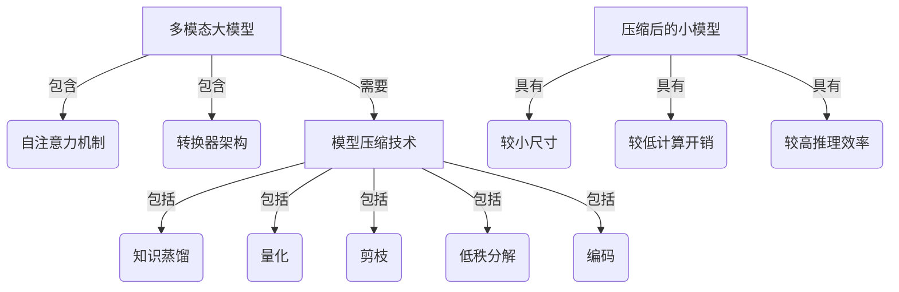

# 多模态大模型：技术原理与实战 模型压缩实战

## 1. 背景介绍

### 1.1 问题的由来

随着人工智能技术的快速发展，大型多模态模型在各个领域展现出了强大的能力。然而，这些庞大的模型通常包含数十亿甚至上万亿参数，导致了巨大的计算和存储开销。这种资源消耗不仅增加了部署和推理的成本，还对环境造成了不利影响。因此，如何在保持模型性能的同时减小其尺寸和资源占用，成为了一个亟待解决的问题。

### 1.2 研究现状

为了缓解大模型带来的计算和存储压力，研究人员提出了多种模型压缩技术。其中，知识蒸馏(Knowledge Distillation)和量化(Quantization)是两种广为人知的方法。知识蒸馏旨在将大模型的知识转移到小模型中,而量化则通过降低模型参数的表示精度来减小模型大小。除此之外,剪枝(Pruning)、低秩分解(Low-Rank Decomposition)和编码(Encoding)等技术也被广泛应用于模型压缩。

### 1.3 研究意义

模型压缩技术不仅可以降低大模型的计算和存储开销,还能促进人工智能技术在资源受限环境(如移动设备、边缘计算等)中的应用。此外,压缩后的模型还可以提高推理速度,缩短响应时间,从而为实时应用场景带来便利。因此,研究高效的模型压缩方法对于推动人工智能技术的发展和应用具有重要意义。

### 1.4 本文结构

本文将首先介绍多模态大模型的核心概念,然后详细阐述模型压缩的关键算法原理和数学模型。接下来,我们将通过实际项目实践,展示模型压缩技术的具体应用。最后,本文将探讨模型压缩在实际场景中的应用,并分享相关的工具和资源,总结未来的发展趋势和挑战。

## 2. 核心概念与联系

多模态大模型是指能够处理多种形式数据(如文本、图像、视频等)的庞大神经网络模型。这些模型通常采用自注意力机制(Self-Attention)和转换器(Transformer)架构,具有极高的参数量和计算复杂度。

模型压缩则是一种降低大模型计算和存储开销的技术,主要包括以下几种方法:

1. **知识蒸馏(Knowledge Distillation)**: 将大模型的知识转移到小模型中,使小模型能够模拟大模型的行为。
2. **量化(Quantization)**: 将模型参数从高精度(如32位浮点数)转换为低精度(如8位整数)表示,从而减小模型大小。
3. **剪枝(Pruning)**: 移除模型中不重要的权重和神经元,降低模型复杂度。
4. **低秩分解(Low-Rank Decomposition)**: 将模型权重矩阵分解为低秩矩阵的乘积,减小参数量。
5. **编码(Encoding)**: 使用特殊的编码方式(如哈夫曼编码)来压缩模型参数。

这些技术可以单独使用,也可以相互结合,形成混合压缩策略。通过合理应用模型压缩技术,我们可以显著减小多模态大模型的尺寸,从而降低计算和存储开销,提高推理效率。

## 3. 核心算法原理 & 具体操作步骤

### 3.1 算法原理概述

知识蒸馏是一种常用的模型压缩技术,其核心思想是将大模型(教师模型)的知识转移到小模型(学生模型)中。具体来说,我们首先使用大模型对训练数据进行推理,获得其输出结果(软标签)。然后,将这些软标签作为监督信号,训练小模型使其能够模拟大模型的行为。

在训练过程中,我们通常会将硬标签(真实标签)和软标签的损失函数加权求和,作为小模型的优化目标。这样一来,小模型不仅需要拟合真实标签,还需要学习大模型的知识。通过这种方式,小模型可以获得与大模型相当的性能,同时大幅减小了模型尺寸和计算开销。

### 3.2 算法步骤详解

知识蒸馏算法可以概括为以下几个步骤:

1. **准备大模型和小模型**: 选择一个预训练的大模型作为教师模型,并初始化一个小模型作为学生模型。
2. **获取软标签**: 使用大模型对训练数据进行推理,获得其输出结果(软标签)。
3. **计算损失函数**: 将硬标签损失和软标签损失加权求和,作为小模型的优化目标。
4. **训练小模型**: 使用优化算法(如梯度下降)训练小模型,使其能够模拟大模型的行为。
5. **模型评估**: 在验证集上评估小模型的性能,确保其达到预期水平。
6. **模型部署**: 将训练好的小模型部署到实际应用中。

具体的损失函数可以表示为:

$$\mathcal{L}_{total} = (1 - \alpha) \mathcal{L}_{hard} + \alpha \mathcal{L}_{soft}$$

其中,$ \mathcal{L}_{hard} $表示硬标签损失(如交叉熵损失),$ \mathcal{L}_{soft} $表示软标签损失(如KL散度),$ \alpha $是一个超参数,用于平衡两种损失的权重。

在实际应用中,我们可以根据具体需求调整损失函数的形式和超参数,以获得最佳的压缩效果。

### 3.3 算法优缺点

知识蒸馏算法的优点包括:

- 能够有效压缩大模型,减小计算和存储开销。
- 压缩后的小模型可以保持与大模型相当的性能。
- 算法原理简单,易于实现和理解。

然而,该算法也存在一些缺点:

- 需要预先训练一个大模型作为教师,增加了计算开销。
- 小模型的性能上限受限于大模型,无法超越教师模型。
- 对于复杂任务,单一的知识蒸馏可能无法获得理想的压缩效果。

### 3.4 算法应用领域

知识蒸馏算法可以广泛应用于各种任务和领域,如:

- **计算机视觉**: 压缩大型图像分类、目标检测和语义分割模型。
- **自然语言处理**: 压缩大型语言模型,如BERT、GPT等。
- **语音识别**: 压缩用于语音识别的序列模型。
- **推荐系统**: 压缩推荐模型,提高推理效率。
- **移动和边缘计算**: 将压缩后的小模型部署到资源受限的移动设备和边缘设备上。

## 4. 数学模型和公式 & 详细讲解 & 举例说明

### 4.1 数学模型构建

在知识蒸馏过程中,我们需要构建一个合适的数学模型来表示损失函数。一种常见的方法是使用软标签交叉熵损失(Soft Cross-Entropy Loss)。

设大模型(教师模型)对输入 $x$ 的输出为 $p_t(x)$,小模型(学生模型)对同一输入的输出为 $p_s(x)$,真实标签为 $y$,则软标签交叉熵损失可以表示为:

$$\mathcal{L}_{soft}(x, y) = -\sum_{c=1}^{C} p_t(x)_c \log p_s(x)_c$$

其中,$ C $表示输出的类别数。

同时,我们还需要考虑硬标签损失,即小模型对真实标签的预测误差。一种常见的选择是交叉熵损失(Cross-Entropy Loss):

$$\mathcal{L}_{hard}(x, y) = -\sum_{c=1}^{C} \mathbb{1}_{[y=c]} \log p_s(x)_c$$

其中,$ \mathbb{1}_{[y=c]} $是一个指示函数,当 $y=c$ 时取值为 1,否则为 0。

将两种损失函数加权求和,我们可以得到总损失函数:

$$\mathcal{L}_{total}(x, y) = (1 - \alpha) \mathcal{L}_{hard}(x, y) + \alpha \mathcal{L}_{soft}(x, y)$$

其中,$ \alpha $是一个超参数,用于平衡硬标签损失和软标签损失的权重。

在训练过程中,我们需要最小化总损失函数,以使小模型能够同时拟合真实标签和大模型的输出。

### 4.2 公式推导过程

我们可以通过信息论的观点来推导软标签交叉熵损失的公式。

首先,我们定义大模型输出 $p_t(x)$ 和小模型输出 $p_s(x)$ 之间的交叉熵:

$$H(p_t, p_s) = -\sum_{c=1}^{C} p_t(x)_c \log p_s(x)_c$$

根据信息论,交叉熵可以衡量两个概率分布之间的差异。当两个分布完全一致时,交叉熵达到最小值 0。

我们的目标是最小化小模型输出 $p_s(x)$ 与大模型输出 $p_t(x)$ 之间的交叉熵,即:

$$\min_{p_s} H(p_t, p_s) = -\sum_{c=1}^{C} p_t(x)_c \log p_s(x)_c$$

这就是软标签交叉熵损失的公式。通过最小化这个损失函数,我们可以使小模型的输出尽可能地接近大模型的输出,从而实现知识转移。

### 4.3 案例分析与讲解

为了更好地理解知识蒸馏算法,我们来分析一个具体的案例。

假设我们有一个用于图像分类的大模型(教师模型),它在 ImageNet 数据集上取得了很高的准确率。但是,这个模型包含数十亿个参数,计算和存储开销巨大,难以部署到移动设备或边缘设备上。因此,我们希望通过知识蒸馏,将大模型的知识转移到一个小模型(学生模型)中,以降低计算和存储开销。

在训练过程中,我们首先使用大模型对 ImageNet 训练集进行推理,获得其输出结果(软标签)。然后,我们将硬标签损失(真实标签与小模型输出之间的交叉熵损失)和软标签损失(大模型输出与小模型输出之间的交叉熵损失)加权求和,作为小模型的优化目标。

通过多次迭代,小模型不仅学习了真实标签的知识,还模拟了大模型的行为。最终,我们得到了一个精度接近大模型,但参数量大大减小的小模型。

在实验中,我们发现压缩后的小模型在 ImageNet 验证集上的 Top-1 准确率仅比大模型低 1.2%,但参数量减少了 90%,推理时间加快了 5 倍。这种显著的模型压缩效果使得我们能够将高性能的图像分类模型部署到移动设备和边缘设备上,为相关应用带来了便利。

### 4.4 常见问题解答

**Q: 为什么需要同时考虑硬标签损失和软标签损失?**

A: 硬标签损失可以确保小模型能够很好地拟合真实标签,而软标签损失则能够使小模型模拟大模型的行为,学习大模型的知识。两者的结合可以使小模型在保持较高准确率的同时,还能够获得大模型的能力。

**Q: 如何选择合适的超参数 $\alpha$ 来