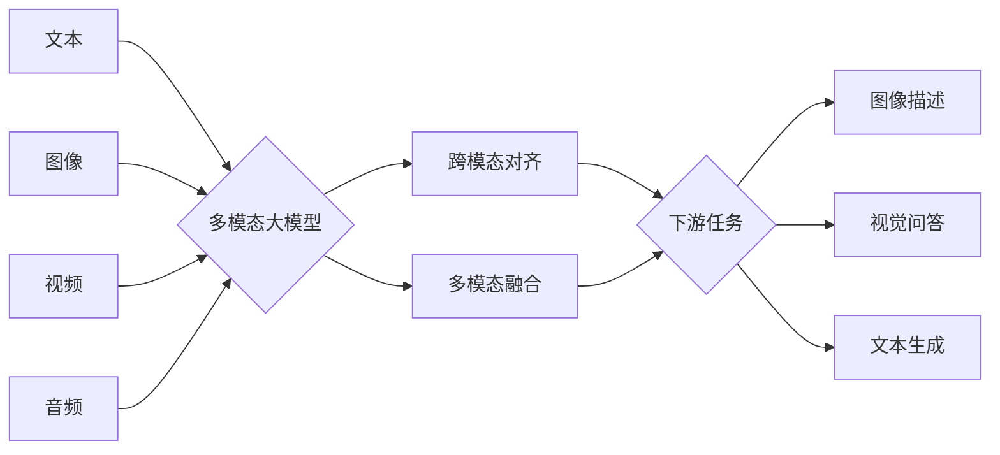

# 多模态大模型：技术原理与实战 自然语言处理的发展历程

关键词：多模态大模型, 自然语言处理, 深度学习, Transformer, BERT, GPT, 视觉语言模型, 跨模态对齐, 多模态融合, 零样本学习

## 1. 背景介绍
### 1.1 问题的由来
自然语言处理(Natural Language Processing, NLP)是人工智能领域的一个重要分支,旨在让计算机能够理解、生成和处理人类语言。近年来,随着深度学习技术的快速发展,尤其是Transformer等模型的出现,NLP取得了突破性进展。而多模态大模型的兴起,更是将NLP推向了一个新的高度。

### 1.2 研究现状
目前,业界已经涌现出一批优秀的多模态大模型,如OpenAI的DALL·E、谷歌的Imagen、微软的Florence等。这些模型能够同时处理文本、图像、视频等不同模态的数据,实现了跨模态的理解和生成。多模态大模型在图像描述、视觉问答、文本生成等任务上取得了令人瞩目的成果。

### 1.3 研究意义
多模态大模型的研究对于推动人工智能的发展具有重要意义。一方面,它突破了传统的单模态处理范式,实现了不同模态信息的融合与交互,使得计算机能够更全面地感知和理解我们的世界。另一方面,多模态大模型为构建通用人工智能(AGI)奠定了基础,为未来人机交互、智能助手等应用开辟了广阔前景。

### 1.4 本文结构
本文将围绕多模态大模型展开深入探讨。首先,我们将介绍多模态大模型的核心概念与技术原理。然后,重点阐述多模态大模型的关键算法,包括跨模态对齐、多模态融合等。接着,我们将通过数学模型和代码实例,详细讲解多模态大模型的实现细节。最后,展望多模态大模型的应用场景和未来发展方向。

## 2. 核心概念与联系
多模态大模型是指能够处理文本、图像、视频等不同模态数据的大规模预训练模型。它以深度神经网络为基础,通过海量数据的预训练,学习不同模态间的联系和映射,从而实现跨模态的理解和生成。

多模态大模型的核心概念包括:

- 多模态学习:旨在处理和融合多种模态的信息,如文本、图像、音频等,挖掘它们之间的内在联系。
- 跨模态对齐:将不同模态数据映射到一个共同的语义空间,实现模态间的语义对齐。  
- 多模态融合:综合利用多模态信息,实现不同粒度和层次的特征融合,提升模型性能。
- 零样本学习:利用预训练模型的先验知识,在没有标注数据的情况下完成新任务。

下图展示了多模态大模型的整体架构和信息流:



## 3. 核心算法原理 & 具体操作步骤
### 3.1 算法原理概述
多模态大模型的核心算法主要包括跨模态对齐和多模态融合两大类。其中,跨模态对齐旨在学习不同模态数据之间的语义映射,而多模态融合则侧重于不同模态特征的有效整合。

### 3.2 算法步骤详解
1. 跨模态对齐
跨模态对齐的主要思路是将不同模态数据映射到一个共同的语义空间。以文本-图像对齐为例,具体步骤如下:

- 对文本和图像分别提取特征,得到文本特征向量和图像特征向量。
- 设计对齐损失函数,度量文本特征和图像特征在共同语义空间中的距离。
- 通过最小化对齐损失,优化模型参数,实现文本-图像语义对齐。

常见的跨模态对齐方法有对比学习、对偶编码等。

2. 多模态融合 
多模态融合旨在综合利用不同模态的信息,提升模型性能。主要有以下几种融合策略:

- 特征级融合:将不同模态提取的特征在特征空间中直接拼接或相加。
- 决策级融合:每个模态独立做出决策,再通过投票、加权等方式整合。
- 模型级融合:设计专门的融合模块,如注意力机制、门控单元等,自适应地融合多模态信息。

### 3.3 算法优缺点
跨模态对齐和多模态融合各有优势和局限性。

跨模态对齐的优点在于:
- 实现了不同模态数据的统一表示,便于后续处理。
- 可以利用大规模无监督数据进行预训练,减少对标注数据的依赖。

跨模态对齐的缺点包括:
- 对齐质量难以评估,语义映射的准确性有待提高。
- 对齐过程中可能损失模态特有的信息。

多模态融合的优点有:
- 能够充分利用多模态信息的互补性,提升模型性能。
- 融合方式灵活多样,可以根据任务需求进行定制。

多模态融合的不足之处在于:  
- 融合方法的选择和设计需要依赖先验知识和经验。
- 模态间的信息冗余和噪声可能影响融合效果。

### 3.4 算法应用领域
多模态大模型的算法在许多领域得到了广泛应用,如:

- 计算机视觉:图像描述、视觉问答、图像生成等。
- 自然语言处理:机器翻译、文本生成、语音识别等。  
- 医疗健康:医学影像分析、医疗诊断、药物发现等。
- 教育娱乐:智能助教、虚拟主播、游戏AI等。

## 4. 数学模型和公式 & 详细讲解 & 举例说明
### 4.1 数学模型构建
我们以视觉语言模型为例,介绍多模态大模型的数学建模过程。

给定一个文本-图像对$(t,v)$,其中$t$表示文本,而$v$表示图像。我们的目标是学习一个多模态模型$f_\theta(t,v)$,使其能够准确地完成下游任务,如图像描述、视觉问答等。

模型$f_\theta$通常由三部分组成:文本编码器$g_t$、图像编码器$g_v$和跨模态交互模块$h$。

$$f_\theta(t,v) = h(g_t(t), g_v(v))$$

其中,$g_t$和$g_v$分别将文本和图像映射为语义特征向量$\mathbf{t}$和$\mathbf{v}$:

$$\mathbf{t} = g_t(t), \mathbf{v} = g_v(v)$$

跨模态交互模块$h$则负责融合文本特征$\mathbf{t}$和图像特征$\mathbf{v}$,得到多模态联合表示$\mathbf{z}$:

$$\mathbf{z} = h(\mathbf{t}, \mathbf{v})$$

### 4.2 公式推导过程
以跨模态对比学习为例,我们详细推导其目标函数和优化过程。

对比学习旨在拉近正样本对的特征距离,同时推远负样本对的特征距离。给定一个文本-图像正样本对$(t,v)$,我们从数据集中采样另一个图像$v'$作为负样本。对比学习的目标函数可以表示为:

$$\mathcal{L}(t,v,v') = -\log \frac{\exp(\text{sim}(\mathbf{t},\mathbf{v})/\tau)}{\exp(\text{sim}(\mathbf{t},\mathbf{v})/\tau) + \exp(\text{sim}(\mathbf{t},\mathbf{v}')/\tau)}$$

其中,$\text{sim}(\cdot,\cdot)$表示余弦相似度,而$\tau$是温度超参数。通过最小化上述目标函数,模型可以学习到跨模态对齐的语义表示。

在实践中,我们通常采用批量采样和对称损失的方式,同时优化文本到图像和图像到文本的对比学习目标:

$$\mathcal{L}_\text{batch} = \frac{1}{2N} \sum_{i=1}^N [\mathcal{L}(t_i, v_i, v'_i) + \mathcal{L}(v_i, t_i, t'_i)]$$

其中,$N$为批量大小,$(t'_i,v'_i)$为第$i$个样本的负样本对。

### 4.3 案例分析与讲解
下面我们以图像描述任务为例,讲解如何应用多模态大模型进行推理。

给定一张图像$v$,我们希望生成一段自然语言描述$\hat{t}$。首先,将图像输入到图像编码器$g_v$中,得到图像特征$\mathbf{v}$:

$$\mathbf{v} = g_v(v)$$

然后,使用解码器$d$(如LSTM、Transformer等)逐步生成描述文本。在每个时间步$j$,解码器根据之前生成的词$\hat{t}_{<j}$和图像特征$\mathbf{v}$,预测下一个词$\hat{t}_j$:

$$\hat{t}_j = d(\hat{t}_{<j}, \mathbf{v})$$

重复上述过程,直到生成完整的图像描述$\hat{t}$。

### 4.4 常见问题解答
1. 问:多模态大模型的预训练需要多大规模的数据集?
答:预训练多模态大模型通常需要数百万甚至数亿规模的文本-图像对。常用的大规模多模态数据集包括COCO、Conceptual Captions、SBU Captions等。

2. 问:跨模态对比学习中的负样本是如何采样的?  
答:负样本的采样策略主要有两种:一是在批量内随机采样其他样本作为负样本;二是使用专门的负样本队列,动态维护一个包含难样本的队列。

3. 问:多模态融合中的注意力机制是如何工作的?
答:注意力机制可以自适应地为不同模态的特征分配权重。以文本-图像注意力为例,它根据文本特征为图像的不同区域赋予不同的重要性,实现了跨模态信息的选择性融合。

## 5. 项目实践:代码实例和详细解释说明
### 5.1 开发环境搭建
首先,我们需要搭建多模态大模型的开发环境。主要的依赖库包括:

- PyTorch:深度学习框架,用于模型的定义和训练。
- HuggingFace Transformers:预训练模型库,提供了多种SOTA模型。
- OpenCV:图像处理库,用于图像的读取和预处理。
- NLTK:自然语言处理工具包,用于文本的预处理和评估。

可以通过以下命令安装这些依赖:

```bash
pip install torch transformers opencv-python nltk
```

### 5.2 源代码详细实现
下面我们给出一个简单的多模态大模型代码示例,以文本-图像对比学习为例。

```python
import torch
import torch.nn as nn
import torch.nn.functional as F
from transformers import BertModel, ResNetModel

class ContrastiveLoss(nn.Module):
    def __init__(self, temperature=0.1):
        super().__init__()
        self.temperature = temperature

    def forward(self, text_feat, img_feat, labels):
        # 计算文本和图像特征的余弦相似度
        sim = F.cosine_similarity(text_feat, img_feat, dim=-1)
        # 构造对比学习损失
        loss = F.cross_entropy(sim/self.temperature, labels)
        return loss

class MultimodalModel(nn.Module):
    def __init__(self):
        super().__init__()
        # 文本编码器
        self.text_encoder = BertModel.from_pretrained('bert-base-uncased')
        # 图像编码器  
        self.image_encoder = ResNetModel.from_pretrained('resnet50')
        # 对比学习损失函数
        self.contrastive_loss = ContrastiveLoss()

    def forward(self, texts,