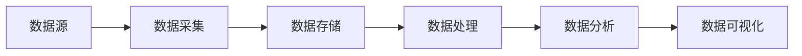

# 大数据 原理与代码实例讲解

## 1. 背景介绍

### 1.1 问题的由来
随着互联网、物联网、移动互联网等现代信息技术的快速发展,数据呈现爆炸式增长,传统的数据处理和分析方法已经无法满足海量数据处理的需求。如何从海量数据中快速获得有价值的信息,已成为当前亟待解决的问题。

### 1.2 研究现状
目前,大数据相关技术已经广泛应用于互联网、金融、医疗、交通、电商等诸多领域。谷歌、亚马逊、阿里巴巴等互联网巨头纷纷推出了自己的大数据处理平台和工具。Hadoop、Spark、Flink等大数据框架成为业界主流。

### 1.3 研究意义
大数据蕴含着巨大的商业价值和社会价值。通过大数据分析,企业可以更好地了解用户行为、优化业务流程、创新商业模式。政府可以利用大数据实现智慧城市、改善民生。大数据已成为推动经济发展和社会进步的重要力量。

### 1.4 本文结构
本文将从大数据的核心概念出发,详细讲解大数据处理的关键技术原理,包括分布式存储、分布式计算、实时计算等。并通过具体的代码实例,演示如何使用主流大数据框架进行大数据应用开发。同时,本文还将探讨大数据技术未来的发展趋势和面临的挑战。

## 2. 核心概念与联系

大数据是指无法在一定时间范围内用常规软件工具进行捕捉、管理和处理的数据集合,需要新处理模式才能具有更强的决策力、洞察发现力和流程优化能力。大数据的4V特征:

- Volume(大量):收集、存储海量的数据
- Velocity(高速):快速产生和处理数据  
- Variety(多样):处理结构化、半结构化、非结构化等各种类型数据
- Value(价值):从海量数据中挖掘价值

大数据处理的关键技术包括:

- 分布式存储:将海量数据分散存储到多个节点,实现高可靠、高可用、可扩展的存储
- 分布式计算:将计算任务分发到多个节点并行执行,大幅提升数据处理效率  
- 实时计算:对数据进行实时采集、实时处理,满足数据实时分析的需求

下图展示了大数据处理的核心架构:



## 3. 核心算法原理 & 具体操作步骤

### 3.1 算法原理概述
大数据处理涉及到多种算法,其中最核心的是MapReduce。MapReduce是一种分布式计算模型,由Map和Reduce两个阶段组成。Map阶段将输入数据划分成多个独立的数据块,并行处理,生成中间结果。Reduce阶段对Map的中间结果进行合并、排序等处理,得到最终结果。

### 3.2 算法步骤详解
MapReduce的具体步骤如下:

1. 输入数据被划分为多个Split 
2. 每个Split作为一个Map Task的输入,并行执行用户自定义的map函数,生成中间结果 <key,value>
3. 将所有Map Task的输出按key进行partition,分发到不同的Reduce节点
4. 在Reduce节点上对相同key的数据进行排序、合并,执行用户自定义的reduce函数,输出最终结果
5. 将多个Reduce Task的结果合并,输出到HDFS等存储系统

### 3.3 算法优缺点
MapReduce具有良好的可扩展性、容错性和海量数据处理能力。但也存在一些局限:

- 不适合迭代计算和实时计算
- 中间结果需要写磁盘,IO开销大
- 处理逻辑需要人工编程实现,开发效率低

### 3.4 算法应用领域
MapReduce广泛应用于搜索引擎、推荐系统、用户行为分析、舆情监测等大数据场景。一些经典的应用如:

- 倒排索引:通过Map生成<word,docid>对,Reduce合并相同word的docid列表,构建倒排索引
- PageRank:迭代计算网页的PR值,直到收敛
- 日志分析:分析Web日志、APP日志等,挖掘用户行为模式

## 4. 数学模型和公式 & 详细讲解 & 举例说明

### 4.1 数学模型构建
大数据处理涉及到一些数学模型,用于对数据进行建模、挖掘。以协同过滤推荐为例,其核心是利用用户或物品之间的相似性,为用户推荐感兴趣的物品。常用的相似性度量包括:

- 欧氏距离:

$$
d(x,y)=\sqrt{\sum_{i=1}^n(x_i-y_i)^2}
$$

- 皮尔逊相关系数:

$$
sim(x,y) = \frac{\sum_{i=1}^n(x_i-\bar{x})(y_i-\bar{y})}{\sqrt{\sum_{i=1}^n(x_i-\bar{x})^2}\sqrt{\sum_{i=1}^n(y_i-\bar{y})^2}}
$$

- 余弦相似度:

$$
cos(x,y) = \frac{x \cdot y}{||x||_2||y||_2}
$$

### 4.2 公式推导过程
以皮尔逊相关系数为例,其推导过程如下:

设$X=(x_1,x_2,...,x_n), Y=(y_1,y_2,...,y_n)$是两个n维向量,$\bar{x},\bar{y}$分别是X和Y的均值。

协方差:
$$
cov(X,Y)=\frac{1}{n}\sum_{i=1}^n(x_i-\bar{x})(y_i-\bar{y})
$$

标准差:
$$
\sigma_x=\sqrt{\frac{1}{n}\sum_{i=1}^n(x_i-\bar{x})^2}
$$
$$
\sigma_y=\sqrt{\frac{1}{n}\sum_{i=1}^n(y_i-\bar{y})^2}
$$

皮尔逊相关系数定义为协方差和标准差的商:

$$
\rho_{X,Y} = \frac{cov(X,Y)}{\sigma_x \sigma_y}=\frac{\sum_{i=1}^n(x_i-\bar{x})(y_i-\bar{y})}{\sqrt{\sum_{i=1}^n(x_i-\bar{x})^2}\sqrt{\sum_{i=1}^n(y_i-\bar{y})^2}}
$$

### 4.3 案例分析与讲解
以电影推荐为例,假设有以下用户对电影的评分数据:

| 用户\电影 | 电影1 | 电影2 | 电影3 |
|:----:|:----:|:----:|:----:|
| 用户1 | 3    | 4    | 2    |
| 用户2 | 5    | 4    | 1    |
| 用户3 | ?    | 3    | 2    |

现在我们要预测用户3对电影1的评分。首先计算用户3与用户1、用户2的相似度:

用户1: $X=(4,2), \bar{x}=3$
用户2: $Y=(4,1), \bar{y}=2.5$
用户3: $Z=(3,2), \bar{z}=2.5$

$sim(X,Z)=\frac{(4-3)(3-2.5)+(2-3)(2-2.5)}{\sqrt{(4-3)^2+(2-3)^2}\sqrt{(3-2.5)^2+(2-2.5)^2}}=0.71$

$sim(Y,Z)=\frac{(4-2.5)(3-2.5)+(1-2.5)(2-2.5)}{\sqrt{(4-2.5)^2+(1-2.5)^2}\sqrt{(3-2.5)^2+(2-2.5)^2}}=0.32$

用户1和用户3的相似度更高,因此用户3更可能和用户1有相近的品味。最后,用与用户3最相似的k个用户的评分加权平均,得到用户3对电影1的预测评分:

$r_{31}=\frac{0.71 \times 3 + 0.32 \times 5}{0.71+0.32}=3.61$

### 4.4 常见问题解答
Q:MapReduce适合处理哪些类型的数据和计算?
A:MapReduce适合海量数据的批处理计算,如网页爬取、日志分析、数据统计等。不太适合交互式查询、图计算、机器学习等场景。

Q:如何提高MapReduce作业的性能?
A:可以从以下几个方面优化:
- 调整Map和Reduce数,充分利用集群资源
- 设置合理的Split Size,避免过多的Map任务
- 开启Combiner,在Map端进行局部聚合,减少网络传输  
- 优化Shuffle参数,如调大Buffer、调优Partition和Sort策略

Q:Spark与MapReduce相比有哪些优势?  
A:Spark是MapReduce的替代方案,具有以下优势:
- 基于内存计算,中间结果可以缓存在内存中,避免重复读写HDFS
- 支持DAG的任务调度,更加灵活高效
- 提供了RDD、DataFrame、Dataset等更高级的数据抽象,使用更加方便
- 集成了Streaming、SQL、MLlib、GraphX等高级组件,功能更加丰富

## 5. 项目实践：代码实例和详细解释说明

### 5.1 开发环境搭建
以Hadoop和Spark为例,搭建大数据开发环境的步骤如下:

1. 准备若干Linux服务器,安装JDK和SSH
2. 在NameNode上安装并配置Hadoop,包括HDFS、YARN等组件
3. 将Hadoop安装目录复制到其他服务器,修改slaves文件,添加所有DataNode的主机名
4. 在NameNode上格式化HDFS,启动Hadoop集群
5. 下载Spark安装包,解压并配置环境变量
6. 修改Spark配置文件spark-env.sh,设置Master URL、Worker内存等参数
7. 启动Spark集群,提交测试作业验证

### 5.2 源代码详细实现
以Spark的WordCount为例,实现词频统计:

```scala
val conf = new SparkConf().setAppName("WordCount")
val sc = new SparkContext(conf)

val lines = sc.textFile("hdfs://input/file.txt") 
val words = lines.flatMap(_.split(" ")) 
val pairs = words.map(word => (word, 1)) 
val wordCounts = pairs.reduceByKey(_ + _) 

wordCounts.saveAsTextFile("hdfs://output/wordcount")
```

代码解读:
- 创建SparkContext,设置应用名称
- 读取HDFS上的文本文件,得到RDD[String]
- 对每一行文本进行分词,得到单词序列 
- 将每个单词映射为(word,1)的键值对
- 对相同单词的计数进行聚合,得到每个单词的频次
- 将结果保存到HDFS

### 5.3 代码解读与分析
Spark通过RDD(弹性分布式数据集)来表示分布式数据,RDD支持两种类型的操作:
- Transformation:对RDD进行转换,惰性求值,返回一个新的RDD,如map、filter、reduceByKey等
- Action:触发RDD的计算,将结果返回给Driver或写入外部存储,如count、collect、saveAsTextFile等

RDD通过血缘关系(Lineage)记录数据的转换过程,从而实现容错。如果某个分区的数据丢失,Spark可以根据Lineage重新计算出该分区的数据。

Spark基于Scala语言开发,支持函数式编程,代码简洁优雅。同时Spark还提供了Java、Python、R等多语言的API,适合不同背景的开发者。

### 5.4 运行结果展示
将WordCount程序打包提交到Spark集群运行:

```shell
spark-submit --class WordCount --master spark://host:port wordcount.jar
```

运行结果会保存在HDFS的/output/wordcount目录下,查看结果:

```shell
hadoop fs -cat /output/wordcount/part-*
```

可以看到每个单词及其出现的频次,说明WordCount程序运行成功。

## 6. 实际应用场景

大数据技术在各个行业都有广泛应用,一些典型的场景包括:

- 电商:用户行为分析、商品推荐、销量预测等
- 金融:风险控制、反欺诈、信用评估等  
- 制造:设备故障诊断、质量管理、供