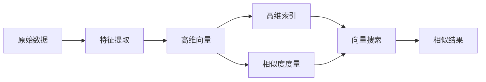

# 大数据背景下的向量数据库：处理和分析巨量信息

关键词：大数据、向量数据库、高维向量、相似性搜索、特征提取、Faiss、Annoy、Milvus

## 1. 背景介绍
### 1.1  问题的由来
随着互联网、物联网、社交媒体等技术的飞速发展,数据呈现出爆炸式增长的趋势。据统计,全球数据量每两年就会增长一倍,预计到2025年将达到163ZB。面对如此庞大的数据量,传统的关系型数据库已经难以满足海量数据的存储和检索需求。尤其是对于非结构化数据如图像、视频、文本等,如何高效地处理和分析这些数据成为了一个巨大的挑战。

### 1.2  研究现状
针对大数据处理和分析的需求,学术界和工业界都在积极探索新的数据库技术。其中,向量数据库作为一种新兴的数据库类型,受到了越来越多的关注。不同于传统的关系型数据库和NoSQL数据库,向量数据库主要面向高维向量数据的存储和检索,通过相似性搜索等技术实现对海量数据的快速查询和分析。目前,已经涌现出一批优秀的开源和商业向量数据库产品,如Faiss、Annoy、Milvus等,在推荐系统、语义搜索、人脸识别等领域得到了广泛应用。

### 1.3  研究意义 
在大数据时代,高效处理和分析海量数据对于企业和组织至关重要。传统的数据库技术已经难以应对数据量激增带来的挑战,亟需新的数据库解决方案。向量数据库的出现为大数据处理和分析提供了新的思路和方法。通过研究向量数据库的核心技术和应用实践,可以帮助企业和开发者更好地利用大数据资源,挖掘数据价值,提升数据处理和分析效率。同时,也为学术界提供了一个新的研究方向,推动数据库技术的发展和创新。

### 1.4  本文结构
本文将围绕向量数据库展开深入探讨。首先,介绍向量数据库的核心概念和技术原理。然后,重点阐述向量数据库的关键算法,包括向量索引、相似性度量等,并给出具体的数学模型和代码实现。接着,讨论向量数据库在实际场景中的应用,分享一些成功案例和经验。最后,展望向量数据库技术的未来发展趋势和面临的挑战。

## 2. 核心概念与联系
向量数据库是一种专门面向高维向量数据存储和检索的数据库系统。与传统数据库不同,向量数据库的数据模型是向量空间模型(Vector Space Model),每条记录都表示为一个高维向量。通过向量之间的距离或相似度来衡量记录之间的关联性,实现高效的相似性搜索。

向量数据库的核心概念包括:

- 特征向量(Feature Vector):将原始数据对象转换为固定维度的实数向量,用于后续的索引和查询。特征向量应该尽可能地表达原始对象的语义信息。
- 高维索引(High-dimensional Index):针对高维向量数据构建的索引结构,支持快速的 K 近邻查询和范围查询。常见的索引算法有乘积量化(PQ)、树形索引(Tree-based Index)等。
- 相似度度量(Similarity Metric):用于衡量两个向量之间的相似程度,常见的度量方式有欧氏距离、余弦相似度、汉明距离等。
- 向量搜索(Vector Search):给定一个查询向量,从海量向量数据库中找出与之最相似的 K 个向量,也称为 K 近邻(KNN)搜索。
- 语义提取(Semantic Extraction):从原始数据对象中提取语义信息,将其转换为语义向量,以支持语义相似性搜索。常用的方法有深度学习、主题模型等。

下图展示了向量数据库的核心概念之间的关系:

## 3. 核心算法原理 & 具体操作步骤
### 3.1  算法原理概述
向量数据库的核心是如何在海量高维向量数据中快速找到与查询向量最相似的 K 个向量。这需要解决两个关键问题:高维索引和相似度计算。

高维索引旨在缓解"维度灾难"带来的搜索效率下降问题。常见的高维索引方法有:
- 基于树的索引:如 KD-Tree、Ball Tree 等,通过递归地划分向量空间构建树形结构,但在高维空间下性能下降明显。
- 基于哈希的索引:如 LSH,通过局部敏感哈希将相似向量映射到同一个桶中,但哈希函数的设计较为困难。
- 基于量化的索引:如乘积量化(PQ),通过将高维向量分解为低维子空间并量化编码,大幅压缩索引空间。

相似度计算决定了如何比较两个向量的相似程度。常见的相似度度量方式有:
- 欧氏距离(Euclidean Distance):衡量两个向量在空间中的直线距离,计算简单但受维度影响大。
- 余弦相似度(Cosine Similarity):计算两个向量夹角的余弦值,消除了向量长度的影响。
- 汉明距离(Hamming Distance):统计两个等长字符串对应位置不同字符的个数,多用于二值向量。

### 3.2  算法步骤详解
下面以乘积量化(PQ)算法为例,详细讲解其工作原理和步骤。

PQ算法的核心思想是将原始的D维向量空间均匀划分为M个子空间,每个子空间维度为D/M。然后对每个子空间分别进行K-means聚类,得到K个聚类中心作为子量化器。在索引阶段,将每个数据向量分割成M个子向量,并用相应的子量化器进行量化编码。在查询阶段,将查询向量也进行分割和编码,然后通过非对称距离计算(ADC)得到top-k结果。

具体步骤如下:

1. 将D维向量空间划分为M个子空间,每个子空间维度为D/M。
2. 对每个子空间的向量数据进行K-means聚类,得到K个聚类中心作为子量化器。形式化表示为:

$$
C_m = \{c_{m1}, c_{m2}, ..., c_{mK}\}, m=1,2,...,M
$$

其中,$C_m$表示第m个子空间的子量化器,$c_{mk}$表示第m个子空间的第k个聚类中心。

3. 对每个数据向量$x$进行分割和量化编码。将其分割为M个D/M维的子向量:

$$
x = (x^1, x^2, ..., x^M)
$$

然后对每个子向量$x^m$用相应的子量化器$C_m$进行量化编码:

$$
q_m(x^m) = \arg\min_{c_{mk} \in C_m} \lVert x^m - c_{mk} \rVert^2
$$

最终得到$x$的PQ编码为$(q_1(x^1), q_2(x^2), ..., q_M(x^M))$。

4. 在查询阶段,将查询向量$y$也进行分割和编码,得到$(q_1(y^1), q_2(y^2), ..., q_M(y^M))$。

5. 计算查询向量$y$与数据向量$x$的非对称距离(ADC):

$$
d_{ADC}(y, x) = \sum_{m=1}^M \lVert y^m - c_{m,q_m(x^m)} \rVert^2
$$

6. 根据ADC距离得到top-k最相似的结果向量。

### 3.3  算法优缺点
PQ算法的优点包括:
- 大幅压缩索引空间,减少内存占用。
- 加速查询速度,通过简单的表查找和求和即可计算距离。
- 支持内存数据库,可实现毫秒级的实时查询响应。
- 量化编码可并行计算,易于硬件加速。

PQ算法的缺点包括:  
- 离线训练时间较长,需要对大规模数据进行聚类。
- 难以应对动态插入,每次插入数据都可能影响量化器。
- 编码结果难以理解,缺乏可解释性。
- 量化误差会影响搜索精度,需要权衡压缩率和精度。

### 3.4  算法应用领域
PQ算法在向量数据库领域有广泛的应用,一些典型场景包括:

- 推荐系统:对用户和物品的embedding向量建立PQ索引,实现实时的相似物品推荐和用户群体发现。
- 语义搜索:对词向量、句向量、文档向量等建立PQ索引,支持语义相似度检索和问答系统。  
- 人脸识别:对人脸特征向量建立PQ索引,实现大规模人脸比对和1:N识别。
- 图像搜索:对图像特征(如CNN特征)建立PQ索引,支持以图搜图和相似图片检索。
- 视频分析:对视频关键帧特征建立PQ索引,实现视频去重、相似视频推荐等。

## 4. 数学模型和公式 & 详细讲解 & 举例说明
### 4.1  数学模型构建
在向量数据库中,最核心的数学模型是向量空间模型(VSM)。给定一个D维向量空间,每条数据记录和查询都可以表示为该空间中的一个向量。

令数据集$X=\{x_1,x_2,...,x_N\}$,其中每个数据向量$x_i \in \mathbb{R}^D$。查询向量为$y \in \mathbb{R}^D$。

相似度度量函数为$f(x,y): \mathbb{R}^D \times \mathbb{R}^D \rightarrow \mathbb{R}$,用于衡量两个向量之间的相似程度。

K近邻查询(KNN)可以定义为:

$$
KNN(y, X, K) = \underset{x \in X}{\arg\max}_{K} f(x, y)
$$

即从数据集$X$中找出与查询向量$y$最相似的K个向量。

### 4.2  公式推导过程
以欧氏距离和余弦相似度为例,推导其数学公式。

欧氏距离定义为两个向量之间的直线距离:

$$
d_{euc}(x, y) = \sqrt{\sum_{i=1}^D (x_i - y_i)^2}
$$

展开可得:

$$
\begin{aligned}
d_{euc}(x, y) &= \sqrt{(x_1 - y_1)^2 + (x_2 - y_2)^2 + ... + (x_D - y_D)^2} \\
              &= \sqrt{\sum_{i=1}^D x_i^2 - 2\sum_{i=1}^D x_iy_i + \sum_{i=1}^D y_i^2} \\
              &= \sqrt{\lVert x \rVert^2 - 2x \cdot y + \lVert y \rVert^2}
\end{aligned}
$$

余弦相似度定义为两个向量夹角的余弦值:

$$
\cos(x, y) = \frac{x \cdot y}{\lVert x \rVert \lVert y \rVert} = \frac{\sum_{i=1}^D x_iy_i}{\sqrt{\sum_{i=1}^D x_i^2} \sqrt{\sum_{i=1}^D y_i^2}}
$$

可以看出,余弦相似度与向量长度无关,只考虑向量方向。

### 4.3  案例分析与讲解
下面以一个简单的例子说明向量相似度计算。

假设有两个3维向量:

$$
x = (1, 2, 3), y = (4, 5, 6)
$$

计算它们的欧氏距离:

$$
\begin{aligned}
d_{euc}(x, y) &= \sqrt{(1-4)^2 + (2-5)^2 + (3-6)^2} \\
              &= \sqrt{(-3)^2 + (-3)^2 + (-3)^2} \\
              &= \sqrt{27} \\
              &= 5.20
\end{aligned}
$$

计算它们的余弦相似度:

$$
\begin{aligne