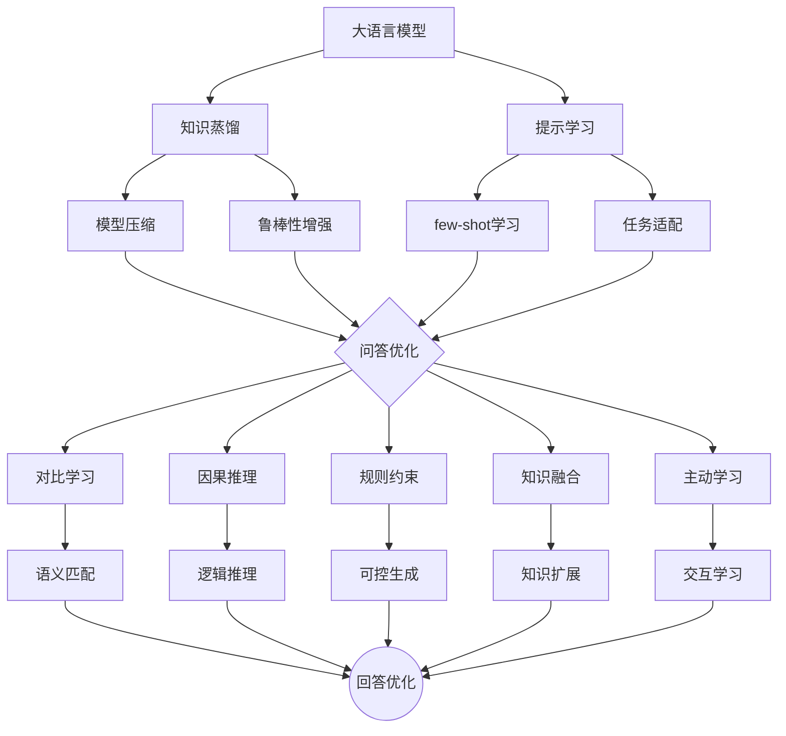

# 大模型问答机器人如何优化回答

## 1. 背景介绍
### 1.1 问题的由来
随着人工智能技术的飞速发展,特别是大语言模型的出现,问答机器人已经成为了人工智能领域的一个热点研究方向。传统的问答机器人往往基于预先定义好的知识库和规则,无法灵活应对开放领域的各种问题。而基于大语言模型的问答机器人可以利用海量的预训练数据,具备更强的语义理解和生成能力,能够更好地理解用户的意图,给出更加准确和丰富的回答。
 
### 1.2 研究现状
目前业界主流的大模型问答机器人主要有OpenAI的ChatGPT、Google的LaMDA、微软的Sydney等。这些系统都是基于Transformer架构的大规模语言模型,在大量无监督数据上进行预训练,然后针对特定任务进行微调。它们展现出了惊人的对话和问答能力,受到了学术界和工业界的广泛关注。

但是,这些大模型问答机器人在实际应用中仍然存在一些问题和挑战:
1. 回答的准确性和可靠性有待提高,有时会产生错误或不恰当的回答。
2. 缺乏常识推理和因果推理能力,对一些需要复杂推理的问题回答不够理想。
3. 难以控制回答的风格和倾向性,容易产生偏见或不当言论。
4. 缺乏明确的知识来源,难以追溯和验证回答的依据。
5. 生成效率较低,难以实时响应大规模用户请求。

因此,如何进一步优化大模型问答机器人的回答质量和效率,是目前亟待解决的关键问题。

### 1.3 研究意义 
大模型问答机器人代表了人工智能技术发展的前沿,对于推动人机交互、知识服务、智能助理等领域具有重要意义。优化大模型问答机器人的回答,一方面可以提升系统的实用性和用户体验,让机器人能够更好地理解用户需求,提供高质量的知识服务。另一方面,相关研究也将促进自然语言处理、知识表示、推理决策等人工智能核心技术的进步。同时,高效可靠的问答机器人在智能客服、智能教育、智能医疗等领域也有广阔的应用前景。

### 1.4 本文结构
本文将围绕大模型问答机器人回答优化这一主题展开论述。第2部分介绍相关的核心概念;第3部分重点阐述优化的核心算法原理和操作步骤;第4部分从数学角度对优化算法进行建模和推导;第5部分给出代码实例,并详细解释说明;第6部分分析优化算法在实际场景中的应用;第7部分推荐相关的学习资源和开发工具;第8部分总结全文,并展望未来的发展趋势和挑战;第9部分列举常见问题解答。

## 2. 核心概念与联系
要优化大模型问答机器人的回答,需要理解以下几个核心概念:

- 大语言模型(Large Language Model):以Transformer为代表的深度神经网络模型,在大规模无监督语料上进行预训练,具备强大的语言理解和生成能力,是问答机器人的核心。代表模型有GPT、BERT、T5等。

- 知识蒸馏(Knowledge Distillation):将大模型的知识提炼到小模型中,在保持性能的同时提高推理效率。常见方法有软标签蒸馏、attention蒸馏等。

- 提示学习(Prompt Learning):通过设计恰当的提示模板,引导语言模型进行特定任务的推理和生成。优化提示可以显著提升问答效果。

- 对比学习(Contrastive Learning):通过构建正负样本对,训练模型去辨别和对齐文本语义。在问答中可用于优化问题匹配和过滤无关回答。

- 因果推理(Causal Reasoning):通过建立事件间的因果关系,进行逻辑推理和决策。在问答中可增强语义理解和常识推理能力。

- 规则约束(Rule Constraint):通过预定义规则和模板,对语言模型的生成过程进行引导和约束,以确保回答满足特定要求,如安全性、格式等。

- 知识融合(Knowledge Fusion):将外部结构化或非结构化知识与语言模型相结合,扩充模型的知识和回答能力。常见方式有检索增强、数据增强等。

- 主动学习(Active Learning):通过主动向用户或其他模型提问,获取关键信息,从而优化问题理解和回答生成。可提高数据利用效率。

这些概念之间也有着紧密联系。大语言模型是问答优化的基础,知识蒸馏和提示学习是两种主要的优化范式。对比学习、因果推理、规则约束是优化语义理解和推理能力的重要手段。知识融合和主动学习则从知识扩充和交互学习的角度来增强问答效果。它们相互配合,形成了一套完整的大模型问答优化技术体系。

下面以一个流程图来展示这些概念之间的逻辑关系:

## 3. 核心算法原理 & 具体操作步骤
### 3.1 算法原理概述
大模型问答优化可以分为三个主要步骤:问题理解、知识匹配、回答生成。

在问题理解阶段,首先利用大语言模型对问题进行语义编码,提取关键信息。然后通过对比学习,将问题与候选答案进行语义匹配,初步筛选出相关性较高的答案。接着利用因果推理和常识知识,对问题进行语义解析和拓展,构建推理链条。

在知识匹配阶段,以问题理解获得的关键信息为线索,利用知识蒸馏模型在海量知识库中快速检索相关知识。并通过知识融合技术,将外部知识与语言模型表征进行对齐,形成更加丰富和准确的知识表示。

在回答生成阶段,利用优化后的提示学习模型,以问题和匹配知识为输入,生成自然流畅的答案文本。同时引入规则约束,对生成过程进行引导,确保回答满足安全、格式等特定要求。此外,还可通过主动学习,针对性地提问用户,获取关键信息来进一步优化回答。

### 3.2 算法步骤详解
1. 问题理解
- 利用预训练语言模型如BERT,对问题文本进行编码,提取语义特征。
- 构建问题与候选答案的正负样本对,通过对比学习模型如SimCSE进行语义相似度计算,初筛相关答案。
- 利用因果推理模型如CausalBERT,结合常识知识库,对问题进行语义解析和拓展,构建推理链条。

2. 知识匹配
- 将问题理解获得的关键信息(如实体、关系等)作为检索词,利用知识蒸馏模型如TinyBERT在知识库中进行快速检索匹配。 
- 对于结构化知识(如知识图谱),可通过TransE等知识表示学习方法,将实体和关系映射到同一语义空间。
- 对于非结构化文本知识,可通过文本匹配模型如ColBERT进行语义相似度计算。
- 利用注意力机制等知识融合技术,将外部知识表征与语言模型动态结合,形成知识增强的语义表示。

3. 回答生成
- 构建提示学习模板,将问题、匹配知识等信息填入模板,形成优化的上下文输入。
- 利用预训练语言模型如GPT-3进行回答生成,以提示信息为前缀,对答案进行自回归解码。
- 对生成过程施加规则约束,引入答案长度、安全性、格式等限制条件,进行约束性解码。
- 通过主动学习,识别出回答中的不确定部分,主动向用户提问,获取关键信息并动态优化回答。
- 结合强化学习,根据用户反馈动态调整模型参数,不断提升回答质量。

### 3.3 算法优缺点
优点:
- 充分利用大语言模型的语义理解和生成能力,回答更加自然流畅。
- 融合了多种优化技术,从问题理解、知识匹配、回答生成等环节进行了全面优化。
- 引入了外部知识,增强了模型的知识广度和深度,能够回答更加开放和复杂的问题。
- 采用了规则约束和主动学习等人机交互机制,回答更加可控和个性化。

缺点:
- 对算力要求较高,优化过程比较耗时,实时响应能力有待提升。
- 虽然引入了外部知识,但知识的准确性和全面性仍难以保证,可能出现知识噪声。
- 规则约束虽然增强了可控性,但也可能限制回答的灵活性和创造力。
- 主动学习需要用户的参与,在实际应用中用户体验可能受到影响。

### 3.4 算法应用领域
- 智能客服:利用问答优化技术,提供更加专业和个性化的客户服务,提升用户满意度。
- 智能教育:通过问答交互,实现因材施教和智能导学,促进学习效果提升。  
- 智能助理:通过语音问答,提供日程管理、信息查询、任务规划等智能化服务,提高生活和工作效率。
- 医疗健康:利用医学知识优化问答,协助医生诊断、为患者提供智能咨询服务,促进医疗服务智能化。
- 金融投资:通过问答系统,提供智能投资顾问、风险提示等服务,为投资者的决策提供参考。

## 4. 数学模型和公式 & 详细讲解 & 举例说明
### 4.1 数学模型构建
以下我们以对比学习中的SimCSE为例,介绍问答优化中的数学建模过程。

SimCSE的核心思想是通过构建正负样本对,让模型学习去区分语义相似和不相似的文本对,从而获得更加鲁棒和有效的语义表征。

具体来说,SimCSE采用了一个双塔结构的神经网络模型,分别对查询(Query)和文档(Document)进行编码。查询塔和文档塔共享同一套参数。模型的目标是最大化查询与其相似文档的相似度,同时最小化查询与不相似文档的相似度。

设查询编码为 $q$,正例文档编码为 $d^+$,负例文档编码为 $d^-$,我们希望学习一个编码函数 $f$,使得:

$$
sim(f(q),f(d^+)) > sim(f(q), f(d^-))
$$

其中 $sim$ 表示余弦相似度,定义为:

$$
sim(u,v) = \frac{u \cdot v}{||u|| \cdot ||v||}
$$

进一步地,我们使用交叉熵损失函数来描述这一优化目标:

$$
\mathcal{L} = -log\frac{e^{sim(f(q),f(d^+))/\tau}}  {e^{sim(f(q),f(d^+))/\tau} + \sum_{d^-}e^{sim(f(q),f(d^-))/\tau}}
$$

其中 $\tau$ 为温度超参数,用于控制软最大化的平滑度。

最小化该损失函数,就可以让模型学会将相似的查询-文档对的相似度最大化,同时将不相似的查询-文档对的相似度最小化,从而获得更加有