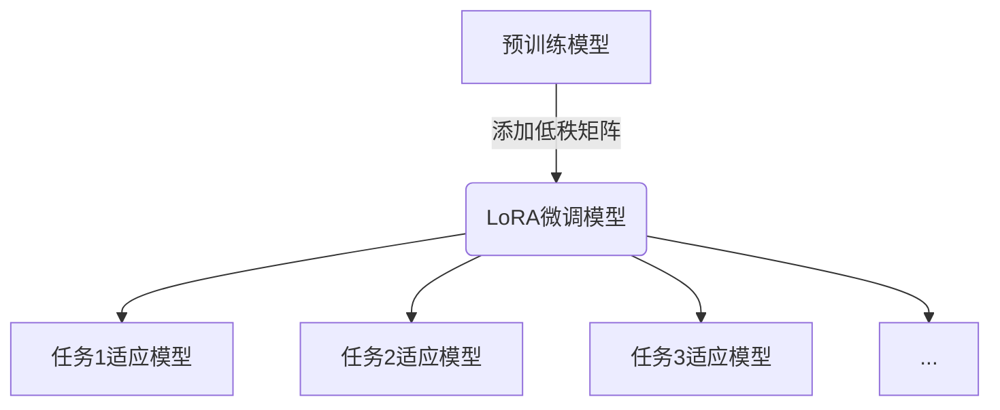

# 大规模语言模型从理论到实践：LoRA的变体

## 1. 背景介绍

### 1.1 问题的由来

随着人工智能技术的不断发展,大规模语言模型已经成为自然语言处理领域的关键技术之一。这些模型通过在海量文本数据上进行预训练,能够捕捉到丰富的语言知识和上下文信息,从而在各种自然语言处理任务上表现出色。然而,训练这些庞大的模型需要消耗大量的计算资源,而且一旦训练完成,模型参数也变得固定,难以针对特定任务或领域进行个性化调整。

为了解决这一问题,研究人员提出了一种称为LoRA(Low-Rank Adaptation)的高效微调方法。LoRA通过在预训练模型的基础上添加一些低秩矩阵,实现了在保持原始模型大部分参数不变的情况下,对模型进行有效的特定任务或领域适应。这种方法不仅能够显著降低微调所需的计算资源,而且还能够保持模型在通用领域的泛化能力。

### 1.2 研究现状

LoRA作为一种高效的模型微调方法,自提出以来就受到了广泛关注。许多研究工作都在探索如何改进和扩展LoRA,以进一步提高其性能和适用范围。例如,一些研究尝试将LoRA应用于不同类型的预训练模型,如基于Transformer的语言模型、基于卷积神经网络的视觉模型等。另一些研究则关注于优化LoRA的训练策略,以提高其收敛速度和稳定性。

此外,还有一些研究工作致力于将LoRA与其他技术相结合,以获得更好的效果。例如,将LoRA与知识蒸馏技术相结合,可以进一步减小微调后模型的大小;将LoRA与元学习技术相结合,可以提高模型在新任务上的适应能力。

### 1.3 研究意义

LoRA及其变体技术对于实现高效、灵活的大规模语言模型微调具有重要意义。具体来说,它们可以带来以下几个主要好处:

1. **计算资源节省**:与传统的模型微调方法相比,LoRA只需要更新模型中的一小部分参数,从而大大减少了所需的计算资源,使得在有限的硬件条件下也能够对大型模型进行微调。

2. **任务适应性**:LoRA允许对预训练模型进行特定任务或领域的适应,使得模型在相应的场景下表现更加出色,同时保持了在通用领域的泛化能力。

3. **模型压缩**:通过LoRA训练得到的适应模型,其大小通常比原始预训练模型小得多,这有利于模型的部署和应用。

4. **模型可解释性**:LoRA引入的低秩矩阵可以被视为对原始模型的一种解释,有助于我们理解模型在特定任务上的适应过程。

综上所述,LoRA及其变体技术为高效利用大规模语言模型提供了一种有前景的解决方案,对于推动自然语言处理技术的发展具有重要意义。

### 1.4 本文结构  

本文将全面介绍LoRA及其变体技术的理论基础、算法细节、实现方式和应用场景。文章的主要结构如下:

1. 背景介绍:阐述LoRA技术的由来、研究现状和意义。
2. 核心概念与联系:介绍LoRA的核心思想,并与其他相关技术进行对比和联系。
3. 核心算法原理与具体操作步骤:详细解释LoRA及其变体算法的原理和实现细节。
4. 数学模型和公式:推导LoRA相关的数学模型和公式,并通过案例进行讲解和分析。
5. 项目实践:提供LoRA的代码实现示例,并对关键部分进行解读和分析。
6. 实际应用场景:介绍LoRA在自然语言处理等领域的实际应用案例。
7. 工具和资源推荐:推荐一些LoRA相关的学习资源、开发工具和论文等。
8. 总结:对LoRA的研究成果进行总结,并展望其未来发展趋势和面临的挑战。
9. 附录:解答一些LoRA常见的问题和疑惑。

## 2. 核心概念与联系

LoRA(Low-Rank Adaptation)是一种高效的模型微调方法,它的核心思想是在预训练模型的基础上添加一些低秩矩阵,从而实现对模型的有效适应。具体来说,LoRA将预训练模型的每一层权重矩阵W分解为两部分:

$$W = W_p + W_l$$

其中,W_p是预训练模型原有的权重矩阵,在微调过程中保持不变;W_l是一个低秩矩阵,它由两个较小的矩阵相乘得到:

$$W_l = BA$$

这里,B和A都是可训练的矩阵,它们的秩远小于W_p的秩。在微调过程中,我们只需要更新B和A这两个小矩阵,就可以实现对整个模型的适应,而无需更新庞大的W_p。

LoRA的这种思路源于矩阵分解理论,它利用了低秩矩阵在表示能力和计算效率之间的平衡。一方面,低秩矩阵能够有效地捕捉数据的主要模式和特征;另一方面,它们的参数数量较少,因此更新起来更加高效。

LoRA技术与其他一些相关技术存在联系,例如:

- **知识蒸馏(Knowledge Distillation)**:知识蒸馏是一种模型压缩技术,它通过将一个大型模型(教师模型)的知识传递给一个小型模型(学生模型),从而实现模型的压缩和加速。LoRA可以被视为一种特殊形式的知识蒸馏,其中学生模型是通过在教师模型的基础上添加低秩矩阵得到的。

- **元学习(Meta-Learning)**:元学习旨在提高模型在新任务上的快速适应能力。LoRA可以被看作是一种简单的元学习方法,它通过学习如何在预训练模型上添加低秩矩阵,实现了对新任务的快速适应。

- **注意力机制(Attention Mechanism)**:注意力机制是当前深度学习模型中的一种关键技术,它允许模型动态地关注输入数据的不同部分。LoRA中引入的低秩矩阵可以被解释为对预训练模型注意力分布的微调,从而实现对特定任务的适应。

总的来说,LoRA是一种将矩阵分解、知识蒸馏、元学习和注意力机制等多种思想融合在一起的创新技术,它为高效利用大规模语言模型提供了一种有前景的解决方案。

## 3. 核心算法原理与具体操作步骤

### 3.1 算法原理概述

LoRA算法的核心思想是通过在预训练模型的基础上添加一些低秩矩阵,实现对模型的高效微调和适应。具体来说,LoRA将预训练模型的每一层权重矩阵W分解为两部分:

$$W = W_p + W_l$$

其中,W_p是预训练模型原有的权重矩阵,在微调过程中保持不变;W_l是一个低秩矩阵,它由两个较小的矩阵相乘得到:

$$W_l = BA$$

这里,B和A都是可训练的矩阵,它们的秩远小于W_p的秩。在微调过程中,我们只需要更新B和A这两个小矩阵,就可以实现对整个模型的适应,而无需更新庞大的W_p。

LoRA的这种思路源于矩阵分解理论,它利用了低秩矩阵在表示能力和计算效率之间的平衡。一方面,低秩矩阵能够有效地捕捉数据的主要模式和特征;另一方面,它们的参数数量较少,因此更新起来更加高效。

### 3.2 算法步骤详解

LoRA算法的具体实现步骤如下:

1. **初始化**:首先,我们需要初始化预训练模型的权重矩阵W_p,以及LoRA低秩矩阵的两个因子矩阵B和A。通常,B和A可以使用一些简单的初始化策略,如Xavier初始化或Kaiming初始化。

2. **前向传播**:在模型的前向传播过程中,我们将预训练模型的权重矩阵W_p与LoRA低秩矩阵W_l相加,得到微调后的权重矩阵W:

$$W = W_p + BA$$

然后,使用这个微调后的权重矩阵W进行前向计算,得到模型的输出。

3. **反向传播**:在反向传播阶段,我们需要计算损失函数相对于B和A的梯度,并使用这些梯度来更新B和A的值。与传统的模型微调不同,我们无需计算预训练模型权重W_p的梯度,因为它们在微调过程中保持不变。

4. **参数更新**:使用优化算法(如Adam或SGD)根据计算得到的梯度,更新B和A的值。通常,我们会在每个训练步骤中更新这两个矩阵。

5. **迭代训练**:重复步骤2-4,直到模型收敛或达到预设的训练轮数。

通过上述步骤,我们可以高效地对预训练模型进行微调,使其适应特定的任务或领域,同时只需要更新少量的参数。

### 3.3 算法优缺点

LoRA算法具有以下优点:

1. **计算效率高**:由于只需要更新少量的参数(B和A矩阵),LoRA算法的计算开销远小于传统的模型微调方法,因此能够显著节省计算资源。

2. **内存占用小**:LoRA算法只需要存储B和A这两个相对较小的矩阵,而无需存储整个微调后的模型权重,从而大大减小了内存占用。

3. **任务适应性强**:LoRA算法能够灵活地对预训练模型进行适应,使其在特定任务或领域上表现更加出色,同时保持了在通用领域的泛化能力。

4. **模型可解释性**:LoRA引入的低秩矩阵可以被视为对原始模型的一种解释,有助于我们理解模型在特定任务上的适应过程。

然而,LoRA算法也存在一些潜在的缺点:

1. **表示能力有限**:尽管低秩矩阵能够捕捉数据的主要模式,但它们的表示能力仍然有限,可能无法完全捕捉复杂任务所需的所有信息。

2. **超参数选择**:LoRA算法需要选择合适的低秩矩阵的秩,这可能需要一些试验和调优。不当的秩选择可能会影响模型的性能。

3. **任务转移问题**:LoRA算法主要针对单个任务进行优化,如果需要在多个任务之间进行转移,可能会存在一定的困难和性能下降。

4. **训练不稳定性**:在某些情况下,LoRA算法的训练过程可能会出现不稳定性,导致收敛速度较慢或无法收敛。

总的来说,LoRA算法是一种高效的模型微调方法,具有计算效率高、内存占用小、任务适应性强等优点,但也存在一些潜在的缺陷和限制。在实际应用中,需要根据具体情况权衡利弊,并采取适当的策略来缓解这些问题。

### 3.4 算法应用领域

LoRA算法及其变体技术可以应用于各种需要对大规模语言模型进行微调和适应的场景,包括但不限于:

1. **自然语言处理任务**:如文本分类、机器翻译、问答系统、对话系统等,LoRA可以帮助将预训练的大型语言模型适应到特定的任务和领域。

2. **多模态任务**:LoRA不仅可以应用于纯文本数据,还可以扩展到处理图像、视频等