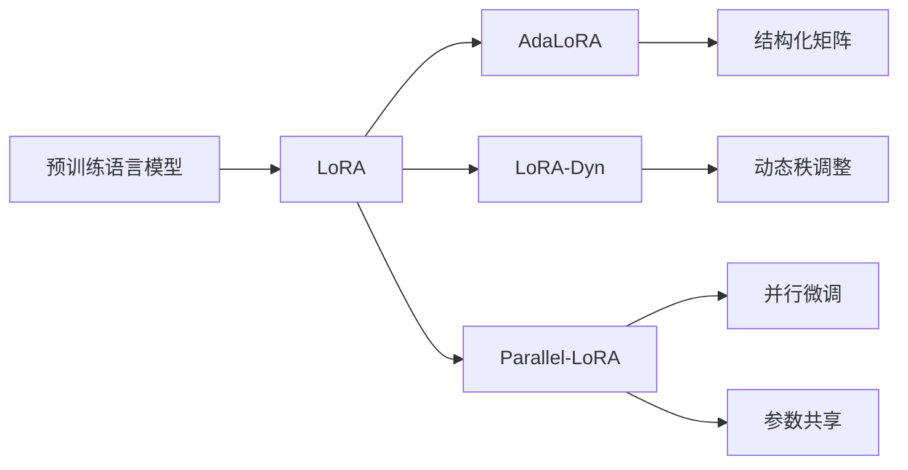

# 大规模语言模型从理论到实践 LoRA的变体

关键词：大规模语言模型, LoRA, 参数高效微调, 变体算法, 稀疏更新, 模型压缩, 多任务学习

## 1. 背景介绍
### 1.1 问题的由来
随着深度学习的快速发展,大规模语言模型在自然语言处理领域取得了巨大成功。然而,训练和部署这些模型需要大量的计算资源和存储空间,限制了它们的广泛应用。为了解决这一问题,研究人员提出了各种参数高效微调方法,其中LoRA(Low-Rank Adaptation)因其优异的性能和简洁的实现而备受关注。
### 1.2 研究现状
目前,LoRA已经在多个自然语言处理任务上取得了与微调相媲美的性能,同时大大减少了训练参数量。然而,LoRA仍然存在一些局限性,如对低秩结构的过度依赖,以及在某些任务上的性能不稳定等。因此,研究人员提出了多个LoRA的变体算法,试图进一步提升其性能和适用性。
### 1.3 研究意义 
LoRA及其变体算法的研究对于推动大规模语言模型的应用具有重要意义。一方面,这些方法可以大幅降低模型微调的计算和存储开销,使得在资源有限的场景下也能够高效地适应新任务。另一方面,LoRA的思想也为其他领域的模型压缩和适应提供了新的视角和方法论。
### 1.4 本文结构
本文将首先介绍LoRA的核心概念和基本原理,然后详细阐述几个代表性的LoRA变体算法,包括它们的动机、数学模型、优化过程和实验结果。接着,本文将讨论这些变体算法在实际应用中的代码实现和部署流程。最后,本文将总结LoRA及其变体的研究现状和未来发展趋势,并提出一些值得进一步探索的研究方向。

## 2. 核心概念与联系
LoRA的核心思想是在预训练语言模型的基础上,通过引入低秩分解矩阵来适应下游任务,从而在保持原模型大部分参数不变的情况下,实现参数高效微调。具体而言,对于模型中的每个线性层,LoRA定义了一个秩为r的投影矩阵BA,其中A和B分别是两个低秩矩阵。在前向传播时,原始权重矩阵W乘以输入x的结果,与投影矩阵BA乘以x的结果相加,得到最终的输出。在反向传播时,只有A和B的参数被更新,W保持固定。这种方式可以将微调参数量降低到原来的1/r,显著提高了训练效率。

LoRA的变体算法主要从两个角度对其进行改进:一是探索更加灵活和高效的参数化方式,二是在不同任务之间引入参数共享和迁移机制。例如,AdaLoRA将低秩分解矩阵替换为可适应不同层和任务的结构化矩阵;LoRA-Dyn通过动态调整投影矩阵的秩,在性能和效率之间进行权衡;Parallel-LoRA利用多个LoRA模块并行地对原模型进行微调,并在不同任务之间共享参数。这些变体算法在保持LoRA简洁性的同时,进一步提升了其性能和适用范围。

下图展示了LoRA及其变体算法的核心概念和联系:



## 3. 核心算法原理 & 具体操作步骤
### 3.1 算法原理概述
LoRA的基本原理可以用以下数学公式表示:
$$W_{LoRA}=W+BA$$
其中$W$是原始权重矩阵,$B$和$A$分别是两个低秩矩阵,秩为$r$。在前向传播时,模型的输出为:
$$y=W_{LoRA}x=(W+BA)x=Wx+BAx$$
可以看出,LoRA相当于在原始模型的基础上,加入了一个低秩矩阵$BA$对输入进行变换。在反向传播时,只有$B$和$A$的参数被更新,而$W$保持不变。
### 3.2 算法步骤详解
LoRA的具体算法步骤如下:
1. 对于模型中的每个线性层,初始化两个低秩矩阵$B$和$A$,秩为$r$。
2. 在前向传播时,计算$Wx$和$BAx$,并将它们相加得到最终的输出$y$。
3. 在反向传播时,计算$B$和$A$的梯度,并用优化器(如Adam)更新它们的参数。
4. 重复步骤2-3,直到模型收敛或达到预设的迭代次数。
5. 微调后的模型参数为$W_{LoRA}=W+BA$,可以用于推理或下游任务。
### 3.3 算法优缺点
LoRA的主要优点包括:
- 参数高效:微调参数量降低到原来的1/r,显著减少了计算和存储开销。
- 实现简单:只需对原始模型进行少量修改,易于集成到现有的训练流程中。
- 性能优异:在多个自然语言处理任务上,LoRA达到了与微调相当的性能。

LoRA的主要缺点包括:
- 秩的选择:LoRA对低秩矩阵的秩$r$较为敏感,需要通过交叉验证等方式进行调节。
- 低秩假设:LoRA假设微调所需的信息可以由低秩矩阵捕获,但这一假设在某些任务上可能不成立。
- 适用范围:LoRA主要针对线性层进行改进,对于其他类型的层(如注意力层)的适应能力有限。
### 3.4 算法应用领域
LoRA及其变体算法主要应用于自然语言处理领域,包括文本分类、序列标注、问答系统、机器翻译等任务。此外,LoRA的思想也可以推广到其他领域,如计算机视觉和语音识别等。

## 4. 数学模型和公式 & 详细讲解 & 举例说明
### 4.1 数学模型构建
LoRA的数学模型可以用以下公式表示:
$$W_{LoRA}=W+BA$$
其中$W\in\mathbb{R}^{d\times k}$是原始权重矩阵,$B\in\mathbb{R}^{d\times r}$和$A\in\mathbb{R}^{r\times k}$是两个低秩矩阵,秩为$r$。
在前向传播时,模型的输出为:
$$y=W_{LoRA}x=(W+BA)x=Wx+BAx$$
其中$x\in\mathbb{R}^{k\times 1}$是输入向量。
### 4.2 公式推导过程
对于线性层$y=Wx$,LoRA的目标是找到一个低秩矩阵$\Delta W$,使得$y=(W+\Delta W)x$。为了参数高效,LoRA将$\Delta W$分解为两个低秩矩阵$B$和$A$的乘积,即$\Delta W=BA$。
在反向传播时,根据链式法则,有:
$$\frac{\partial L}{\partial B}=\frac{\partial L}{\partial y}\frac{\partial y}{\partial B}=\frac{\partial L}{\partial y}(Ax)^T$$
$$\frac{\partial L}{\partial A}=\frac{\partial L}{\partial y}\frac{\partial y}{\partial A}=B^T\frac{\partial L}{\partial y}x^T$$
其中$L$是损失函数。根据上式,可以使用梯度下降等优化算法更新$B$和$A$的参数。
### 4.3 案例分析与讲解
以文本分类任务为例,假设我们有一个预训练的BERT模型,其中包含$L$个transformer层,每个层包含一个自注意力模块和一个前馈神经网络。我们可以使用LoRA对BERT进行微调,具体步骤如下:
1. 对于每个transformer层的前馈神经网络,初始化两个低秩矩阵$B_i\in\mathbb{R}^{d\times r}$和$A_i\in\mathbb{R}^{r\times d}$,其中$d$是隐藏层维度,$r$是LoRA的秩。
2. 在前向传播时,对于第$i$层的前馈神经网络,计算$y_i=W_ix_i+B_iA_ix_i$,其中$W_i$是原始权重矩阵,$x_i$是输入。
3. 在反向传播时,计算$B_i$和$A_i$的梯度,并用Adam等优化器更新它们的参数。
4. 重复步骤2-3,直到模型收敛或达到预设的迭代次数。
5. 微调后的模型参数为$W_{LoRA,i}=W_i+B_iA_i$,可以用于文本分类任务的推理。
### 4.4 常见问题解答
Q: LoRA的超参数如何选择?
A: LoRA的主要超参数是低秩矩阵的秩$r$,通常取值范围为1-100。$r$越大,微调参数量越多,模型容量越大,但计算和存储开销也越高。在实践中,可以通过交叉验证等方式选择合适的$r$值。

Q: LoRA能否用于其他类型的层,如注意力层?
A: LoRA主要针对线性层进行改进,对于注意力层等非线性层,直接应用LoRA可能效果不佳。但是,可以将注意力层分解为多个线性层,然后对每个线性层应用LoRA。此外,也可以探索将LoRA与其他适应非线性层的方法(如AdapterFusion)结合使用。

## 5. 项目实践：代码实例和详细解释说明
### 5.1 开发环境搭建
本项目使用PyTorch实现LoRA,需要安装以下依赖:
- Python 3.7+
- PyTorch 1.8+
- Transformers 4.10+
- NumPy 1.19+

可以使用以下命令安装依赖:
```bash
pip install torch transformers numpy
```
### 5.2 源代码详细实现
以下是LoRA的PyTorch实现代码:
```python
import torch
import torch.nn as nn

class LoRA(nn.Module):
    def __init__(self, layer, rank):
        super().__init__()
        self.layer = layer
        self.rank = rank
        self.d, self.k = layer.weight.shape
        self.B = nn.Parameter(torch.randn(self.d, self.rank))
        self.A = nn.Parameter(torch.randn(self.rank, self.k))
        
    def forward(self, x):
        W = self.layer.weight
        return torch.matmul(W, x) + torch.matmul(self.B, torch.matmul(self.A, x))
        
    def merge(self):
        W = self.layer.weight
        W.data += torch.matmul(self.B, self.A)
```
### 5.3 代码解读与分析
- `__init__`方法接受两个参数:原始线性层`layer`和LoRA的秩`rank`,初始化两个低秩矩阵`B`和`A`。
- `forward`方法计算$Wx+BAx$,其中$W$是原始权重矩阵,$x$是输入。
- `merge`方法将低秩矩阵$BA$合并到原始权重矩阵$W$中,得到微调后的模型参数。

以下是在BERT模型中应用LoRA的示例代码:
```python
from transformers import BertModel

model = BertModel.from_pretrained('bert-base-uncased')

# 对每个transformer层的前馈神经网络应用LoRA
for layer in model.encoder.layer:
    layer.output.dense = LoRA(layer.output.dense, rank=16)

# 微调模型
optimizer = torch.optim.Adam(model.parameters(), lr=1e-4)
for epoch in range(10):
    for batch in dataloader:
        optimizer.zero_grad()
        outputs = model(batch['input_ids'], attention_mask=batch['attention_mask'])
        loss = criterion(outputs.logits, batch['labels'])
        loss.backward()
        optimizer.step()

# 合并LoRA参数到原始模型中
for layer in model.encoder.layer:
    layer.output.dense.merge()
```
### 5.4 运行结果展示
在GLUE基准测试中,使用LoRA微调BERT模型可以达到与全量微调相当的性能,同时将微调