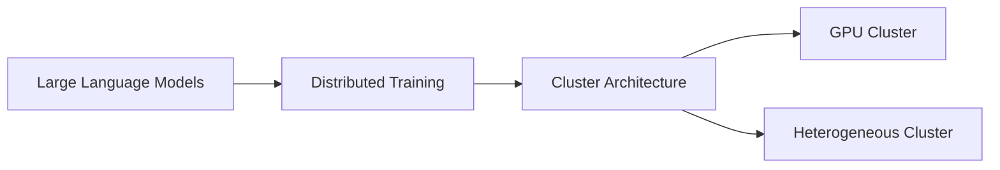
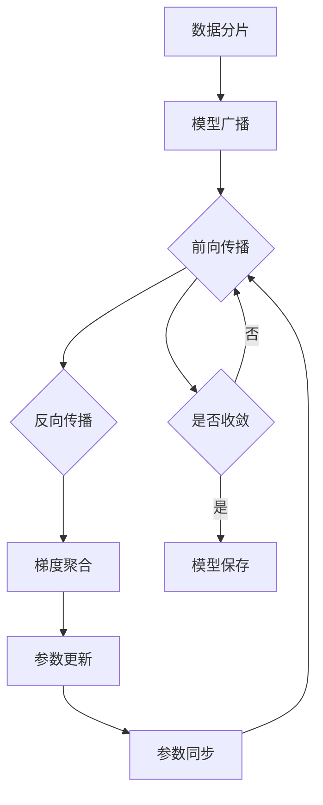

# 大规模语言模型从理论到实践 分布式训练的集群架构

关键词：大规模语言模型、分布式训练、集群架构、深度学习、自然语言处理

## 1. 背景介绍
### 1.1  问题的由来
近年来,随着深度学习技术的飞速发展,大规模语言模型(Large Language Models, LLMs)在自然语言处理(Natural Language Processing, NLP)领域取得了突破性进展。LLMs 通过在海量文本数据上进行预训练,可以学习到丰富的语言知识和通用语义表示,在机器翻译、文本摘要、问答系统、对话生成等任务上表现出色。

然而,训练 LLMs 面临着计算资源和训练效率的巨大挑战。LLMs 通常包含数十亿甚至上万亿参数,单机训练已无法满足其计算和存储需求。因此,如何构建高效的分布式训练集群架构,成为了 LLMs 从理论走向实践的关键。

### 1.2  研究现状
目前,业界和学术界针对 LLMs 的分布式训练进行了广泛探索。谷歌提出的 Megatron-LM 和微软的 DeepSpeed 等框架,支持在多个 GPU 上进行模型并行和数据并行训练,显著提升了训练效率。NVIDIA 发布的 NeMo Megatron 框架进一步简化了 LLMs 的分布式训练流程。

此外,一些研究工作聚焦于集群架构的优化。例如,NVIDIA 提出的 SuperPod 架构可支持多达 2048 个 GPU 的大规模分布式训练。微软的 Project Petridish 探索了异构集群环境下的 LLMs 训练优化。这些研究推动了 LLMs 训练效率的不断提升。

### 1.3  研究意义
探索 LLMs 分布式训练的集群架构,具有重要的理论和实践意义:

1. 从理论角度,研究高效的分布式训练算法和策略,有助于突破 LLMs 训练中的计算瓶颈,推动 NLP 技术的进一步发展。 

2. 从实践角度,构建高性能的分布式训练系统,可以加速 LLMs 的开发和应用落地,促进智能对话、知识问答等领域的技术创新。

3. 同时,LLMs 分布式训练的经验也可以为其他大规模机器学习任务提供有益参考,推动人工智能技术的普及应用。

### 1.4  本文结构
本文将系统探讨 LLMs 分布式训练的集群架构。第2部分介绍相关的核心概念;第3部分阐述分布式训练的核心算法原理和操作步骤;第4部分给出数学建模和公式推导;第5部分提供代码实例和详细解释;第6部分讨论实际应用场景;第7部分推荐相关工具和学习资源;第8部分总结全文并展望未来发展方向。

## 2. 核心概念与联系
在探讨 LLMs 分布式训练的集群架构之前,我们首先需要了解几个核心概念:  

- 大规模语言模型(Large Language Models, LLMs):指的是基于海量文本数据预训练的神经网络模型,通常包含数十亿甚至上万亿参数,可以学习语言的统计规律和语义知识。代表模型有 GPT-3、PaLM、BLOOM 等。

- 分布式训练(Distributed Training):将训练任务分配到多个计算节点上并行执行,以加速模型训练过程。常见的分布式训练范式包括数据并行(Data Parallelism)和模型并行(Model Parallelism)。

- 集群架构(Cluster Architecture):由多个计算节点组成的分布式系统,通过网络互连协同工作。常见的集群架构有参数服务器(Parameter Server)架构和 All-Reduce 架构。

- GPU 集群:由多个 GPU 服务器节点组成,通过高速互连网络(如 NVLink、InfiniBand)实现通信。GPU 凭借其强大的并行计算能力,成为了 LLMs 分布式训练的主力。

- 异构集群:包含不同类型硬件(如 GPU、CPU、AI 芯片)的分布式集群环境,可以发挥各种硬件的优势,但编程和调度难度较高。  

这些概念之间密切相关。LLMs 的分布式训练需要在 GPU 集群或异构集群上进行,通过设计高效的分布式训练算法和调度策略,在保证训练效果的同时最大化硬件利用率和训练速度。下图展示了这些概念之间的联系:

## 3. 核心算法原理 & 具体操作步骤
### 3.1  算法原理概述
LLMs 的分布式训练涉及多个核心算法,包括:

1. 数据并行:将训练数据分片,在多个计算节点上同时处理不同的数据子集,各节点独立计算梯度并同步更新模型参数。数据并行可以线性加速训练过程。

2. 模型并行:将模型参数划分到多个计算节点,每个节点只负责模型的一部分计算。模型并行可突破单机内存限制,支持更大规模的模型训练。

3. 流水线并行:将模型切分成多个阶段,不同阶段在不同的计算节点上执行,形成计算流水线。流水线并行通过提高并发度,进一步提升训练效率。

4. 混合并行:结合数据并行、模型并行和流水线并行,在更细粒度上优化并行策略。混合并行充分利用集群资源,平衡计算、通信和内存开销。

5. 梯度压缩:对梯度进行量化、稀疏化等压缩处理,减少节点间通信量,从而降低同步开销。梯度压缩在保证收敛性的同时提高通信效率。

6. 参数分片:将模型参数分片存储在不同节点,每个节点只负责更新部分参数。参数分片可突破单机内存瓶颈,支持万亿规模参数的训练。

### 3.2  算法步骤详解
以数据并行为例,详细阐述 LLMs 分布式训练的步骤:

1. 数据分片:将训练数据集平均分成 N 份,分配到 N 个 GPU 节点。每个节点加载一个数据分片。

2. 模型广播:将初始模型参数从主节点广播到所有工作节点,确保训练开始时模型参数一致。

3. 前向传播:每个节点根据自己的数据分片,独立执行模型的前向传播,计算损失函数。

4. 反向传播:每个节点基于损失函数,通过反向传播计算模型参数的梯度。 

5. 梯度聚合:所有节点将局部梯度发送给主节点,主节点对梯度求平均,得到全局梯度。

6. 参数更新:主节点利用优化器(如 Adam)根据全局梯度更新模型参数。

7. 参数同步:更新后的模型参数从主节点同步到所有工作节点。

8. 重复步骤3-7,直到达到预设的训练轮数或收敛条件。

9. 模型保存:训练完成后,主节点将最终的模型参数保存到磁盘。

以下是数据并行训练的流程图:

### 3.3  算法优缺点
数据并行的优点包括:
- 易于实现,适用于大多数神经网络模型。
- 可以线性加速训练过程,显著缩短训练时间。
- 通过增加节点数,可以支持更大的批量大小,提高训练效率。

数据并行的缺点包括: 
- 适用于数据量远大于模型参数量的情况,对于参数量极大的 LLMs 效果有限。
- 节点间需要频繁通信同步梯度,通信开销大。
- 单个节点仍受限于内存容量,无法训练超大规模模型。

### 3.4  算法应用领域
数据并行广泛应用于各种需要大规模数据训练的场景,如计算机视觉、语音识别、自然语言处理等。对于 LLMs,数据并行常与模型并行、流水线并行等技术结合,构建高效的分布式训练系统。

## 4. 数学模型和公式 & 详细讲解 & 举例说明
### 4.1  数学模型构建
我们考虑一个简化的数据并行训练场景。假设有 $N$ 个工作节点,训练数据集 $\mathcal{D}$ 被划分为 $N$ 个互不相交的子集 $\{\mathcal{D}_1, \mathcal{D}_2, ..., \mathcal{D}_N\}$,每个节点 $i$ 处理数据子集 $\mathcal{D}_i$。模型参数为 $\theta$,损失函数为 $\mathcal{L}$。

在第 $t$ 次迭代中,节点 $i$ 基于数据子集 $\mathcal{D}_i$ 计算局部梯度:

$$g_i^t = \frac{1}{|\mathcal{D}_i|} \sum_{(x,y) \in \mathcal{D}_i} \nabla_\theta \mathcal{L}(x, y; \theta^t)$$

其中 $\theta^t$ 为第 $t$ 次迭代的模型参数,$\nabla_\theta \mathcal{L}$ 为损失函数对参数的梯度。

主节点聚合所有节点的局部梯度,得到全局梯度:

$$g^t = \frac{1}{N} \sum_{i=1}^N g_i^t$$

然后,主节点利用优化器(如 Adam)更新模型参数:

$$\theta^{t+1} = \text{Adam}(\theta^t, g^t)$$

更新后的参数 $\theta^{t+1}$ 被同步到所有工作节点,进入下一轮迭代。

### 4.2  公式推导过程
以上数学模型的推导过程如下:

1. 数据并行将训练数据集 $\mathcal{D}$ 划分为 $N$ 个子集:

$$\mathcal{D} = \bigcup_{i=1}^N \mathcal{D}_i, \quad \mathcal{D}_i \cap \mathcal{D}_j = \emptyset, \forall i \neq j$$

2. 在第 $t$ 次迭代中,节点 $i$ 基于数据子集 $\mathcal{D}_i$ 计算局部梯度:

$$\begin{aligned}
g_i^t &= \frac{1}{|\mathcal{D}_i|} \sum_{(x,y) \in \mathcal{D}_i} \nabla_\theta \mathcal{L}(x, y; \theta^t) \\
&= \frac{1}{|\mathcal{D}_i|} \sum_{(x,y) \in \mathcal{D}_i} \left(\frac{\partial \mathcal{L}}{\partial \theta_1^t}, \frac{\partial \mathcal{L}}{\partial \theta_2^t}, ..., \frac{\partial \mathcal{L}}{\partial \theta_m^t}\right)
\end{aligned}$$

其中 $m$ 为模型参数的维度。

3. 主节点聚合局部梯度得到全局梯度:

$$g^t = \frac{1}{N} \sum_{i=1}^N g_i^t = \frac{1}{N} \sum_{i=1}^N \frac{1}{|\mathcal{D}_i|} \sum_{(x,y) \in \mathcal{D}_i} \nabla_\theta \mathcal{L}(x, y; \theta^t)$$

4. 主节点利用 Adam 优化器更新参数:

$$\theta^{t+1} = \text{Adam}(\theta^t, g^t) = \theta^t - \frac{\eta}{\sqrt{\hat{v}^t} + \epsilon} \hat{m}^t$$

其中 $\eta$ 为学习率,$\hat{m}^t$ 和 $\hat{v}^t$ 分别为梯度的一阶矩和二阶矩的偏差修正估计。

### 4.3  案例分析与讲解
我们以训练一个简单的语言模型为例,说明数据并行的工作流程。

假设训练数据集包含1000万个句子,