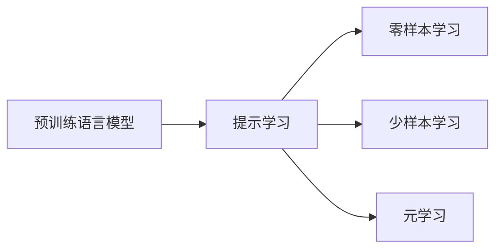

# 大规模语言模型从理论到实践 提示学习

关键词：大规模语言模型、提示学习、自然语言处理、深度学习、预训练模型、零样本学习、少样本学习

## 1. 背景介绍 
### 1.1 问题的由来
近年来,随着深度学习技术的飞速发展,自然语言处理(NLP)领域取得了突破性的进展。尤其是以 Transformer[^1] 为代表的预训练语言模型(Pre-trained Language Models,PLMs)的出现,极大地提升了各类 NLP 任务的性能。然而,传统的微调(Fine-tuning)方法需要为每个下游任务单独训练一个模型,这不仅耗费大量计算资源,而且难以适应实际应用中多变的场景需求。因此,如何利用预训练语言模型高效地适应不同任务,成为了 NLP 领域的一大挑战。

### 1.2 研究现状 
为了解决上述问题,学术界提出了提示学习(Prompt Learning)[^2]的新范式。不同于微调,提示学习旨在通过设计合适的提示模板(Prompt Template),直接利用预训练语言模型进行推理,从而实现零样本(Zero-shot)或少样本(Few-shot)学习。目前,提示学习已经在文本分类[^3]、问答[^4]、实体识别[^5]等多个任务上取得了优异的表现,展现出广阔的应用前景。

### 1.3 研究意义
提示学习为预训练语言模型在下游任务的应用提供了新的思路。一方面,它能够最大限度地利用预训练模型学到的丰富知识,减少针对特定任务的训练成本;另一方面,通过灵活设计提示,使得同一个模型可以适应不同的任务形式,大大提高了模型的泛化能力和实用性。深入研究提示学习,对于推动 NLP 技术在实际场景中的应用具有重要意义。

### 1.4 本文结构
本文将全面介绍提示学习的理论基础和实践方法。第2部分阐述提示学习的核心概念;第3部分详细讲解提示学习的算法原理和操作步骤;第4部分建立提示学习的数学模型并给出公式推导;第5部分通过代码实例演示提示学习的实现过程;第6部分讨论提示学习的应用场景;第7部分推荐提示学习的相关工具和资源;第8部分总结全文并展望未来发展方向。

## 2. 核心概念与联系
提示学习的核心思想是利用自然语言提示来引导预训练语言模型执行特定任务。这里的"提示"是指一段包含任务描述、输入示例和需要预测的目标的文本序列。通过将提示和待预测的文本拼接在一起输入到语言模型中,就可以直接利用语言模型的生成能力得到结果,而无需对模型进行微调。

提示学习与传统的微调方法有着本质的区别。微调需要在下游任务的有标注数据上重新训练模型的参数,而提示学习则通过精心设计输入提示,直接利用预训练模型进行推理和预测。因此,提示学习可以实现零样本和少样本学习,大大降低了任务适配的成本。

从更高的角度来看,提示学习体现了语言模型具备的"元学习"(Meta-learning)能力[^6]。所谓元学习,是指机器学习模型能够从以往学习的经验中总结出快速学习新任务的能力。预训练语言模型通过在大规模无标注语料上进行自监督学习,掌握了丰富的语言知识和推理能力,具备了元学习的基础。而提示学习则为语言模型的元学习提供了有效的实现路径。



## 3. 核心算法原理 & 具体操作步骤
### 3.1 算法原理概述
提示学习的核心是通过构造输入提示来引导预训练语言模型执行特定任务。具体来说,给定一个任务和相应的输入文本,提示学习算法的主要步骤如下:

1. 设计提示模板,定义输入文本和目标之间的映射关系;
2. 将提示模板和输入文本拼接成完整的输入序列;
3. 将输入序列输入到预训练语言模型中,让模型基于提示生成目标文本;
4. 对生成的文本进行后处理,得到最终的任务输出。

其中,提示模板的设计是提示学习的关键。一个好的提示模板应当满足以下特点:

- 清晰表达任务目标,引导模型朝正确方向生成;
- 充分利用输入信息,将其与提示紧密结合;
- 符合自然语言表达习惯,便于模型理解和生成。

### 3.2 算法步骤详解
下面我们以文本分类任务为例,详细说明提示学习算法的执行步骤。

**步骤1:设计提示模板**

假设我们要对一条电影评论进行情感极性分类(正面/负面)。一个可能的提示模板为:

```
评论:
{input_text}
问题:这条评论的情感倾向是什么?
答案:
```

其中`{input_text}`是输入文本的占位符。

**步骤2:构造输入序列**

将提示模板中的占位符替换为实际的输入文本,得到完整的输入序列。例如:

```
评论:
这部电影太棒了,剧情紧凑,演技出色,强烈推荐!
问题:这条评论的情感倾向是什么?
答案:
```

**步骤3:生成目标文本**

将构造好的输入序列输入到预训练语言模型中,让模型基于提示生成目标文本。以 GPT-3[^7] 为例,我们可以使用如下的 API 调用:

```python
response = openai.Completion.create(
    engine="text-davinci-002",
    prompt=input_sequence,
    max_tokens=10,
    n=1,
    stop=None,
    temperature=0,
)
target_text = response.choices[0].text.strip()
```

其中`input_sequence`是第2步构造的输入序列。生成的`target_text`可能是:"正面"。

**步骤4:后处理输出**

对于分类任务,我们通常需要将生成的文本映射为标准的类别标签。例如,可以定义一个映射字典:

```python
label_map = {
    "正面": "positive",
    "负面": "negative",
}
final_label = label_map[target_text]
```

最终得到的分类结果为`"positive"`。

### 3.3 算法优缺点
提示学习相比传统的微调方法具有以下优点:
- 可以实现零样本和少样本学习,大大降低任务适配成本;
- 通过灵活设计提示,使得同一个模型可以适应不同形式的任务;
- 充分利用预训练模型学到的知识,具有更好的泛化能力。

同时,提示学习也存在一些局限性:
- 对提示模板的设计有较高要求,需要一定的先验知识和经验;
- 生成的结果可能不够精准,需要进行后处理才能得到最终输出;
- 对于一些复杂任务,单纯使用提示可能难以达到理想的效果。

### 3.4 算法应用领域
提示学习是一种通用的范式,可以应用于各种 NLP 任务,包括但不限于:
- 文本分类:情感分析、主题分类、意图识别等;
- 信息抽取:实体识别、关系抽取、事件抽取等;
- 文本生成:摘要生成、对话生成、问题生成等;
- 语义匹配:文本相似度计算、自然语言推理等。

此外,提示学习还可以用于其他模态的任务,如图像分类、视觉问答等。这体现了提示学习作为一种元学习方法的普适性。

## 4. 数学模型和公式 & 详细讲解 & 举例说明
### 4.1 数学模型构建
我们可以用数学语言对提示学习进行形式化描述。设输入文本为 $\mathbf{x}$,提示模板为 $\mathbf{p}$,预训练语言模型为 $M$,生成的目标文本为 $\mathbf{y}$。提示学习的过程可以表示为:

$$
\mathbf{y} = M(\mathbf{p}(\mathbf{x}))
$$

其中 $\mathbf{p}(\mathbf{x})$ 表示将输入文本 $\mathbf{x}$ 填充到提示模板 $\mathbf{p}$ 中得到的完整输入序列。

对于一个具体的任务,我们的目标是找到一个最优的提示模板 $\mathbf{p}^*$,使得模型 $M$ 在该任务上的性能最大化:

$$
\mathbf{p}^* = \arg\max_{\mathbf{p}} \mathrm{Perf}(M(\mathbf{p}(\mathbf{x})), \mathbf{y})
$$

其中 $\mathrm{Perf}$ 是任务的性能评估函数,衡量生成的目标文本 $\mathbf{y}$ 与真实标签之间的匹配程度。例如,对于分类任务,可以使用准确率(Accuracy)作为性能指标。

### 4.2 公式推导过程
下面我们推导出提示学习的目标函数。设训练集为 $\mathcal{D} = \{(\mathbf{x}_i, \mathbf{y}_i)\}_{i=1}^N$,我们希望最大化模型在训练集上的对数似然(Log-likelihood):

$$
\mathcal{L}(\mathbf{p}) = \sum_{i=1}^N \log P(\mathbf{y}_i|\mathbf{p}(\mathbf{x}_i))
$$

其中 $P(\mathbf{y}_i|\mathbf{p}(\mathbf{x}_i))$ 表示语言模型 $M$ 在给定输入 $\mathbf{p}(\mathbf{x}_i)$ 的情况下生成目标文本 $\mathbf{y}_i$ 的概率。假设语言模型的输出是一个序列 $\mathbf{y}_i = (y_{i1}, y_{i2}, \dots, y_{iT})$,则有:

$$
P(\mathbf{y}_i|\mathbf{p}(\mathbf{x}_i)) = \prod_{t=1}^T P(y_{it}|\mathbf{p}(\mathbf{x}_i), y_{i1}, \dots, y_{i(t-1)})
$$

将其代入对数似然公式,得到:

$$
\mathcal{L}(\mathbf{p}) = \sum_{i=1}^N \sum_{t=1}^T \log P(y_{it}|\mathbf{p}(\mathbf{x}_i), y_{i1}, \dots, y_{i(t-1)})
$$

我们的目标是找到最优的提示模板 $\mathbf{p}^*$ 来最大化上述目标函数:

$$
\mathbf{p}^* = \arg\max_{\mathbf{p}} \mathcal{L}(\mathbf{p})
$$

### 4.3 案例分析与讲解
我们以情感分类任务为例,说明如何应用上述数学模型进行提示学习。假设训练集中有以下两个样本:

- $\mathbf{x}_1$ = "这部电影太棒了,剧情紧凑,演技出色,强烈推荐!",  $\mathbf{y}_1$ = "正面"
- $\mathbf{x}_2$ = "这部电影简直是在浪费时间,毫无亮点,完全不值得看。",  $\mathbf{y}_2$ = "负面"

我们设计一个简单的提示模板:

```
评论:{input_text}
问题:这条评论的情感倾向是什么?
答案:
```

将训练样本填充到提示模板中,得到输入序列:

- $\mathbf{p}(\mathbf{x}_1)$ = "评论:这部电影太棒了,剧情紧凑,演技出色,强烈推荐!\n问题:这条评论的情感倾向是什么?\n答案:"
- $\mathbf{p}(\mathbf{x}_2)$ = "评论:这部电影简直是在浪费时间,毫无亮点,完全不值得看。\n问题:这条评论的情感倾向是什么?\n答案:"

然后,我们让语言模型基于输入序列生成目标文本。理想情况下,模型应该生成:

- $\mathbf{y}_