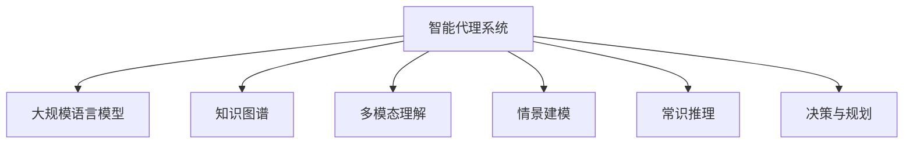

# 大规模语言模型从理论到实践：智能代理的组成

## 1. 背景介绍

### 1.1 问题的由来

在当今的数字时代，人工智能(AI)已经渗透到我们生活的方方面面。作为AI的一个重要分支,自然语言处理(NLP)技术正在推动着人机交互的革命性变革。大规模语言模型(Large Language Model, LLM)作为NLP领域的核心技术,已经展现出令人惊叹的能力,能够理解和生成流畅、连贯的自然语言文本。

随着计算能力的不断提升和海量数据的累积,训练大规模语言模型成为可能。这些模型通过在大量文本数据上进行预训练,学习到了丰富的语言知识和上下文信息,从而能够生成高质量的文本输出。然而,构建一个真正"智能"的代理系统,不仅需要强大的语言生成能力,还需要具备多模态理解、常识推理、情景建模等多方面的能力,以更好地理解用户需求并作出合理响应。

### 1.2 研究现状

目前,大规模语言模型已经取得了令人瞩目的成就,如GPT-3、PaLM、ChatGPT等模型展现出了惊人的语言生成能力。但同时,这些模型也存在一些明显的缺陷,如缺乏常识推理能力、容易产生不一致和虚构的输出、缺乏情景理解能力等。

为了构建真正"智能"的代理系统,研究人员正在努力探索将大规模语言模型与其他AI技术相结合的方法,如知识图谱、多模态理解、情景建模等,以弥补语言模型的不足。同时,也有研究致力于提高语言模型本身的能力,如注入常识知识、增强推理能力、提高一致性和可靠性等。

### 1.3 研究意义

构建智能代理系统对于推动人机交互的发展至关重要。一个真正"智能"的代理不仅能够流畅地交流,还能够深入理解用户的需求,并作出合理的响应和决策。这种智能代理系统在诸多领域都有广阔的应用前景,如智能助手、客户服务、教育辅导、医疗诊断等。

此外,智能代理系统的研究也将推动相关AI技术的发展,如自然语言处理、知识表示与推理、多模态学习等,为构建通用人工智能(Artificial General Intelligence, AGI)奠定基础。

### 1.4 本文结构

本文将全面探讨构建智能代理系统的理论基础和实践技术。我们将首先介绍大规模语言模型的核心概念和算法原理,然后讲解如何将其与其他AI技术相结合,以增强智能代理的能力。接下来,我们将深入探讨智能代理系统在实际应用中的挑战和解决方案。最后,我们将总结研究现状,并展望未来的发展趋势和挑战。

## 2. 核心概念与联系

大规模语言模型是构建智能代理系统的核心技术之一。它通过在海量文本数据上进行预训练,学习到丰富的语言知识和上下文信息,从而能够生成高质量的文本输出。然而,仅仅依赖语言模型是远远不够的,我们还需要将其与其他AI技术相结合,以构建真正"智能"的代理系统。

1. **知识图谱(Knowledge Graph)**: 知识图谱是一种结构化的知识表示形式,它将实体、概念和它们之间的关系以图的形式组织起来。将知识图谱与语言模型相结合,可以帮助智能代理获取外部知识,提高理解和推理能力。

2. **多模态理解(Multimodal Understanding)**: 智能代理需要能够理解和处理多种模态的输入,如文本、图像、视频、语音等。多模态理解技术可以帮助智能代理融合不同模态的信息,形成更全面的理解。

3. **情景建模(Situational Modeling)**: 情景建模旨在构建对当前情景的表示,包括用户的意图、背景信息、对话历史等。通过情景建模,智能代理可以更好地理解用户的需求,并作出合理的响应。

4. **常识推理(Commonsense Reasoning)**: 常识推理是指利用常识知识进行推理和决策的能力。由于大规模语言模型缺乏常识知识,需要引入常识推理技术来弥补这一缺陷。

5. **决策与规划(Decision Making and Planning)**: 智能代理需要具备决策和规划能力,以根据用户需求制定合理的行动计划。这需要综合利用语言理解、知识推理、情景建模等多种技术。

通过将上述技术与大规模语言模型相结合,我们可以构建出真正"智能"的代理系统,实现更自然、更高效的人机交互体验。

## 3. 核心算法原理与具体操作步骤

### 3.1 算法原理概述

大规模语言模型的核心算法是**transformer**,它是一种基于自注意力机制(Self-Attention)的序列到序列(Seq2Seq)模型。Transformer能够有效地捕捉输入序列中的长程依赖关系,从而生成高质量的文本输出。

Transformer的主要组成部分包括:

1. **嵌入层(Embedding Layer)**: 将输入的文本序列转换为向量表示。
2. **编码器(Encoder)**: 由多个编码器层堆叠而成,每个编码器层包含一个多头自注意力子层和一个前馈神经网络子层。编码器的作用是捕捉输入序列的上下文信息。
3. **解码器(Decoder)**: 与编码器结构类似,但在自注意力子层之前,还引入了一个编码器-解码器注意力子层,用于关注输入序列中的相关信息。
4. **输出层(Output Layer)**: 将解码器的输出转换为目标序列的概率分布。

在训练过程中,Transformer模型通过最大似然估计,学习到能够生成目标序列的参数。在推理阶段,模型则通过贪婪搜索或beam search等策略,生成最可能的输出序列。

### 3.2 算法步骤详解

1. **输入表示**

   将输入文本序列转换为向量表示,通常采用词嵌入(Word Embedding)或子词嵌入(Subword Embedding)的方式。同时,还需要添加位置编码(Positional Encoding),以保留序列中的位置信息。

2. **编码器(Encoder)**

   编码器的主要任务是捕捉输入序列的上下文信息。具体步骤如下:
   
   a. 自注意力子层: 计算每个位置的单词与整个输入序列的关系,生成注意力权重。
   
   b. 多头注意力: 将多个注意力头的结果进行拼接,捕捉不同的依赖关系。
   
   c. 前馈神经网络子层: 对注意力输出进行非线性变换,提取更高层次的特征表示。
   
   d. 残差连接和层归一化: 为了更好地传递梯度信号,引入残差连接和层归一化。

3. **解码器(Decoder)**

   解码器的任务是根据编码器的输出和前一步生成的单词,预测下一个单词。具体步骤如下:
   
   a. 掩码自注意力子层: 防止当前位置的单词关注到未来位置的信息。
   
   b. 编码器-解码器注意力子层: 关注输入序列中的相关信息。
   
   c. 前馈神经网络子层: 同编码器。
   
   d. 残差连接和层归一化: 同编码器。

4. **输出生成**

   根据解码器的输出,计算目标序列每个位置的单词概率分布。在推理阶段,可以采用贪婪搜索或beam search等策略,生成最可能的输出序列。

### 3.3 算法优缺点

**优点**:

1. **并行计算**: 自注意力机制允许模型并行计算序列中每个位置的注意力权重,提高了计算效率。
2. **长程依赖建模**: 自注意力机制能够有效捕捉输入序列中的长程依赖关系,生成更连贯的输出。
3. **可解释性**: 注意力权重可以解释模型关注的部分,提高了模型的可解释性。

**缺点**:

1. **缺乏常识推理能力**: 大规模语言模型缺乏常识知识,难以进行复杂的推理和决策。
2. **缺乏一致性**: 模型输出可能存在矛盾和不一致的情况,影响了可靠性。
3. **计算资源需求高**: 训练大规模语言模型需要海量数据和巨大的计算资源,成本昂贵。

### 3.4 算法应用领域

大规模语言模型已经在多个领域展现出了广泛的应用前景:

1. **自然语言生成(NLG)**: 包括文本生成、机器翻译、文本摘要等任务。
2. **对话系统**: 用于构建智能对话代理,如虚拟助手、客户服务机器人等。
3. **问答系统**: 能够根据给定的问题,从知识库中检索并生成相关的答案。
4. **内容创作**: 可用于自动生成新闻、故事、广告文案等内容。
5. **代码生成**: 根据给定的需求,自动生成相应的代码。

## 4. 数学模型和公式详细讲解与举例说明

### 4.1 数学模型构建

大规模语言模型的核心是transformer模型,它是一种基于自注意力机制的序列到序列模型。自注意力机制能够捕捉输入序列中的长程依赖关系,从而生成高质量的文本输出。

transformer模型的输入是一个长度为 $n$ 的序列 $\boldsymbol{x} = (x_1, x_2, \dots, x_n)$,目标是生成一个长度为 $m$ 的序列 $\boldsymbol{y} = (y_1, y_2, \dots, y_m)$。模型的目标是最大化条件概率 $P(\boldsymbol{y} | \boldsymbol{x})$,即给定输入序列 $\boldsymbol{x}$,生成目标序列 $\boldsymbol{y}$ 的概率。

具体来说,transformer模型由编码器(Encoder)和解码器(Decoder)两部分组成。编码器的作用是捕捉输入序列的上下文信息,生成一个序列表示 $\boldsymbol{C}$。解码器则根据编码器的输出 $\boldsymbol{C}$ 和前一步生成的单词,预测下一个单词。

在训练过程中,模型通过最大似然估计,学习到能够生成目标序列的参数:

$$\begin{aligned}
\mathcal{L}(\boldsymbol{x}, \boldsymbol{y}) &= -\log P(\boldsymbol{y} | \boldsymbol{x}) \\
&= -\sum_{t=1}^m \log P(y_t | y_{<t}, \boldsymbol{x}; \boldsymbol{\theta})
\end{aligned}$$

其中 $\boldsymbol{\theta}$ 表示模型参数, $y_{<t}$ 表示序列 $\boldsymbol{y}$ 中位置小于 $t$ 的部分。

在推理阶段,模型则通过贪婪搜索或beam search等策略,生成最可能的输出序列:

$$\hat{\boldsymbol{y}} = \arg\max_{\boldsymbol{y}} P(\boldsymbol{y} | \boldsymbol{x}; \boldsymbol{\theta})$$

### 4.2 公式推导过程

自注意力机制是transformer模型的核心,它能够捕捉输入序列中的长程依赖关系。给定一个长度为 $n$ 的序列 $\boldsymbol{x} = (x_1, x_2, \dots, x_n)$,自注意力机制的计算过程如下:

1. 首先,将输入序列 $\boldsymbol{x}$ 映射到一个维度为 $d_k$ 的键(Key)空间,得到 $\boldsymbol{K} = (\boldsymbol{k}_1, \boldsymbol{k}_2, \dots, \boldsymbol{k}_n)$。同理,将 $\boldsymbol{