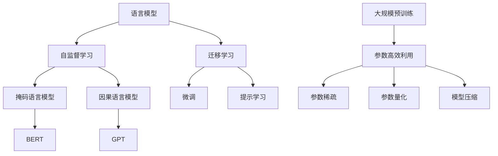

# 大规模语言模型从理论到实践：模型训练

## 1. 背景介绍

### 1.1 问题的由来

在过去的几年里,自然语言处理(NLP)领域取得了长足的进步,很大程度上归功于大规模语言模型的出现和发展。这些模型通过在大量文本数据上进行预训练,学习了丰富的语言知识,为下游任务提供了强大的语义表示能力。然而,训练这些大规模模型面临着巨大的计算和存储挑战。

### 1.2 研究现状  

目前,主流的大规模语言模型包括GPT(Generative Pre-trained Transformer)、BERT(Bidirectional Encoder Representations from Transformers)、XLNet、RoBERTa等。这些模型通常包含数十亿甚至上百亿个参数,需要消耗大量的计算资源进行训练。例如,GPT-3拥有1750亿个参数,其训练过程耗费了约3500万美元的计算成本。

### 1.3 研究意义

大规模语言模型的训练对于提高模型性能至关重要。通过有效的训练方法,可以充分挖掘模型的潜力,提高其在各种下游任务中的表现。此外,优化训练过程也有助于降低计算和存储开销,使得训练大规模模型变得更加可行和经济。

### 1.4 本文结构

本文将从理论和实践两个角度探讨大规模语言模型的训练。首先介绍相关的核心概念和算法原理,然后详细讲解数学模型和公式推导,并通过代码实例展示具体的实现细节。最后,我们将讨论实际应用场景、未来发展趋势和面临的挑战。

## 2. 核心概念与联系

大规模语言模型的训练主要涉及以下几个核心概念:

1. **语言模型(Language Model)**: 语言模型旨在学习自然语言的概率分布,即给定一段文本,计算其出现的概率。这是自然语言处理的基础问题之一。

2. **自监督学习(Self-Supervised Learning)**: 由于标注大规模语料库的成本很高,因此大规模语言模型通常采用自监督学习的方式进行预训练。常见的自监督学习任务包括掩码语言模型(Masked Language Model)和因果语言模型(Causal Language Model)。

3. **迁移学习(Transfer Learning)**: 预训练的语言模型通过在大量无标注数据上学习通用的语言知识,可以为下游任务提供良好的初始化参数和语义表示,从而实现知识迁移。常见的迁移学习方法包括微调(Fine-tuning)和提示学习(Prompt Learning)。

4. **参数高效利用(Parameter Efficient Utilization)**: 由于大规模语言模型包含巨量参数,因此如何高效利用这些参数是一个重要问题。常见的方法包括参数稀疏(Parameter Sparsity)、参数量化(Parameter Quantization)和模型压缩(Model Compression)等。

这些核心概念相互关联,共同构建了大规模语言模型训练的理论基础和实践方法。

## 3. 核心算法原理 & 具体操作步骤

### 3.1 算法原理概述

大规模语言模型的训练通常采用自监督学习的方式,利用大量无标注文本数据进行预训练。常见的自监督学习任务包括掩码语言模型(Masked Language Model, MLM)和因果语言模型(Causal Language Model, CLM)。

**掩码语言模型(MLM)**是BERT等双向编码器模型采用的预训练任务。它的基本思想是在输入序列中随机掩码一些词元(token),然后让模型根据上下文预测这些被掩码的词元。通过这种方式,模型可以学习到双向的语境信息。

**因果语言模型(CLM)**是GPT等自回归(Auto-Regressive)模型采用的预训练任务。它的目标是根据前面的上下文预测下一个词元,从而学习到单向的语言模型。

除了上述两种主要的自监督学习任务,还有一些其他的预训练任务,如下一句预测(Next Sentence Prediction, NSP)、句子排序(Sentence Order Prediction, SOP)等。

在预训练完成后,可以通过微调(Fine-tuning)或提示学习(Prompt Learning)等迁移学习方法,将预训练模型应用于下游任务。

### 3.2 算法步骤详解

以掩码语言模型(MLM)为例,其训练过程可以分为以下几个步骤:

1. **数据预处理**: 将原始文本数据转换为模型可以接受的格式,包括分词(Tokenization)、构建输入序列等。

2. **掩码词元**: 在输入序列中随机选择一些词元,并将它们替换为特殊的掩码标记(如[MASK])。通常会保留一小部分原始词元,以提供更多的上下文信息。

3. **前向传播**: 将掩码后的输入序列输入到预训练模型中,计算被掩码词元的预测概率分布。

4. **计算损失**: 将预测概率分布与原始词元的one-hot编码进行比较,计算交叉熵损失(Cross-Entropy Loss)。

5. **反向传播**: 根据损失值,利用优化算法(如Adam)计算模型参数的梯度,并更新模型参数。

6. **迭代训练**: 重复上述步骤,对大量样本进行训练,直到模型收敛或达到预设的训练轮次。

在实际操作中,还需要考虑一些细节,如梯度裁剪(Gradient Clipping)、学习率调度(Learning Rate Scheduling)、数据并行(Data Parallelism)、模型并行(Model Parallelism)等,以提高训练效率和模型性能。

### 3.3 算法优缺点

**优点**:

- 自监督学习方式可以利用大量无标注数据进行预训练,学习到丰富的语言知识。
- 预训练模型可以为下游任务提供良好的初始化参数和语义表示,提高了迁移学习的效果。
- 掩码语言模型和因果语言模型分别学习了双向和单向的语言模型,可以满足不同场景的需求。

**缺点**:

- 训练大规模语言模型需要消耗大量的计算和存储资源,成本很高。
- 预训练过程中存在一些不确定性,如掩码策略、优化算法等,需要进行大量的实验调优。
- 预训练模型可能会存在一些偏差和不确定性,需要在下游任务上进行进一步的微调或提示学习。

### 3.4 算法应用领域

大规模语言模型及其训练算法可以应用于自然语言处理的多个领域,包括但不限于:

- **文本生成**: 利用因果语言模型生成连贯、流畅的文本内容,如新闻、小说、诗歌等。
- **机器翻译**: 将预训练模型微调为翻译模型,实现高质量的机器翻译。
- **问答系统**: 利用预训练模型的语义理解能力,构建高性能的问答系统。
- **文本摘要**: 基于预训练模型生成高质量的文本摘要。
- **情感分析**: 将预训练模型微调为情感分析模型,实现对文本情感的精准识别。
- **关系抽取**: 利用预训练模型的语义表示能力,提高关系抽取的性能。

总的来说,大规模语言模型及其训练算法为自然语言处理领域带来了革命性的进步,极大地提高了各种任务的性能表现。

## 4. 数学模型和公式 & 详细讲解 & 举例说明

### 4.1 数学模型构建

在介绍具体的数学模型和公式之前,我们先来构建一个基本的语言模型。

给定一个长度为 $T$ 的文本序列 $X = (x_1, x_2, \dots, x_T)$,其中 $x_t$ 表示第 $t$ 个词元(token)。语言模型的目标是计算该序列出现的概率 $P(X)$。根据链式法则,我们可以将 $P(X)$ 分解为:

$$
P(X) = P(x_1, x_2, \dots, x_T) = \prod_{t=1}^T P(x_t | x_1, \dots, x_{t-1})
$$

其中 $P(x_t | x_1, \dots, x_{t-1})$ 表示在给定前 $t-1$ 个词元的情况下,第 $t$ 个词元出现的条件概率。

为了计算上述条件概率,我们可以引入一个模型 $f_\theta$,其中 $\theta$ 表示模型参数。该模型的输入是前 $t-1$ 个词元,输出是第 $t$ 个词元的概率分布:

$$
P(x_t | x_1, \dots, x_{t-1}) = f_\theta(x_1, \dots, x_{t-1})
$$

在训练过程中,我们需要最大化语料库中所有序列的联合概率,即最小化负对数似然(Negative Log-Likelihood):

$$
\mathcal{L}(\theta) = -\sum_{X \in \mathcal{D}} \log P(X) = -\sum_{X \in \mathcal{D}} \sum_{t=1}^T \log P(x_t | x_1, \dots, x_{t-1})
$$

其中 $\mathcal{D}$ 表示训练语料库。

通过梯度下降等优化算法,我们可以迭代地更新模型参数 $\theta$,使得负对数似然 $\mathcal{L}(\theta)$ 最小化,从而得到一个能够很好地拟合训练数据的语言模型。

### 4.2 公式推导过程

在上一节中,我们构建了一个基本的语言模型,并给出了负对数似然的公式。现在,我们来推导一下交叉熵损失(Cross-Entropy Loss)与负对数似然之间的关系。

对于一个长度为 $T$ 的序列 $X = (x_1, x_2, \dots, x_T)$,其负对数似然可以表示为:

$$
\begin{aligned}
\mathcal{L}(\theta) &= -\sum_{t=1}^T \log P(x_t | x_1, \dots, x_{t-1}) \\
&= -\sum_{t=1}^T \log f_\theta(x_1, \dots, x_{t-1})_{x_t}
\end{aligned}
$$

其中 $f_\theta(x_1, \dots, x_{t-1})_{x_t}$ 表示模型预测的第 $t$ 个词元为 $x_t$ 的概率。

我们可以将上式重写为:

$$
\mathcal{L}(\theta) = -\sum_{t=1}^T \sum_{x \in \mathcal{V}} \mathbb{1}_{x_t=x} \log f_\theta(x_1, \dots, x_{t-1})_x
$$

其中 $\mathcal{V}$ 表示词表(Vocabulary),即所有可能的词元集合。$\mathbb{1}_{x_t=x}$ 是指示函数,当 $x_t=x$ 时取值为 1,否则为 0。

进一步地,我们可以将上式表示为:

$$
\mathcal{L}(\theta) = -\sum_{t=1}^T \sum_{x \in \mathcal{V}} y_x^{(t)} \log f_\theta(x_1, \dots, x_{t-1})_x
$$

其中 $y_x^{(t)}$ 是一个one-hot编码向量,表示第 $t$ 个词元是否为 $x$。

这个公式就是交叉熵损失的表达式,其中 $y_x^{(t)}$ 是真实标签的one-hot编码,而 $f_\theta(x_1, \dots, x_{t-1})_x$ 是模型预测的概率分布。

通过最小化交叉熵损失,我们实际上是在最小化负对数似然,从而得到一个能够很好地拟合训练数据的语言模型。

### 4.3 案例分析与讲解

为了更好地理解上述数学模型和公式,我们来看一个具体的案例。

假设我们有一个简单的语料库,包含以下两个句子:

1. "The cat sat