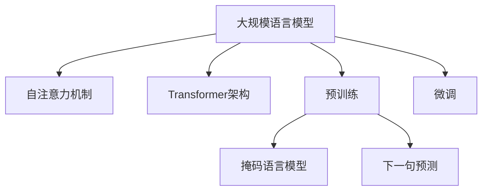

# 大规模语言模型从理论到实践 由少至多提示

## 1. 背景介绍

### 1.1 问题的由来

在过去的几年中,自然语言处理(NLP)领域取得了长足的进步,这主要归功于大规模语言模型(Large Language Models, LLMs)的兴起。LLMs是一种基于深度学习的技术,能够从海量文本数据中学习语言的内在规律和知识,并用于各种自然语言处理任务,如机器翻译、文本生成、问答系统等。

然而,训练一个高质量的大规模语言模型并非易事。它需要消耗大量的计算资源,并且需要处理海量的文本数据。此外,如何有效地利用这些语言模型,并将其应用于实际场景也是一个值得探讨的问题。

### 1.2 研究现状

目前,一些科技巨头和研究机构已经开发出了一系列大规模语言模型,如OpenAI的GPT-3、谷歌的LaMDA、DeepMind的Chinchilla等。这些模型在各种自然语言处理任务上表现出色,展现出了令人惊叹的语言理解和生成能力。

然而,这些模型也存在一些缺陷和挑战,如对于一些特定领域的知识掌握不足、存在偏见和不当内容、缺乏可解释性等。因此,如何进一步提高模型的性能、可靠性和可解释性,成为了当前研究的重点。

### 1.3 研究意义

大规模语言模型的研究和应用具有重要的理论和实践意义。在理论层面上,它能够推动自然语言处理技术的发展,帮助我们更好地理解和模拟人类语言的本质。在实践层面上,它可以为各种语言相关的应用提供强大的支持,如智能助手、内容创作、知识图谱构建等,从而带来巨大的经济和社会价值。

### 1.4 本文结构

本文将从理论和实践两个角度,全面介绍大规模语言模型的最新进展。首先,我们将探讨大规模语言模型的核心概念和原理,包括自注意力机制、transformer架构、预训练和微调等。然后,我们将详细阐述模型训练的核心算法,如掩码语言模型和下一句预测等。接下来,我们将介绍模型的数学表示和优化方法。在实践部分,我们将分享一个基于Python和Hugging Face库的代码示例,并讨论模型在各种应用场景中的实践经验。最后,我们将总结模型的发展趋势和面临的挑战,并提供相关的学习资源和工具推荐。

## 2. 核心概念与联系

大规模语言模型是一种基于深度学习的自然语言处理技术,它能够从海量文本数据中学习语言的内在规律和知识表示。其核心概念包括:

1. **自注意力机制(Self-Attention Mechanism)**: 这是transformer模型的核心,它允许模型在计算每个单词的表示时,同时考虑其他单词的信息,捕捉长距离依赖关系。

2. **Transformer架构**: 这是一种全新的序列到序列(Seq2Seq)模型架构,它完全基于注意力机制,避免了传统RNN模型的一些缺陷。

3. **预训练(Pre-training)**: 通过在大规模无标注语料库上进行预训练,模型可以学习到通用的语言知识表示,为下游任务提供良好的初始化。

4. **微调(Fine-tuning)**: 在预训练的基础上,通过在特定任务的标注数据上进行微调,可以使模型适应特定的应用场景。

5. **掩码语言模型(Masked Language Modeling)**: 这是预训练的一种常用方法,通过随机掩码部分输入词元,并预测被掩码的词元,来学习语言的双向上下文信息。

6. **下一句预测(Next Sentence Prediction)**: 另一种预训练方法,通过预测两个句子是否相邻,来学习捕捉句子之间的关系和语义连贯性。

这些核心概念相互关联、环环相扣,共同构建了大规模语言模型的理论基础和技术框架。自注意力机制和transformer架构为模型提供了强大的表示能力;预训练和微调则使模型能够从大规模数据中学习知识,并适应特定任务;掩码语言模型和下一句预测等技术则是实现预训练的关键手段。

## 3. 核心算法原理 & 具体操作步骤

### 3.1 算法原理概述

大规模语言模型的核心算法主要包括两个部分:预训练算法和微调算法。

**预训练算法**的目标是在大规模无标注语料库上,学习到通用的语言知识表示。常用的预训练算法包括:

1. **掩码语言模型(Masked Language Modeling, MLM)**: 随机掩码部分输入词元,并预测被掩码的词元。这种方式可以学习到双向的上下文信息。

2. **下一句预测(Next Sentence Prediction, NSP)**: 预测两个句子是否相邻,从而学习捕捉句子之间的关系和语义连贯性。

通过预训练,模型可以在大规模语料库上学习到通用的语言知识表示,为后续的微调任务提供良好的初始化。

**微调算法**的目标是在特定任务的标注数据上,对预训练模型进行进一步的调整和优化,使其适应特定的应用场景。常用的微调方法包括:

1. **监督微调**: 在标注数据上进行监督式微调,根据任务目标计算损失函数,并使用梯度下降等优化算法更新模型参数。

2. **半监督微调**: 结合少量标注数据和大量无标注数据进行微调,可以提高模型的泛化能力。

3. **多任务微调**: 在多个相关任务的标注数据上同时进行微调,可以提高模型的鲁棒性和泛化能力。

通过微调,模型可以针对特定任务进行专门的优化和调整,从而提高在该任务上的性能表现。

### 3.2 算法步骤详解

#### 3.2.1 预训练算法

以掩码语言模型(MLM)为例,其具体步骤如下:

1. **数据预处理**: 将原始文本数据进行标记化、分词、构建词表等预处理操作。

2. **掩码策略**: 对输入序列中的部分词元进行随机掩码,通常采用以下策略:
   - 80%的词元保持不变
   - 10%的词元被替换为特殊的[MASK]标记
   - 10%的词元被随机替换为其他词元

3. **前向计算**: 将掩码后的输入序列输入到transformer模型中,计算每个掩码位置的输出向量表示。

4. **预测和损失计算**: 对于每个掩码位置,使用输出向量表示和词表进行分类,预测被掩码的词元。计算预测值与真实值之间的交叉熵损失。

5. **反向传播和优化**: 使用梯度下降等优化算法,根据损失函数的梯度更新模型参数。

6. **迭代训练**: 重复上述步骤,对大规模语料库进行多次迭代训练,直到模型收敛或达到预期性能。

对于下一句预测(NSP)任务,其步骤类似,主要区别在于需要将两个句子作为输入,并预测它们是否相邻。

#### 3.2.2 微调算法

以监督微调为例,其具体步骤如下:

1. **数据准备**: 根据任务目标,准备相应的标注数据集,包括输入序列和对应的标签。

2. **数据预处理**: 对输入序列进行标记化、分词等预处理操作。对标签进行编码,如文本分类任务中将标签one-hot编码。

3. **模型初始化**: 加载预训练好的语言模型参数作为初始化参数。

4. **前向计算**: 将输入序列输入到模型中,计算输出向量表示。

5. **预测和损失计算**: 根据任务目标,使用输出向量表示进行预测,如分类、回归等。计算预测值与真实标签之间的损失函数,如交叉熵损失、均方误差等。

6. **反向传播和优化**: 使用梯度下降等优化算法,根据损失函数的梯度更新模型参数。

7. **迭代训练**: 重复上述步骤,对标注数据集进行多次迭代训练,直到模型收敛或达到预期性能。

8. **模型评估**: 在保留的测试集上评估模型的性能指标,如准确率、F1分数等。

对于半监督微调和多任务微调,其步骤也类似,主要区别在于数据集的构建和损失函数的计算方式。

### 3.3 算法优缺点

大规模语言模型的算法具有以下优缺点:

**优点**:

1. **强大的语言理解和生成能力**: 通过在大规模语料库上预训练,模型可以学习到丰富的语言知识,展现出令人惊叹的语言理解和生成能力。

2. **通用性和迁移学习能力**: 预训练模型可以作为通用的语言知识库,通过微调可以快速适应各种下游任务,体现出强大的迁移学习能力。

3. **数据高效利用**: 通过预训练和微调的范式,可以有效利用大规模无标注数据和少量标注数据,提高数据利用效率。

4. **可解释性**: 自注意力机制和transformer架构赋予了模型一定的可解释性,有助于理解模型的内部工作机制。

**缺点**:

1. **计算资源消耗大**: 训练大规模语言模型需要消耗大量的计算资源,包括GPU、TPU等加速硬件,以及海量的训练数据。

2. **存在偏见和不当内容**: 由于训练数据的局限性,模型可能会学习到一些不当的内容或存在某些偏见。

3. **缺乏常识推理能力**: 尽管模型展现出了强大的语言能力,但它们在常识推理和因果推理方面的能力仍然有限。

4. **安全性和隐私问题**: 大规模语言模型可能会生成一些不当或有害的内容,存在潜在的安全和隐私风险。

5. **可解释性有限**: 虽然自注意力机制提供了一定的可解释性,但对于大规模模型的内部工作机制,我们的理解仍然有限。

### 3.4 算法应用领域

大规模语言模型及其相关算法可以应用于自然语言处理的各个领域,包括但不限于:

1. **机器翻译**: 利用语言模型的强大语言生成能力,可以实现高质量的机器翻译系统。

2. **文本生成**: 包括新闻报道自动写作、小说创作、广告文案生成等,语言模型可以生成流畅、富有创意的文本内容。

3. **对话系统**: 语言模型可以作为对话代理,与人进行自然的对话交互,广泛应用于智能助手、客服等场景。

4. **问答系统**: 利用语言模型的语言理解能力,可以构建高质量的问答系统,回答各种复杂的自然语言问题。

5. **文本摘要**: 语言模型可以对长文本进行理解和概括,生成高质量的文本摘要。

6. **情感分析**: 通过对文本的情感倾向进行分析,语言模型可以应用于情感计算、舆情监测等领域。

7. **实体识别和关系抽取**: 语言模型可以用于识别文本中的实体和抽取实体之间的关系,为知识图谱构建等任务提供支持。

8. **文本分类和主题建模**: 语言模型可以对文本进行分类和主题建模,广泛应用于信息检索、推荐系统等领域。

总的来说,大规模语言模型及其相关算法为自然语言处理领域带来了革命性的进步,它们的应用前景广阔,正在推动着人工智能技术在各个领域的落地和发展。

## 4. 数学模型和公式 & 详细讲解 & 举例说明