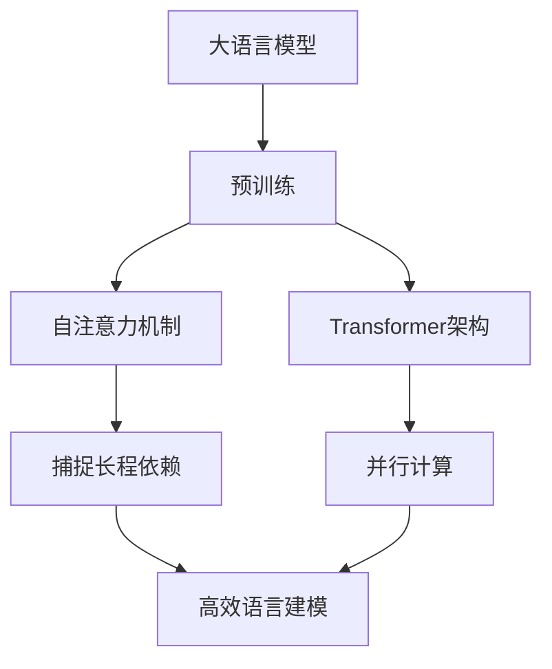

以下是关于"大语言模型 原理与代码实例讲解"的技术博客文章正文内容：

# 大语言模型 原理与代码实例讲解

## 1. 背景介绍

### 1.1 问题的由来

在过去的几年里，自然语言处理(NLP)领域取得了长足的进步,很大程度上要归功于大型神经网络模型(通常称为大语言模型)的出现。这些模型通过在大规模语料库上进行预训练,学习了丰富的语言知识,展现出令人惊叹的性能表现。

然而,尽管取得了巨大成功,但大语言模型的内部机理仍然是一个黑箱,我们对它们如何工作的理解仍然非常有限。这不仅阻碍了我们进一步提高这些模型的性能,也给它们的可解释性、公平性和安全性等方面带来了挑战。

### 1.2 研究现状  

目前,研究人员正在从多个角度努力揭开大语言模型的神秘面纱。一些研究着眼于可解释性,试图理解这些模型内部是如何表示和处理语言信息的。另一些研究则关注模型的缺陷和偏差,旨在提高它们的健壮性和公平性。

与此同时,工程师们一直在努力优化这些模型的效率,使它们能够在有限的计算资源下高效运行。此外,新的模型架构和训练技术不断被提出,以期能进一步提升大语言模型的性能表现。

### 1.3 研究意义

深入理解大语言模型的原理对于充分发挥它们的潜力至关重要。只有透彻理解了这些模型的内在机制,我们才能更好地解释和控制它们的行为,从而提高它们的可靠性、公平性和安全性。

此外,对大语言模型的深入研究也有助于推动自然语言处理领域的进一步发展。通过揭示这些模型的优缺点,我们可以设计出更先进、更高效的模型架构,从而推动整个领域向前迈进。

### 1.4 本文结构

本文将从多个角度深入探讨大语言模型的原理和实践。我们将首先介绍大语言模型的核心概念和算法原理,包括自注意力机制、transformer架构等。接下来,我们将详细讲解这些模型的数学基础,包括嵌入表示、注意力计算等。

在理论部分之后,我们将转向实践,提供大语言模型的代码实现示例,并对关键部分进行详细解释。最后,我们将探讨大语言模型在实际应用中的使用场景,并介绍一些有用的工具和资源。

## 2. 核心概念与联系

大语言模型是一种基于深度学习的自然语言处理模型,旨在从大量文本数据中学习语言的统计规律和语义信息。它们通常采用transformer等注意力机制,能够有效捕捉文本序列中的长程依赖关系。

大语言模型的核心思想是通过在大规模语料库上进行无监督预训练,使模型学习到丰富的语言知识和上下文信息。在预训练阶段,模型会尝试预测被遮蔽的单词或句子,从而学习到单词之间的关联性和语义信息。

预训练过程中使用的自注意力机制和transformer架构是大语言模型的关键创新。自注意力机制允许模型在计算单词表示时,直接关注与当前单词相关的上下文信息,从而有效捕捉长程依赖关系。而transformer架构则通过并行计算和残差连接,大大提高了模型的计算效率和表达能力。

经过预训练后,大语言模型可以在下游任务上进行微调,快速适应特定的应用场景,展现出强大的性能表现。这种预训练+微调的范式已成为自然语言处理领域的主流做法。

## 3. 核心算法原理 & 具体操作步骤  

### 3.1 算法原理概述

大语言模型的核心算法原理可以概括为以下几个关键点:

1. **词嵌入表示**: 将每个单词映射为一个固定长度的向量表示,作为模型的输入。这些向量被训练得能够捕捉单词的语义和句法信息。

2. **自注意力机制**: 通过计算查询向量与键向量之间的相关性分数,模型可以选择性地关注与当前单词相关的上下文信息,从而捕捉长程依赖关系。

3. **多头注意力**: 通过并行计算多个注意力头,模型可以从不同的表示子空间捕捉不同类型的依赖关系,提高了表达能力。

4. **位置编码**: 由于transformer模型没有递归或卷积结构,因此需要通过添加位置编码来注入序列的位置信息。

5. **层归一化和残差连接**: 这些技术有助于加速训练收敛,并缓解了深度网络的梯度消失问题。

6. **掩码语言模型(MLM)**: 在预训练阶段,模型会随机遮蔽部分输入单词,并尝试预测这些被遮蔽的单词,从而学习到单词之间的关联性和语义信息。

### 3.2 算法步骤详解

以下是大语言模型算法的具体操作步骤:

1. **输入表示**: 将输入文本序列转换为一系列词嵌入向量,并添加位置编码。

2. **多头注意力计算**:
   a) 将查询向量(Q)、键向量(K)和值向量(V)进行线性投影,得到投影后的向量。
   b) 计算查询向量与所有键向量的点积,得到注意力分数。
   c) 对注意力分数进行软最大值操作,得到注意力权重。
   d) 将注意力权重与值向量相乘,得到加权和表示。
   e) 对多个注意力头的结果进行拼接,得到多头注意力的输出。

3. **前馈网络**: 将多头注意力的输出通过两个全连接层进行非线性变换,得到该层的输出表示。

4. **残差连接和层归一化**: 将前馈网络的输出与输入相加,并进行层归一化,得到该层的最终输出。

5. **重复上述步骤**: 重复执行2-4步骤,对输入序列进行多层编码。

6. **输出层**: 对最终编码后的序列进行线性投影和softmax操作,得到每个位置的单词预测概率分布。

7. **掩码语言模型损失计算**: 将预测的单词概率分布与真实单词的标签进行交叉熵损失计算,并对所有被遮蔽位置的损失求和,作为最终的损失函数。

8. **模型训练**: 使用梯度下降等优化算法,最小化损失函数,不断调整模型参数。

### 3.3 算法优缺点

**优点**:

- 自注意力机制能够有效捕捉长程依赖关系,克服了RNN等序列模型的局限性。
- transformer架构支持并行计算,大大提高了模型的计算效率。
- 预训练+微调范式使模型能够在大规模语料库上学习通用的语言知识,并快速适应下游任务。
- 多头注意力和残差连接等技术提高了模型的表达能力和优化效率。

**缺点**:

- 计算复杂度较高,需要大量的计算资源和训练数据。
- 缺乏内在的顺序偏置,需要显式地注入位置信息。
- 存在一定的不确定性和缺乏可解释性的问题。
- 可能会受到数据集中存在的偏差和噪声的影响。

### 3.4 算法应用领域

大语言模型在自然语言处理的多个领域都有广泛的应用,包括但不限于:

- **机器翻译**: 通过预训练+微调的方式,大语言模型可以学习到丰富的语言知识,从而提高机器翻译的质量和准确性。

- **文本生成**: 大语言模型可以用于生成自然、流畅的文本,如新闻报道、故事创作、对话系统等。

- **文本分类和情感分析**: 通过微调,大语言模型可以快速适应文本分类、情感分析等下游任务,展现出优异的性能表现。

- **问答系统**: 大语言模型能够从大量文本数据中学习到丰富的知识,因此非常适合用于构建智能问答系统。

- **信息抽取**: 大语言模型可以用于从非结构化文本中抽取关键信息,如命名实体识别、关系抽取等。

## 4. 数学模型和公式 & 详细讲解 & 举例说明

### 4.1 数学模型构建

大语言模型的数学模型主要基于transformer架构和自注意力机制。我们将从词嵌入表示和位置编码开始,逐步构建整个模型的数学形式。

**词嵌入表示**:

对于一个长度为 $n$ 的输入序列 $X = (x_1, x_2, \dots, x_n)$,我们首先将每个单词 $x_i$ 映射为一个 $d$ 维的词嵌入向量 $\boldsymbol{e}_i \in \mathbb{R}^d$。这些词嵌入向量被存储在一个嵌入矩阵 $\boldsymbol{E} \in \mathbb{R}^{V \times d}$ 中,其中 $V$ 是词表的大小。

**位置编码**:

由于transformer模型没有递归或卷积结构,因此需要显式地注入序列的位置信息。我们使用一个位置编码函数 $\text{PE}(pos, d)$ 来为每个位置生成一个 $d$ 维的位置编码向量。这些位置编码向量与词嵌入向量相加,形成最终的输入表示:

$$\boldsymbol{x}_i = \boldsymbol{e}_i + \text{PE}(i, d)$$

其中 $\boldsymbol{x}_i \in \mathbb{R}^d$ 是第 $i$ 个位置的输入表示向量。

**自注意力机制**:

自注意力机制的核心是计算查询向量与所有键向量之间的相关性分数,并根据这些分数对值向量进行加权求和。具体来说,对于一个序列 $X$,我们将其线性投影到查询矩阵 $\boldsymbol{Q}$、键矩阵 $\boldsymbol{K}$ 和值矩阵 $\boldsymbol{V}$ 中:

$$\boldsymbol{Q} = \boldsymbol{X} \boldsymbol{W}^Q, \quad \boldsymbol{K} = \boldsymbol{X} \boldsymbol{W}^K, \quad \boldsymbol{V} = \boldsymbol{X} \boldsymbol{W}^V$$

其中 $\boldsymbol{W}^Q \in \mathbb{R}^{d \times d_k}$、$\boldsymbol{W}^K \in \mathbb{R}^{d \times d_k}$ 和 $\boldsymbol{W}^V \in \mathbb{R}^{d \times d_v}$ 是可学习的投影矩阵。

接下来,我们计算查询向量与所有键向量之间的点积,得到注意力分数矩阵 $\boldsymbol{S}$:

$$\boldsymbol{S} = \text{softmax}\left(\frac{\boldsymbol{Q} \boldsymbol{K}^\top}{\sqrt{d_k}}\right)$$

其中 $\sqrt{d_k}$ 是一个缩放因子,用于防止点积值过大导致梯度消失或爆炸。

最后,我们将注意力分数矩阵与值矩阵相乘,得到自注意力的输出表示:

$$\text{Attention}(\boldsymbol{Q}, \boldsymbol{K}, \boldsymbol{V}) = \boldsymbol{S} \boldsymbol{V}$$

**多头注意力**:

为了捕捉不同类型的依赖关系,transformer模型使用了多头注意力机制。具体来说,我们将查询矩阵 $\boldsymbol{Q}$、键矩阵 $\boldsymbol{K}$ 和值矩阵 $\boldsymbol{V}$ 分别投影到 $h$ 个注意力头上,对每个注意力头