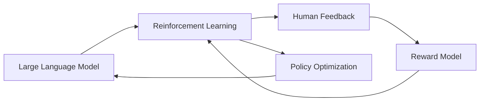

# 大语言模型原理与工程实践：RLHF 实战框架

关键词：大语言模型、RLHF、强化学习、人类反馈、对话系统、自然语言处理

## 1. 背景介绍
### 1.1  问题的由来
随着人工智能技术的快速发展,大语言模型(Large Language Model, LLM)在自然语言处理领域取得了突破性进展。LLM 能够生成流畅、连贯且富有语义的文本,在对话、问答、文本生成等任务中展现出惊人的能力。然而,LLM 仍然存在一些局限性,例如生成的文本可能偏离主题、逻辑不一致、缺乏事实依据等。为了进一步提升 LLM 的性能,研究者们提出了基于人类反馈的强化学习(Reinforcement Learning from Human Feedback, RLHF)方法。

### 1.2  研究现状
目前,RLHF 已经成为改进 LLM 的重要手段之一。OpenAI、DeepMind、Anthropic 等知名机构都在积极探索 RLHF 技术。例如,OpenAI 的 InstructGPT 模型通过 RLHF 训练,生成的文本更加符合人类意图和偏好。DeepMind 提出的 Sparrow 模型引入了基于反事实的人类反馈,提高了模型的可控性和安全性。Anthropic 开发的 Constitutional AI 框架利用 RLHF 对模型行为进行约束,使其符合人类价值观和伦理规范。

### 1.3  研究意义 
RLHF 的研究对于提升 LLM 的性能和应用价值具有重要意义。首先,RLHF 可以有效改善 LLM 生成文本的质量,使其更加符合人类期望。其次,RLHF 有助于提高 LLM 的可控性和安全性,避免生成有害、虚假或偏见的内容。此外,RLHF 的研究也为探索人机协作、价值对齐等前沿课题提供了新的视角和思路。因此,深入研究 RLHF 技术对于推动 LLM 的发展和应用具有重要意义。

### 1.4  本文结构
本文将全面介绍 RLHF 的原理与工程实践。第二部分阐述 RLHF 的核心概念及其与 LLM 的关系。第三部分详细讲解 RLHF 的算法原理和具体操作步骤。第四部分介绍 RLHF 的数学模型和公式推导过程,并给出案例分析。第五部分展示 RLHF 的代码实现和项目实践。第六部分探讨 RLHF 的实际应用场景和未来展望。第七部分推荐 RLHF 相关的学习资源和开发工具。最后,第八部分总结 RLHF 的研究成果、发展趋势和面临的挑战。

## 2. 核心概念与联系
RLHF 是一种将强化学习与人类反馈相结合的方法,用于优化 LLM 的行为。其核心思想是通过人类对模型生成文本的评价反馈,引导模型学习符合人类偏好的策略。具体而言,RLHF 包含以下关键概念:

- 大语言模型(LLM):指基于海量文本数据预训练得到的语言模型,如 GPT、BERT、T5 等。LLM 具有强大的语言理解和生成能力,是 RLHF 的基础。

- 强化学习(RL):一种机器学习范式,通过智能体与环境的交互,学习最优策略以获得最大累积奖励。在 RLHF 中,LLM 扮演智能体的角色,人类反馈作为奖励信号。

- 人类反馈(HF):人类对 LLM 生成文本的主观评价,可以是对话质量、安全性、伦理性等方面的评分或排序。HF 为 RL 提供了学习目标和优化方向。

- 奖励模型(RM):将人类反馈转化为数值化的奖励函数,用于指导 RL 的策略学习。RM 可以基于分类、排序等方式构建,并通过机器学习不断优化。

- 策略优化:根据 RM 提供的奖励信号,通过 RL 算法(如 PPO、A2C)对 LLM 的策略进行优化,使其生成的文本能够获得更高的人类评价。

下图展示了 RLHF 的整体架构和各组件之间的关系:

RLHF 的关键在于建立 LLM、RL、HF 之间的有效联系和反馈循环。LLM 为 RL 提供了强大的语言生成能力,RL 通过 HF 学习人类偏好,并优化 LLM 的策略。优化后的 LLM 能够生成更加符合人类期望的文本,进而提升下一轮 HF 的质量。通过多轮迭代,RLHF 不断改进 LLM 的性能,实现人机协同的语言交互。

## 3. 核心算法原理 & 具体操作步骤
### 3.1  算法原理概述
RLHF 的核心算法基于强化学习,具体采用 PPO(Proximal Policy Optimization)算法进行策略优化。PPO 是一种基于 Actor-Critic 框架的 RL 算法,通过约束策略更新幅度,在提高样本效率的同时保证训练的稳定性。在 RLHF 中,LLM 作为 Actor 生成文本,RM 作为 Critic 评估文本质量并提供奖励。

### 3.2  算法步骤详解
RLHF 的具体操作步骤如下:

1. 预训练 LLM:在大规模文本数据上预训练 LLM,学习语言的基本特征和生成能力。

2. 收集人类反馈数据:构建人类反馈数据集,包括不同质量水平的文本样本及其对应的人类评分或排序。

3. 训练奖励模型:基于人类反馈数据,训练监督学习模型(如 RankNet、T5)作为 RM,将文本映射为数值化的奖励。

4. 初始化 Actor 和 Critic:将预训练的 LLM 作为 Actor,将训练好的 RM 作为 Critic,构建 PPO 算法的基本组件。

5. 策略优化:
   - Actor 生成一批文本样本
   - Critic 对样本进行评分,计算奖励
   - 根据奖励计算 PPO 损失函数,包括策略损失和值函数损失
   - 通过梯度反向传播,更新 Actor 和 Critic 的参数,优化策略

6. 迭代训练:重复步骤 5,不断优化 LLM 的策略,直到满足停止条件(如达到预设的奖励阈值、迭代轮数等)。

7. 评估与部署:在测试集上评估优化后的 LLM 性能,选择最优模型进行部署和应用。

### 3.3  算法优缺点
RLHF 算法的优点包括:
- 通过人类反馈引导模型学习,使生成文本更加符合人类偏好
- 采用 PPO 算法进行策略优化,提高了训练效率和稳定性
- 奖励模型可以建模复杂的人类偏好,为策略学习提供细粒度的指导

RLHF 算法的缺点包括:
- 需要大量高质量的人类反馈数据,数据收集成本较高
- 奖励模型的训练需要较多的计算资源和时间
- 算法对超参数较为敏感,调参需要一定的经验和技巧

### 3.4  算法应用领域
RLHF 算法可以广泛应用于各种需要人机交互的自然语言处理任务,例如:
- 对话系统:通过 RLHF 优化对话策略,生成更加自然、贴切的回复
- 问答系统:通过 RLHF 学习问答偏好,提供更加准确、完整的答案
- 文本生成:通过 RLHF 引导文本生成方向,输出符合特定风格、主题的文本
- 机器翻译:通过 RLHF 优化翻译策略,提高翻译的流畅度和忠实度

此外,RLHF 还可以与其他技术(如迁移学习、主动学习)结合,进一步提升模型性能和应用价值。

## 4. 数学模型和公式 & 详细讲解 & 举例说明
### 4.1  数学模型构建
RLHF 的数学模型可以用马尔可夫决策过程(Markov Decision Process, MDP)来描述。MDP 由状态空间 $\mathcal{S}$、动作空间 $\mathcal{A}$、转移概率 $\mathcal{P}$、奖励函数 $\mathcal{R}$ 和折扣因子 $\gamma$ 组成。在 RLHF 中,这些要素可以表示为:

- 状态 $s \in \mathcal{S}$:表示 LLM 生成文本的当前上下文,即已生成的词序列。

- 动作 $a \in \mathcal{A}$:表示 LLM 在当前状态下生成的下一个词。

- 转移概率 $\mathcal{P}(s'|s,a)$:表示在状态 $s$ 下采取动作 $a$ 后转移到状态 $s'$ 的概率。在 RLHF 中,转移概率由 LLM 的语言模型决定。

- 奖励函数 $\mathcal{R}(s,a)$:表示在状态 $s$ 下采取动作 $a$ 后获得的即时奖励。在 RLHF 中,奖励函数由 RM 根据人类反馈给出。

- 折扣因子 $\gamma \in [0,1]$:表示未来奖励的折扣程度,用于平衡即时奖励和长期回报。

基于 MDP 模型,RLHF 的目标是学习一个最优策略 $\pi^*$,使得在该策略下的期望累积奖励最大化:

$$\pi^* = \arg\max_\pi \mathbb{E}_{\tau \sim \pi} \left[ \sum_{t=0}^T \gamma^t \mathcal{R}(s_t,a_t) \right]$$

其中,$\tau$ 表示一个完整的对话轨迹 $(s_0,a_0,s_1,a_1,\dots,s_T,a_T)$,$T$ 表示对话的长度。

### 4.2  公式推导过程
为了求解最优策略 $\pi^*$,RLHF 采用 PPO 算法进行优化。PPO 的核心思想是通过约束策略更新幅度,在提高样本效率的同时保证训练的稳定性。具体而言,PPO 的目标函数可以表示为:

$$\mathcal{L}^{PPO}(\theta) = \mathbb{E}_t \left[ \min \left( r_t(\theta) \hat{A}_t, \text{clip}(r_t(\theta), 1-\epsilon, 1+\epsilon) \hat{A}_t \right) \right]$$

其中,$\theta$ 表示策略 $\pi_\theta$ 的参数,$r_t(\theta) = \frac{\pi_\theta(a_t|s_t)}{\pi_{\theta_{old}}(a_t|s_t)}$ 表示策略比率,$\hat{A}_t$ 表示优势函数的估计值,$\epsilon$ 表示约束因子。

优势函数 $\hat{A}_t$ 的计算公式为:

$$\hat{A}_t = \delta_t + (\gamma \lambda) \delta_{t+1} + \dots + (\gamma \lambda)^{T-t+1} \delta_{T-1}$$

其中,$\delta_t = r_t + \gamma V(s_{t+1}) - V(s_t)$ 表示时间差分(TD)误差,$V(s)$ 表示状态值函数。

根据目标函数和优势函数,PPO 的策略更新公式为:

$$\theta \leftarrow \theta + \alpha \nabla_\theta \mathcal{L}^{PPO}(\theta)$$

其中,$\alpha$ 表示学习率。通过多轮迭代优化,最终得到最优策略 $\pi^*$。

### 4.3  案例分析与讲解
下面以一个简单的对话场景为例,说明 RLHF 的工作流程。

假设我们要训练一个餐厅推