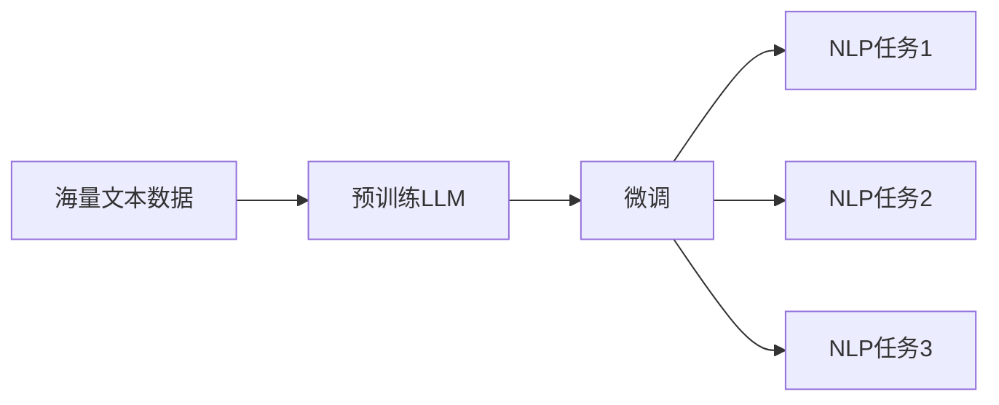

# 大语言模型原理与工程实践：大语言模型的微调方法

关键词：大语言模型、微调、预训练、迁移学习、自然语言处理、人工智能

## 1. 背景介绍

### 1.1  问题的由来

随着人工智能技术的快速发展，自然语言处理(NLP)领域取得了长足的进步。其中，大语言模型(Large Language Model, LLM)的出现，为NLP领域带来了革命性的变革。LLM通过在海量文本数据上进行预训练，能够学习到丰富的语言知识和通用语言表示，在下游NLP任务中表现出色。

然而，预训练的LLM虽然性能强大，但由于训练数据和目标任务的差异，直接应用于特定领域和任务时，效果往往不够理想。为了进一步提升LLM在特定任务上的表现，微调(Fine-tuning)技术应运而生。微调通过在目标任务的少量标注数据上对预训练LLM进行额外的训练，使其适应特定任务的需求，从而获得更好的性能。

### 1.2  研究现状

目前，大语言模型微调已经成为NLP领域的研究热点。许多研究者提出了各种微调方法，如标准微调、混合微调、多任务微调等，并在多个NLP任务上取得了显著的性能提升。例如，在自然语言推理、情感分析、问答系统等任务中，微调后的LLM相比从头训练的模型，在准确率和效率上都有明显优势。

### 1.3  研究意义

深入研究大语言模型的微调方法，对于推动NLP技术的发展和应用具有重要意义：

1. 提升模型性能：通过微调，可以充分利用预训练LLM学习到的语言知识，快速适应特定任务，获得更好的性能表现。

2. 降低训练成本：微调在目标任务的少量数据上进行训练，相比从头训练模型，大大减少了计算资源和时间成本。

3. 扩展应用场景：微调使得LLM能够灵活应用于各种NLP任务和领域，极大地拓宽了其应用范围。

4. 促进技术创新：微调方法的研究推动了迁移学习、少样本学习等技术的发展，为NLP领域带来了新的研究思路和方向。

### 1.4  本文结构

本文将全面探讨大语言模型微调的原理与实践。首先，介绍微调的核心概念和关键技术。然后，详细阐述微调算法的原理和具体操作步骤。接着，给出微调的数学模型和公式推导。再通过项目实践，展示微调的代码实现和效果分析。最后，总结微调技术的发展趋势与挑战，并提供相关工具和资源推荐。

## 2. 核心概念与联系

在探讨大语言模型微调之前，需要了解几个核心概念：

- 大语言模型(Large Language Model, LLM)：指在海量文本数据上预训练得到的语言模型，如BERT、GPT等，能够学习到丰富的语言知识和通用语言表示。

- 预训练(Pre-training)：指在大规模无监督数据上训练语言模型的过程，使其学习到通用的语言理解能力。

- 微调(Fine-tuning)：指在预训练LLM的基础上，使用目标任务的少量标注数据进行额外的训练，使模型适应特定任务需求的过程。

- 迁移学习(Transfer Learning)：指将在源任务上学习到的知识迁移到目标任务上，提高目标任务的学习效率和性能的机器学习范式。

- 自然语言处理(Natural Language Processing, NLP)：指利用计算机技术对自然语言进行分析、理解和生成的研究领域。

这些概念之间密切相关。大语言模型通过预训练学习通用语言知识，再通过微调适应特定NLP任务，体现了迁移学习的思想。微调使得预训练LLM能够灵活应用于各种NLP任务，极大地促进了NLP技术的发展。

下图展示了预训练、微调、NLP任务之间的关系：

## 3. 核心算法原理 & 具体操作步骤

### 3.1  算法原理概述

大语言模型微调的核心思想是在预训练LLM的基础上，利用目标任务的少量标注数据进行额外的训练，使模型适应特定任务的需求。微调过程通常包括以下步骤：

1. 加载预训练LLM的参数作为初始化。
2. 根据目标任务的特点，设计输入输出格式和损失函数。
3. 使用目标任务的标注数据，对LLM进行额外的训练，更新模型参数。
4. 在目标任务的验证集上评估微调后模型的性能，进行超参数调优。
5. 使用微调后的模型对目标任务的测试集进行预测。

### 3.2  算法步骤详解

下面详细介绍微调算法的具体操作步骤。

**步骤1：加载预训练LLM**

首先，需要加载预训练LLM的参数作为微调的初始化。常见的预训练LLM包括BERT、GPT、RoBERTa等。加载预训练参数可以显著提高微调的效率和性能，因为预训练LLM已经学习到了丰富的语言知识和通用语言表示。

**步骤2：设计输入输出格式和损失函数**

根据目标任务的特点，设计合适的输入输出格式和损失函数。输入格式通常包括将文本转换为模型可接受的向量表示，如token embedding、position embedding等。输出格式取决于任务类型，如分类任务输出类别概率，生成任务输出token序列等。损失函数用于衡量模型预测结果与真实标签之间的差异，常见的有交叉熵损失、平方损失等。

**步骤3：使用标注数据训练模型**

使用目标任务的标注数据对预训练LLM进行额外的训练。将输入数据按照设计的格式传入模型，计算输出结果和损失函数，然后通过反向传播算法更新模型参数。常见的优化算法有Adam、AdamW等。训练过程通常采用小批量梯度下降，即每次从训练集中抽取一个小批量数据进行训练，多次迭代直到模型收敛。

**步骤4：评估和调优**

在目标任务的验证集上评估微调后模型的性能，如准确率、F1值等。根据评估结果，调整超参数如学习率、批量大小、训练轮数等，以进一步提升性能。可以使用网格搜索、随机搜索等方法进行超参数优化。

**步骤5：测试集预测**

使用微调后的模型对目标任务的测试集进行预测，得到最终的性能指标。测试集用于评估模型的泛化能力，即在未见过的数据上的表现。

### 3.3  算法优缺点

大语言模型微调算法的优点包括：

1. 利用预训练LLM的语言知识，显著提升下游任务性能。
2. 在少量标注数据上进行训练，降低了数据标注成本。
3. 训练效率高，通常只需几个epoch即可收敛。
4. 适用于各种NLP任务，灵活性强。

但微调算法也存在一些局限性：

1. 预训练LLM的知识与目标任务不完全匹配时，微调效果可能不够理想。
2. 对低资源语言和领域，预训练LLM的语言知识有限，微调提升有限。
3. 微调需要存储完整的预训练LLM参数，占用较大的存储空间。
4. 微调过程中可能出现过拟合，需要采取相应的正则化措施。

### 3.4  算法应用领域

大语言模型微调算法已经在众多NLP任务中得到广泛应用，展现出显著的性能提升。主要应用领域包括：

1. 文本分类：如情感分析、新闻分类、垃圾邮件检测等。
2. 序列标注：如命名实体识别、词性标注、语义角色标注等。
3. 文本生成：如机器翻译、摘要生成、对话生成等。
4. 语义匹配：如自然语言推理、语义相似度计算、问答系统等。
5. 信息抽取：如关系抽取、事件抽取、知识图谱构建等。

微调使得预训练LLM能够快速适应这些任务，极大地提升了NLP技术在各领域的应用效果。

## 4. 数学模型和公式 & 详细讲解 & 举例说明

### 4.1  数学模型构建

大语言模型微调的数学模型可以表示为以下优化问题：

$$
\min_{\theta} \mathcal{L}(\theta) = \min_{\theta} \frac{1}{N} \sum_{i=1}^N l(f_{\theta}(x_i), y_i)
$$

其中，$\theta$表示模型参数，$\mathcal{L}(\theta)$表示损失函数，$N$表示训练样本数量，$l$表示样本级别的损失函数，$f_{\theta}(x_i)$表示模型对输入$x_i$的预测输出，$y_i$表示真实标签。

目标是找到最优的模型参数$\theta^*$，使得在训练集上的平均损失最小化：

$$
\theta^* = \arg\min_{\theta} \mathcal{L}(\theta)
$$

### 4.2  公式推导过程

模型参数$\theta$通过梯度下降算法进行优化。首先，计算损失函数对参数的梯度：

$$
\nabla_{\theta} \mathcal{L}(\theta) = \frac{1}{N} \sum_{i=1}^N \nabla_{\theta} l(f_{\theta}(x_i), y_i)
$$

然后，根据梯度更新参数：

$$
\theta \leftarrow \theta - \eta \nabla_{\theta} \mathcal{L}(\theta)
$$

其中，$\eta$表示学习率，控制每次更新的步长。

常见的梯度下降算法变体有随机梯度下降(SGD)、小批量梯度下降(Mini-batch GD)、动量法(Momentum)、Adam等。以小批量梯度下降为例，每次从训练集中随机抽取一个小批量(mini-batch)数据$\mathcal{B}$进行梯度计算和参数更新：

$$
\theta \leftarrow \theta - \eta \nabla_{\theta} \mathcal{L}_{\mathcal{B}}(\theta)
$$

其中，$\mathcal{L}_{\mathcal{B}}(\theta)$表示在小批量数据上的平均损失：

$$
\mathcal{L}_{\mathcal{B}}(\theta) = \frac{1}{|\mathcal{B}|} \sum_{i \in \mathcal{B}} l(f_{\theta}(x_i), y_i)
$$

通过多次迭代，不断更新模型参数，直到损失函数收敛或达到预设的训练轮数。

### 4.3  案例分析与讲解

以文本分类任务为例，说明大语言模型微调的数学模型和优化过程。

假设有一个二分类任务，判断一段文本的情感是积极还是消极。输入为文本序列$x=(x_1,\dots,x_T)$，输出为类别概率$\hat{y} \in \mathbb{R}^2$。使用交叉熵损失函数：

$$
l(f_{\theta}(x), y) = -\sum_{c=1}^2 y_c \log \hat{y}_c
$$

其中，$y=(y_1,y_2)$为真实标签的one-hot向量表示。

微调过程如下：

1. 加载预训练BERT模型的参数作为初始化。
2. 在BERT模型顶层添加一个全连接层，将BERT输出转换为类别概率。
3. 使用标注数据对模型进行微调，计算交叉熵损失，通过反向传播算法更新全连接层和BERT的参数。
4. 在验证集上评估微调后模型的准确率，调整超参数。
5. 使用微调后的模型对测试集进行情感分类。

假设训练集有10000个样本，批量大小为32，学习率为0.00005，训练10个epoch。每个epoch中，循环312次(10000/32≈312)，每次从训练集中随机抽取32个样本，计算小批量损失和