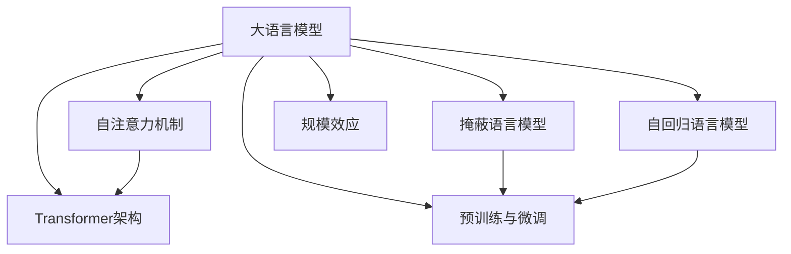
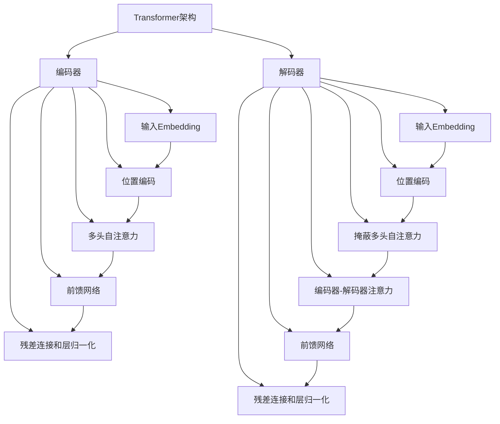

# 大语言模型原理与工程实践：大语言模型的涌现能力

## 1. 背景介绍

### 1.1 问题的由来

在过去的几年里,自然语言处理(NLP)领域取得了长足的进步,其中大语言模型(Large Language Models, LLMs)的出现无疑是最具革命性的突破之一。传统的NLP系统通常是基于规则或统计的方法,需要大量的人工特征工程和领域知识。而大语言模型则是一种基于深度学习的全新范式,它们能够直接从大规模的文本语料中学习语义和上下文信息,从而实现更加通用和强大的自然语言理解和生成能力。

大语言模型的核心思想是利用自注意力(Self-Attention)机制和Transformer架构,在海量文本语料上进行无监督预训练,获取通用的语言表示。之后,只需在预训练模型的基础上进行少量的任务精调(Task-specific Fine-tuning),即可将通用语言知识迁移到特定的下游NLP任务中,从而显著提升模型的性能和泛化能力。

### 1.2 研究现状

自2018年Transformer模型和BERT等开创性工作问世以来,大语言模型的发展一直处于飞速发展的状态。GPT、XLNet、ALBERT、T5等一系列突破性模型不断问世,模型规模也从最初的1亿参数迅速增长到数十亿、上百亿乃至上万亿参数。与此同时,大语言模型在各种NLP任务上不断刷新着最佳成绩,展现出了强大的语言理解和生成能力。

最近,以GPT-3、PaLM、ChatGPT等为代表的新一代大语言模型更是掀起了新的热潮。这些模型不仅在规模上达到了惊人的数十亿到上万亿参数,而且在自然语言理解、推理、生成等多个方面展现出了前所未有的能力,被认为已初步具备了"通用人工智能"(Artificial General Intelligence, AGI)的雏形。

### 1.3 研究意义

大语言模型的出现对于自然语言处理乃至整个人工智能领域都具有重大意义:

1. **通用语言表示**:大语言模型能够从海量语料中学习通用的语义和上下文表示,这为各种NLP任务提供了强大的基础模型,极大提高了下游任务的性能。

2. **泛化能力增强**:与传统的任务专用模型不同,大语言模型具有很强的泛化能力,能够更好地迁移到看不见的数据和新的任务场景中。

3. **少样本/无监督学习**:大语言模型通过自监督学习的方式,能够从无标注数据中获取知识,这为数据稀缺的领域带来了新的机遇。

4. **多模态融合**:最新的大语言模型开始尝试融合视觉、语音等多种模态信息,为构建通用人工智能奠定基础。

5. **认知智能模拟**:大语言模型在某些方面展现出了类似人类的语言理解、推理和生成能力,为研究人类认知智能提供了新的工具和视角。

总的来说,大语言模型代表了自然语言处理和人工智能发展的前沿方向,对于推动这一领域的理论研究和应用实践都具有重要意义。

### 1.4 本文结构

本文将系统地介绍大语言模型的原理、算法、工程实践和应用场景。具体来说,第2部分将阐述大语言模型的核心概念和基本原理;第3部分将详细解析大语言模型中的核心算法;第4部分将着重介绍大语言模型的数学模型和公式推导;第5部分将通过实例展示大语言模型的工程实现细节;第6部分将介绍大语言模型在不同领域的实际应用情况;第7部分将推荐相关的学习资源和开发工具;最后第8部分将总结大语言模型的发展趋势和面临的挑战。

## 2. 核心概念与联系

大语言模型(Large Language Models, LLMs)是一种基于深度学习的自然语言处理范式,它能够从海量的文本语料中直接学习语义和上下文信息,实现通用和强大的自然语言理解和生成能力。大语言模型的核心概念主要包括:

1. **自注意力机制(Self-Attention)**:自注意力机制是Transformer模型的核心,它能够捕捉输入序列中任意两个位置之间的依赖关系,从而更好地建模长距离上下文信息。

2. **Transformer架构**:Transformer是一种全新的基于自注意力机制的序列到序列(Seq2Seq)模型架构,它完全抛弃了传统的循环神经网络(RNN)和卷积神经网络(CNN),使用多头自注意力和前馈网络构建了一种全新的模型结构。

3. **掩蔽语言模型(Masked Language Model)**:掩蔽语言模型是BERT等大语言模型预训练的核心任务,它通过随机掩蔽部分输入词元,并让模型基于上下文预测被掩蔽的词元,从而学习到双向的语义和上下文表示。

4. **自回归语言模型(Autoregressive Language Model)**:自回归语言模型是GPT等大语言模型预训练的核心任务,它通过基于前文预测下一个词元的方式,学习到单向的语义和上下文表示,适用于文本生成等任务。

5. **预训练与微调(Pre-training & Fine-tuning)**:大语言模型采用了"预训练+微调"的范式。首先在大规模无监督语料上进行通用的自监督预训练,获得通用语言表示;然后在有标注的任务数据上进行少量的监督微调,将通用知识迁移到特定的下游任务中。

6. **规模效应(Scaling Effect)**:大语言模型的性能随着模型规模(参数量)和训练语料的增加而显著提升,这种"规模效应"是大语言模型取得突破性进展的关键因素之一。

这些核心概念相互关联、环环相扣,共同构成了大语言模型的理论基础和技术体系。下面将对其中的核心算法原理和数学模型进行更加深入的解析。

## 3. 核心算法原理 & 具体操作步骤

### 3.1 算法原理概述

大语言模型的核心算法主要包括两个部分:自注意力机制(Self-Attention)和Transformer架构。

**自注意力机制**是Transformer模型的核心创新,它能够捕捉输入序列中任意两个位置之间的依赖关系,从而更好地建模长距离上下文信息。与传统的RNN和CNN相比,自注意力机制不存在递归计算或卷积窗口大小的限制,因此能够更有效地并行计算,提高训练效率。

**Transformer架构**则是一种全新的基于自注意力机制的Seq2Seq模型架构。它完全抛弃了RNN和CNN,使用多头自注意力层和前馈网络层构建了一种全新的模型结构。Transformer编码器通过自注意力捕捉输入序列的上下文信息,解码器则在编码器的基础上引入了额外的注意力机制,用于关注输入序列的不同部分。

### 3.2 算法步骤详解

#### 3.2.1 自注意力机制

自注意力机制的核心思想是让每个词元都去"注意"其他词元,并基于注意力分数对所有词元进行加权求和,得到该词元的表示向量。具体步骤如下:

1. **线性投影**:将输入序列 $X = (x_1, x_2, ..., x_n)$ 通过三个不同的线性变换,分别得到查询(Query)向量 $Q$、键(Key)向量 $K$ 和值(Value)向量 $V$。
   $$Q = XW_Q, K = XW_K, V = XW_V$$

2. **计算注意力分数**:对于序列中的每个词元 $x_i$,计算它与所有其他词元的注意力分数,即 $x_i$ 对其他词元的"注意力程度"。注意力分数通过查询向量 $Q$ 与键向量 $K$ 的点积得到,并除以一个缩放因子 $\sqrt{d_k}$ 进行归一化。
   $$\text{Attention}(Q, K, V) = \text{softmax}(\frac{QK^T}{\sqrt{d_k}})V$$

3. **多头注意力**:为了捕捉不同的子空间信息,我们会计算多个注意力头(Head),每个头对应一个注意力子空间。最终将所有头的注意力结果拼接起来,并通过一个线性变换得到最终的多头自注意力表示。
   $$\text{MultiHead}(Q, K, V) = \text{Concat}(head_1, ..., head_h)W^O$$

通过自注意力机制,每个词元的表示向量都融合了对整个输入序列的"注意力"信息,从而能够更好地捕捉长距离上下文依赖。

#### 3.2.2 Transformer架构

Transformer架构主要由编码器(Encoder)和解码器(Decoder)两部分组成,两者都是基于自注意力机制和前馈网络构建的。

**Transformer编码器**的主要流程如下:

1. 输入embedding:将输入token序列 $X$ 映射为embedding向量序列。

2. 位置编码:为embedding向量添加位置信息,构建位置编码向量。

3. 多头自注意力:计算embedding向量序列的多头自注意力表示。

4. 前馈网络:对自注意力输出进行全连接的前馈网络变换。

5. 残差连接和层归一化:将自注意力输出和前馈网络输出分别与输入进行残差连接,并进行层归一化。

6. 重复3-5步骤N次,形成N层编码器层的输出。

**Transformer解码器**除了包含与编码器类似的自注意力和前馈网络结构外,还引入了一个额外的注意力子层,用于"注意"编码器的输出。具体步骤如下:

1. 输入embedding和位置编码,得到embedding向量序列。

2. 掩蔽多头自注意力:计算embedding向量序列的掩蔽(防止"违规访问"future信息)多头自注意力表示。

3. 编码器-解码器注意力:计算自注意力输出与编码器输出的注意力表示。

4. 前馈网络层。

5. 残差连接和层归一化。

6. 重复2-5步骤N次,形成N层解码器层的输出。

通过编码器捕捉输入序列的上下文信息,解码器则在此基础上生成目标序列,两者通过注意力机制相互关注,实现了高效的序列到序列的转换。

### 3.3 算法优缺点

**优点**:

1. **长距离依赖建模**:自注意力机制能够直接捕捉任意距离的上下文依赖关系,克服了RNN的长程依赖问题。

2. **并行计算**:Transformer架构完全基于注意力机制和前馈网络,不存在RNN的递归计算,因此能够高效并行,加速训练过程。

3. **灵活的序列建模**:Transformer可以灵活地处理变长序列输入和输出,不受长度限制。

4. **多任务能力**:通过预训练+微调范式,大语言模型能够在多种NLP任务上取得出色表现。

**缺点**:

1. **计算开销大**:自注意力机制需