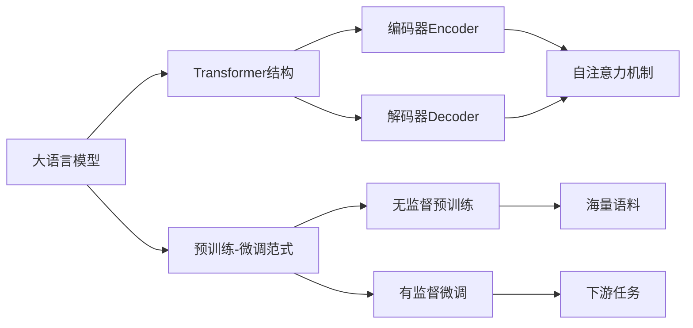

# 大语言模型原理与工程实践：工具设计

关键词：大语言模型、自然语言处理、预训练、微调、Transformer、BERT、GPT、ChatGPT、提示工程、模型压缩

## 1. 背景介绍
### 1.1 问题的由来
随着人工智能技术的飞速发展,自然语言处理(NLP)领域取得了突破性的进展。大语言模型的出现,让机器能够更好地理解和生成人类语言,为实现通用人工智能(AGI)奠定了基础。然而,大语言模型的训练和部署仍面临诸多挑战,如何设计高效的工具来支持大语言模型的开发和应用,成为亟待解决的问题。

### 1.2 研究现状
目前,业界已经涌现出一批优秀的大语言模型,如GPT系列、BERT、T5等。这些模型在各类NLP任务上取得了state-of-the-art的表现。但训练这些模型需要海量数据和算力,对计算资源要求极高。同时,大模型的推理速度较慢,不利于实际应用。因此,急需开发配套的工具,来降低大语言模型的使用门槛,提高开发效率。

### 1.3 研究意义
大语言模型蕴含着巨大的应用潜力,可用于问答、对话、文本生成、知识图谱等诸多场景。但目前缺乏成熟的工具链来支撑大模型的落地。本文旨在探讨大语言模型工具设计的核心原理和最佳实践,提出一套系统的解决方案。这将极大促进大语言模型技术的普及,让更多开发者和企业受益,推动NLP领域的进一步发展。

### 1.4 本文结构
本文将从以下几个方面展开论述:
- 首先介绍大语言模型的核心概念和内在联系
- 然后重点阐述大语言模型的关键算法原理和操作步骤
- 接着从数学角度对大语言模型的原理进行建模分析
- 并给出具体的代码实现,辅以详细的注释说明
- 进一步探讨大语言模型工具的实际应用场景
- 推荐一些学习资源、开发工具和相关文献
- 最后总结大语言模型的研究现状、未来趋势和面临的挑战
- 附录中列出常见问题解答,方便读者快速查阅

## 2. 核心概念与联系

要设计大语言模型工具,首先需要理解其背后的核心概念。大语言模型本质上是一种深度神经网络,通过海量语料的预训练,学习到丰富的语言知识,再通过特定任务的微调,实现下游应用。其核心在于Transformer结构和自注意力机制,使得模型能够捕捉长距离的语义依赖。而预训练-微调范式则是大语言模型的灵魂所在。

下图展示了大语言模型的核心概念及其内在联系:

可以看出,Transformer结构是大语言模型的基石,由编码器和解码器组成,核心是自注意力机制,让模型能关注到全局信息。而预训练-微调范式则是大语言模型的两大阶段,预训练让模型学会语言知识,微调让模型适应具体任务。两者相辅相成,缺一不可。

## 3. 核心算法原理 & 具体操作步骤
### 3.1 算法原理概述

大语言模型的核心算法可以概括为两大步骤:预训练和微调。

预训练阶段采用无监督学习,利用海量无标注语料,训练模型学习通用语言知识。常见的预训练任务有:
- 语言模型:让模型根据上文预测下一个词,捕捉语言的统计规律
- 去噪自编码:随机遮挡部分词,让模型根据上下文还原,学习语义表示
- 对比学习:让模型判断两个句子是否语义一致,学习语义相似度

微调阶段采用有监督学习,在下游任务的标注数据上训练模型,让其适应特定任务。常见任务如文本分类、序列标注、问答等。微调时,一般采用预训练模型作为初始化参数,再在任务数据上进行梯度下降,调整模型权重,使其拟合当前任务。

### 3.2 算法步骤详解

以BERT为例,详细讲解大语言模型的训练步骤。

预训练阶段:
1. 语料预处理:对原始文本进行tokenize,转换为词表中的id序列,按固定长度截断或padding,生成训练数据。 
2. Mask Language Model:随机遮挡一定比例(如15%)的词,让模型根据上下文预测这些词,损失函数为遮挡词的交叉熵。
3. Next Sentence Prediction:随机采样两个句子,50%概率为连续句子,50%为随机句子,让模型判断是否为连续句子,损失函数为二分类交叉熵。
4. 训练过程:将两个任务的损失相加,进行梯度反向传播,用Adam优化器更新模型参数,迭代若干epoch直到收敛。

微调阶段:
1. 任务数据处理:将下游任务数据转换为模型可读的格式,如[CLS]文本[SEP]标签。
2. 模型结构调整:根据任务类型,在BERT后接不同的输出层,如分类任务接softmax层,生成任务接decoder。
3. 训练过程:加载预训练权重进行初始化,冻结大部分BERT层参数,只微调输出层。用任务数据进行训练,优化任务损失函数,直到模型性能达到要求。

### 3.3 算法优缺点

大语言模型的优点主要有:
- 语言理解能力强:通过预训练学习到丰富的语言知识,具备较好的语义理解和生成能力
- 泛化能力好:预训练让模型具备一定的常识,可应用于不同领域的下游任务
- 样本效率高:预训练模型蕴含大量知识,下游任务只需少量标注数据即可微调

但同时也存在一些局限:
- 计算开销大:模型参数量巨大,训练和推理都很耗时耗力
- 黑盒推理:模型复杂度高,推理过程不透明,存在安全隐患
- 数据偏差:模型从训练数据中学习,容易继承其中的偏见,产生伦理问题

### 3.4 算法应用领域

大语言模型可应用的领域非常广泛,主要有:
- 信息抽取:如命名实体识别、关系抽取、事件抽取等
- 文本分类:如情感分析、意图识别、主题分类等 
- 问答系统:基于大语言模型构建知识库问答、阅读理解等
- 对话系统:如任务型对话、开放域对话、知识驱动对话等
- 文本生成:如摘要生成、改写、创意写作等
- 机器翻译:将大语言模型用于编码器-解码器框架,提升翻译质量
- 知识图谱:利用大语言模型从文本中抽取三元组,构建知识图谱

未来大语言模型有望进一步拓展到语音、视觉、决策、规划等更多领域,实现多模态理解和认知智能。

## 4. 数学模型和公式 & 详细讲解 & 举例说明
### 4.1 数学模型构建

大语言模型的数学原理可以用概率图模型来刻画。假设词表大小为$V$,句子长度为$n$,句子$S$可表示为词的序列$S=(w_1,w_2,...,w_n)$。语言模型的目标是估计句子的概率$P(S)$,将其分解为一系列条件概率的乘积:

$$
P(S)=P(w_1,w_2,...,w_n)=\prod_{i=1}^n P(w_i|w_1,...,w_{i-1})
$$

其中$P(w_i|w_1,...,w_{i-1})$表示在给定前$i-1$个词的条件下,第$i$个词为$w_i$的概率。传统的n-gram语言模型通过平滑方法估计这个概率,但面临数据稀疏和长距离依赖的问题。

大语言模型用神经网络来参数化条件概率。设第$i$个词的嵌入向量为$e(w_i)$,前$i-1$个词的隐藏状态为$h_i$,则第$i$个词的条件概率为:

$$
P(w_i|w_1,...,w_{i-1})=softmax(W_o h_i+b_o)
$$

其中$W_o$和$b_o$为输出层参数。隐藏状态$h_i$通过Transformer编码器计算:

$$
h_i=Transformer(e(w_1),...,e(w_{i-1}))
$$

Transformer内部通过自注意力和前馈网络的堆叠来建模长距离依赖:

$$
\begin{aligned}
q_i,k_i,v_i &= e(w_i)W_q, e(w_i)W_k, e(w_i)W_v \\
\alpha_{ij} &= softmax(\frac{q_i k_j^T}{\sqrt{d}}) \\
a_i &= \sum_j \alpha_{ij} v_j \\
h'_i &= LayerNorm(a_i+e(w_i)) \\  
h_i &= LayerNorm(FFN(h'_i)+h'_i)
\end{aligned}
$$

其中$W_q,W_k,W_v$为注意力参数矩阵,$\alpha$为注意力分布,$d$为隐藏维度,$FFN$为前馈网络。

### 4.2 公式推导过程

以上公式的推导过程如下:

1. 语言模型公式:根据概率论的链式法则,将句子概率分解为一系列条件概率的乘积。这是语言模型的基本出发点。

2. 神经网络参数化:用神经网络对条件概率建模,词嵌入向量作为输入,隐藏状态经softmax后输出下一个词的概率分布。这是神经语言模型的核心思想。

3. Transformer编码:将前i-1个词的嵌入向量输入Transformer,建模长距离语义依赖,得到第i个词的隐藏表示。Transformer是大语言模型的基础结构。

4. 自注意力计算:通过查询、键、值向量的乘积计算自注意力权重,将值向量按权重加和,得到注意力向量。这是Transformer的核心操作,可捕捉任意两个词之间的关系。

5. 残差连接和层归一化:将注意力向量与词嵌入相加,再经过层归一化,作为前馈网络的输入。这些技巧可以缓解梯度消失和加速收敛。

6. 前馈网络:经过两层全连接和非线性激活,再与层归一化结果相加,得到最终的隐藏状态。前馈网络可以增加模型容量和非线性。

通过以上步骤,就可以得到大语言模型的完整数学形式。模型训练时通过极大似然估计,优化负对数似然损失函数:

$$
L=-\sum_{i=1}^n \log P(w_i|w_1,...,w_{i-1})
$$

### 4.3 案例分析与讲解

下面以一个具体的例子来说明大语言模型的计算过程。假设我们有一个句子:"The cat sat on the mat"。经过tokenize后得到词序列:['The','cat','sat','on','the','mat']。

首先将每个词映射为嵌入向量,假设维度为512,则得到一个6*512的矩阵。然后将这个矩阵输入Transformer的第一层。

在自注意力计算中,以'sat'这个词为例。首先通过三个矩阵分别计算其查询向量q、键向量k和值向量v。然后用q去查询其他词的k,通过点积计算相似度,经softmax归一化后得到注意力分布α。这个分布体现了'sat'与其他词的相关度。

接下来根据α对值向量v进行加权求和,得到'sat'的注意力向量a。直观地说,a就是'sat'通过"软寻址"从其他词获取到的信息。

然后将a与