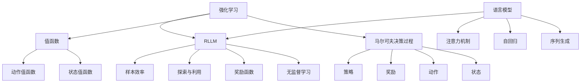

# 大语言模型原理与工程实践：强化学习基础

## 1. 背景介绍

### 1.1 问题的由来

在过去的几年里，自然语言处理(NLP)领域取得了长足的进步,很大程度上归功于深度学习和大型神经网络模型的发展。然而,传统的监督学习方法需要大量标注数据,这在现实场景中成本高昂且难以获取。因此,研究人员开始探索利用无标注数据的强化学习(Reinforcement Learning, RL)技术来训练大型语言模型。

强化学习是一种基于奖励最大化的机器学习范式,它允许智能体(Agent)通过与环境交互来学习最优策略。在NLP领域中,我们可以将语言模型视为智能体,通过与大量无标注语料库交互,模型可以学习生成自然、流畅的文本,并获得奖励反馈来优化自身。这种方法被称为强化学习语言模型(Reinforcement Learning Language Model, RLLM)。

### 1.2 研究现状

早期的RLLM工作主要集中在小规模任务上,如文本生成、对话系统等。随着计算能力的提高和大型预训练语言模型(如GPT、BERT等)的出现,研究人员开始探索在这些模型基础上应用强化学习。目前,RLLM已经在机器翻译、文本摘要、问答系统等多个领域取得了可喜成果。

然而,RLLM仍然面临诸多挑战,如奖励函数设计、探索与利用权衡、样本效率低下等。此外,大型语言模型的训练成本高昂,需要大量计算资源,这也限制了RLLM的广泛应用。

### 1.3 研究意义

RLLM有望成为未来NLP领域的重要技术,它可以利用海量无标注数据,减少人工标注成本,提高模型的泛化能力。同时,RLLM也为语言模型带来了新的能力,如目标驱动的生成、交互式学习等,这将推动NLP技术的发展和应用。

此外,RLLM也为强化学习理论和算法的研究提供了新的应用场景,有望促进两个领域的相互发展。

### 1.4 本文结构

本文将全面介绍RLLM的原理、算法和工程实践。我们将从强化学习的基础理论出发,阐述RLLM的核心思想,并详细讲解主流的RLLM算法。接下来,我们将重点探讨RLLM在工程实践中的关键问题,如奖励函数设计、样本效率优化、模型部署等。最后,我们将总结RLLM的发展趋势和未来挑战。

## 2. 核心概念与联系

强化学习语言模型(RLLM)融合了强化学习和自然语言处理两个领域的核心概念。下面,我们将介绍RLLM中的几个关键概念,并阐述它们之间的联系。

1. **马尔可夫决策过程(Markov Decision Process, MDP)**: 强化学习的核心概念之一,描述了智能体与环境的交互过程。MDP由状态、动作、奖励和策略等组成。

2. **状态(State)**: 描述环境的当前状况。在RLLM中,状态通常表示已生成的文本序列。

3. **动作(Action)**: 智能体在当前状态下可执行的操作。对于RLLM,动作指生成下一个词或标点符号。

4. **奖励(Reward)**: 环境对智能体动作的反馈,用于指导智能体学习。在RLLM中,奖励函数需要根据生成文本的质量进行设计。

5. **策略(Policy)**: 智能体在各个状态下选择动作的策略,是强化学习算法需要学习的目标。对于RLLM,策略即生成文本的语言模型。

6. **值函数(Value Function)**: 用于评估某个状态或状态-动作对的期望累计奖励。值函数在强化学习算法中扮演重要角色。

7. **语言模型(Language Model)**: 自然语言处理领域的核心概念,用于捕获语言的统计规律,并生成自然语言序列。

8. **序列生成(Sequence Generation)**: 语言模型的主要任务之一,即根据上文生成下文。这与强化学习中的序列决策问题高度相似。

9. **自回归(Autoregressive)**: 语言模型常用的生成方式,即根据历史生成的序列来预测下一个元素。这与强化学习中的马尔可夫性质相吻合。

10. **注意力机制(Attention Mechanism)**: 用于捕捉序列中元素之间的长程依赖关系,在现代语言模型中发挥关键作用。

11. **无监督学习(Unsupervised Learning)**: RLLM的一大优势在于可以利用大量无标注数据进行训练,属于无监督学习范畴。

12. **奖励函数(Reward Function)**: 将语言生成任务的目标转化为可优化的奖励信号,是RLLM的核心问题之一。

13. **探索与利用(Exploration and Exploitation)**: 强化学习算法需要在利用已学习的策略和探索新策略之间进行权衡,以达到最优化。

14. **样本效率(Sample Efficiency)**: 指算法在有限的交互样本下达到良好性能的能力,是RLLM面临的一大挑战。

通过上述概念,我们可以看出RLLM将强化学习和语言模型有机结合,将语言生成任务建模为马尔可夫决策过程,利用无监督数据训练语言模型策略,并通过设计奖励函数来优化生成质量。

## 3. 核心算法原理 & 具体操作步骤

在介绍具体的RLLM算法之前,我们先概述一下RLLM的核心算法原理。

### 3.1 算法原理概述

RLLM算法的目标是学习一个语言模型策略 $\pi_\theta$,使其能够生成高质量的文本序列,并最大化期望累积奖励。具体来说,我们需要找到模型参数 $\theta^*$,使得:

$$\theta^* = \arg\max_\theta \mathbb{E}_{\pi_\theta}[\sum_{t=0}^{T}r(s_t, a_t)]$$

其中,$ s_t $ 表示第 $ t $ 个时间步的状态(已生成的文本序列), $ a_t $ 表示在该状态下生成的动作(下一个词或标点), $ r(s_t, a_t) $ 表示奖励函数,用于评估生成质量, $ T $ 表示序列的最大长度。

由于语言模型的状态和动作空间都是离散且高维的,传统的动态规划或时序差分方法难以直接应用。因此,RLLM算法通常采用策略梯度(Policy Gradient)的思路,通过采样的方式估计梯度,并使用梯度上升法更新模型参数。

具体来说,在每个时间步 $ t $,模型根据当前状态 $ s_t $ 和策略 $ \pi_\theta $ 采样一个动作 $ a_t $,并将其添加到序列中。当序列生成完毕后,我们计算整个序列的累积奖励 $ R = \sum_{t=0}^{T}r(s_t, a_t) $,并根据 $ R $ 估计策略梯度:

$$\nabla_\theta J(\theta) = \mathbb{E}_{\pi_\theta}[R\nabla_\theta\log\pi_\theta(a_t|s_t)]$$

其中, $ J(\theta) $ 表示期望累积奖励的目标函数。通过梯度上升,我们可以更新模型参数 $ \theta $,使得策略 $ \pi_\theta $ 能够生成更高质量的序列。

需要注意的是,直接根据 $ R $ 估计梯度会存在高方差问题。因此,实际算法通常会采用基线(Baseline)或者其他方差减小技术来提高估计的稳定性。

### 3.2 算法步骤详解

下面,我们将详细介绍一种常用的RLLM算法——REINFORCE算法,并给出其具体操作步骤。

REINFORCE算法是一种基于策略梯度的强化学习算法,它可以直接应用于离散动作空间的问题,如语言模型的序列生成任务。算法的主要步骤如下:

1. **初始化**:初始化语言模型策略 $ \pi_\theta $ 的参数 $ \theta $,通常采用预训练语言模型的参数进行初始化。

2. **采样序列**:对于每个训练样本,根据当前策略 $ \pi_\theta $ 采样生成一个文本序列 $ \tau = (s_0, a_0, s_1, a_1, ..., s_T) $。具体操作为:
   - 从起始状态 $ s_0 $ 开始(通常为空序列)
   - 对于每个时间步 $ t $:
     - 根据当前状态 $ s_t $ 和策略 $ \pi_\theta $,采样一个动作 $ a_t $ (即生成下一个词或标点)
     - 将 $ a_t $ 添加到序列中,得到新状态 $ s_{t+1} $
   - 重复上述步骤,直到达到最大序列长度 $ T $ 或生成终止符

3. **计算奖励**:对于生成的序列 $ \tau $,计算其累积奖励 $ R(\tau) = \sum_{t=0}^{T}r(s_t, a_t) $,其中 $ r(s_t, a_t) $ 是预先设计的奖励函数。

4. **估计策略梯度**:根据累积奖励 $ R(\tau) $,估计策略梯度:

$$\nabla_\theta J(\theta) \approx R(\tau)\sum_{t=0}^{T}\nabla_\theta\log\pi_\theta(a_t|s_t)$$

5. **更新策略**:使用梯度上升法更新语言模型策略的参数 $ \theta $:

$$\theta \leftarrow \theta + \alpha \nabla_\theta J(\theta)$$

其中 $ \alpha $ 是学习率。

6. **重复训练**:重复步骤2-5,直到策略收敛或达到预设的训练轮数。

需要注意的是,直接使用上述梯度估计会存在高方差问题。因此,实际算法通常会采用基线(Baseline)或者其他方差减小技术,如:

- 使用状态值函数 $ V(s_t) $ 作为基线,即估计 $ \nabla_\theta J(\theta) \approx (R(\tau) - V(s_t))\sum_{t=0}^{T}\nabla_\theta\log\pi_\theta(a_t|s_t) $
- 采用Actor-Critic算法,同时学习策略 $ \pi_\theta $ 和状态值函数 $ V_\phi $
- 使用蒙特卡罗树搜索(MCTS)等技术进行有效探索

另外,为了提高探索能力和样本效率,一些算法还会采用熵正则化(Entropy Regularization)、课程学习(Curriculum Learning)等技术。

### 3.3 算法优缺点

REINFORCE算法及其变体作为RLLM的核心算法,具有以下优缺点:

**优点**:

1. **简单直接**:算法思路清晰,易于理解和实现。
2. **无监督**:可以利用大量无标注数据进行训练,减少人工标注成本。
3. **端到端**:将语言生成任务建模为强化学习过程,实现了端到端的优化。
4. **通用性强**:算法可以应用于各种序列生成任务,如机器翻译、对话系统等。

**缺点**:

1. **高方差**:基于采样估计的策略梯度存在高方差问题,需要采用方差减小技术。
2. **样本效率低**:强化学习算法通常需要大量的交互样本才能收敛,在NLP任务中容易遇到样本稀疏问题。
3. **奖励延迟**:对于长序列任务,奖励信号延迟严重,会影响算法的收敛速度。
4.