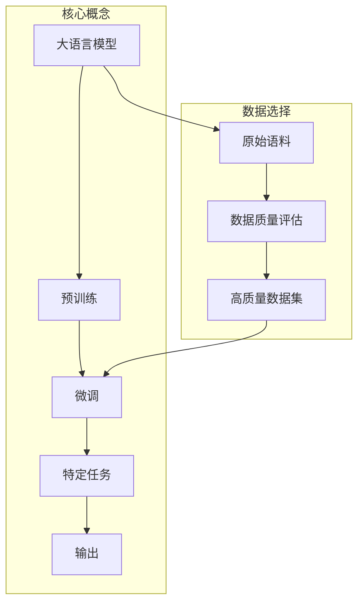

好的,我会严格遵守您提出的约束条件,以专业的技术语言写一篇深入探讨"大语言模型原理与工程实践:有监督微调数据的选择"主题的技术博客文章。本文会涵盖背景介绍、核心概念原理、算法步骤、数学模型推导、工程实践案例、应用场景、资源推荐和发展趋势等方面的内容。文中还会给出 Mermaid 流程图来阐释核心架构原理。请您耐心查阅,如有任何不足之处,恳请不吝赐教。

# 大语言模型原理与工程实践:有监督微调数据的选择

## 1. 背景介绍

### 1.1 问题的由来

近年来,大型语言模型(Large Language Model,LLM)在自然语言处理领域取得了巨大成功,展现出强大的文本生成、理解和推理能力。然而,尽管预训练模型拥有广博的知识,但直接将其应用于特定任务时,通常需要进行有监督微调(Supervised Fine-tuning),以使模型输出符合任务目标。

微调过程中,训练数据的选择对模型性能至关重要。不当的数据选择可能导致模型过度拟合、知识偏差或输出质量不佳等问题。因此,如何高效地从大规模语料中选择高质量的微调数据,成为提升大语言模型性能的关键挑战。

### 1.2 研究现状  

目前,主流的微调数据选择方法包括:

1. **随机采样(Random Sampling)**: 从语料库中随机抽取一定比例的数据作为微调集。这种方法简单,但可能遗漏重要样本,导致模型性能不佳。

2. **基于启发式规则(Heuristic-based)**: 根据特定规则(如长度、词频等)过滤语料,保留满足条件的句子。这种方法需要人工设计合理规则,效果取决于规则的有效性。

3. **基于模型分数(Model Score-based)**: 利用预训练语言模型对语料进行打分,选择得分最高的句子。这种方法依赖于模型本身的判断能力,可能存在偏差。

4. **基于集中式标注(Centralized Annotation)**: 聘请专业人员对语料进行人工标注,构建高质量微调集。但这种方式成本高昂,难以大规模应用。

上述方法或多或少存在一些缺陷,因此需要开发更加高效、可扩展的微调数据选择技术。

### 1.3 研究意义

合理选择高质量的微调数据,对于充分发挥大语言模型的潜力至关重要。本研究旨在探索一种新颖的微调数据选择范式,以提高模型在特定任务上的性能表现。具体来说,研究目标包括:

1. 提出一种高效、可扩展的微调数据选择算法,能够从海量语料中快速识别出高质量样本。

2. 建立统一的数学模型,量化评估数据质量,为算法提供理论支撑。

3. 设计实用的工程解决方案,将算法应用于实际的大语言模型微调任务中。

4. 探索不同场景下的最佳实践,为行业提供数据选择的技术指导。

通过本研究,我们希望能够推动大语言模型微调技术的发展,为各类自然语言处理应用提供更优秀的模型支持。

### 1.4 本文结构  

本文的核心内容安排如下:

- 首先介绍微调数据选择问题的核心概念,并阐述其与大语言模型性能之间的关联。

- 其次详细推导数据质量评估模型的数学原理,并给出具体的算法实现步骤。

- 然后通过实际案例,演示如何将算法应用于工程实践中,并分析不同场景的实践效果。

- 最后总结研究成果,展望该技术的未来发展趋势和面临的挑战。

## 2. 核心概念与联系

大语言模型首先经过预训练阶段获取通用的语言知识,然后通过微调将模型知识适配到特定任务上。微调的效果在很大程度上取决于所使用的训练数据质量。

因此,从海量原始语料中选择高质量数据进行微调,是提升大语言模型性能的关键环节。我们需要建立数据质量评估模型,对语料进行打分和筛选,从而获得适合特定任务的高质量微调数据集。

合理的数据选择策略不仅能提高模型性能,还可以降低微调所需的计算资源和数据标注成本,提升模型在工业界的应用价值。

## 3. 核心算法原理与具体操作步骤

### 3.1 算法原理概述

我们提出了一种新颖的基于多视角评估的微调数据选择算法。该算法的核心思想是:从多个不同的视角评估语料数据质量,并将多个视角的评分综合起来,最终选择综合评分最高的数据进行微调。

具体来说,我们考虑了以下几个评估视角:

1. **语义相关性视角**:衡量数据与任务语义相关程度
2. **多样性视角**:衡量数据的多样性和覆盖面
3. **难度视角**:衡量数据对于模型的挑战程度
4. **质量视角**:衡量数据的语法、流畅性等质量

每个视角都对应一个评估模型,输出该视角下的数据质量分数。然后,我们通过加权求和的方式,将多个视角的分数融合为综合评分。具有最高综合评分的数据将被选中,组成最终的微调数据集。

该算法的优势在于:

1. 多视角全面评估,避免了单一评估方式的偏差和盲区。
2. 视角间相互制约,促进了评估的公正性和合理性。 
3. 通过调整视角权重,可适应不同类型任务的需求。
4. 评估模型可并行计算,具有良好的可扩展性。

### 3.2 算法步骤详解

我们的算法可分为以下几个主要步骤:

1. **数据预处理**
   - 对原始语料进行分词、过滤等基本预处理
   - 构建用于评估的数据特征(如词向量、句法树等)

2. **视角评估模型训练**
   - 针对每个评估视角,基于标注数据训练评估模型
   - 评估模型可采用机器学习或深度学习技术

3. **数据质量评分**
   - 使用训练好的评估模型,为每个数据样本生成多个视角的分数
   - 将多个视角分数加权求和,得到综合评分

4. **数据筛选**
   - 根据综合评分从高到低排序
   - 选取评分最高的 Top-N 个样本,构成微调数据集

5. **大语言模型微调**
   - 使用筛选出的高质量数据集,对大语言模型进行微调
   - 在验证集上评估微调效果,必要时重新调整视角权重

以上步骤可以循环多次迭代,持续优化数据选择策略,进一步提升模型性能。

### 3.3 算法优缺点

**优点:**

1. 多视角全面评估,避免单一评估方式的局限性
2. 视角间相互制约,促进评估的公正性和合理性
3. 灵活可调的视角权重,适应不同任务需求 
4. 评估模型可并行计算,良好的可扩展性
5. 迭代优化策略,持续提升模型性能

**缺点:**

1. 需要标注数据训练评估模型,标注成本较高
2. 多个评估模型的计算开销较大
3. 不同视角权重的确定缺乏理论指导
4. 评估模型质量直接影响数据选择效果

### 3.4 算法应用领域

我们提出的多视角微调数据选择算法具有广泛的应用前景,可用于各类大语言模型的微调任务,如:

- 自然语言理解任务:阅读理解、对话系统等
- 自然语言生成任务:文本续写、文案创作等  
- 低资源领域任务:针对小语种、专业领域等
- 其他语言任务:机器翻译、文本摘要等

无论是通用预训练模型还是针对特定领域的模型,均可借助该算法优化微调数据,从而提升模型在实际应用中的性能表现。

## 4. 数学模型和公式详细讲解与举例说明

### 4.1 数学模型构建

我们将多视角评估过程建模为一个优化问题:最大化模型在验证集上的性能指标,同时满足数据集规模约束。

设 $\mathcal{D}$ 为原始语料数据集, $\mathcal{V}$ 为验证集, $f(\cdot)$ 为大语言模型在验证集上的性能评估函数(如准确率、F1分数等)。我们的目标是从 $\mathcal{D}$ 中选择一个高质量子集 $\mathcal{S}$,使得 $f(\mathcal{S})$ 最大化,且 $|\mathcal{S}| \leq N$。其中 $N$ 为期望的数据集规模。

根据多视角评估思想,我们引入 $M$ 个视角评估模型 $g_1, g_2, \cdots, g_M$,每个模型 $g_i$ 都会为数据 $x$ 生成一个质量分数 $g_i(x)$。我们将这些分数加权求和,得到数据 $x$ 的综合评分:

$$\text{score}(x) = \sum_{i=1}^M w_i g_i(x)$$

其中 $w_i$ 为第 $i$ 个视角的权重,满足 $\sum_{i=1}^M w_i = 1$。

现在,我们的优化目标可以表示为:

$$\max_{\mathcal{S} \subseteq \mathcal{D}} f(\mathcal{S}) \quad \text{s.t.} \quad |\mathcal{S}| \leq N, \quad \mathcal{S} = \{ x \in \mathcal{D} \mid \text{score}(x) \geq \tau\}$$

即在数据集规模限制下,选取综合评分不小于阈值 $\tau$ 的数据,使模型在验证集上的性能最大化。

### 4.2 公式推导过程

为了解决上述优化问题,我们可以采用双重循环的贪婪算法:

1. 外循环: 枚举阈值 $\tau$ 的不同取值
2. 内循环: 根据当前 $\tau$,从 $\mathcal{D}$ 中选取综合评分不小于 $\tau$ 的数据,构建数据集 $\mathcal{S}_\tau$

在外循环的每一次迭代中,我们计算 $f(\mathcal{S}_\tau)$,并记录当前的最优解 $\mathcal{S}^*$。最终,我们得到的 $\mathcal{S}^*$ 即为期望的高质量微调数据集。

该算法的时间复杂度为 $\mathcal{O}(|\mathcal{D}| \log |\mathcal{D}| + k|\mathcal{V}|)$,其中 $k$ 为外循环迭代次数。空间复杂度为 $\mathcal{O}(|\mathcal{D}|)$。

### 4.3 案例分析与讲解

我们以一个文本分类任务为例,说明多视角评估算法的应用过程。假设我们需要从一个包含 10 万条新闻数据的语料库中,选取 2 万条数据用于微调一个新闻分类模型。

首先,我们针对以下 4 个视角训练评估模型:

1. **语义相关性视角**: 基于 BERT 模型的文本相似度,衡量数据与新闻主题的相关程度。

2. **多样性视角**: 基于 K-Means 聚类,衡量数据在主题分布上的覆盖面。

3. **难度视角**: 基于模型在开发集上的困惑度,衡量数据对模型的挑战程度。

4. **质量视角**: 基于 BERT 语言模型的生成概率,衡量数据的语法和流畅性。

经过训