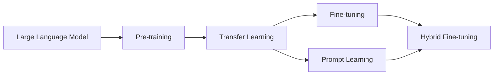

# 大语言模型原理与工程实践：混合微调策略

关键词：大语言模型、预训练、微调、混合微调、迁移学习、自然语言处理

## 1. 背景介绍
### 1.1  问题的由来
近年来，随着深度学习技术的快速发展，大语言模型(Large Language Model, LLM)在自然语言处理(Natural Language Processing, NLP)领域取得了突破性进展。LLM通过在海量文本数据上进行预训练，能够学习到丰富的语言知识和通用语言表征，为下游NLP任务提供了强大的迁移学习能力。然而，面对不同领域和任务的数据，如何有效地利用预训练的LLM进行微调(Fine-tuning)以提升性能，仍然是一个具有挑战性的问题。

### 1.2  研究现状
目前主流的LLM微调方法主要包括全参数微调(Full Fine-tuning)和提示学习(Prompt Learning)。全参数微调是将预训练模型的所有参数在下游任务数据上进行端到端的训练，虽然效果较好，但需要大量的计算资源和任务数据。提示学习通过设计合适的提示模板(Prompt Template)，将任务转化为预训练阶段的格式，从而减少微调参数量，但对提示工程有较高要求。此外，一些研究尝试将不同的微调方法进行组合，形成混合微调策略，以期兼顾效率和性能。

### 1.3  研究意义
探索LLM的混合微调策略具有重要的研究意义和应用价值：
1. 提高微调效率：通过巧妙设计混合微调策略，可以在保证性能的同时减少微调参数量和计算开销，提高模型适应新任务的效率。
2. 增强模型泛化能力：混合微调能够综合利用不同方法的优势，使模型更好地适应不同领域和任务的特点，提升模型的泛化能力。 
3. 探索新的优化方向：混合微调为LLM的优化提供了新的思路，有助于推动相关领域的理论创新和技术进步。

### 1.4  本文结构
本文将围绕LLM的混合微调策略展开深入探讨。第2部分介绍相关的核心概念及其联系；第3部分详细阐述混合微调的核心算法原理和具体操作步骤；第4部分给出混合微调涉及的数学模型和公式推导；第5部分通过代码实例演示混合微调的工程实践；第6部分分析混合微调的实际应用场景；第7部分推荐相关的学习资源和开发工具；第8部分总结全文并展望未来发展方向；第9部分附录了常见问题解答。

## 2. 核心概念与联系

### 2.1 大语言模型(Large Language Model, LLM)
大语言模型是指在海量文本语料上预训练得到的大规模神经网络模型，通常包含数亿到数千亿的参数。LLM通过自监督学习，能够习得语言的统计规律和语义知识，具备强大的语言理解和生成能力。代表性的LLM包括BERT、GPT、T5等。

### 2.2 预训练(Pre-training)
预训练是指在大规模无标注语料上对模型进行自监督训练的过程。常见的预训练任务包括语言模型、掩码语言模型等。通过预训练，LLM能够学习到通用的语言表征，为下游任务提供良好的初始化参数。预训练是LLM强大性能的基础。

### 2.3 微调(Fine-tuning) 
微调是指在特定任务的标注数据上，对预训练的LLM进行监督学习，使其适应任务的过程。微调可以端到端地训练所有模型参数，也可以只训练部分参数。微调使LLM能够快速适应新任务，显著提升性能。微调是LLM应用于实际任务的关键。

### 2.4 提示学习(Prompt Learning)
提示学习是一种新兴的微调方法，核心思想是将下游任务转化为与预训练阶段一致的格式。通过引入提示模板，将任务输入转化为自然语言形式，使LLM能够基于预训练知识直接进行推理。提示学习减少了微调参数，但对提示设计有较高要求。

### 2.5 迁移学习(Transfer Learning)
迁移学习是指将在源任务上学习到的知识迁移应用到目标任务中的机器学习范式。LLM的预训练-微调范式本质上是一种迁移学习，即将预训练阶段学到的通用语言知识迁移到具体的下游任务中。迁移学习是LLM实现few-shot乃至zero-shot学习的理论基础。

### 2.6 混合微调(Hybrid Fine-tuning)
混合微调是指将不同的微调方法灵活组合，形成更加有效的微调策略。例如，可以同时使用全参数微调和提示学习，在提升模型性能的同时降低微调开销。混合微调能够兼顾不同方法的优缺点，是一种有前景的模型优化思路。

以上核心概念环环相扣，共同构成了LLM的技术体系：
- LLM通过预训练习得语言知识，为下游任务提供迁移学习能力
- 微调和提示学习是LLM适应下游任务的两种主要方式  
- 混合微调将二者进行融合，以期获得更优的性能

它们的关系如下图所示：

## 3. 核心算法原理 & 具体操作步骤
### 3.1  算法原理概述
混合微调的核心思想是将不同的微调方法进行组合优化。本文重点介绍以下两种典型的混合微调策略：
1. 基于Adapter的混合微调
2. 基于Prefix-tuning的混合微调

基于Adapter的混合微调在预训练模型的每个Transformer块中引入了额外的Adapter模块，在微调阶段只训练这些新增参数。同时在输入端引入少量的可训练Prompt Tokens，引导模型适应任务。

基于Prefix-tuning的混合微调在预训练模型前面拼接一段可训练的Prefix，作为任务的提示信息。在微调阶段同时训练Prefix和模型的部分参数(如最后几层)，实现轻量化微调。

### 3.2  算法步骤详解

#### 3.2.1 基于Adapter的混合微调
1. 在预训练模型的每个Transformer块中，并行地插入Adapter模块。Adapter由两个全连接层和一个非线性激活函数组成。
2. 在输入端插入若干可训练的Prompt Tokens，作为任务提示。
3. 冻结预训练模型的所有参数，只微调Adapter和Prompt Tokens的参数。
4. 将微调后的模型应用到下游任务中进行推理。

#### 3.2.2 基于Prefix-tuning的混合微调
1. 在预训练模型的输入端拼接一段可训练的Prefix，作为任务提示。
2. 选择预训练模型的部分参数(如最后几层)参与微调，其余参数保持冻结。
3. 同时训练Prefix和所选参数，使模型适应下游任务。
4. 将微调后的模型应用到下游任务中进行推理。

### 3.3  算法优缺点

基于Adapter的混合微调的优点是：
- 可灵活插拔，方便任务切换
- 新增参数量小，微调开销低
- 通过Prompt Tokens引入任务先验，提升效果

其缺点是：
- Adapter结构设计需要依赖先验经验
- 不同任务单独训练Adapter，无法充分利用迁移学习

基于Prefix-tuning的混合微调的优点是：
- Prefix作为任务提示，引导模型适应任务
- 选择部分参数微调，在降低开销的同时提升效果
- 不同任务间可共享Prefix，充分利用迁移学习

其缺点是：
- Prefix长度和形式的选择需要依赖先验和调参
- 仍需微调部分预训练参数，开销较纯Prompt方法高

### 3.4  算法应用领域
混合微调策略可广泛应用于各类NLP任务，如：
- 文本分类
- 命名实体识别
- 关系抽取
- 机器阅读理解
- 机器翻译
- 文本生成

此外，混合微调的思想也可以推广到CV、语音、跨模态等领域，用于优化预训练模型在下游任务中的适配。

## 4. 数学模型和公式 & 详细讲解 & 举例说明
### 4.1  数学模型构建
我们以基于Adapter的混合微调为例，给出其数学模型。

设预训练模型为$f_{\theta}$，其中$\theta$为预训练参数。Adapter模块定义为：

$$Adapter(x)=W_2\sigma(W_1x)$$

其中$x$为输入，$W_1,W_2$为全连接层参数，$\sigma$为非线性激活函数(如ReLU)。

在每个Transformer块中并行插入Adapter，记Adapter参数为$\phi$。同时在输入端插入$n$个可训练的Prompt Tokens，记为$P=[p_1,...,p_n]$，对应参数为$\psi$。

因此，混合微调的数学模型可表示为：

$$\hat{y}=f_{\theta}(x;P,\phi)$$

其中$\hat{y}$为模型输出，$x$为任务输入。微调的目标是优化如下损失函数：

$$\mathcal{L}=\sum_{(x,y)\in \mathcal{D}}l(f_{\theta}(x;P,\phi),y)$$

其中$\mathcal{D}$为任务数据集，$l$为任务相关的损失函数(如交叉熵)，$y$为真实标签。

### 4.2  公式推导过程
基于上述数学模型，混合微调的优化目标可形式化为：

$$\min_{\psi,\phi} \mathcal{L}=\min_{\psi,\phi}\sum_{(x,y)\in \mathcal{D}}l(f_{\theta}(x;P,\phi),y)$$

求解该优化问题的过程如下：
1. 初始化Prompt Tokens参数$\psi$和Adapter参数$\phi$
2. 固定预训练参数$\theta$，只更新$\psi$和$\phi$
3. 基于任务数据集$\mathcal{D}$，计算损失函数$\mathcal{L}$
4. 通过梯度下降法更新$\psi$和$\phi$：
$$
\psi \leftarrow \psi-\eta \frac{\partial \mathcal{L}}{\partial \psi}
$$
$$
\phi \leftarrow \phi-\eta \frac{\partial \mathcal{L}}{\partial \phi}
$$
其中$\eta$为学习率
5. 重复步骤3-4直到收敛，得到最优参数$\psi^*$和$\phi^*$

### 4.3  案例分析与讲解
下面我们以文本分类任务为例，对混合微调的数学模型进行说明。

假设预训练模型为BERT，任务为二分类。输入文本记为$x$，对应的标签为$y\in\{0,1\}$。我们在BERT的12层Transformer块中分别插入Adapter，并在输入端插入5个可训练的Prompt Tokens。

记Prompt Tokens为$P=[p_1,...,p_5]$，对应参数为$\psi\in \mathbb{R}^{5\times d}$，其中$d$为词嵌入维度。Adapter的参数为$\phi=\{W_1^{(i)},W_2^{(i)}\}_{i=1}^{12}$，其中$W_1^{(i)}\in \mathbb{R}^{d\times r},W_2^{(i)}\in \mathbb{R}^{r\times d}$，$r$为Adapter的隐藏层大小。

将输入$x$和Prompt Tokens $P$拼接后喂入BERT，经过12层Transformer块(内含Adapter)的前向传播，得到最后一层的输出向量$h\in \mathbb{R}^d$。

再经过一个线性分类器$W_c\in \mathbb{R}^{d\times 2}$，得到类别概率分布：

$$\hat{y}=softmax(W_ch)$$

其中$\hat{y}\in \mathbb{R}^2$为预测概率。

使用交叉熵损失函数，优化目标为：

$$\min_{\psi,\phi,W_c} \mathcal{L