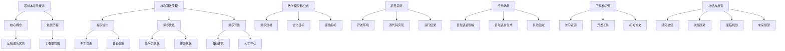
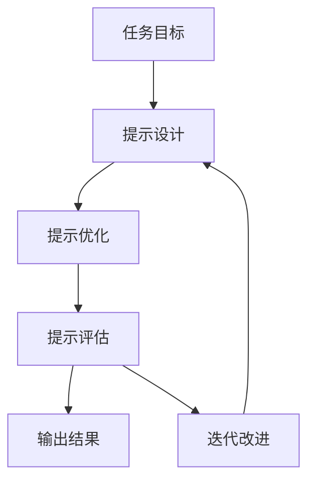

# 大语言模型原理与工程实践：零样本提示

## 1. 背景介绍

### 1.1 问题的由来

在自然语言处理(NLP)领域,传统的监督学习方法需要大量的人工标注数据,这种方式成本高且效率低下。随着深度学习技术的发展,大型语言模型(Large Language Models, LLMs)应运而生,它们通过在大规模无标注语料库上进行自监督预训练,学习到丰富的语言知识,从而能够在下游任务上取得出色的表现。

然而,当面对全新的任务时,传统的微调(fine-tuning)方法仍然需要大量的任务特定标注数据,这使得LLMs的应用场景受到了限制。为了克服这一挑战,**零样本提示(Zero-Shot Prompting)**应运而生,它通过设计合理的提示(Prompt),使LLMs能够直接解决全新的任务,无需任何额外的微调或标注数据,从而极大地扩展了LLMs的应用范围。

### 1.2 研究现状

近年来,零样本提示技术在NLP领域引起了广泛关注,许多研究工作致力于探索更加高效、通用和可解释的提示方法。目前,主要的提示范式包括:

1. **手工提示(Manual Prompting)**: 人工设计提示模板,利用人类的语言理解能力和领域知识。
2. **自动提示(Automated Prompting)**: 通过自动搜索或生成提示,减少人工干预。
3. **元学习提示(Meta-Learning Prompting)**: 在元学习框架下优化提示,提高其通用性。

尽管取得了一定进展,但零样本提示技术仍然面临诸多挑战,例如提示效率低下、可解释性差、缺乏理论指导等。因此,深入探索零样本提示的原理和方法,对于充分发挥LLMs的潜力至关重要。

### 1.3 研究意义

零样本提示技术的发展,不仅能够极大提高LLMs在实际应用中的灵活性和效率,还能推动NLP领域的理论和方法创新。具体来说,其研究意义主要体现在以下几个方面:

1. **降低标注成本**: 无需大量标注数据,能够大幅降低模型应用的成本。
2. **扩展应用场景**: 使LLMs能够直接解决全新的任务,极大扩展了其应用范围。
3. **促进可解释性**: 通过分析提示与模型的交互,有助于理解LLMs的内在机制。
4. **驱动理论创新**: 需要发展新的理论和方法来指导提示的设计和优化。

因此,深入研究零样本提示的原理和方法,不仅具有重要的理论价值,也蕴含着巨大的应用潜力。

### 1.4 本文结构

本文将全面探讨零样本提示在大语言模型中的原理和工程实践。首先介绍零样本提示的核心概念和发展历程,阐明其与传统微调方法的区别和联系。接下来深入剖析零样本提示的核心算法原理,包括提示设计、优化和评估等关键环节,并配以数学模型和公式推导。

随后,我们将介绍零样本提示在实际项目中的工程实践,包括开发环境搭建、源代码实现、运行结果分析等内容,帮助读者更好地掌握相关技术。此外,还将探讨零样本提示在自然语言理解、生成等领域的应用场景,并对未来的发展趋势和挑战进行前瞻性分析。

最后,本文将为读者提供丰富的学习资源、开发工具和相关论文推荐,以及常见问题解答,旨在为零样本提示技术的学习和实践提供全面的指导和支持。

## 2. 核心概念与联系

零样本提示(Zero-Shot Prompting)是一种新兴的范式,它允许大型语言模型(LLMs)直接解决全新的任务,无需任何额外的微调或标注数据。与传统的监督微调方法不同,零样本提示通过设计合理的提示,将任务信息注入到LLMs中,从而引导模型生成所需的输出。

### 2.1 什么是提示?

提示(Prompt)是一段自然语言文本,它为LLMs提供了任务相关的背景信息和指令。一个好的提示应该能够清晰地描述任务目标、输入输出格式等,从而帮助模型理解和完成该任务。例如,对于文本分类任务,提示可以是:

"下面是一段产品评论,请判断该评论的情感极性(正面/负面):"

### 2.2 提示与微调的区别

传统的微调方法是在预训练的LLMs基础上,使用任务特定的标注数据进行进一步训练,以适应新的下游任务。这种方式需要大量的标注数据,成本高且效率低下。

相比之下,零样本提示不需要任何额外的训练数据,只需要设计合理的提示即可直接应用LLMs解决新任务。这种方式更加灵活和高效,但也对提示的设计提出了更高的要求。

### 2.3 提示与LLMs的交互

零样本提示实际上是利用了LLMs在预训练过程中学习到的丰富语言知识。当LLMs接收到提示后,它会根据提示中的信息,结合自身的语言模型,生成与任务相关的输出。

这种交互过程可以看作是一种"Prompting编程(Prompting Programming)"paradigm,开发者通过编写提示来指导LLMs完成特定任务,而不是像传统编程那样直接编写算法和代码。

### 2.4 提示的发展历程

零样本提示最早可以追溯到2019年,GPT-2模型的发布标志着这一范式的兴起。随后,研究人员提出了各种提示方法,如手工提示、自动提示、元学习提示等,不断推进着这一领域的发展。

2021年,Prompt Programming被正式提出,将提示视为一种新的编程范式,进一步扩展了零样本提示的应用场景。同年,InstructGPT等指令跟随模型的出现,使得零样本提示能够更好地理解和执行复杂的任务指令。

未来,随着LLMs能力的不断提升,以及新理论和方法的涌现,零样本提示必将在NLP乃至更广泛的领域发挥越来越重要的作用。

## 3. 核心算法原理 & 具体操作步骤

### 3.1 算法原理概述

零样本提示的核心思想是通过设计合理的提示,将任务信息注入到LLMs中,从而引导模型生成所需的输出。这个过程可以概括为以下三个关键步骤:

1. **提示设计(Prompt Design)**: 根据任务目标和LLMs的特性,设计合适的提示模板和示例。
2. **提示优化(Prompt Optimization)**: 通过自动搜索或元学习等方法,优化提示的表现。
3. **提示评估(Prompt Evaluation)**: 评估优化后提示在目标任务上的效果,并进行迭代改进。

在这个过程中,提示设计是最关键的一步,它决定了LLMs能否正确理解任务并生成合理的输出。提示优化则旨在进一步提高提示的效果,使其能够更好地指导LLMs完成任务。最后,提示评估能够量化提示的表现,为后续的迭代改进提供依据。

### 3.2 算法步骤详解

#### 3.2.1 提示设计

提示设计是零样本提示的核心环节,它需要综合考虑任务目标、LLMs的特性以及人类的语言理解能力。常见的提示设计方法包括:

1. **手工提示(Manual Prompting)**: 由人工设计提示模板和示例,利用人类的语言理解能力和领域知识。这种方法灵活性强,但效率低且难以保证质量一致性。

2. **自动提示(Automated Prompting)**: 通过自动搜索或生成的方式获得提示,减少人工干预。这种方法效率高,但可能会产生不合理或低质量的提示。

3. **混合提示(Hybrid Prompting)**: 结合手工和自动方法的优点,人工设计初始提示,然后通过自动优化进行改进。

无论采用何种方法,一个好的提示通常应该包含以下几个要素:

- **任务描述**: 清晰地描述任务目标和要求。
- **输入输出格式**: 说明输入和期望输出的格式。
- **示例**: 提供一些任务示例,帮助LLMs理解任务。
- **指令**: 给出具体的操作指令,引导LLMs完成任务。

#### 3.2.2 提示优化

即使是经过精心设计的提示,其效果也可能不尽人意。因此,我们需要通过优化来进一步提高提示的质量。常见的提示优化方法包括:

1. **元学习优化(Meta-Learning Optimization)**: 在元学习框架下,通过在一系列相关任务上优化提示,提高其通用性和泛化能力。

2. **搜索优化(Search-Based Optimization)**: 将提示视为一个可搜索的空间,通过启发式搜索或强化学习等方法,自动搜索最优提示。

3. **约束优化(Constrained Optimization)**: 在优化过程中加入一些约束条件,如长度限制、语义一致性等,以确保生成的提示具有合理性和可解释性。

无论采用何种优化方法,其目标都是最小化提示与任务之间的差异,使得LLMs能够更好地理解和执行任务指令。

#### 3.2.3 提示评估

为了量化和比较不同提示的效果,我们需要进行提示评估。常见的评估方法包括:

1. **自动评估(Automatic Evaluation)**: 基于一些预定义的评估指标,如准确率、F1分数等,自动评估提示在目标任务上的表现。

2. **人工评估(Human Evaluation)**: 由人工评估员根据一定标准,如输出质量、一致性等,对提示生成的结果进行评分。

3. **综合评估(Hybrid Evaluation)**: 结合自动评估和人工评估的优点,首先使用自动评估进行初步筛选,然后由人工评估员对筛选后的结果进行深入评估。

评估结果不仅能够反映当前提示的效果,还可以为后续的迭代改进提供依据。通过不断优化和评估,我们可以获得性能更加出色的提示。

### 3.3 算法优缺点

零样本提示作为一种新兴的范式,它相比传统的微调方法具有以下优点:

1. **高效便捷**: 无需额外的训练数据和计算资源,能够快速应用于新任务。
2. **灵活可扩展**: 只需设计合适的提示,就能解决各种不同的任务。
3. **可解释性强**: 提示本身是自然语言,有助于理解模型的内在机理。

同时,零样本提示也存在一些不足之处:

1. **效果不稳