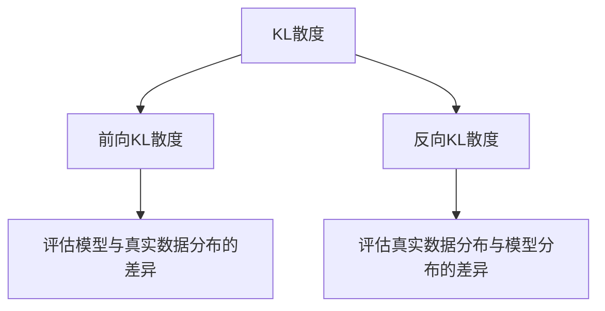

好的,我会按照要求,认真撰写这篇文章。以下是正文部分:

# 大语言模型原理基础与前沿 KL散度:前向与反向

## 1. 背景介绍

### 1.1 问题的由来

在自然语言处理(NLP)领域,语言模型是一种用于捕捉语言规律和表示语言结构的关键技术。传统的统计语言模型通过n-gram等方法对语料库中的词序列进行建模,但存在数据稀疏、语义不连续等问题。近年来,随着深度学习技术的兴起,基于神经网络的语言模型(Neural Language Model)逐渐成为主流方法。

神经语言模型能够有效地学习词与词之间的语义关联,并捕捉长距离的上下文依赖关系。然而,由于神经网络的"黑盒"特性,很难解释模型内部是如何表示和处理语言的。因此,深入理解大型神经语言模型的内在机理,对于提高模型性能、可解释性和可控性至关重要。

### 1.2 研究现状

目前,基于Transformer的大型语言模型(如GPT、BERT等)已经取得了令人瞩目的成就,在多项自然语言处理任务上展现出卓越的性能。然而,这些模型内部复杂的参数交互和计算过程,使得人们难以透彻地理解它们是如何工作的。

研究人员一直在努力探索大型语言模型的内在机理,试图揭示模型中蕴含的语言知识表示和处理方式。其中,信息论中的KL散度(Kullback-Leibler Divergence)被广泛应用于分析语言模型的概率分布,从而揭示模型对语言的理解程度。

### 1.3 研究意义 

深入研究大型语言模型的内在机理,对于以下几个方面具有重要意义:

1. **模型优化**:了解模型内部的工作原理,有助于发现性能瓶颈,并针对性地优化模型结构和训练策略。

2. **可解释性**:提高模型的可解释性,有助于人类更好地理解模型的决策过程,从而提高人机协作的效率和质量。

3. **知识迁移**:揭示模型内部的语言知识表示,有助于将其应用于其他自然语言处理任务,实现知识迁移和模型复用。

4. **模型鲁棒性**:深入理解模型内部机制,有助于分析模型的缺陷和弱点,从而提高模型的鲁棒性和安全性。

5. **语言理解**:研究大型语言模型有助于揭示人类语言的本质特征,为认知科学和语言哲学等领域提供新的见解。

### 1.4 本文结构

本文将围绕KL散度这一核心概念,深入探讨大型语言模型的内在机理。文章首先介绍KL散度在语言模型中的应用,以及前向和反向KL散度的基本概念。接下来,详细阐述基于KL散度的语言模型分析方法的理论基础和具体实现步骤。然后,通过数学模型和公式推导,解释KL散度如何量化语言模型的概率分布差异。

此外,本文还将提供一个实际项目案例,展示如何使用Python和深度学习框架对语言模型进行KL散度分析。最后,我们将总结研究成果,并展望基于KL散度的语言模型分析在未来的发展趋势和面临的挑战。

## 2. 核心概念与联系

KL散度(Kullback-Leibler Divergence)是信息论中的一个核心概念,用于衡量两个概率分布之间的差异程度。在语言模型领域,KL散度被广泛应用于评估语言模型对真实语料的拟合程度,以及分析模型内部对语言的表示和理解。

KL散度可以分为两种形式:前向KL散度(Forward KL)和反向KL散度(Reverse KL)。前向KL散度衡量真实数据分布与模型分布之间的差异,而反向KL散度则衡量模型分布与真实数据分布之间的差异。这两种形式的KL散度提供了不同的视角来分析语言模型的性能和特征。

前向KL散度常用于评估语言模型在生成任务中的性能,例如机器翻译、文本生成等。它衡量了模型生成的文本与真实语料之间的差异,可以反映模型捕捉语言规律的能力。

反向KL散度则更多应用于理解语言模型内部对语言的表示。它衡量真实语料与模型分布之间的差异,可以揭示模型在哪些方面与真实语言存在偏差,从而优化模型结构和训练策略。

通过综合运用前向和反向KL散度,研究人员可以全面分析语言模型的性能和特征,深入理解模型内部对语言的表示和处理方式。这为提高模型的性能、可解释性和可控性奠定了基础。

## 3. 核心算法原理 & 具体操作步骤

### 3.1 算法原理概述

基于KL散度的语言模型分析方法,旨在量化语言模型与真实语料之间的概率分布差异。该方法的核心思想是:通过计算KL散度值,评估模型分布与真实数据分布之间的距离,从而衡量模型对语言的理解程度。

算法的基本流程如下:

1. 选择待分析的语言模型和真实语料
2. 对语料进行预处理,构建模型输入
3. 使用语言模型对输入进行概率预测,获得模型分布
4. 计算模型分布与真实数据分布之间的KL散度
5. 分析和可视化KL散度结果,揭示模型的特征和偏差

在具体实现中,我们需要明确定义真实数据分布和模型分布,并选择合适的KL散度形式(前向或反向)。接下来,我们将详细介绍算法的具体步骤。

### 3.2 算法步骤详解

#### 步骤1: 数据预处理

在开始分析之前,我们需要对待分析的语料进行预处理,将其转换为语言模型可接受的输入格式。常见的预处理步骤包括:

1. 文本清理:去除无关字符、标点符号等
2. 分词:将文本切分为词元序列
3. 词元编码:将词元转换为模型可识别的数值表示(如词汇表索引)
4. 填充和截断:将序列统一为固定长度,以满足模型输入要求

#### 步骤2: 模型预测

使用语言模型对预处理后的输入进行概率预测,获得模型分布。具体操作取决于所使用的语言模型类型。

对于基于Transformer的大型语言模型(如BERT、GPT等),我们可以利用掩码语言模型(Masked Language Model)任务,让模型预测被掩码的词元的概率分布。

对于基于RNN的语言模型,我们可以使用序列预测任务,让模型逐个预测下一个词元的概率分布。

无论使用何种方式,最终我们都需要获得模型对每个词元位置的概率分布预测值。

#### 步骤3: 计算KL散度

根据所选择的KL散度形式(前向或反向),计算模型分布与真实数据分布之间的KL散度值。

对于前向KL散度,我们需要定义真实数据分布,通常可以使用one-hot编码的方式,将真实词元赋予概率1,其他词元概率为0。然后,使用以下公式计算前向KL散度:

$$KL(P_{true}||P_{model}) = \sum_{x}P_{true}(x)\log\frac{P_{true}(x)}{P_{model}(x)}$$

其中,$P_{true}$表示真实数据分布,$P_{model}$表示模型分布。

对于反向KL散度,我们需要交换分布的位置,使用以下公式计算:

$$KL(P_{model}||P_{true}) = \sum_{x}P_{model}(x)\log\frac{P_{model}(x)}{P_{true}(x)}$$

在实际计算中,我们可以对词元概率进行平滑处理,避免出现对数值为无穷的情况。

#### 步骤4: 分析和可视化

计算得到KL散度值后,我们可以进行进一步的分析和可视化,揭示语言模型的特征和偏差。

一种常见的分析方法是,将KL散度值按照不同的语言现象(如词性、语义类别等)进行分组统计,观察模型在不同语言方面的表现差异。

另一种方法是,将KL散度值可视化为热力图或其他形式,直观展示模型在不同上下文中的偏差分布。

通过综合运用多种分析手段,我们可以全面评估语言模型的性能,发现模型的优缺点,并为后续的模型优化提供指导。

### 3.3 算法优缺点

基于KL散度的语言模型分析方法具有以下优点:

1. **理论基础扎实**:KL散度源于信息论,具有坚实的理论基础,能够有效量化概率分布之间的差异。

2. **可解释性强**:通过分析KL散度值的分布情况,我们可以直观地了解模型在哪些方面与真实语言存在偏差,提高模型的可解释性。

3. **适用范围广**:该方法可以应用于各种类型的语言模型,包括基于RNN、Transformer等不同架构的模型。

4. **可视化直观**:通过合理的可视化手段,我们可以直观地展示模型的偏差分布,便于人类理解和分析。

然而,该方法也存在一些局限性:

1. **计算复杂度高**:当语料规模和词汇表大小增加时,计算KL散度的时间和空间复杂度会快速增长,给实际应用带来挑战。

2. **参数选择敏感**:在计算KL散度时,需要对概率值进行平滑处理,平滑参数的选择会影响最终结果的准确性。

3. **难以捕捉上下文信息**:KL散度主要关注单个词元的概率分布,难以直接反映模型对长距离上下文依赖的捕捉能力。

4. **需要真实数据分布**:计算KL散度需要已知的真实数据分布,而在实际应用中,真实分布往往是未知的,需要进行估计或近似。

尽管存在一定局限性,基于KL散度的语言模型分析方法仍然是一种有价值的工具,能够为我们提供有关模型内部机理的重要见解。未来,我们需要继续探索新的分析方法,以更全面地理解大型语言模型。

### 3.4 算法应用领域

基于KL散度的语言模型分析方法可以应用于以下几个主要领域:

1. **语言模型评估**:通过计算KL散度,我们可以全面评估语言模型在不同语言现象上的表现,发现模型的优缺点,为模型选择和优化提供依据。

2. **模型解释**:分析KL散度的分布情况,有助于揭示语言模型内部对语言的表示和理解,提高模型的可解释性。

3. **模型鲁棒性分析**:通过观察KL散度在不同输入条件下的变化,我们可以评估模型的鲁棒性,发现模型的弱点和漏洞。

4. **语言理解研究**:基于KL散度分析的结果,我们可以获得有关人类语言本质特征的新见解,为认知科学和语言哲学等领域提供参考。

5. **模型知识迁移**:通过分析不同模型之间KL散度的差异,我们可以探索模型知识的迁移和复用方式,提高模型的通用性和效率。

6. **语料库构建**:KL散度可以用于评估语料库的质量和覆盖范围,为构建高质量语料库提供指导。

总的来说,基于KL散度的语言模型分析方法具有广泛的应用前景,有助于我们更好地理解和优化大型语言模型,推动自然语言处理技术的发展。

## 4. 数学模型和公式 & 详细讲解 & 举例说明

### 4.1 数