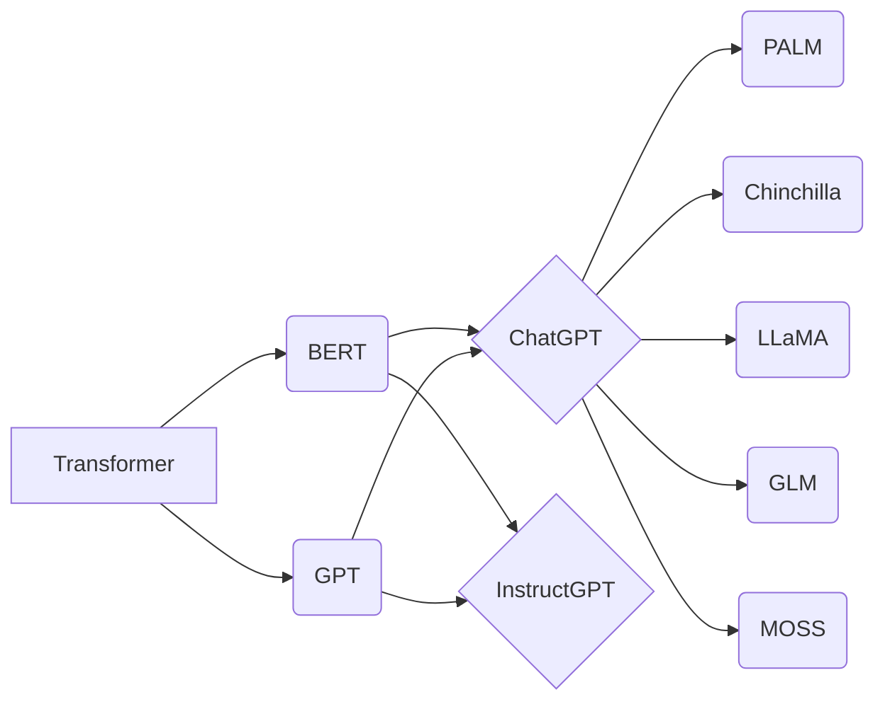

# 大语言模型原理基础与前沿 专家混合

关键词：大语言模型、Transformer、自注意力机制、预训练、微调、BERT、GPT、ChatGPT、InstructGPT、PALM、Chinchilla、LLaMA、GLM、MOSS

## 1. 背景介绍
### 1.1  问题的由来
随着人工智能技术的飞速发展,自然语言处理(NLP)领域也取得了突破性的进展。其中,大语言模型(Large Language Model, LLM)的出现和应用,极大地推动了 NLP 的发展。LLM 能够从海量文本数据中学习语言知识,并应用于各种 NLP 任务,如文本分类、命名实体识别、问答系统、机器翻译等。然而,LLM 的原理和应用仍然存在诸多挑战,亟需研究者们进一步探索。

### 1.2  研究现状
目前,业界已经提出了多种 LLM 模型,如 BERT、GPT、ChatGPT、InstructGPT、PALM、Chinchilla、LLaMA、GLM、MOSS 等。这些模型在不同的数据集和任务上取得了优异的性能,展现出 LLM 的强大能力。但同时,LLM 也面临着模型参数量巨大、训练成本高昂、推理速度慢、泛化能力不足等问题。因此,如何设计更加高效、鲁棒的 LLM 模型,仍是当前的研究热点。

### 1.3  研究意义 
LLM 在 NLP 领域具有重要的研究意义:

(1) LLM 能够学习语言的深层次语义表示,有助于提升 NLP 任务的性能;

(2) LLM 可以作为预训练模型,为下游任务提供更好的初始化参数,加速模型收敛; 

(3) LLM 展现出强大的零样本和少样本学习能力,为构建通用 AI 系统奠定基础;

(4) LLM 的可解释性研究有助于我们理解模型的工作机制,提高模型的可信度。

因此,深入研究 LLM 的原理和应用,对于推动 NLP 乃至 AI 的发展具有重要意义。

### 1.4  本文结构
本文将全面介绍 LLM 的原理和应用。第 2 节介绍 LLM 的核心概念;第 3 节阐述 LLM 的核心算法原理;第 4 节给出 LLM 的数学模型和公式;第 5 节展示 LLM 的代码实例;第 6 节分析 LLM 的应用场景;第 7 节推荐 LLM 的相关工具和资源;第 8 节总结全文并展望未来;第 9 节为文章的附录。

## 2. 核心概念与联系
- 大语言模型(Large Language Model, LLM):能够从大规模文本语料中学习语言知识,并应用于各种 NLP 任务的模型。
- Transformer:一种基于自注意力机制的神经网络结构,被广泛应用于 LLM 中。
- 自注意力机制(Self-Attention):一种能够捕捉序列内部长距离依赖关系的注意力机制。
- 预训练(Pre-training):在大规模无标注语料上训练语言模型,学习通用的语言表示。
- 微调(Fine-tuning):在特定任务的标注数据上微调预训练模型,使其适应任务。
- BERT:基于 Transformer 的双向语言模型,在多个 NLP 任务上取得了 SOTA 效果。
- GPT:基于 Transformer 的单向语言模型,能够生成连贯、流畅的文本。
- ChatGPT:由 OpenAI 开发的大型对话语言模型,展现出惊人的对话交互能力。
- InstructGPT:由 OpenAI 开发的指令微调模型,能够根据指令完成各种任务。
- PALM:由 Google 开发的可扩展语言模型,在少样本学习方面表现出色。
- Chinchilla:由 DeepMind 开发的高效语言模型,在相同计算资源下超越了 GPT-3。
- LLaMA:由 Meta 开发的基础语言模型,开源并支持商业使用。
- GLM:由清华大学开发的开源双语(中英)语言模型,在中文 NLP 任务上表现优异。
- MOSS:由 Fudan University 开发的支持多语言的开源对话语言模型。

这些概念之间存在着紧密的联系。Transformer 作为 LLM 的基础架构,其自注意力机制能够建模语言的长距离依赖。预训练和微调是 LLM 的两个关键训练阶段,分别学习通用语言知识和任务特定知识。BERT 和 GPT 是两类典型的 LLM,分别擅长理解和生成。ChatGPT 等大模型在 BERT 和 GPT 的基础上进一步扩大规模,展现出更强的语言能力。PALM、Chinchilla、LLaMA、GLM、MOSS 则在不同方面对 LLM 进行了改进和创新。理解这些概念之间的联系,有助于我们系统地掌握 LLM 的原理和应用。

## 3. 核心算法原理 & 具体操作步骤
### 3.1  算法原理概述
LLM 的核心算法是基于 Transformer 的自注意力机制。与传统的 RNN、CNN 等结构不同,Transformer 抛弃了循环和卷积操作,完全依靠注意力机制来建模序列。具体来说,Transformer 包含编码器和解码器两部分,每一部分都是由多个相同的层堆叠而成。每一层主要由三个子层组成:自注意力层、前馈神经网络层和残差连接层。其中,自注意力层用于捕捉序列内部的依赖关系,前馈神经网络层用于增强特征表示能力,残差连接层用于缓解梯度消失问题。通过这种结构,Transformer 能够并行地处理序列,大大提高了训练和推理效率。

### 3.2  算法步骤详解
Transformer 的编码器-解码器结构可以用于各种 NLP 任务。以机器翻译任务为例,其算法步骤如下:

(1) 输入表示:将源语言句子和目标语言句子分别转换为向量序列。

(2) 位置编码:为每个向量添加位置信息,使模型能够区分不同位置的词。

(3) 自注意力计算:通过点积注意力机制,计算序列中每个位置与其他位置的相关性。

(4) 前馈神经网络:通过两层全连接网络,对自注意力的输出进行非线性变换。

(5) 残差连接和层标准化:将自注意力和前馈神经网络的输出与输入相加,并进行层标准化。

(6) 编码器-解码器注意力:在解码器中,通过点积注意力机制,计算目标语言序列与源语言序列的相关性。

(7) 解码器自注意力:在解码器中,通过点积注意力机制,计算目标语言序列内部的相关性。

(8) 输出层:将解码器的输出传递给 Softmax 层,生成目标语言的概率分布。

(9) 贪心搜索或束搜索:根据输出概率,选择最可能的目标语言序列作为翻译结果。

通过这些步骤,Transformer 能够完成端到端的机器翻译任务。类似地,Transformer 也可以应用于其他 NLP 任务,如文本分类、命名实体识别、问答系统等。

### 3.3  算法优缺点
Transformer 相比传统的序列模型,具有以下优点:

(1) 并行计算:Transformer 通过自注意力机制实现了并行计算,大大提高了训练和推理效率。

(2) 长距离依赖:自注意力机制能够直接建模序列中任意两个位置之间的依赖关系,更好地捕捉长距离依赖。

(3) 可解释性:自注意力矩阵可以直观地展示序列中不同位置之间的相关性,提高了模型的可解释性。

但 Transformer 也存在一些缺点:

(1) 计算复杂度高:自注意力机制的时间和空间复杂度均为平方级别,难以应用于超长序列。

(2) 位置编码不灵活:Transformer 使用固定的正弦位置编码,难以建模更复杂的位置关系。

(3) 注意力分散:当序列较长时,自注意力机制可能会关注到无关的位置,影响模型性能。

因此,如何改进 Transformer 以克服这些缺点,是当前 LLM 研究的重要方向。

### 3.4  算法应用领域
Transformer 及其衍生模型在 NLP 领域有广泛的应用,主要包括:

(1) 机器翻译:Transformer 是当前机器翻译任务的主流模型,如 Google 的 GNMT 系统。

(2) 文本分类:基于 Transformer 的 BERT 模型在多个文本分类数据集上取得了 SOTA 效果。

(3) 命名实体识别:BERT 等模型能够有效地识别文本中的实体,如人名、地名、机构名等。

(4) 问答系统:Transformer 可以用于构建端到端的问答系统,如 OpenAI 的 GPT-3 模型。

(5) 文本生成:GPT 系列模型能够生成连贯、流畅的长文本,在对话生成、故事创作等任务上表现出色。

(6) 语音识别:Transformer 也被用于构建端到端的语音识别系统,如 Google 的 Conformer 模型。

(7) 推荐系统:Transformer 可以建模用户和物品之间的交互行为,用于个性化推荐任务。

随着 Transformer 的不断发展和改进,其应用领域也在不断扩大,成为 NLP 乃至 AI 领域的重要工具。

## 4. 数学模型和公式 & 详细讲解 & 举例说明
### 4.1  数学模型构建
Transformer 的数学模型可以用以下公式来表示:

(1) 自注意力机制:
$$
\text{Attention}(Q, K, V) = \text{softmax}(\frac{QK^T}{\sqrt{d_k}})V
$$
其中,$Q$,$K$,$V$ 分别表示查询向量、键向量和值向量,$d_k$ 表示向量维度。

(2) 多头自注意力:
$$
\text{MultiHead}(Q, K, V) = \text{Concat}(\text{head}_1, ..., \text{head}_h)W^O \\
\text{head}_i = \text{Attention}(QW_i^Q, KW_i^K, VW_i^V)
$$
其中,$W_i^Q$,$W_i^K$,$W_i^V$ 表示第 $i$ 个头的权重矩阵,$W^O$ 表示输出权重矩阵。

(3) 前馈神经网络:
$$
\text{FFN}(x) = \max(0, xW_1 + b_1)W_2 + b_2
$$
其中,$W_1$,$b_1$,$W_2$,$b_2$ 表示前馈神经网络的权重矩阵和偏置向量。

(4) 残差连接和层标准化:
$$
\text{LayerNorm}(x + \text{Sublayer}(x))
$$
其中,Sublayer 表示自注意力层或前馈神经网络层。

### 4.2  公式推导过程
以自注意力机制为例,其公式推导过程如下:

(1) 将输入序列 $X$ 乘以三个权重矩阵 $W^Q$,$W^K$,$W^V$,得到查询向量 $Q$、键向量 $K$ 和值向量 $V$:
$$
Q = XW^Q, K = XW^K, V = XW^V
$$

(2) 计算查询向量 $Q$ 和键向量 $K$ 的点积注意力分数:
$$
\text{score} = QK^T
$$

(3) 将注意力分数除以 $\sqrt{d_k}$,并通过 Softmax 函数归一化:
$$
\text{weights} = \text{softmax}(\frac{\text{score}}{\sqrt{d_k}})
$$

(4) 将注意力权重乘以值向量 $V$,得到自注意力的输出:
$$