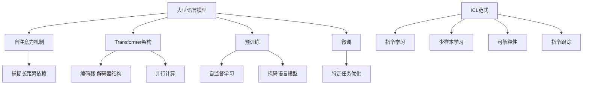

# 大语言模型原理基础与前沿 为什么ICL有效

## 1. 背景介绍

### 1.1 问题的由来

在自然语言处理(NLP)领域,大型语言模型(Large Language Model, LLM)由于其强大的文本生成能力而备受关注。传统的语言模型通常基于n-gram统计或神经网络,但存在参数量有限、泛化能力差的缺陷。随着计算能力的提升和大规模语料库的出现,训练大型语言模型成为可能。

大型语言模型可以在海量文本数据上进行预训练,捕捉丰富的语义和语法知识。这些模型不仅能够生成流畅的自然语言文本,还可以应用于机器翻译、问答系统、文本摘要等多种下游任务。然而,训练如此庞大的模型面临着巨大的计算和存储开销,也存在潜在的隐私和安全风险。

### 1.2 研究现状

目前,以GPT-3、PanGu-Alpha、BLOOM等为代表的大型语言模型已经取得了令人瞩目的成就。它们能够生成看似合理且内容丰富的文本,在某些场景下甚至可以欺骗人类。但这些模型也存在着明显的缺陷,如缺乏逻辑一致性、容易产生虚构内容、缺乏因果推理能力等。

为了解决这些问题,研究人员提出了多种改进方法,包括结构化知识注入、因果推理建模、少样本学习等。其中,ICL(Instruction-Conditioned Learning)作为一种新兴的指令学习范式,展现出了巨大的潜力。

### 1.3 研究意义

大型语言模型的发展不仅是NLP领域的重大突破,也为人工智能的发展带来了新的契机。通过研究大型语言模型的原理和训练方法,我们可以更好地理解人类语言的本质,并将这些知识应用于构建更智能、更人性化的人工智能系统。

同时,大型语言模型也面临着诸多挑战,如数据隐私、模型公平性、能源消耗等。研究这些挑战并提出有效的解决方案,对于推动人工智能的可持续发展至关重要。

### 1.4 本文结构

本文将首先介绍大型语言模型的核心概念和基本原理,包括自注意力机制、Transformer架构等。接下来,我们将重点探讨ICL范式的理论基础和实现细节,并分析其在提高模型性能和可解释性方面的优势。

此外,我们还将介绍ICL在实际应用中的案例,如指令跟踪、少样本学习等,并讨论其在不同场景下的适用性。最后,我们将总结ICL的发展趋势和面临的挑战,为未来的研究提供建议和方向。

## 2. 核心概念与联系

大型语言模型(LLM)是一种基于深度学习的自然语言处理模型,通常采用自注意力机制和Transformer架构。自注意力机制允许模型捕捉输入序列中长距离的依赖关系,而Transformer架构则使用了编码器-解码器结构和并行计算,大大提高了模型的计算效率。

LLM通常先在大规模语料库上进行预训练,获取通用的语言知识。预训练常采用自监督学习方式,如掩码语言模型(Masked Language Model)等。之后,可以通过微调(Fine-tuning)的方式,将预训练模型应用于特定的下游任务,如机器翻译、文本摘要等。

ICL(Instruction-Conditioned Learning)是一种新兴的指令学习范式,旨在提高LLM的性能和可解释性。ICL将指令(Instruction)作为条件,训练模型根据指令生成相应的输出。这种方式不仅可以实现少样本学习,还可以提高模型的可解释性和可控性。

ICL范式还引入了指令跟踪(Instruction Tracing)的概念,通过分析模型在执行指令时的中间状态,来解释模型的决策过程。这有助于提高模型的透明度和可解释性,从而增强人们对模型的信任。

## 3. 核心算法原理 & 具体操作步骤

### 3.1 算法原理概述

ICL(Instruction-Conditioned Learning)的核心思想是将指令(Instruction)作为条件,训练语言模型根据指令生成相应的输出。这种方式可以看作是一种条件生成(Conditional Generation)的范式。

在传统的语言模型训练中,我们通常最小化语言模型在给定上下文(Context)的条件下,预测下一个词的负对数似然(Negative Log-Likelihood)。而在ICL中,我们不仅考虑上下文,还要考虑指令的影响。具体来说,我们最小化语言模型在给定上下文和指令的条件下,预测目标输出序列的负对数似然。

通过这种方式训练,语言模型不仅学习了语言的一般规则,还学习了如何根据指令生成特定的输出。这使得模型在执行各种任务时更加可控和可解释。

### 3.2 算法步骤详解

1. **数据准备**：首先需要准备一个包含指令-输入-输出三元组的数据集。指令描述了我们希望模型执行的任务,输入是模型的上下文,输出是我们期望模型生成的结果。

2. **指令编码**：将指令表示为一个可被模型理解的向量形式,通常使用预训练的词向量或序列到向量的编码器(如BERT)。

3. **输入编码**：将输入文本序列编码为模型可以处理的形式,通常使用词嵌入(Word Embedding)和位置编码(Positional Encoding)。

4. **条件生成**：将指令向量和输入序列向量concatenate后输入到语言模型中,模型根据这两个条件生成目标输出序列。

5. **损失计算**：计算模型生成的输出序列与真实目标输出序列之间的损失,通常使用交叉熵损失(Cross-Entropy Loss)。

6. **模型优化**：使用优化算法(如Adam)根据损失的梯度,更新模型参数。

7. **模型评估**：在验证集或测试集上评估模型的性能,可使用各种指标,如BLEU、ROUGE等。

8. **模型微调**：可以进一步在特定任务的数据集上微调模型,提高其在该任务上的性能。

### 3.3 算法优缺点

**优点**:

1. **少样本学习**:由于模型学习了执行指令的能力,因此在有限的训练数据下也可以获得不错的性能。
2. **可解释性**:模型的决策过程更加透明,因为我们知道它是在执行特定的指令。
3. **可控性**:通过调整指令,我们可以控制模型的输出,使其满足特定需求。
4. **泛化能力**:模型可以根据指令生成多种形式的输出,而不仅限于训练数据中的样本。

**缺点**:

1. **指令偏差**:模型的性能很大程度上依赖于指令的质量,指令存在偏差或模糊会影响模型的表现。
2. **训练数据需求**:虽然比传统方法需要的数据量少,但ICL仍需要大量的指令-输入-输出三元组数据进行训练。
3. **计算开销**:条件生成过程通常比普通语言模型更加计算密集,需要更多的计算资源。
4. **鲁棒性**:模型可能对指令中的细微变化过于敏感,导致生成的输出发生较大变化。

### 3.4 算法应用领域

ICL范式可以应用于多种自然语言处理任务,包括但不限于:

1. **文本生成**:根据指令生成各种形式的文本,如新闻报道、小说、诗歌等。
2. **机器翻译**:将源语言文本和"将X语言翻译为Y语言"的指令输入模型,生成目标语言的翻译文本。
3. **文本摘要**:根据"概括文本主旨"的指令,生成文本的摘要。
4. **问答系统**:根据问题和"回答问题"的指令,从知识库中检索相关信息并生成答案。
5. **代码生成**:根据"编写X功能的代码"的指令,生成相应的程序代码。
6. **数据增广**:根据"修改文本使其包含X内容"的指令,对原始数据进行变换,生成新的训练样本。

总的来说,只要任务可以用指令来描述,ICL范式就可以为之提供解决方案。

## 4. 数学模型和公式 & 详细讲解 & 举例说明

### 4.1 数学模型构建

在ICL范式中,我们的目标是最大化语言模型在给定指令(Instruction)和上下文(Context)的条件下,生成目标输出序列(Target Sequence)的条件概率。具体来说,我们希望最大化如下条件概率:

$$P(Y|X, I; \theta)=\prod_{t=1}^{T}P(y_t|y_{<t}, X, I; \theta)$$

其中:
- $Y = (y_1, y_2, \dots, y_T)$是目标输出序列
- $X$是输入的上下文
- $I$是给定的指令
- $\theta$是模型参数

我们将指令$I$和上下文$X$concatenate为一个序列$[I; X]$,然后输入到Transformer模型中进行编码,得到其表示$\mathbf{h}^{enc}$。解码器则根据$\mathbf{h}^{enc}$和先前生成的词$y_{<t}$,预测下一个词$y_t$的概率分布:

$$P(y_t|y_{<t}, X, I; \theta) = \text{Decoder}(\mathbf{h}^{enc}, y_{<t}; \theta)$$

在训练过程中,我们最小化模型在训练数据集$\mathcal{D}$上的负对数似然损失:

$$\mathcal{L}(\theta) = -\frac{1}{|\mathcal{D}|}\sum_{(X, I, Y)\in\mathcal{D}}\log P(Y|X, I; \theta)$$

通过梯度下降等优化算法,我们可以得到最优的模型参数$\theta^*$,使得在给定指令和上下文的情况下,模型生成正确的目标输出序列的概率最大化。

### 4.2 公式推导过程

我们将从最基本的语言模型概率公式出发,逐步推导出ICL范式下的目标函数。

首先,根据链式法则,语言模型生成序列$Y$的概率可以表示为:

$$\begin{aligned}
P(Y) &= P(y_1, y_2, \dots, y_T)\\
     &= P(y_1)P(y_2|y_1)P(y_3|y_1, y_2)\cdots P(y_T|y_1, y_2, \dots, y_{T-1})\\
     &= \prod_{t=1}^{T}P(y_t|y_{<t})
\end{aligned}$$

其中$y_{<t}$表示序列$Y$中位置$t$之前的所有词。

在ICL范式中,我们需要考虑指令$I$和上下文$X$对序列生成的影响,因此上式可以改写为:

$$P(Y|X, I) = \prod_{t=1}^{T}P(y_t|y_{<t}, X, I)$$

为了简化计算,我们通常假设$P(y_t|y_{<t}, X, I)$只与有限的历史词$y_{<t}$和编码表示$\mathbf{h}^{enc}$相关,而与整个序列$Y$无关。于是我们有:

$$P(y_t|y_{<t}, X, I) \approx P(y_t|y_{<t}, \mathbf{h}^{enc})$$

将其代入上式,我们得到ICL范式下的目标函数:

$$P(Y|X, I; \theta) = \prod_{t=1}^{T}P(y_t|y_{<t}, \mathbf{h}^{enc; \