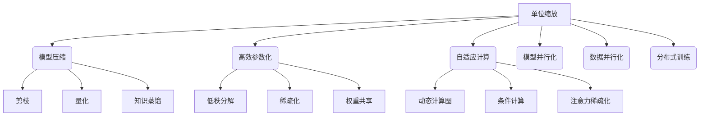

# 大语言模型原理基础与前沿：单位缩放

## 1. 背景介绍

### 1.1 问题的由来

在过去几年中,大型语言模型(Large Language Models, LLMs)在自然语言处理(NLP)领域取得了令人瞩目的成就。这些模型通过在海量文本数据上进行预训练,学习了丰富的语言知识和上下文关联性,从而在下游任务中表现出惊人的泛化能力。然而,训练这些庞大的模型需要消耗大量的计算资源,这对于普通研究机构和企业来说是一个巨大的挑战。

为了缓解这一问题,研究人员提出了一种称为"单位缩放"(Unit Scaling)的新颖方法。单位缩放旨在通过优化模型架构和训练策略,在保持模型性能的同时大幅降低计算成本。这一创新方法为大型语言模型的发展开辟了新的可能性,使得更多的组织和个人能够获取和利用这些强大的语言智能。

### 1.2 研究现状

目前,单位缩放在大型语言模型领域受到了广泛关注。一些著名的科技公司和研究机构,如谷歌、OpenAI、Meta等,都在积极探索和推进这一前沿技术。他们提出了多种创新的单位缩放策略,如模型压缩、参数高效化、自适应计算等,取得了令人鼓舞的成果。

然而,单位缩放仍处于发展的初级阶段,存在诸多需要解决的挑战和未知领域。例如,如何在不显著降低模型性能的情况下实现更大程度的缩放?如何平衡计算效率和模型表现?如何设计更加通用和可扩展的单位缩放框架?这些问题都需要持续的研究和探索。

### 1.3 研究意义

单位缩放技术的发展对于推动大型语言模型的民主化和普及具有重要意义。通过降低计算资源需求,单位缩放可以使更多的组织和个人获取和利用这些强大的语言智能,从而推动人工智能技术在各个领域的应用和创新。

此外,单位缩放也有助于提高大型语言模型的环境可持续性。由于训练这些庞大的模型需要消耗大量的能源和计算资源,因此降低其计算成本也意味着减少了相应的碳足迹和环境影响。

从理论和技术层面来看,单位缩放也为优化深度学习模型架构和训练策略提供了新的思路和方向。通过深入研究单位缩放的原理和方法,我们可以更好地理解模型的内在机制,并设计出更加高效和有效的深度学习系统。

### 1.4 本文结构

本文将全面探讨大型语言模型单位缩放的原理、方法和前沿进展。我们将首先介绍单位缩放的核心概念和与其他技术的联系,然后深入探讨单位缩放的核心算法原理和具体操作步骤。接下来,我们将详细阐述单位缩放所涉及的数学模型和公式,并通过案例分析加深理解。

此外,我们还将介绍单位缩放在实际项目中的应用,包括开发环境搭建、源代码实现和运行结果展示。同时,我们也将探讨单位缩放在各个领域的实际应用场景,并对其未来的发展趋势和挑战进行展望。

最后,我们将为读者提供丰富的学习资源、开发工具和相关论文推荐,以帮助他们深入了解和掌握单位缩放技术。

## 2. 核心概念与联系

单位缩放(Unit Scaling)是一种旨在优化大型语言模型计算效率的新颖方法。它的核心思想是通过精心设计的模型架构和训练策略,在保持模型性能的同时,大幅降低计算资源需求。

单位缩放与其他一些相关技术存在密切联系,如模型压缩(Model Compression)、高效参数化(Efficient Parameterization)和自适应计算(Adaptive Computation)等。

模型压缩旨在减小模型的参数量和计算复杂度,从而降低存储和推理成本。常见的模型压缩技术包括剪枝(Pruning)、量化(Quantization)和知识蒸馏(Knowledge Distillation)等。单位缩放可以借鉴和整合这些技术,实现更高效的模型压缩。

高效参数化则是通过设计更加紧凑和高效的参数表示方式,来减少模型的参数量和计算开销。一些常见的高效参数化方法包括低秩分解(Low-Rank Decomposition)、稀疏化(Sparsification)和权重共享(Weight Sharing)等。单位缩放可以利用这些技术,实现更加高效的参数化。

自适应计算则是根据输入数据的特征动态调整计算量,从而避免不必要的计算开销。一些常见的自适应计算技术包括动态计算图(Dynamic Computation Graphs)、条件计算(Conditional Computation)和注意力稀疏化(Attention Sparsification)等。单位缩放可以与这些技术相结合,实现更加灵活和高效的计算策略。

除了上述技术之外,单位缩放还与一些其他领域的研究存在联系,如模型并行化(Model Parallelism)、数据并行化(Data Parallelism)和分布式训练(Distributed Training)等。通过将这些技术与单位缩放相结合,我们可以进一步提高大型语言模型的计算效率和可扩展性。

总的来说,单位缩放是一种综合性的方法,它借鉴和整合了多种优化技术,旨在从多个角度提高大型语言模型的计算效率,同时保持其出色的性能表现。

## 3. 核心算法原理与具体操作步骤

### 3.1 算法原理概述

单位缩放的核心算法原理可以概括为以下几个关键点:

1. **模型架构优化**: 通过设计更加紧凑和高效的模型架构,减少模型的参数量和计算复杂度。这可以通过多种技术实现,如低秩分解、稀疏化、权重共享等。

2. **自适应计算**: 根据输入数据的特征动态调整计算量,避免不必要的计算开销。常见的自适应计算技术包括动态计算图、条件计算和注意力稀疏化等。

3. **模型压缩**: 通过剪枝、量化和知识蒸馏等技术,进一步减小模型的参数量和计算复杂度,从而降低存储和推理成本。

4. **高效参数化**: 设计更加紧凑和高效的参数表示方式,如低秩分解、稀疏化和权重共享等,来减少模型的参数量和计算开销。

5. **并行化和分布式训练**: 利用模型并行化、数据并行化和分布式训练等技术,提高大型语言模型的训练效率和可扩展性。

6. **优化训练策略**: 通过设计更加高效的训练算法和优化器,加速模型的收敛速度,从而缩短训练时间和计算成本。

通过综合运用上述多种技术和策略,单位缩放旨在在保持模型性能的同时,大幅降低计算资源需求,实现更高的计算效率和可扩展性。

### 3.2 算法步骤详解

单位缩放算法的具体实现步骤可以概括为以下几个阶段:

1. **模型架构设计**

   - 选择合适的模型架构,如Transformer、BERT、GPT等,作为基础模型。
   - 应用低秩分解、稀疏化和权重共享等技术,优化模型架构,减少参数量和计算复杂度。
   - 设计自适应计算模块,如动态计算图、条件计算和注意力稀疏化等,以根据输入数据动态调整计算量。

2. **模型压缩**

   - 对预训练的基础模型进行剪枝,移除冗余的参数和计算单元。
   - 应用量化技术,将浮点数参数转换为低精度整数表示,从而减小模型大小。
   - 使用知识蒸馏技术,将大型教师模型的知识转移到小型学生模型中,提高压缩后模型的性能。

3. **高效参数化**

   - 进一步优化模型参数的表示方式,如低秩分解、稀疏化和权重共享等,以减少参数量和计算开销。
   - 探索新的高效参数化技术,如混合精度训练、动态量化等,以进一步提高计算效率。

4. **并行化和分布式训练**

   - 应用模型并行化和数据并行化技术,将大型模型分割到多个计算设备上进行训练和推理。
   - 利用分布式训练框架,如TensorFlow、PyTorch等,实现高效的多机多卡训练。
   - 优化通信和同步策略,减少并行化和分布式训练的开销。

5. **训练策略优化**

   - 设计高效的训练算法和优化器,如层次化优化、自适应学习率调整等,加速模型收敛。
   - 应用梯度压缩、梯度累积等技术,减少通信开销和内存需求。
   - 探索新的训练范式,如元学习、自监督学习等,提高模型的泛化能力和计算效率。

6. **模型评估和迭代**

   - 在下游任务上评估单位缩放后的模型性能,与基线模型进行对比。
   - 根据评估结果,对模型架构、压缩策略、参数化方式和训练策略进行调整和优化。
   - 重复上述步骤,迭代优化模型,直至达到满意的性能和计算效率平衡。

通过上述步骤,单位缩放算法可以有效地优化大型语言模型的计算效率,同时保持其出色的性能表现。需要注意的是,具体的实现细节和技术选择会因特定场景和需求而有所不同,需要根据实际情况进行调整和优化。

### 3.3 算法优缺点

单位缩放算法在提高大型语言模型计算效率方面具有显著优势,但也存在一些潜在的缺点和挑战。

**优点**:

1. **计算资源节省**: 通过模型压缩、高效参数化和自适应计算等技术,单位缩放可以大幅降低模型的计算复杂度和资源需求,从而节省计算成本和能源消耗。

2. **可扩展性提升**: 利用模型并行化、数据并行化和分布式训练等技术,单位缩放可以更好地利用多个计算设备的并行计算能力,提高模型的可扩展性和训练效率。

3. **性能保持**: 单位缩放旨在在优化计算效率的同时,尽可能保持模型的性能水平,使其在下游任务上表现不会显著下降。

4. **灵活性和通用性**: 单位缩放是一种综合性的方法,它可以灵活地整合多种优化技术,并适用于不同类型的大型语言模型和任务场景。

**缺点和挑战**:

1. **性能损失风险**: 尽管单位缩放旨在保持模型性能,但过度压缩和优化可能会导致模型性能下降,需要权衡计算效率和性能之间的平衡。

2. **复杂性增加**: 单位缩放涉及多种优化技术和策略,这增加了模型架构和训练过程的复杂性,对开发者的技能和经验提出了更高要求。

3. **可解释性降低**: 一些压缩和优化技术,如剪枝和低秩分解,可能会降低模型的可解释性和透明度,使得模型内部机制变得更加黑箱化。

4. **硬件依赖性**: 某些单位缩放技术,如自适