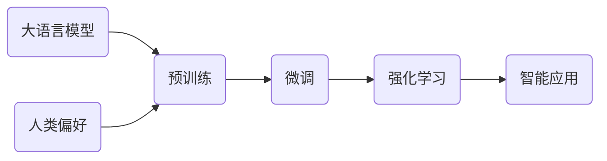

# 大语言模型原理基础与前沿 基于强化学习的微调和基于人类偏好的预训练

关键词：大语言模型、强化学习、人类偏好、微调、预训练

## 1. 背景介绍
### 1.1 问题的由来
近年来，随着深度学习技术的飞速发展，自然语言处理(NLP)领域取得了巨大的突破。其中，大语言模型(Large Language Models, LLMs)以其强大的语言理解和生成能力，成为了NLP领域的研究热点。然而，现有的大语言模型在训练过程中仍然存在一些问题，如难以充分利用人类知识、模型泛化能力不足等。为了进一步提升大语言模型的性能，研究者们提出了基于强化学习的微调和基于人类偏好的预训练等前沿技术。

### 1.2 研究现状 
目前，业界主流的大语言模型如GPT-3、PaLM、Megatron-Turing NLG等，都采用了基于transformer的预训练-微调范式。这些模型在下游任务上取得了很好的效果，但在训练过程中没有充分利用人类知识，导致模型泛化能力受限。最近，一些研究者尝试将强化学习引入大语言模型的微调过程，通过奖励模型生成符合人类偏好的文本，来提升模型性能。另一方面，也有工作探索在预训练阶段引入人类偏好信息，从而让模型更好地理解和模仿人类语言。

### 1.3 研究意义
基于强化学习的微调和基于人类偏好的预训练，为进一步提升大语言模型性能指明了新的方向。这些技术的研究和应用，有望让机器更好地理解人类语言，生成更加通顺、连贯、符合人类偏好的文本。同时，这也将大大拓展大语言模型的应用场景，如智能写作助手、智能客服、知识问答等，为人机交互带来更多可能性。因此，深入探讨这两种前沿技术的原理和实践，对于推动NLP乃至人工智能的发展具有重要意义。

### 1.4 本文结构
本文将围绕大语言模型原理基础与前沿技术展开详细论述。第2部分介绍大语言模型、强化学习、人类偏好等核心概念及其内在联系。第3部分重点阐述基于强化学习的微调算法原理和具体操作步骤。第4部分建立相关数学模型，并给出详细的公式推导和案例分析。第5部分通过代码实例，演示如何实现基于人类偏好的预训练。第6部分讨论相关技术的实际应用场景。第7部分推荐相关学习资源和开发工具。第8部分总结全文，并对未来发展趋势和挑战进行展望。

## 2. 核心概念与联系
在探讨大语言模型前沿技术之前，我们有必要先明确几个核心概念：

- 大语言模型：以transformer为基础构建的大规模预训练语言模型，通过在大规模无标注文本语料上进行自监督学习，习得强大的语言理解和生成能力。代表模型有GPT系列、BERT系列等。

- 强化学习：一种机器学习范式，通过智能体(agent)与环境的交互，学习如何采取最优行动(action)以获得最大累积奖励(reward)。常见算法有Q-learning、Policy Gradient等。

- 人类偏好：人类对语言的主观偏好，如语法正确性、内容相关性、逻辑一致性等。将人类偏好引入语言模型训练，可以使其生成更加符合人类期望的文本。

- 微调：在预训练语言模型的基础上，使用下游任务的监督数据对模型进行二次训练，以适应特定任务。微调可以大幅提升模型在下游任务上的表现。

- 预训练：在大规模无标注语料上对模型进行自监督学习，习得通用的语言知识和技能。预训练是构建大语言模型的关键步骤。

这些概念之间有着紧密的内在联系。大语言模型通过预训练习得强大的语言能力，再通过微调适应下游任务。引入强化学习机制可以在微调阶段对模型进行优化，使其生成符合特定目标的文本。而将人类偏好融入预训练阶段，则可以从底层就让模型更好地理解和模仿人类语言。它们的结合，将助力打造更加智能、更加贴近人类需求的语言模型。

## 3. 核心算法原理 & 具体操作步骤
### 3.1 算法原理概述
基于强化学习的微调，其核心思想是将语言模型看作一个智能体(agent)，将文本生成过程看作一个序列决策过程。在每个时间步，模型根据当前状态(state)选择一个单词(action)，并根据生成的文本质量获得相应的奖励(reward)。通过不断与环境交互并优化策略，模型逐步学会生成高质量、符合特定目标的文本。

### 3.2 算法步骤详解
基于强化学习的微调主要分为以下几个步骤：

1. 定义状态空间和动作空间。状态空间通常为模型的隐藏状态，动作空间为词表中的所有单词。

2. 设计奖励函数。奖励函数用于评估生成文本的质量，可以根据任务目标自行设计。常见的奖励函数包括基于语言模型的奖励、基于人类反馈的奖励等。

3. 选择强化学习算法。常用的算法有 Policy Gradient、Actor-Critic 等。这里以 Policy Gradient 为例进行说明。

4. 初始化语言模型参数。可以使用预训练模型的参数进行初始化，以加速训练过程。

5. 采样生成文本。根据当前策略(policy)，采样生成一批文本序列。

6. 计算奖励。使用奖励函数计算每个生成序列的奖励值。

7. 估计梯度并更新策略。根据采样序列和奖励值，估计 policy gradient，并使用优化器更新模型参数，优化策略。

8. 重复步骤5-7，直到策略收敛或达到预设的训练轮数。

### 3.3 算法优缺点
基于强化学习的微调具有以下优点：
- 可以针对特定任务目标优化模型，生成更加符合需求的文本。
- 通过引入奖励机制，可以弥补语言模型在生成过程中的偏差，提升文本质量。
- 与监督微调相比，强化学习微调不需要大量标注数据，适用范围更广。

同时，该算法也存在一些局限性：
- 奖励函数的设计需要依赖领域知识，对算法性能影响很大。
- 训练过程中需要不断与环境交互并采样，计算开销较大，训练时间较长。
- 容易受到稀疏奖励问题的影响，导致训练不稳定。

### 3.4 算法应用领域
基于强化学习的微调可以应用于多种自然语言生成任务，如：
- 文本摘要：生成简洁、主题突出的摘要。
- 对话生成：生成流畅、合理、符合人类偏好的对话响应。
- 机器翻译：生成忠实于原文、语法通顺的翻译结果。
- 写作助手：协助人类撰写文章，提供写作素材和修改建议。

## 4. 数学模型和公式 & 详细讲解 & 举例说明
### 4.1 数学模型构建
我们以 Policy Gradient 算法为例，建立基于强化学习的微调数学模型。

首先，定义语言模型策略 $\pi_{\theta}(a_t|s_t)$，表示在状态 $s_t$ 下选择动作 $a_t$ 的概率，其中 $\theta$ 为模型参数。语言模型的目标是最大化期望奖励：

$$J(\theta) = \mathbb{E}_{\tau \sim \pi_{\theta}}[R(\tau)]$$

其中，$\tau$ 为根据策略 $\pi_{\theta}$ 采样得到的文本序列，$R(\tau)$ 为该序列的奖励值。

根据 Policy Gradient 定理，策略梯度可以表示为：

$$\nabla_{\theta}J(\theta) = \mathbb{E}_{\tau \sim \pi_{\theta}}[R(\tau) \nabla_{\theta} \log \pi_{\theta}(\tau)]$$

进一步，我们可以使用蒙特卡洛方法估计策略梯度：

$$\nabla_{\theta}J(\theta) \approx \frac{1}{N} \sum_{i=1}^N R(\tau^i) \nabla_{\theta} \log \pi_{\theta}(\tau^i)$$

其中，$\tau^i$ 为第 $i$ 个采样序列，$N$ 为采样序列总数。

### 4.2 公式推导过程
为了得到策略梯度的估计公式，我们需要对 $J(\theta)$ 求梯度：

$$\nabla_{\theta}J(\theta) = \nabla_{\theta} \mathbb{E}_{\tau \sim \pi_{\theta}}[R(\tau)]$$

根据期望的定义，可以将梯度转换为：

$$\nabla_{\theta}J(\theta) = \sum_{\tau} R(\tau) \nabla_{\theta} \pi_{\theta}(\tau)$$

再根据 $\log$ 函数的性质，有：

$$\nabla_{\theta}J(\theta) = \sum_{\tau} R(\tau) \pi_{\theta}(\tau) \nabla_{\theta} \log \pi_{\theta}(\tau)$$

最后，使用蒙特卡洛方法对上式进行估计，得到策略梯度的估计公式：

$$\nabla_{\theta}J(\theta) \approx \frac{1}{N} \sum_{i=1}^N R(\tau^i) \nabla_{\theta} \log \pi_{\theta}(\tau^i)$$

### 4.3 案例分析与讲解
下面我们以一个简单的文本生成任务为例，说明如何应用 Policy Gradient 算法进行微调。

假设我们要训练一个语言模型，使其生成关于"春天"主题的诗句。我们可以设计如下奖励函数：

- 如果生成的诗句包含"春天"、"花"、"鸟"等关键词，则奖励 +1 分；
- 如果生成的诗句在语法、韵律、意境上符合诗歌要求，则再奖励 +1 分；
- 如果生成的诗句与"春天"主题无关，或存在语法错误，则奖励 -1 分。

在训练过程中，我们先随机采样一批诗句序列 $\{\tau^i\}_{i=1}^N$，然后计算每个序列的奖励值 $R(\tau^i)$。接着，估计策略梯度：

$$\nabla_{\theta}J(\theta) \approx \frac{1}{N} \sum_{i=1}^N R(\tau^i) \nabla_{\theta} \log \pi_{\theta}(\tau^i)$$

最后，使用梯度上升法更新模型参数：

$$\theta \leftarrow \theta + \alpha \nabla_{\theta}J(\theta)$$

其中，$\alpha$ 为学习率。

通过多轮迭代优化，语言模型逐渐学会根据"春天"主题，生成符合诗歌要求的优美句子，如"春风拂柳绿丝柔，百花争艳映春洲"等。

### 4.4 常见问题解答
**Q:** 为什么要使用强化学习进行微调，而不是监督学习？

**A:** 监督学习需要大量标注数据，而很多任务难以获得充足的标注。强化学习可以通过奖励函数implicitly引导模型学习，不需要显式的标注数据。此外，强化学习还可以针对特定目标对模型进行优化，使其生成更加符合需求的文本。

**Q:** 如何设计奖励函数？有哪些常见的做法？

**A:** 奖励函数的设计需要根据任务目标和领域知识来确定。一些常见的做法包括：
- 基于人工规则：根据人工定义的规则给予奖励，如关键词匹配、语法检查等。
- 基于人类反馈：由人类对生成文本进行评分，作为奖励。
- 基于预训练模型：使用预训练语言模型对生成文本进行评分，如 GPT-2 的 perplexity。
- 