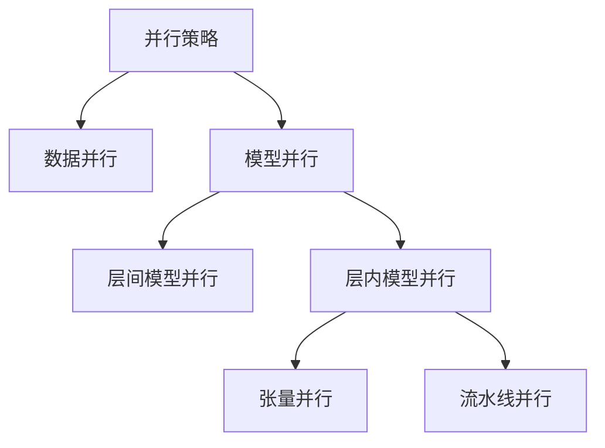

# 大语言模型原理基础与前沿 张量/模型并行

关键词：大语言模型、张量并行、模型并行、分布式训练、Transformer、GPT、BERT

## 1. 背景介绍
### 1.1  问题的由来
随着人工智能技术的飞速发展,自然语言处理(NLP)领域也取得了巨大的进步。其中,大语言模型的出现标志着 NLP 进入了一个新的里程碑。大语言模型能够在海量文本数据上进行预训练,学习到丰富的语言知识,并可以应用于各种下游任务,如文本分类、命名实体识别、问答系统等。然而,训练大语言模型需要巨大的计算资源和存储空间,单个 GPU 已经无法满足需求。因此,如何高效地训练大语言模型成为了一个亟待解决的问题。

### 1.2  研究现状
目前,业界主要采用数据并行和模型并行两种方式来加速大语言模型的训练。数据并行是将数据集划分到多个设备上,每个设备保存完整的模型参数,并行处理不同的数据子集。而模型并行则是将模型参数划分到多个设备上,每个设备只保存部分参数,共同完成前向传播和反向传播。其中,张量并行是模型并行的一种实现方式,通过将张量切分到不同设备来实现并行化。近年来,张量并行在训练 GPT-3、Megatron-LM 等超大规模语言模型中得到了广泛应用。

### 1.3  研究意义
研究张量并行对于推动大语言模型的发展具有重要意义。首先,张量并行可以突破单个设备内存的限制,支持训练更大规模的模型。其次,张量并行能够充分利用多个设备的计算能力,加速模型训练过程。此外,掌握张量并行技术也有助于我们理解分布式训练的原理,为设计新的并行策略提供思路。因此,深入探究张量并行的原理和实现,对于学术界和工业界都具有重要的参考价值。

### 1.4  本文结构
本文将围绕张量并行展开深入讨论。第二章介绍张量并行涉及的核心概念。第三章详细阐述张量并行的算法原理和具体实现步骤。第四章从数学角度对张量并行的原理进行建模和推导。第五章通过代码实例演示张量并行的实现细节。第六章总结张量并行在实际应用中的场景。第七章推荐了张量并行相关的学习资源和工具。第八章对全文进行总结,并对张量并行的未来发展趋势和挑战进行展望。

## 2. 核心概念与联系
在讨论张量并行之前,我们先来了解一些相关的核心概念:

- 张量(Tensor):多维数组,机器学习中的基本数据结构。
- 数据并行(Data Parallelism):将数据分片,在多个设备上并行处理。
- 模型并行(Model Parallelism):将模型参数划分到多个设备。
- 层间模型并行:按层将模型划分,不同设备负责不同的层。
- 层内模型并行:将同一层的计算拆分到多个设备。
- 流水线并行(Pipeline Parallelism):将模型划分为多个阶段,每个阶段在不同设备上串行执行。

下图展示了张量并行与数据并行、层间/内模型并行之间的关系:

可以看出,张量并行是层内模型并行的一种实现方式。它与数据并行正交,可以同时使用。张量并行主要用于加速单个层内的计算,尤其是大规模的矩阵乘法运算。

## 3. 核心算法原理 & 具体操作步骤
### 3.1  算法原理概述
张量并行的核心思想是将张量切分到多个设备,每个设备只计算和存储张量的一部分,从而实现并行化。以最常见的矩阵乘法 $\mathbf{Y} = \mathbf{X} \mathbf{W}$ 为例,假设我们有 $N$ 个设备,可以将 $\mathbf{X}$ 按列切分成 $N$ 份,将 $\mathbf{W}$ 按行切分成 $N$ 份:

$$
\mathbf{X} = \begin{bmatrix}
\mathbf{X}_1 & \mathbf{X}_2 & \cdots & \mathbf{X}_N
\end{bmatrix}, \quad
\mathbf{W} = \begin{bmatrix}
\mathbf{W}_1 \\
\mathbf{W}_2 \\
\vdots \\
\mathbf{W}_N
\end{bmatrix}
$$

每个设备 $i$ 计算 $\mathbf{Y}_i = \mathbf{X}_i \mathbf{W}_i$,最后将结果拼接起来得到完整的输出 $\mathbf{Y} = \begin{bmatrix}
\mathbf{Y}_1 & \mathbf{Y}_2 & \cdots & \mathbf{Y}_N
\end{bmatrix}$。这样,每个设备只需要 $1/N$ 的存储和计算,实现了并行加速。

### 3.2  算法步骤详解
下面我们详细讲解张量并行的实现步骤:

**步骤1:张量切分**
首先需要确定张量的切分方式。对于二维矩阵,通常采用行切分或列切分。对于高维张量,可以在任意维度上进行切分。切分方式的选择需要考虑设备数量、通信开销等因素。

**步骤2:设备间通信**
张量切分后,每个设备只持有部分数据。为了完成计算,设备间需要进行通信。以矩阵乘法为例,需要将输入矩阵 $\mathbf{X}$ 的分片 $\mathbf{X}_i$ 广播到所有设备,将权重矩阵 $\mathbf{W}$ 的分片 $\mathbf{W}_i$ 保留在本地设备。这种通信方式称为 AllGather。

**步骤3:本地计算**
每个设备 $i$ 根据本地持有的数据 $\mathbf{X}_i$ 和 $\mathbf{W}_i$ 进行计算,得到输出 $\mathbf{Y}_i$。这一步可以充分利用各个设备的并行计算能力。

**步骤4:结果聚合**
最后,需要将各个设备计算得到的结果 $\mathbf{Y}_i$ 聚合起来,得到完整的输出 $\mathbf{Y}$。聚合操作可以通过 AllGather 通信原语高效实现。

### 3.3  算法优缺点
张量并行的优点在于:
- 可以突破单个设备内存的限制,支持更大的模型。
- 通过增加设备数量,可以实现近似线性的加速比。
- 实现相对简单,易于集成到现有的深度学习框架中。

但张量并行也存在一些局限性:
- 设备间通信会带来额外的开销,影响整体性能。  
- 适用于计算密集型操作如矩阵乘法,对其他操作加速效果有限。
- 切分方式需要根据具体问题仔细设计,不够灵活。

### 3.4  算法应用领域
张量并行主要应用于以下领域:

- 大规模语言模型如 GPT-3、Megatron-LM 的训练。
- 超大规模推荐系统如 Facebook 的 DLRM 模型。  
- 大规模图神经网络如 GraphSAGE、PinSAGE 等。
- 其他计算密集型的深度学习任务。

## 4. 数学模型和公式 & 详细讲解 & 举例说明
### 4.1  数学模型构建
我们以最基本的矩阵乘法 $\mathbf{Y} = \mathbf{X} \mathbf{W}$ 为例,建立张量并行的数学模型。假设输入矩阵 $\mathbf{X} \in \mathbb{R}^{m \times d}$,权重矩阵 $\mathbf{W} \in \mathbb{R}^{d \times n}$,输出矩阵 $\mathbf{Y} \in \mathbb{R}^{m \times n}$。我们有 $N$ 个设备,对 $\mathbf{X}$ 按列切分,对 $\mathbf{W}$ 按行切分:

$$
\mathbf{X} = \begin{bmatrix}
\mathbf{X}_1 & \mathbf{X}_2 & \cdots & \mathbf{X}_N
\end{bmatrix}, \quad
\mathbf{W} = \begin{bmatrix}
\mathbf{W}_1 \\
\mathbf{W}_2 \\
\vdots \\
\mathbf{W}_N
\end{bmatrix}
$$

其中 $\mathbf{X}_i \in \mathbb{R}^{m \times d/N}, \mathbf{W}_i \in \mathbb{R}^{d/N \times n}$。

### 4.2  公式推导过程
对于设备 $i$,本地计算可以表示为:

$$
\mathbf{Y}_i = \mathbf{X}_i \mathbf{W}_i, \quad i = 1, 2, \cdots, N
$$

其中 $\mathbf{Y}_i \in \mathbb{R}^{m \times n/N}$。最终输出 $\mathbf{Y}$ 可以通过拼接各个设备的结果得到:

$$
\mathbf{Y} = \begin{bmatrix}
\mathbf{Y}_1 & \mathbf{Y}_2 & \cdots & \mathbf{Y}_N
\end{bmatrix}
$$

可以证明,这种张量并行方式得到的结果与原始矩阵乘法完全一致:

$$
\begin{aligned}
\mathbf{Y} &= \begin{bmatrix}
\mathbf{Y}_1 & \mathbf{Y}_2 & \cdots & \mathbf{Y}_N
\end{bmatrix} \\
&= \begin{bmatrix}
\mathbf{X}_1 \mathbf{W}_1 & \mathbf{X}_2 \mathbf{W}_2 & \cdots & \mathbf{X}_N \mathbf{W}_N
\end{bmatrix} \\
&= \begin{bmatrix}
\mathbf{X}_1 & \mathbf{X}_2 & \cdots & \mathbf{X}_N
\end{bmatrix}
\begin{bmatrix}
\mathbf{W}_1 \\
\mathbf{W}_2 \\
\vdots \\
\mathbf{W}_N
\end{bmatrix} \\
&= \mathbf{X} \mathbf{W}
\end{aligned}
$$

### 4.3  案例分析与讲解
下面我们通过一个具体的例子来说明张量并行的计算过程。考虑输入矩阵 $\mathbf{X} \in \mathbb{R}^{4 \times 8}$ 和权重矩阵 $\mathbf{W} \in \mathbb{R}^{8 \times 6}$,我们使用 $N=2$ 个设备进行张量并行:

$$
\mathbf{X} = \begin{bmatrix}
1 & 2 & 3 & 4 & 5 & 6 & 7 & 8 \\
9 & 10 & 11 & 12 & 13 & 14 & 15 & 16 \\
17 & 18 & 19 & 20 & 21 & 22 & 23 & 24 \\
25 & 26 & 27 & 28 & 29 & 30 & 31 & 32
\end{bmatrix}, \quad
\mathbf{W} = \begin{bmatrix}
1 & 2 & 3 & 4 & 5 & 6 \\
7 & 8 & 9 & 10 & 11 & 12 \\
13 & 14 & 15 & 16 & 17 & 18 \\
19 & 20 & 21 & 22 & 23 & 24 \\
25 & 26 & 27 & 28 & 29 & 30 \\
31 & 32 & 33 & 34 & 35 & 36 \\
37 & 38 & 39 & 40 & 41 & 42 \\
43 & 44 & 45 & 46 & 47 & 48
\end{bmatrix}
$$

对 $\mathbf{X}$ 按列切分,对 $\mathbf{W}$ 按行切分:

$$
\mathbf{X}_1 = \begin{bmatrix}
1 & 2 & 3 & 4 \\
9