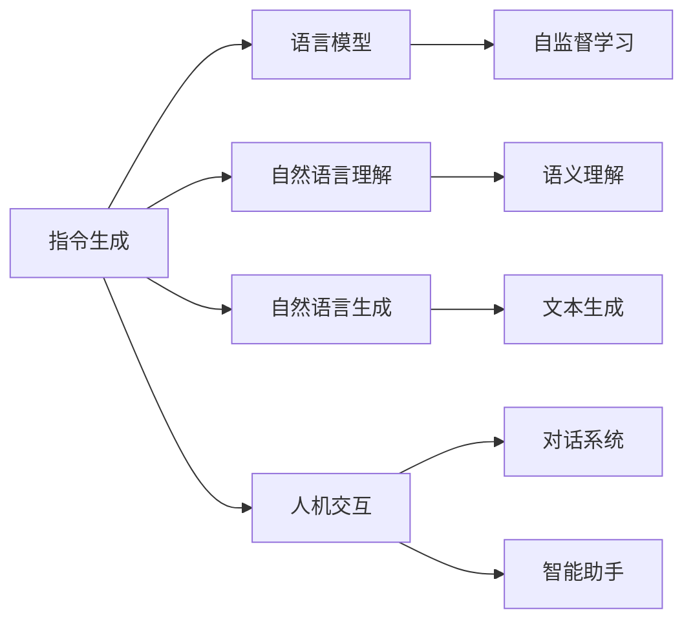

以下是《大语言模型原理基础与前沿 指令生成》的正文部分：

# 大语言模型原理基础与前沿 指令生成

## 1. 背景介绍

### 1.1 问题的由来

近年来,大型语言模型在自然语言处理(NLP)领域取得了令人瞩目的成就。随着计算能力的不断提升和海量语料的积累,训练大规模语言模型成为可能。这些模型通过自监督学习从大量文本数据中捕捉语言的统计规律,展现出惊人的语言理解和生成能力。

然而,传统的语言模型存在一些局限性。它们通常被视为"黑盒子",只能被动地生成文本,缺乏对特定任务的理解和控制能力。为了充分发挥大型语言模型的潜力,需要探索新的范式,赋予模型更强的理解能力和指令跟随能力,使其能够根据人类的需求和指令生成高质量的输出。

### 1.2 研究现状

指令生成(Instruction Generation)是一种新兴的范式,旨在使大型语言模型能够根据人类的指令生成所需的输出。相比于传统的语言模型,指令生成模型需要具备更强的语义理解能力,能够捕捉指令中的语义信息,并生成符合指令要求的高质量输出。

目前,指令生成研究主要集中在以下几个方面:

1. **指令理解**:如何让模型准确理解指令的语义,捕捉关键信息和要求。
2. **指令跟随**:如何让模型根据指令生成满足要求的输出,而不是简单地继续指令。
3. **指令一致性**:如何确保模型生成的输出与指令保持一致,不偏离主题。
4. **指令鲁棒性**:如何提高模型对模糊、不完整指令的鲁棒性,生成合理的输出。

一些主流的方法包括:

- 基于提示学习(Prompt Learning)的方法,通过设计合适的提示,引导模型生成所需的输出。
- 基于强化学习(Reinforcement Learning)的方法,设计奖惩机制,让模型学习生成符合指令的输出。
- 基于序列到序列(Seq2Seq)模型的方法,将指令作为输入,生成所需输出。

### 1.3 研究意义

指令生成范式有望赋予大型语言模型更强的理解和控制能力,使其能够根据人类的需求生成高质量的输出。这对于提高语言模型的实用性和可解释性具有重要意义。指令生成技术的发展,将推动语言模型在各种应用场景中发挥更大作用,如智能助手、内容生成、问答系统等。

此外,指令生成研究也将促进人工智能系统的可解释性和可控性。通过指令,人类可以更好地控制和理解模型的行为,降低"黑盒"风险。这有助于构建更加可信赖、透明和可控的人工智能系统。

### 1.4 本文结构

本文将全面介绍指令生成的基础理论和前沿研究进展。我们将首先阐述指令生成的核心概念和与其他范式的联系,然后深入探讨指令生成的核心算法原理和数学模型。接下来,我们将通过实际项目实践,展示如何开发和应用指令生成模型。最后,我们将分析指令生成在实际应用场景中的作用,并总结未来的发展趋势和挑战。

## 2. 核心概念与联系



指令生成(Instruction Generation)是一种新兴的范式,旨在赋予大型语言模型更强的理解和控制能力。它紧密联系着以下几个核心概念:

1. **语言模型(Language Model)**: 指令生成建立在大型语言模型的基础之上,利用其捕捉语言统计规律的能力。

2. **自然语言理解(Natural Language Understanding)**: 指令生成需要模型具备深度的语义理解能力,准确捕捉指令的意图和要求。

3. **自然语言生成(Natural Language Generation)**: 指令生成的目标是根据指令生成高质量的自然语言输出。

4. **人机交互(Human-Computer Interaction)**: 指令生成旨在提高语言模型与人类交互的能力,使其能够根据人类的指令生成所需输出。

指令生成与其他一些相关概念也有密切联系:

- **自监督学习(Self-Supervised Learning)**: 大型语言模型通常采用自监督学习方式从海量语料中学习语言知识。

- **语义理解(Semantic Understanding)**: 深度语义理解是指令生成的关键,需要模型捕捉指令的语义信息。

- **文本生成(Text Generation)**: 指令生成可视为一种特殊的文本生成任务,需要根据指令生成所需输出。

- **对话系统(Dialogue System)**: 指令生成可应用于对话系统,使其能够根据用户的指令生成合适的响应。

- **智能助手(Intelligent Assistant)**: 指令生成是构建智能助手的关键技术之一,赋予助手根据指令完成各种任务的能力。

总的来说,指令生成融合了语言模型、自然语言理解与生成、人机交互等多个领域的概念,是一个跨学科的研究方向。

## 3. 核心算法原理 & 具体操作步骤

### 3.1 算法原理概述

指令生成算法的核心思想是让语言模型能够根据给定的指令生成所需的输出,而不是简单地继续指令。这需要模型具备深度的语义理解能力,能够捕捉指令的意图和要求,并生成与之相符的高质量输出。

指令生成算法通常包括以下几个关键步骤:

1. **指令编码(Instruction Encoding)**: 将指令表示为模型可以理解的形式,通常采用文本嵌入或序列编码的方式。

2. **语义理解(Semantic Understanding)**: 利用语言模型的语义理解能力,捕捉指令中的关键信息和要求。

3. **条件生成(Conditional Generation)**: 根据捕捉到的指令语义,对语言模型进行条件化训练或微调,使其能够生成符合指令要求的输出。

4. **输出解码(Output Decoding)**: 将模型生成的序列解码为最终的自然语言输出。

5. **反馈优化(Feedback Optimization)**: 根据生成输出的质量,对模型进行进一步优化和调整。

不同的指令生成算法在具体实现上可能有所差异,但都遵循上述基本原理。下面我们将详细介绍几种主流的指令生成算法。

### 3.2 算法步骤详解

#### 3.2.1 基于提示学习的指令生成

提示学习(Prompt Learning)是一种广泛使用的指令生成方法。其核心思想是通过设计合适的提示(Prompt),引导语言模型生成所需的输出。

提示通常包含两部分:

1. **指令提示(Instruction Prompt)**: 描述期望的输出及其要求。
2. **示例提示(Example Prompt)**: 提供一些输入-输出示例,帮助模型理解期望的输出形式。

算法步骤如下:

1. 构建指令提示和示例提示,将它们连接成完整的提示序列。
2. 将提示序列输入到语言模型中,模型会基于提示继续生成输出。
3. 对生成的输出进行后处理,获得最终结果。

示例:

```
指令提示: 请将以下句子翻译成法语:
示例提示: 
输入: Hello, how are you?
输出: Bonjour, comment allez-vous?
输入: I am a student.
输出: Je suis un étudiant.
输入: The weather is nice today.
输出:
```

在上述示例中,模型需要根据指令和示例,生成法语翻译"Le temps est beau aujourd'hui."。

#### 3.2.2 基于强化学习的指令生成

强化学习(Reinforcement Learning)是另一种常用的指令生成方法。它通过设计奖惩机制,让模型学习生成符合指令的输出。

算法步骤如下:

1. 定义奖惩函数(Reward Function),用于评估生成输出与指令的匹配程度。
2. 使用强化学习算法(如策略梯度)训练语言模型,最大化奖励函数。
3. 在inference阶段,模型根据指令生成输出,并使用奖励函数进行评估和优化。

奖惩函数的设计是关键,它需要能够准确度量输出与指令的匹配程度。常用的方法包括:

- 基于规则的评分函数,检查输出是否满足指令中的约束条件。
- 基于参考输出的评分函数,计算生成输出与参考输出的相似度。
- 基于人工评估的评分函数,由人工评估输出与指令的匹配程度。

强化学习方法的优点是可以直接优化模型生成符合指令的输出,但缺点是需要大量的人工标注数据用于训练奖惩函数。

#### 3.2.3 基于Seq2Seq的指令生成

序列到序列(Sequence-to-Sequence, Seq2Seq)模型是一种常用的机器翻译和自然语言生成模型。它也可以应用于指令生成任务。

算法步骤如下:

1. 将指令和期望输出构建为源序列和目标序列的形式。
2. 使用Seq2Seq模型(如Transformer)在大量指令-输出对上进行训练。
3. 在inference阶段,将指令作为源序列输入到模型,模型将生成对应的目标序列作为输出。

Seq2Seq模型的优点是可以直接学习指令到输出的映射关系,但缺点是需要大量的指令-输出对作为监督数据进行训练。

示例:

```
源序列: <指令>将以下英文句子翻译成中文:</指令> The weather is nice today.
目标序列: 今天天气很好。
```

在上述示例中,模型需要学习将"<指令>将以下英文句子翻译成中文:</指令> [英文句子]"映射为对应的中文翻译。

### 3.3 算法优缺点

不同的指令生成算法各有优缺点:

- **基于提示学习**:
  - 优点:简单、高效,无需大量监督数据。
  - 缺点:提示设计的质量直接影响输出质量,需要人工设计高质量的提示。

- **基于强化学习**:
  - 优点:可以直接优化模型生成符合指令的输出。
  - 缺点:需要大量的人工标注数据用于训练奖惩函数,训练过程复杂。

- **基于Seq2Seq**:
  - 优点:可以直接学习指令到输出的映射关系。
  - 缺点:需要大量的指令-输出对作为监督数据进行训练,数据准备成本高。

总的来说,基于提示学习的方法相对简单,但质量取决于提示设计;基于强化学习和Seq2Seq的方法更加通用,但需要大量的监督数据。在实践中,通常需要根据具体任务和数据情况选择合适的算法。

### 3.4 算法应用领域

指令生成算法可以应用于多个领域,为语言模型赋予更强的理解和控制能力:

1. **智能助手**: 指令生成可以赋予智能助手根据用户指令完成各种任务的能力,如问答、文本生成、信息查询等。

2. **内容生成**: 通过指令生成,语言模型可以根据特定要求生成高质量的内容,如新闻报道、故事创作、广告文案等。

3. **数据增强**: 指令生成可用于自动生成训练数据,为各种自然语言处理任务提供更多的监督数据。

4. **对话系统**: 指令生成可以赋予对话系统根据用户输入生成合理响应的能力,提高对话质量和一致性。

5. **问答系统**: 指令生成可以帮助问答系统更好地理解问题,并生成准确、相关的答复。

6. **机器翻译**: 指令生成可以用于控制和优化机器翻译的输出