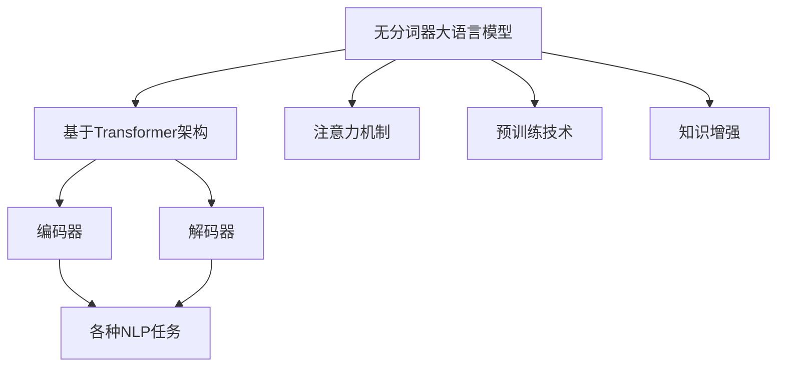
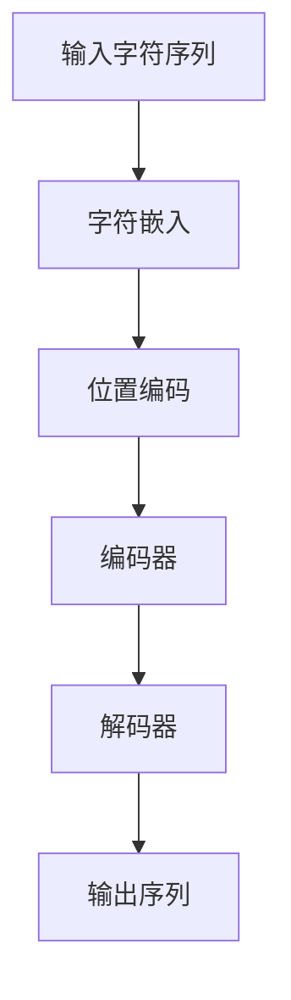

以下是题为《大语言模型原理基础与前沿 无分词器》的技术博客文章正文：

# 大语言模型原理基础与前沿 无分词器

## 1. 背景介绍

### 1.1 问题的由来

近年来,大型语言模型在自然语言处理(NLP)领域取得了令人瞩目的成就,展现出强大的语言理解和生成能力。传统的NLP系统通常依赖于分词器将文本分割成单词序列,然后对单词序列进行处理。然而,这种方法存在一些固有的缺陷:

1. **语言歧义性**:许多语言中存在着词义歧义、词形变化等现象,分词器难以完美处理这些情况。
2. **领域依赖性**:分词器通常是针对特定领域训练的,跨领域应用时性能会下降。
3. **语言覆盖范围**:为每种语言开发高质量分词器是一项艰巨的工程。

为了克服这些挑战,无分词器(Tokenizer-Free)大语言模型应运而生。

### 1.2 研究现状

无分词器大语言模型直接对原始字符序列进行建模,避免了分词器带来的错误传播和信息损失。目前,一些主流的大语言模型如BERT、GPT等已经采用了无分词器的设计。相比传统分词方法,无分词器大语言模型展现出更强的语言理解能力和泛化性能。

### 1.3 研究意义

无分词器大语言模型的研究对于推进NLP技术的发展具有重要意义:

1. **提高语言理解能力**:无需分词,模型可直接对原始字符序列建模,减少信息损失,提高语义理解精度。
2. **降低语言迁移成本**:无需为每种语言开发分词器,模型可直接应用于不同语言,降低了语言迁移的工程成本。
3. **简化NLP流程**:无需分词这一预处理步骤,可以简化NLP流程,提高效率。

### 1.4 本文结构

本文将全面介绍无分词器大语言模型的基础理论和前沿研究进展。我们将从核心概念出发,深入探讨算法原理、数学模型、实际应用等多个方面,并对未来发展趋势和挑战进行展望和讨论。

## 2. 核心概念与联系

无分词器大语言模型的核心思想是直接对原始字符序列进行建模,而不依赖于分词器。这种方法的优势在于:

1. **保留原始信息**:避免了分词过程中的信息损失。
2. **语言无关性**:不依赖于特定语言的分词规则,具有更强的语言无关性。
3. **端到端训练**:模型可以端到端地从字符级别学习语言表示,简化了训练流程。

无分词器大语言模型通常采用基于Transformer的编码器-解码器架构,其中编码器对输入字符序列进行编码,解码器则根据编码结果生成目标序列。该架构支持各种NLP任务,如机器翻译、文本摘要、问答系统等。

无分词器大语言模型的发展与其他NLP技术密切相关,例如:

- **注意力机制**:Transformer模型中的多头注意力机制赋予了模型强大的长距离依赖捕捉能力。
- **预训练技术**:大规模无监督预训练技术(如BERT、GPT等)显著提升了模型的语言理解能力。
- **知识增强**:融合外部知识(如知识图谱)有助于提高模型的推理和常识reasoning能力。

总的来说,无分词器大语言模型是一种前沿的NLP技术范式,与注意力机制、预训练技术等多项创新技术相辅相成,共同推动着NLP领域的快速发展。

## 3. 核心算法原理 & 具体操作步骤

### 3.1 算法原理概述

无分词器大语言模型的核心算法原理是基于Transformer的编码器-解码器架构。编码器将输入的字符序列映射为高维向量表示,解码器则根据该向量表示生成目标序列。

该算法的关键在于自注意力(Self-Attention)机制,它赋予了模型捕捉长距离依赖关系的能力。与传统的RNN/LSTM不同,自注意力机制可以直接建模任意两个位置之间的关联,避免了长距离依赖问题。

此外,多头注意力(Multi-Head Attention)进一步增强了模型的表示能力,通过并行学习多个注意力表示,捕捉输入序列的不同子空间特征。

位置编码(Positional Encoding)则赋予了模型对序列位置信息的建模能力,使得模型可以有效地学习序列的顺序信息。

### 3.2 算法步骤详解

无分词器大语言模型的训练和推理过程可以概括为以下几个步骤:

1. **输入表示**:将原始字符序列映射为一个维度为(序列长度,字符嵌入维度)的嵌入矩阵。
2. **位置编码**:将位置信息编码为同维度的矩阵,并与字符嵌入相加,赋予模型位置信息。
3. **编码器**:输入编码后的序列,通过多层编码器块(包含多头注意力和前馈网络)对输入进行编码,得到高维向量表示。
4. **解码器(自回归)**:对于序列生成任务,解码器以自回归的方式生成目标序列,每个时间步依赖于之前生成的结果和编码器输出。
5. **解码器(非自回归)**:对于序列到序列的任务,解码器可以同时生成整个目标序列,而不是自回归生成。

在训练过程中,模型的参数通过最小化训练数据的损失函数(如交叉熵损失)进行更新。在推理阶段,模型根据输入生成相应的输出序列。

### 3.3 算法优缺点

无分词器大语言模型算法的主要优点包括:

1. **语言无关性**:不依赖于特定语言的分词规则,可直接应用于不同语言。
2. **信息完整性**:避免了分词过程中的信息损失,保留了原始字符序列的所有信息。
3. **端到端训练**:模型可以端到端地从字符级别学习语言表示,简化了训练流程。
4. **长距离依赖建模**:自注意力机制赋予了模型捕捉长距离依赖关系的能力。

然而,该算法也存在一些缺点和挑战:

1. **计算复杂度高**:自注意力机制的计算复杂度较高,对硬件资源要求较大。
2. **序列长度限制**:由于自注意力需要对全序列进行计算,模型对输入序列长度存在一定限制。
3. **缺乏显式语法建模**:与基于语法规则的模型相比,缺乏对语言结构的显式建模。
4. **训练数据需求大**:需要大量高质量的训练数据才能充分发挥模型的潜力。

### 3.4 算法应用领域

无分词器大语言模型算法可以广泛应用于各种NLP任务,包括但不限于:

1. **机器翻译**:将源语言序列翻译为目标语言序列。
2. **文本摘要**:根据输入文本生成对应的摘要。
3. **对话系统**:根据对话历史生成自然的回复。
4. **文本生成**:根据给定的提示或主题生成连贯的文本内容。
5. **问答系统**:根据问题和上下文信息生成答案。
6. **代码生成**:根据给定的需求生成相应的代码。

总的来说,无分词器大语言模型算法为各种基于序列的NLP任务提供了通用的解决方案,展现出广阔的应用前景。

## 4. 数学模型和公式 & 详细讲解 & 举例说明

### 4.1 数学模型构建

无分词器大语言模型的数学模型基于Transformer架构,主要包括以下几个核心组件:

1. **输入表示**:将原始字符序列$X=\{x_1, x_2, \dots, x_n\}$映射为字符嵌入矩阵$\mathbf{E}=\{\mathbf{e}_1, \mathbf{e}_2, \dots, \mathbf{e}_n\}$,其中$\mathbf{e}_i \in \mathbb{R}^{d_\text{model}}$是第$i$个字符的嵌入向量。

2. **位置编码**:为了赋予模型对序列位置信息的建模能力,引入位置编码矩阵$\mathbf{P}=\{\mathbf{p}_1, \mathbf{p}_2, \dots, \mathbf{p}_n\}$,其中$\mathbf{p}_i \in \mathbb{R}^{d_\text{model}}$编码了第$i$个位置的信息。最终的输入表示为$\mathbf{X}=\mathbf{E}+\mathbf{P}$。

3. **多头注意力**:自注意力机制的核心是计算查询向量$\mathbf{Q}$与键向量$\mathbf{K}$的相似性,并根据相似性分配值向量$\mathbf{V}$的权重,得到加权和作为注意力输出。多头注意力则是将注意力机制分解为$h$个并行的注意力头,每个头捕捉输入序列的不同子空间特征,最终将所有头的输出拼接起来:

$$\begin{aligned}
\text{MultiHead}(\mathbf{Q}, \mathbf{K}, \mathbf{V}) &= \text{Concat}(\text{head}_1, \dots, \text{head}_h)\mathbf{W}^O\\
\text{where}\  \text{head}_i &= \text{Attention}(\mathbf{Q}\mathbf{W}_i^Q, \mathbf{K}\mathbf{W}_i^K, \mathbf{V}\mathbf{W}_i^V)
\end{aligned}$$

4. **编码器和解码器**:编码器由$N$层编码器块组成,每层包含多头注意力子层和前馈网络子层。解码器的结构类似,但增加了对编码器输出的注意力子层,用于捕捉编码器和解码器之间的依赖关系。

通过上述组件的层层组合,无分词器大语言模型可以直接从字符级别对原始序列进行建模,学习序列的语义和结构信息。

### 4.2 公式推导过程

我们以自注意力机制为例,推导其数学表达式。自注意力的目标是计算查询向量$\mathbf{Q}$与所有键向量$\mathbf{K}$的相似性,并根据相似性分配值向量$\mathbf{V}$的权重,得到加权和作为注意力输出。

具体来说,对于序列$\mathbf{X}=\{\mathbf{x}_1, \mathbf{x}_2, \dots, \mathbf{x}_n\}$,我们首先通过线性变换得到查询向量$\mathbf{Q}$、键向量$\mathbf{K}$和值向量$\mathbf{V}$:

$$\mathbf{Q} = \mathbf{X}\mathbf{W}^Q, \quad \mathbf{K} = \mathbf{X}\mathbf{W}^K, \quad \mathbf{V} = \mathbf{X}\mathbf{W}^V$$

其中$\mathbf{W}^Q, \mathbf{W}^K, \mathbf{W}^V$为可训练的权重矩阵。

然后,我们计算查询向量$\mathbf{Q}$与所有键向量$\mathbf{K}$的点积,得到相似性矩阵$\mathbf{S}$:

$$\mathbf{S} = \mathbf{Q}\mathbf{K}^\top$$

为了得到注意力权重,我们对相似性矩阵$\mathbf{S}$进行缩放和软最大化操作:

$$\text{Attention}(\mathbf{Q}, \mathbf{K}, \mathbf{V}) = \text{softmax}\left(\frac{\mathbf