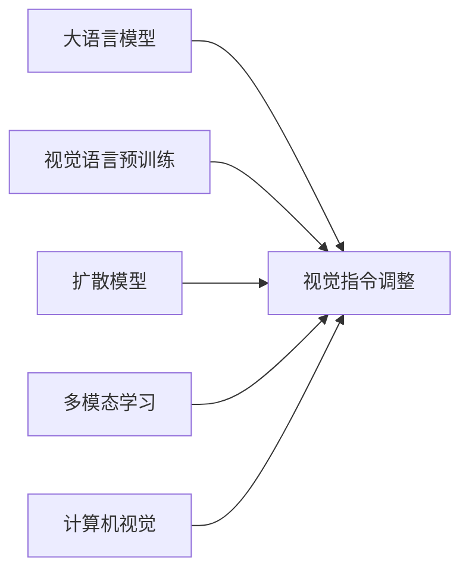

# 大语言模型原理基础与前沿 视觉指令调整

关键词：大语言模型、视觉指令调整、多模态学习、图像生成、计算机视觉

## 1. 背景介绍
### 1.1  问题的由来
随着人工智能技术的快速发展,大语言模型(Large Language Models, LLMs)在自然语言处理领域取得了突破性进展。然而,单纯的语言模型还无法满足日益增长的多模态人工智能需求。为了让机器能够像人一样理解和交互复杂的视觉世界,研究者们开始探索将视觉信息融入语言模型,实现视觉指令调整(Visual Instruction Tuning, VIT)。

### 1.2  研究现状
目前,视觉指令调整主要有两种主流方法:

1. 基于视觉语言预训练(Vision-Language Pre-training, VLP)的方法,如CLIP、ALIGN等,通过在大规模图文对数据上预训练,学习视觉特征和文本特征的对齐表示。  

2. 基于扩散模型(Diffusion Models)的图像生成方法,如DALL-E、Imagen等,通过学习噪声逆转过程,根据文本提示生成高质量图像。

这些方法在图像分类、检索、生成等任务上取得了优异表现,展现出视觉指令调整的巨大潜力。

### 1.3  研究意义
视觉指令调整的研究意义主要体现在以下几个方面:

1. 拓展语言模型的感知能力,使其能够理解和执行涉及视觉信息的复杂指令。

2. 实现机器与人的自然交互,让机器能够根据人的语言指令生成、编辑、检索图像。

3. 推动多模态人工智能的发展,为构建通用人工智能(AGI)奠定基础。

### 1.4  本文结构
本文将围绕视觉指令调整的核心概念、原理、实践、应用等方面展开论述,主要内容包括:

1. 介绍视觉指令调整的核心概念及其与相关领域的联系。

2. 阐述视觉指令调整的核心算法原理和具体操作步骤。

3. 建立视觉指令调整的数学模型,并给出详细的公式推导和案例分析。

4. 提供视觉指令调整的代码实例,并对其进行详细解释说明。

5. 探讨视觉指令调整的实际应用场景和未来应用展望。

6. 推荐视觉指令调整相关的学习资源、开发工具和研究论文。

7. 总结视觉指令调整的研究成果、发展趋势、面临的挑战和未来展望。

8. 附录中列出视觉指令调整的常见问题与解答。

## 2. 核心概念与联系
视觉指令调整的核心概念包括:

1. 大语言模型(LLMs):以Transformer为基础架构,在大规模文本数据上预训练,具有强大的语言理解和生成能力的模型,如GPT、BERT等。

2. 视觉语言预训练(VLP):通过在图文对数据上预训练,学习视觉特征和文本特征的对齐表示,实现跨模态理解和检索。

3. 扩散模型(Diffusion Models):通过学习数据分布的逆向扩散过程,实现高质量的图像生成。扩散模型包括潜在扩散模型(Latent Diffusion Models)和分数匹配扩散模型(Score-based Generative Models)等。

4. 多模态学习(Multimodal Learning):研究如何处理和融合来自不同模态(如文本、图像、音频等)的信息,实现跨模态的理解、生成和推理。

5. 计算机视觉(Computer Vision):研究如何让机器从图像或视频中获取信息,以及如何处理、分析和理解这些视觉信息。

视觉指令调整与这些领域密切相关。通过将大语言模型与视觉信息相结合,利用视觉语言预训练和扩散模型等技术,视觉指令调整实现了跨模态的指令理解和执行。同时,视觉指令调整也借鉴了多模态学习和计算机视觉的研究成果,如注意力机制、对比学习、GAN等。

下图展示了视觉指令调整与相关领域的联系:

## 3. 核心算法原理 & 具体操作步骤
### 3.1  算法原理概述
视觉指令调整的核心算法原理可以概括为以下三个步骤:

1. 视觉语言表示学习:通过预训练学习视觉特征和文本特征的对齐表示,实现跨模态理解。

2. 指令调整:在预训练的基础上,通过指令数据的微调,使模型能够理解和执行特定的视觉指令。

3. 多模态信息融合:将视觉信息和语言信息进行融合,实现跨模态的推理和生成。

### 3.2  算法步骤详解
1. 视觉语言表示学习:
   - 收集大规模的图文对数据,如图像标题数据集、图文问答数据集等。
   - 使用卷积神经网络(如ResNet、ViT等)提取图像特征,使用Transformer编码器提取文本特征。
   - 通过对比学习(Contrastive Learning)或交叉注意力(Cross-attention)机制,学习图像特征和文本特征的对齐表示。
   - 优化目标为最小化正样本对的距离,最大化负样本对的距离,使得相似的图文对具有相近的表示。

2. 指令调整:
   - 在预训练模型的基础上,收集特定领域的指令数据,如图像编辑指令、视觉问答指令等。
   - 将指令数据转化为模型可以理解的形式,如添加特殊的指令标记、构建指令模板等。
   - 通过有监督微调或强化学习,使模型学会理解和执行指令,生成符合指令要求的图像或回答。
   - 优化目标为最小化生成图像与真实图像的差异,或最大化回答的准确性和相关性。

3. 多模态信息融合:
   - 将视觉特征和文本特征进行融合,可以使用concatenation、attention等方式。
   - 使用Transformer解码器或生成模型(如VAE、GAN等),根据融合后的特征生成图像或文本。
   - 优化目标为最小化生成结果与真实结果的差异,同时保持生成结果的多样性和一致性。
   - 可以引入额外的loss函数,如对抗loss、感知loss等,以提高生成质量。

### 3.3  算法优缺点
视觉指令调整算法的优点包括:

1. 实现了跨模态的指令理解和执行,拓展了语言模型的感知能力。

2. 通过预训练和指令调整,可以快速适应新的领域和任务,具有良好的泛化性。

3. 生成的图像质量高,语义一致性好,可以根据指令进行controllable generation。

视觉指令调整算法的缺点包括:

1. 需要大规模的图文对数据和指令数据进行训练,数据收集和标注成本高。

2. 模型参数量大,训练和推理的计算开销大,对硬件要求高。

3. 对于复杂的指令和抽象概念,模型的理解和执行能力还有待提高。

4. 生成结果的可解释性和可控性有待进一步研究。

### 3.4  算法应用领域
视觉指令调整算法可以应用于以下领域:

1. 智能图像编辑:根据用户的语言指令,自动进行图像编辑,如修改对象、调整属性等。

2. 视觉问答:根据图像和问题,生成自然语言答案,实现图像理解和视觉推理。

3. 图像检索:根据文本查询,检索出语义相关的图像,实现跨模态检索。

4. 虚拟助手:通过语音或文本指令,控制虚拟助手执行视觉任务,如拍照、导航等。

5. 智能设计:根据用户的需求描述,自动生成设计稿,如Logo设计、海报设计等。

## 4. 数学模型和公式 & 详细讲解 & 举例说明
### 4.1  数学模型构建
视觉指令调整的数学模型可以表示为:

给定一个视觉指令$i$和一个图像$x$,模型$f$的目标是生成一个符合指令要求的图像$\hat{x}$或一个自然语言答案$\hat{y}$。

$$
\hat{x}, \hat{y} = f(i, x)
$$

其中,$f$由视觉编码器$f_v$、文本编码器$f_t$和解码器$f_d$组成。

$$
f = f_d(f_v(x), f_t(i))
$$

$f_v$和$f_t$分别将图像和指令映射到隐空间,得到视觉特征$v$和文本特征$t$。

$$
v = f_v(x)
$$

$$
t = f_t(i)
$$

$f_d$将$v$和$t$进行融合,生成目标图像或答案。

$$
\hat{x}, \hat{y} = f_d(v, t)
$$

### 4.2  公式推导过程
以图像生成任务为例,模型的优化目标是最小化生成图像$\hat{x}$与真实图像$x$的差异。

$$
\mathcal{L} = \mathbb{E}_{(i,x)\sim D}[d(\hat{x}, x)]
$$

其中,$D$为指令-图像对的数据集,$d$为差异度量函数,如L1损失、L2损失、感知损失等。

为了提高生成质量,可以引入对抗损失$\mathcal{L}_{adv}$和感知损失$\mathcal{L}_{per}$。

$$
\mathcal{L}_{adv} = \mathbb{E}_{(i,x)\sim D}[\log(1-D(\hat{x}))] + \mathbb{E}_{x\sim D}[\log D(x)]
$$

其中,$D$为判别器,用于判断生成图像的真实性。

$$
\mathcal{L}_{per} = \mathbb{E}_{(i,x)\sim D}[\sum_{l}\lambda_l\|\phi_l(\hat{x})-\phi_l(x)\|_1]
$$

其中,$\phi_l$为预训练的视觉特征提取器(如VGG)的第$l$层输出,$\lambda_l$为权重系数。

最终的优化目标为:

$$
\mathcal{L} = \mathcal{L}_{rec} + \lambda_{adv}\mathcal{L}_{adv} + \lambda_{per}\mathcal{L}_{per}
$$

其中,$\mathcal{L}_{rec}$为重建损失,$\lambda_{adv}$和$\lambda_{per}$为平衡系数。

### 4.3  案例分析与讲解
以图像编辑任务为例,假设给定一张图像和一个指令"把狗换成猫",模型需要生成一张将狗替换为猫的图像。

首先,视觉编码器$f_v$将原图像$x$编码为视觉特征$v$,文本编码器$f_t$将指令$i$编码为文本特征$t$。

$$
v = f_v(x)
$$

$$
t = f_t(\text{"把狗换成猫"})
$$

然后,解码器$f_d$将$v$和$t$融合,生成目标图像$\hat{x}$。

$$
\hat{x} = f_d(v, t)
$$

在训练过程中,模型通过最小化$\hat{x}$和真实图像$x_{gt}$(将狗替换为猫的图像)的差异,学习如何根据指令编辑图像。

$$
\mathcal{L} = d(\hat{x}, x_{gt}) + \lambda_{adv}\mathcal{L}_{adv} + \lambda_{per}\mathcal{L}_{per}
$$

通过不断迭代优化,模型最终学会根据指令"把狗换成猫"生成正确的图像。

### 4.4  常见问题解答
1. 问:视觉指令调整中的视觉特征和文本特征是如何对齐的?
   答:主要有两种方式:a)对比学习,通过最小化正样本对的距离和最大化负样本对的距离,使得相似的图文对具有相近的表示;b)交叉注意力,通过计算视觉特征和文本特征之间的注意力权重,实现两种