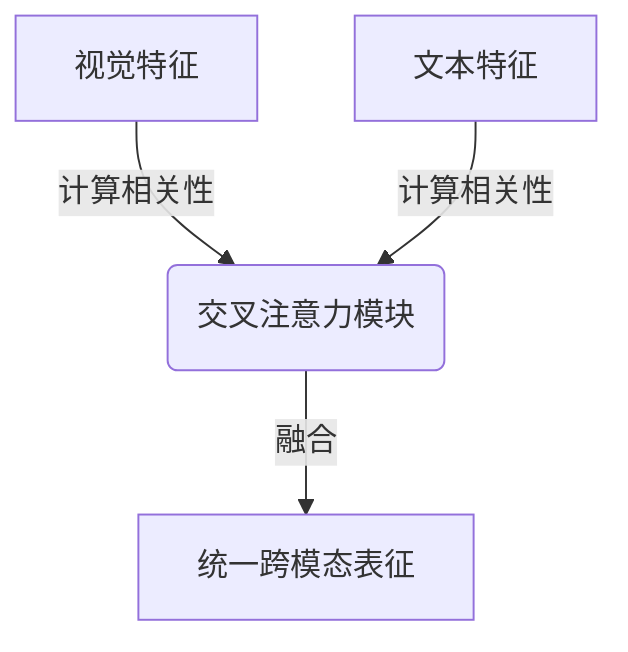
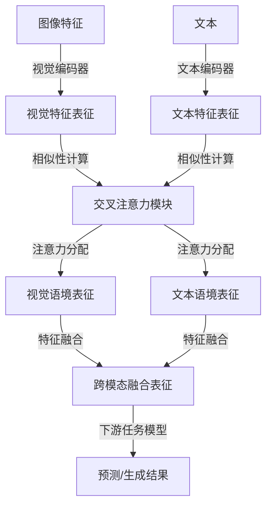

# 大语言模型原理基础与前沿 视觉-文本交叉注意力融合

## 1. 背景介绍

### 1.1 问题的由来

随着深度学习技术的不断发展,大型语言模型在自然语言处理领域取得了令人瞩目的成就。然而,纯文本模型难以捕捉图像等非结构化数据中蕴含的丰富语义信息。为了充分利用多模态数据,视觉-文本融合模型应运而生,旨在将视觉和文本信息有效地融合,实现跨模态的理解和表征。

### 1.2 研究现状 

目前,视觉-文本融合模型主要分为两大类:

1. **单流模型**:将图像和文本分别编码,然后在特定层级进行融合。这种方法简单直接,但难以充分捕捉跨模态的交互关系。

2. **双流模型**:在编码过程中,图像和文本特征会在不同层级进行交互,实现更深层次的融合。其中,交叉注意力机制是一种常用的融合方式,能够建立视觉和文本特征之间的对应关系。

### 1.3 研究意义

视觉-文本融合模型在多个领域展现出巨大的应用潜力,如视觉问答、图像描述生成、多模态检索等。通过有效融合视觉和文本信息,模型可以更好地理解复杂场景,生成更加准确、流畅的自然语言描述。此外,跨模态融合技术也为构建通用人工智能奠定了基础。

### 1.4 本文结构

本文将系统性地介绍大语言模型在视觉-文本融合任务中的原理和前沿进展。我们将从核心概念出发,深入探讨交叉注意力融合机制的算法原理、数学模型和实现细节。最后,我们将分析实际应用场景,并对未来发展趋势和挑战进行展望。

## 2. 核心概念与联系

视觉-文本融合模型的核心目标是学习一种统一的表征,能够同时捕捉视觉和文本信息,并体现两者之间的内在联系。为实现这一目标,交叉注意力机制被广泛应用,它能够建立视觉和文本特征之间的对应关系,实现有效的信息融合。

交叉注意力机制的基本思路是:对于每个文本特征,计算其与所有视觉特征的相关性,然后根据这些相关性分配注意力权重,得到该文本特征的视觉语境表征。反之,也可以为每个视觉特征计算文本语境表征。通过这种交互方式,视觉和文本特征可以相互增强,实现更精确的表征。

上图展示了交叉注意力融合的基本流程。视觉特征和文本特征分别输入交叉注意力模块,在该模块中计算两者之间的相关性,并基于相关性分配注意力权重,最终得到融合后的统一跨模态表征。

通过交叉注意力机制,大语言模型不仅能够学习文本语义表征,还能够融合视觉信息,实现更加准确、全面的理解。这种融合方式已经在多个视觉-文本任务中取得了卓越的表现,为构建通用人工智能系统奠定了基础。

## 3. 核心算法原理 & 具体操作步骤

### 3.1 算法原理概述

交叉注意力融合算法的核心思想是建立视觉和文本特征之间的对应关系,实现有效的信息融合。算法主要分为以下几个步骤:

1. **特征提取**:使用预训练的视觉编码器(如VGG、ResNet等)和文本编码器(如BERT、GPT等)分别提取图像和文本的特征表征。

2. **相似性计算**:计算每个文本特征与所有视觉特征之间的相似性,通常采用点积或缩放点积注意力机制。

3. **注意力分配**:根据相似性分配注意力权重,将视觉特征的加权和作为该文本特征的视觉语境表征。反之,也可以为每个视觉特征计算文本语境表征。

4. **特征融合**:将视觉语境表征和文本特征、视觉特征进行融合,得到融合后的跨模态表征。

5. **模型微调**:将融合后的跨模态表征输入下游任务模型(如分类器、生成器等),并根据任务目标对模型进行微调,完成最终的预测或生成。

上图展示了交叉注意力融合算法的详细流程。首先使用视觉和文本编码器分别提取特征表征,然后在交叉注意力模块中计算相似性、分配注意力权重,得到视觉语境表征和文本语境表征。接下来,将这些语境表征与原始特征进行融合,生成跨模态融合表征。最后,将融合表征输入下游任务模型,完成预测或生成任务。

### 3.2 算法步骤详解

接下来,我们将详细解释交叉注意力融合算法的每个步骤。

#### 3.2.1 特征提取

特征提取阶段的目标是从图像和文本中提取有意义的特征表征。对于图像,我们通常使用预训练的卷积神经网络(CNN)作为视觉编码器,如VGG、ResNet等。这些模型能够有效捕捉图像的低级和高级视觉特征。

对于文本,我们使用预训练的语言模型(如BERT、GPT等)作为文本编码器。这些模型通过自注意力机制学习文本的上下文语义表征。

设图像特征为 $\boldsymbol{V} = \{\boldsymbol{v}_1, \boldsymbol{v}_2, \ldots, \boldsymbol{v}_n\}$,文本特征为 $\boldsymbol{T} = \{\boldsymbol{t}_1, \boldsymbol{t}_2, \ldots, \boldsymbol{t}_m\}$,其中 $n$ 和 $m$ 分别表示视觉和文本特征的数量。

#### 3.2.2 相似性计算

在交叉注意力模块中,我们需要计算每个文本特征与所有视觉特征之间的相似性。常用的相似性计算方法包括点积相似性和缩放点积相似性。

**点积相似性**:

$$\text{sim}(\boldsymbol{t}_i, \boldsymbol{v}_j) = \boldsymbol{t}_i^\top \boldsymbol{v}_j$$

**缩放点积相似性**:

$$\text{sim}(\boldsymbol{t}_i, \boldsymbol{v}_j) = \frac{\boldsymbol{t}_i^\top \boldsymbol{v}_j}{\sqrt{d_t d_v}}$$

其中 $d_t$ 和 $d_v$ 分别表示文本特征和视觉特征的维度。缩放点积相似性通过特征维度的平方根进行缩放,可以避免较大的点积值导致softmax函数的梯度较小。

对于每个文本特征 $\boldsymbol{t}_i$,我们计算它与所有视觉特征的相似性,得到相似性向量 $\boldsymbol{s}_i = [s_{i1}, s_{i2}, \ldots, s_{in}]$,其中 $s_{ij} = \text{sim}(\boldsymbol{t}_i, \boldsymbol{v}_j)$。

#### 3.2.3 注意力分配

有了相似性向量,我们就可以通过softmax函数计算注意力权重:

$$\alpha_{ij} = \frac{\exp(s_{ij})}{\sum_{k=1}^n \exp(s_{ik})}$$

注意力权重 $\alpha_{ij}$ 表示文本特征 $\boldsymbol{t}_i$ 对视觉特征 $\boldsymbol{v}_j$ 的关注程度。

接下来,我们可以计算文本特征 $\boldsymbol{t}_i$ 的视觉语境表征 $\boldsymbol{c}_i^v$,它是所有视觉特征的加权和:

$$\boldsymbol{c}_i^v = \sum_{j=1}^n \alpha_{ij} \boldsymbol{v}_j$$

同理,我们也可以计算视觉特征 $\boldsymbol{v}_j$ 的文本语境表征 $\boldsymbol{c}_j^t$:

$$\boldsymbol{c}_j^t = \sum_{i=1}^m \beta_{ij} \boldsymbol{t}_i$$

其中 $\beta_{ij}$ 是视觉特征 $\boldsymbol{v}_j$ 对文本特征 $\boldsymbol{t}_i$ 的注意力权重。

#### 3.2.4 特征融合

得到视觉语境表征和文本语境表征后,我们需要将它们与原始特征进行融合,生成跨模态融合表征。常见的融合方式包括直接拼接、门控融合等。

**直接拼接**:

$$\boldsymbol{h}_i = [\boldsymbol{t}_i; \boldsymbol{c}_i^v]$$
$$\boldsymbol{g}_j = [\boldsymbol{v}_j; \boldsymbol{c}_j^t]$$

其中 $\boldsymbol{h}_i$ 和 $\boldsymbol{g}_j$ 分别表示融合后的文本特征和视觉特征。

**门控融合**:

$$\boldsymbol{h}_i = \boldsymbol{t}_i \odot \sigma(\boldsymbol{W}_t[\boldsymbol{t}_i; \boldsymbol{c}_i^v]) + \boldsymbol{c}_i^v \odot \sigma(\boldsymbol{W}_v[\boldsymbol{t}_i; \boldsymbol{c}_i^v])$$
$$\boldsymbol{g}_j = \boldsymbol{v}_j \odot \sigma(\boldsymbol{W}_v[\boldsymbol{v}_j; \boldsymbol{c}_j^t]) + \boldsymbol{c}_j^t \odot \sigma(\boldsymbol{W}_t[\boldsymbol{v}_j; \boldsymbol{c}_j^t])$$

其中 $\odot$ 表示元素wise乘积,  $\sigma$ 是非线性激活函数(如ReLU),  $\boldsymbol{W}_t$ 和 $\boldsymbol{W}_v$ 是可学习的权重矩阵。门控融合通过学习两个门控系数,可以自适应地控制原始特征和语境特征的重要性。

通过上述步骤,我们得到了融合后的跨模态表征 $\boldsymbol{H} = \{\boldsymbol{h}_1, \boldsymbol{h}_2, \ldots, \boldsymbol{h}_m\}$ 和 $\boldsymbol{G} = \{\boldsymbol{g}_1, \boldsymbol{g}_2, \ldots, \boldsymbol{g}_n\}$,它们包含了视觉和文本的丰富语义信息。

### 3.3 算法优缺点

**优点**:

1. **有效融合**:交叉注意力机制能够建立视觉和文本特征之间的对应关系,实现有效的信息融合。

2. **灵活性强**:该算法可以与不同的视觉编码器和文本编码器相结合,具有很强的通用性和灵活性。

3. **端到端训练**:整个模型可以进行端到端的训练,无需人工设计特征融合策略。

**缺点**:

1. **计算复杂度高**:需要计算所有文本-视觉特征对之间的相似性,计算量随特征数量的增加而迅速增大。

2. **缺乏结构建模**:目前的交叉注意力机制主要关注特征之间的相似性,缺乏对结构信息(如物体位置、大小等)的有效建模。

3. **鲁棒性不足**:对于一些具有挑战性的视觉-文本数据(如小物体、遮挡等),模型的表现可能会受到影响。

### 3.4 算法应用领域

交叉注意