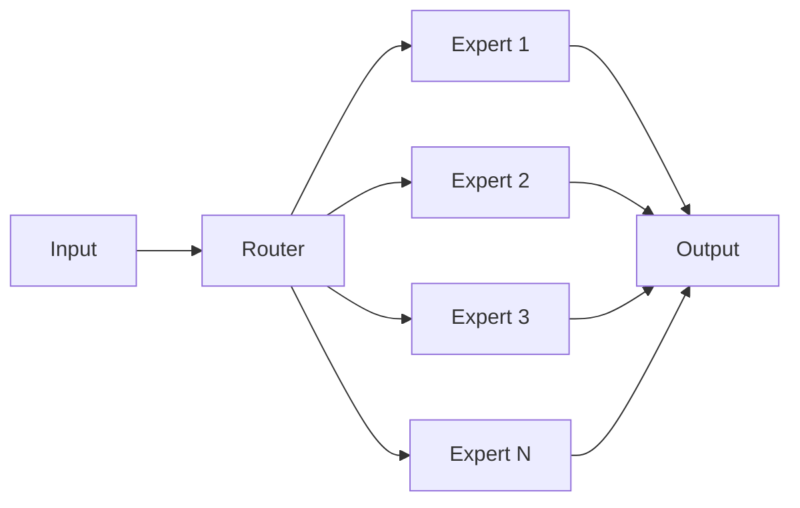

# 大语言模型原理基础与前沿 路由算法

## 1. 背景介绍
### 1.1 问题的由来
大语言模型(Large Language Models, LLMs)自2018年以来取得了突飞猛进的发展,尤其是在自然语言处理(Natural Language Processing, NLP)领域取得了令人瞩目的成就。从GPT-1到GPT-3,再到最新的GPT-4,LLMs展现出了惊人的语言理解和生成能力,可以完成对话、摘要、翻译、写作等多种任务。然而,随着模型规模的不断扩大,训练和推理的计算开销也急剧增加。因此,如何在保证模型性能的同时提高推理效率,成为了LLMs走向实用化的关键问题之一。

### 1.2 研究现状 
为了解决LLMs推理效率的问题,学术界和工业界提出了多种优化方法,包括知识蒸馏、量化、剪枝、编译优化等。其中,基于路由的稀疏化方法因其可以在推理时动态选择模型参数子集,在效率和性能之间取得了较好的平衡,受到了广泛关注。例如,Switch Transformer[1]通过引入路由器(Router)来选择每个输入样本使用的专家网络,在保持较高性能的同时大幅降低了计算开销。GShard[2]提出了一种分布式训练和推理框架,通过将不同的专家网络分布在不同的设备上,实现了模型规模的进一步扩大。最近,Facebook提出的Mixture-of-Experts(MoE)路由算法[3]在训练和推理效率上取得了新的突破。

### 1.3 研究意义
路由算法作为LLMs走向实用化的关键技术之一,其研究意义主要体现在以下几个方面:

(1) 降低计算开销:通过在推理时选择部分模型参数,路由算法可以大幅降低计算开销,使得在有限的计算资源下支持更大规模的模型。

(2) 提高推理速度:通过减少实际使用的计算操作,路由算法可以显著提高推理速度,使得LLMs更好地满足实时交互的需求。

(3) 实现个性化:路由算法为针对不同输入动态选择模型参数提供了可能,有助于实现个性化的语言模型,提升用户体验。

(4) 探索新的架构:路由思想为探索LLMs的新架构提供了新的思路,有望进一步突破目前模型规模和性能的瓶颈。

### 1.4 本文结构
本文将重点介绍LLMs中的路由算法,内容安排如下:第2部分介绍相关的核心概念;第3部分详细讲解主流路由算法的原理和步骤;第4部分给出路由算法涉及的关键数学模型和公式;第5部分提供路由算法的代码实例和解读;第6部分讨论路由算法的实际应用场景;第7部分推荐相关的学习资源;第8部分总结全文并展望未来;第9部分列出常见问题解答。

## 2. 核心概念与联系
在讨论路由算法之前,我们首先来了解几个核心概念:

(1) 专家网络(Expert Networks):指一组子网络,每个子网络负责处理特定的子任务。不同专家网络可以采用不同的结构,如MLP、Attention等。

(2) 路由器(Router):负责为每个输入样本选择对应的专家网络。常见的路由器结构包括Gating Networks和Top-K路由等。

(3) 混合专家模型(Mixture-of-Experts, MoE):一种将多个专家网络和路由器组合的层,可以堆叠形成更深的网络。

(4) 稀疏性(Sparsity):是指只有部分专家网络被激活,专家网络总数远大于实际使用的专家网络数。稀疏性是路由算法提高效率的关键。

(5) 负载均衡(Load Balance):确保每个专家网络处理的样本数尽可能均匀,避免个别专家网络成为瓶颈。

下图展示了MoE层的基本结构和各部分之间的联系:

## 3. 核心算法原理 & 具体操作步骤
### 3.1 算法原理概述
路由算法的核心思想是在推理时根据输入动态选择部分专家网络,从而在计算效率和模型性能之间取得平衡。具体来说,主要涉及两个关键步骤:路由决策和专家网络计算。其中,路由决策由路由器完成,旨在为每个输入样本选择最相关的专家网络;专家网络计算则由被选中的专家网络完成,负责生成当前样本对应的输出。

### 3.2 算法步骤详解
以下是主流路由算法的一般步骤:

(1) 路由器接收输入样本,通过前向计算得到每个专家网络的相关性分数。常见的计算方法包括:
- Gating Networks:使用一个较浅的神经网络(如MLP)来计算分数。
- Top-K路由:对每个专家网络的输出进行采样,选择Top-K个最大值对应的专家网络。

(2) 根据相关性分数,选择Top-K个最相关的专家网络。K的大小控制了稀疏性的程度。

(3) 将输入样本分发给选中的专家网络,并行计算每个专家网络的输出。

(4) 将所有专家网络的输出进行加权平均,得到最终的输出结果。权重由第(1)步的相关性分数决定。

(5) 根据负载均衡的要求,调整路由器的参数,使得专家网络的负载尽量均匀。这通常在训练时完成。

### 3.3 算法优缺点
路由算法的主要优点包括:
- 通过稀疏性降低计算开销,提高推理效率。
- 可以建模任务的多样性,动态适应不同输入。
- 支持更大规模的模型,突破单个设备的资源限制。

主要缺点包括:  
- 引入了额外的路由器计算,带来一定的开销。
- 负载均衡问题给训练带来挑战,需要精心设计。
- 推理时的批次大小受到稀疏性的限制,可能影响吞吐量。

### 3.4 算法应用领域
路由算法在LLMs的多个应用领域都有广泛的应用,例如:
- 开放域对话:通过路由算法选择与当前对话最相关的知识,动态生成回复。
- 文本生成:根据输入的主题、风格等,选择对应的语言模型完成生成任务。
- 多语言翻译:针对不同语言对选择对应的翻译模型,实现更高质量的翻译。
- 知识图谱问答:根据问题类型选择合适的推理模块,提高回答的准确性。

## 4. 数学模型和公式 & 详细讲解 & 举例说明
### 4.1 数学模型构建
我们以MoE层为例,给出其数学模型。设输入为$\mathbf{x} \in \mathbb{R}^d$,共有$N$个专家网络。MoE层的输出$\mathbf{y}$可以表示为:

$$
\mathbf{y} = \sum_{i=1}^N G(\mathbf{x}, i) E_i(\mathbf{x})
$$

其中$G(\mathbf{x}, i)$是路由器给出的第$i$个专家网络的相关性分数,$E_i(\mathbf{x})$是第$i$个专家网络的输出。

对于Gating Networks路由器,相关性分数的计算公式为:

$$
G(\mathbf{x}, i) = \frac{\exp(W_i^T \mathbf{x} + b_i)}{\sum_{j=1}^N \exp(W_j^T \mathbf{x} + b_j)}
$$

其中$W_i$和$b_i$是路由器的参数。

对于Top-K路由,相关性分数为:

$$
G(\mathbf{x}, i) = 
\begin{cases}
1, & \text{if } i \in \text{Top-K}(\{E_j(\mathbf{x})\}_{j=1}^N)\\
0, & \text{otherwise}
\end{cases}
$$

### 4.2 公式推导过程
Gating Networks的相关性分数公式可以通过以下方式推导:

(1) 首先,路由器对每个专家网络计算一个原始分数:

$$
z_i = W_i^T \mathbf{x} + b_i
$$

(2) 然后,对原始分数应用softmax函数,得到归一化的相关性分数:

$$
G(\mathbf{x}, i) = \text{softmax}(z_i) = \frac{\exp(z_i)}{\sum_{j=1}^N \exp(z_j)}
$$

softmax函数可以将原始分数映射到(0,1)区间,并保证所有分数的和为1,符合概率的性质。

Top-K路由的相关性分数公式可以通过以下方式推导:

(1) 对每个专家网络的输出$E_i(\mathbf{x})$进行评估和排序。

(2) 选择其中Top-K个最大值对应的专家网络,将其相关性分数设为1,其余专家网络的分数设为0。

这样可以得到一个one-hot形式的相关性分数向量,实现了稀疏性。

### 4.3 案例分析与讲解
下面我们以一个简单的例子来说明MoE层的计算过程。假设输入$\mathbf{x}$的维度为4,共有3个专家网络。

(1) 路由器计算相关性分数:

$$
\begin{aligned}
z_1 &= 0.1 \cdot x_1 + 0.2 \cdot x_2 + 0.3 \cdot x_3 + 0.4 \cdot x_4 + 0.5 = 1.2 \\
z_2 &= 0.2 \cdot x_1 + 0.3 \cdot x_2 + 0.4 \cdot x_3 + 0.1 \cdot x_4 + 0.3 = 1.5 \\
z_3 &= 0.3 \cdot x_1 + 0.1 \cdot x_2 + 0.2 \cdot x_3 + 0.3 \cdot x_4 + 0.1 = 0.8 \\
\end{aligned}
$$

应用softmax函数得到:

$$
\begin{aligned}
G(\mathbf{x}, 1) &= \frac{\exp(1.2)}{\exp(1.2) + \exp(1.5) + \exp(0.8)} = 0.26 \\  
G(\mathbf{x}, 2) &= \frac{\exp(1.5)}{\exp(1.2) + \exp(1.5) + \exp(0.8)} = 0.53 \\
G(\mathbf{x}, 3) &= \frac{\exp(0.8)}{\exp(1.2) + \exp(1.5) + \exp(0.8)} = 0.21
\end{aligned}
$$

(2) 假设3个专家网络对$\mathbf{x}$的输出分别为:

$$
E_1(\mathbf{x}) = 0.5, \quad E_2(\mathbf{x}) = 1.2, \quad E_3(\mathbf{x}) = 0.8  
$$

(3) 加权平均得到MoE层的最终输出:

$$
\mathbf{y} = 0.26 \cdot 0.5 + 0.53 \cdot 1.2 + 0.21 \cdot 0.8 = 0.93
$$

可以看到,不同专家网络对最终输出的贡献不同,这取决于它们与输入的相关性。

### 4.4 常见问题解答
(1) 路由算法能否应用于其他类型的神经网络,如CNN和RNN?
- 答:原则上路由算法可以应用于任何类型的神经网络。但在实践中,更多地用于Transformer等基于注意力机制的模型,因为它们更容易划分为多个专家网络。将路由算法应用于CNN和RNN可能需要针对性的设计。

(2) 路由算法对数据并行训练有什么影响?
- 答:由于引入了稀疏性,路由算法对数据并行训练提出了新的挑战。不同设备上的专家网络可能处理不同数量的样本,导致负载不均衡。因此,需要专门的负载均衡策略来确保高效的并行训练。此外,模型的聚合和同步也变得更加复杂。

## 5. 项目实